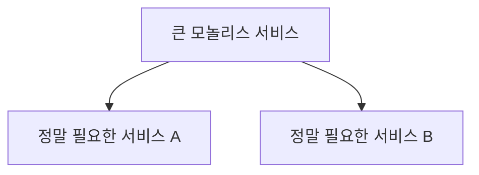

# 39장. 마이크로서비스로 갔다가 돌아온 사례들

37장에서는 분산 모놀리스의 함정을,
38장에서는 너무 잘게 쪼갠 Nanoservice 함정을 보았다.

이 두 함정에 깊이 빠진 회사들은
결국 같은 결정을 내린다.

> **마이크로서비스에서 다시 모놀리스로 돌아간다.**

이런 사례들은 실패가 아니다.
오히려 가장 정직한 학습이다.

이 장에서는 잘 알려진 회귀 사례들과
그들이 무엇을 배웠는지를 본다.

---

## 회귀가 실패가 아닌 이유

마이크로서비스에서 모놀리스로 돌아가는 것을
"실패"라고 부를 수 없다.

이유는 단순하다.

> 아키텍처는 비즈니스 단계에 맞아야 한다.

* 회사가 작을 때는 모놀리스가 맞다
* 회사가 커지면 마이크로서비스가 필요할 수 있다
* 회사가 다시 단순해지면 다시 모놀리스가 나을 수 있다

선택이 바뀌는 것은 자연스럽다.
중요한 것은 **왜 바꿨는가**를 이해하는 것이다.

---

## 사례 1️⃣ — Segment

데이터 분석 플랫폼 Segment는
2017년 마이크로서비스에서 모놀리스로 회귀했다.

### 어떤 상황이었는가

* 수십 개의 데이터 통합 마이크로서비스
* 각 서비스가 외부 시스템 하나로 데이터를 보냄
* 큐, Auto-scaling, 모니터링이 각 서비스마다

### 무엇이 문제였는가

* **운영 복잡도**가 비즈니스 가치보다 컸다
* 새 통합을 추가할 때마다 새 서비스, 새 파이프라인
* 50개 서비스의 알람 관리가 불가능
* 비슷한 코드가 50번 반복

### 어떻게 돌아갔는가

* 통합 로직을 하나의 코드베이스로 합침
* 단일 모놀리스 서비스로 모든 통합 처리
* 운영 부담이 극적으로 감소

### 무엇을 배웠는가

> **마이크로서비스의 비용을 정직하게 계산해야 한다.**
> 분리의 가치보다 운영 비용이 크면 분리하지 않는다.

---

## 사례 2️⃣ — Istio

서비스 메시 Istio는 자기 자신을
여러 마이크로서비스(Pilot, Citadel, Galley 등)로 구성했다.

2020년 이를 단일 바이너리(istiod)로 합쳤다.

### 어떤 상황이었는가

* 4~5개의 컨트롤 플레인 컴포넌트
* 각자 별도 배포·업그레이드
* 사용자가 5개를 관리해야 함

### 무엇이 문제였는가

* 컴포넌트 간 강한 의존성
* 함께 배포해야 하는 경우가 대부분
* 사용자 입장에서 운영이 너무 복잡

### 어떻게 돌아갔는가

* 단일 프로세스로 통합 (istiod)
* 내부 모듈은 여전히 분리되어 있음
* 사용자 입장에서는 하나의 컴포넌트

### 무엇을 배웠는가

> **물리적 분리와 논리적 분리는 다르다.**
> 모듈은 잘 분리되어 있되, 배포는 하나여도 된다.

---

## 사례 3️⃣ — Amazon Prime Video

2023년, Amazon Prime Video는 영상 모니터링 시스템을
마이크로서비스에서 모놀리스로 통합했다.
비용이 90% 감소했다고 발표했다.

### 어떤 상황이었는가

* 영상 품질을 분석하는 분산 시스템
* AWS Step Functions와 Lambda 기반
* 각 분석 단계가 별도 서비스

### 무엇이 문제였는가

* 단계마다 데이터를 S3에 저장하고 다시 읽음
* 직렬화/역직렬화 비용
* AWS 호출 비용
* 단계 간 데이터 전송 비용

### 어떻게 돌아갔는가

* 모든 분석 단계를 단일 프로세스로 통합
* 데이터를 메모리에서 직접 전달
* 인프라 비용 90% 감소

### 무엇을 배웠는가

> **데이터를 자주 주고받는 처리는 분리하면 비싸진다.**
> 분리의 단위는 데이터 흐름을 봐야 한다.

---

## 회귀 결정에 공통적으로 있는 신호

여러 사례를 보면 공통 신호가 있다.

### 1️⃣ 운영 비용이 비즈니스 가치를 초과한다

* 새 기능 출시보다 운영에 시간이 더 든다
* 알람 관리가 불가능한 수준
* 인프라 비용이 비정상적으로 높다

### 2️⃣ 변경이 점점 느려진다

* 한 변경이 여러 서비스를 거친다
* 함께 배포해야 하는 경우가 대부분
* 디버깅이 시간을 다 잡아먹는다

### 3️⃣ 같은 처리에 너무 많은 네트워크 호출이 든다

* 한 요청에 수십 번의 서비스 호출
* 데이터를 자주 직렬화/역직렬화
* 클라우드 호출 비용이 비상식적

### 4️⃣ 비즈니스가 단순해졌다

* 트래픽이 줄었거나
* 도메인이 단순해졌거나
* 팀이 작아졌거나

이 중 두 개 이상이 보이면
회귀를 진지하게 고려할 시점일 수 있다.

---

## "마이크로서비스 회귀"가 의미하는 것

회귀했다고 모든 분리를 없애지는 않는다.

회귀 후 구조는 보통 이렇다.

* 대부분을 하나의 큰 서비스로 합친다
* 정말로 분리될 가치가 있는 영역만 따로 둔다
* "마이크로서비스 vs 모놀리스"가 아니라 적정 크기로 재정렬

이걸 **"Right-sizing"** 또는
**"Macroservices"** 라고 부르기도 한다.

---

## 회귀하지 않으려면 처음부터 무엇을 해야 하는가

이 사례들이 주는 교훈은 분명하다.

### 1️⃣ 분리할 이유를 먼저 정한다

1장에서 봤다.

> "쪼갤 수 있느냐"가 아니라
> "쪼개야 하는 이유가 있는가"

이유 없는 분리는 비용만 남긴다.

### 2️⃣ 적정 크기로 시작한다

처음부터 잘게 쪼개려고 하지 않는다.

* 큰 서비스 몇 개로 시작
* 필요해지면 더 쪼갠다
* 작게 시작해서 키우는 것보다 큰 데서 줄이는 게 어렵다

### 3️⃣ 운영 부담을 정직하게 본다

새 서비스를 만들기 전에 묻는다.

* 누가 운영할 것인가?
* 알람은 누가 받을 것인가?
* 장애는 누가 대응할 것인가?

이 답을 못하면 만들지 않는다.

### 4️⃣ 데이터 흐름을 본다

서비스를 나누는 기준이
**비즈니스 책임**과 **데이터 흐름**을 모두 봐야 한다.

데이터가 한 흐름 안에서 여러 번 주고받아진다면
그 흐름은 한 서비스 안에 있어야 한다.

---

## 모놀리스가 부끄러운 게 아니다

회귀한 회사들은 부끄러워하지 않는다.
오히려 자신감 있게 발표한다.

이유는

> **아키텍처는 도구다.**
> 도구는 상황에 맞게 바꿀 수 있다.

마이크로서비스가 멋있어서 쓰는 게 아니라
필요해서 쓰는 것이다.
필요 없어지면 돌아가는 것이 합리적이다.

이 책 전체가 강조하는 메시지가 여기 있다.

> **마이크로서비스는 의무가 아니다.**

이 메시지는 42장에서 다시 한 번 정리한다.

---

## 이 장의 핵심

* 마이크로서비스에서 모놀리스로 돌아가는 것은 실패가 아니다
* Segment·Istio·Amazon Prime Video — 모두 운영 비용이 가치를 초과해서 회귀했다
* 회귀의 공통 신호: 운영 비용, 느려지는 변경, 과도한 네트워크 호출, 비즈니스 단순화
* 회귀해도 모든 분리를 없애지 않는다 — 적정 크기로 재정렬한다
* 회귀하지 않으려면 분리할 이유, 적정 크기, 운영 부담, 데이터 흐름을 처음부터 본다
* 모놀리스는 부끄러운 선택이 아니다 — 상황에 맞다면 옳은 선택이다
