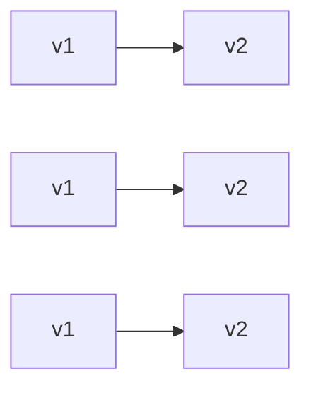
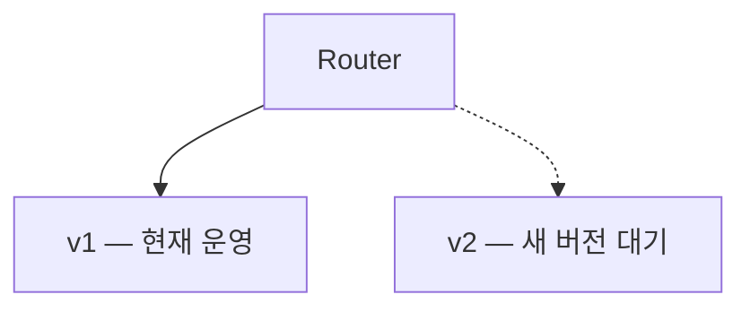
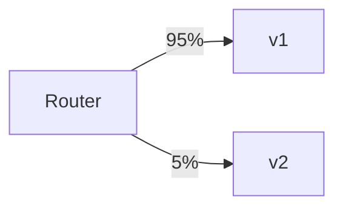
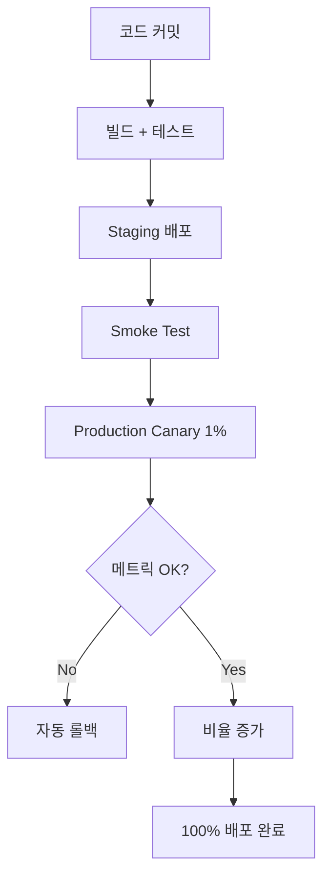

# 40장. 배포 전략 — Blue/Green, Canary, Feature Flag

마이크로서비스의 가장 큰 장점 중 하나는
**독립 배포**다.

하지만 독립적으로 배포할 수 있다는 것과
**안전하게 배포할 수 있다**는 것은 다르다.

이 장에서는 배포의 위험을 어떻게 다룰지를 본다.

---

## 왜 배포 전략이 따로 필요한가

모놀리스 시절 배포는 단순했다.

* 정해진 시간에 전체를 내리고 올린다
* 문제 생기면 이전 버전으로 되돌린다
* 한 달에 몇 번, 큰 이벤트

마이크로서비스에서는 다르다.

* 수십 개 서비스가 각자 배포
* 하루에도 수십 번
* 사용자가 안 보는 시간이 따로 없다

> 배포는 매일 일어나는 일이 되었다.

그래서 배포 자체가 위험을 다루는 도구가 되어야 한다.

---

## 1️⃣ Rolling Update — 가장 기본



* 같은 서비스의 여러 인스턴스를
* 한 번에 하나씩 새 버전으로 교체

장점:

* 다운타임이 거의 없다
* 인프라 비용이 추가로 들지 않는다
* Kubernetes 같은 오케스트레이터의 기본

단점:

* 새 버전과 옛 버전이 짧은 시간 함께 동작 → 호환성 필요
* 문제 발견 후 롤백이 점진적이라 느리다

대부분의 일상 배포는 이 방식이다.

---

## 2️⃣ Blue/Green — 두 환경 전환



* 두 개의 환경(Blue/Green)을 둔다
* 현재 트래픽은 Blue로
* 새 버전을 Green에 배포·검증
* Router를 한 번에 Green으로 전환

장점:

* 전환이 즉각적이다
* 롤백도 즉각적 (Router를 다시 Blue로)
* 새 환경을 완전히 검증한 후 전환

단점:

* 인프라가 2배 필요
* 데이터 일관성 처리가 복잡
* 환경 간 동기화 필요

언제 쓰는가:

* 큰 변경의 안전한 전환
* 데이터 마이그레이션과 함께 (7장 참고)
* 다운타임을 절대 허용하지 못할 때

---

## 3️⃣ Canary — 점진적 노출



* 일부 트래픽만 새 버전으로
* 메트릭을 보며 비율 증가
* 문제 발견 시 비율 감소 또는 0

비율 흐름:

```text
1% → 5% → 25% → 50% → 100%
```

각 단계에서 검증 시간을 둔다.

장점:

* 실 트래픽으로 검증
* 문제 영향 범위를 제한
* 점진적 확신

단점:

* 신·구 버전이 동시에 운영
* 호환성 보장 필요
* 메트릭 자동화 필수

언제 쓰는가:

* 위험도가 있는 변경
* 새 알고리즘 검증
* 성능 영향이 불확실할 때

---

## 4️⃣ Feature Flag — 코드와 배포의 분리

배포 전략은 아니지만 함께 쓰이는 강력한 도구다.

```text
if (featureFlag.isEnabled("new-pricing")) {
    return newPricingLogic();
} else {
    return oldPricingLogic();
}
```

* 새 코드를 배포만 해두고
* 실제 동작은 런타임 플래그로 제어

장점:

* 배포와 릴리스를 분리
* 사용자 그룹별 점진적 노출
* 즉시 끄기 가능 (Kill switch)
* A/B 테스트 가능

단점:

* 플래그가 쌓이면 코드가 복잡
* 플래그 청소가 필요
* 분기 테스트 부담

---

## 어떤 전략을 언제 쓰는가

| 상황 | 전략 |
|---|---|
| 일상적인 버그 수정 | Rolling Update |
| 새 기능 출시 | Canary + Feature Flag |
| 큰 아키텍처 변경 | Blue/Green |
| 위험한 알고리즘 변경 | Canary |
| 실험적 기능 | Feature Flag (배포는 Rolling) |
| 데이터 마이그레이션과 결합 | Blue/Green |

이 전략들은 서로 배타적이 아니다.
보통 함께 쓴다.

예:

* Rolling Update로 배포
* Feature Flag로 기능 숨김
* Canary처럼 일부 사용자에게만 플래그 활성화

---

## 마이크로서비스에서 추가로 고려해야 할 것

### 1️⃣ 호환성

여러 버전이 동시에 운영되는 동안
API와 이벤트 스키마가 호환되어야 한다.

**API 변경 원칙:**

* 새 필드는 옵셔널로 추가
* 기존 필드는 한 번에 제거하지 않음
* Breaking change는 새 버전으로 분기

**이벤트 스키마 변경 원칙:**

* 18장에서 본 멱등성과 함께
* 이전 버전 소비자가 새 이벤트를 무시할 수 있게

### 2️⃣ DB 마이그레이션

DB 스키마 변경은 배포와 별개의 위험이다.

원칙:

* **Expand-then-contract**
  * 새 컬럼 추가 (Expand)
  * 양쪽 코드가 같이 동작
  * 옛 컬럼 제거 (Contract)
* 한 배포에서 양쪽을 다 하지 않는다

### 3️⃣ 서비스 간 배포 순서

A 서비스가 B 서비스의 새 API를 호출한다면

* B를 먼저 배포 (새 API 제공)
* A를 다음에 배포 (새 API 호출)
* 순서가 반대면 A가 깨진다

### 4️⃣ 자동 롤백 기준

배포 후 메트릭이 나빠지면 자동 롤백.

기준 예:

* 에러율 임계치 초과 (예: 5% 이상)
* p99 지연 시간 50% 이상 증가
* 핵심 비즈니스 메트릭 하락

자동 롤백 없이 100개 서비스를 운영할 수는 없다.

---

## 배포의 흐름 (실무 예시)



각 단계에서

* 메트릭 확인
* 자동 검증
* 인간 개입 가능 지점

이 구조가 자동화되어 있어야
마이크로서비스의 배포 부담을 감당할 수 있다.

---

## 배포는 코드의 일부다

마이크로서비스에서는 배포 전략도
코드 설계의 일부로 봐야 한다.

* 코드는 두 버전이 공존할 수 있게 작성
* API는 호환 가능하게 변경
* DB는 점진적으로 변경
* 기능은 Feature Flag로 분리

이 사고가 없으면
배포할 때마다 손에 땀을 쥐게 된다.

---

## 이 장의 핵심

* 마이크로서비스의 독립 배포는 안전한 배포 전략과 함께여야 한다
* Rolling Update — 기본, 일상 배포
* Blue/Green — 한 번에 전환, 즉시 롤백
* Canary — 점진적 노출, 메트릭 기반 결정
* Feature Flag — 배포와 릴리스의 분리, Kill switch
* API·이벤트·DB 호환성, 서비스 간 배포 순서, 자동 롤백을 함께 설계한다
* 배포 전략은 운영 도구가 아니라 코드 설계의 일부다
