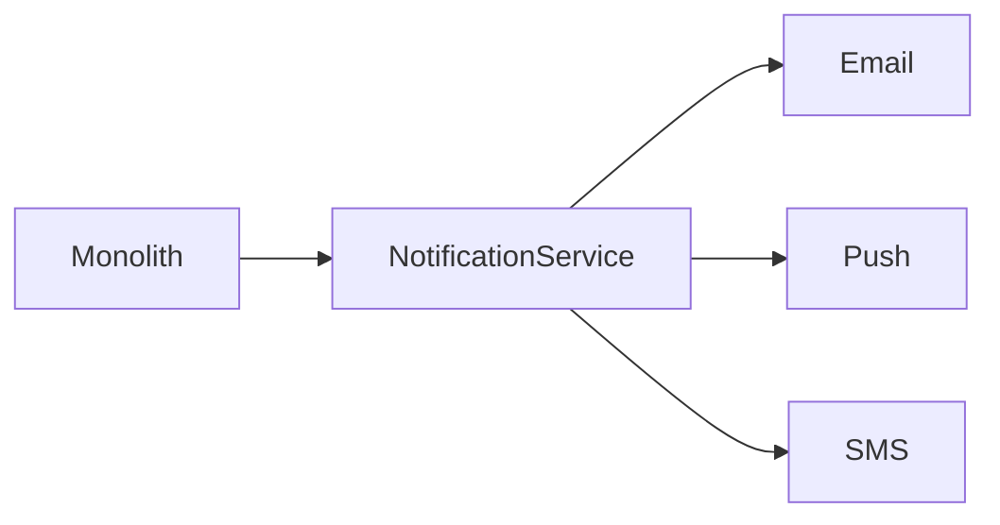
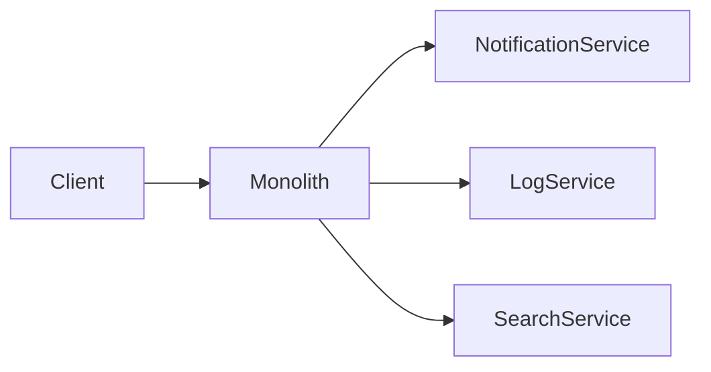
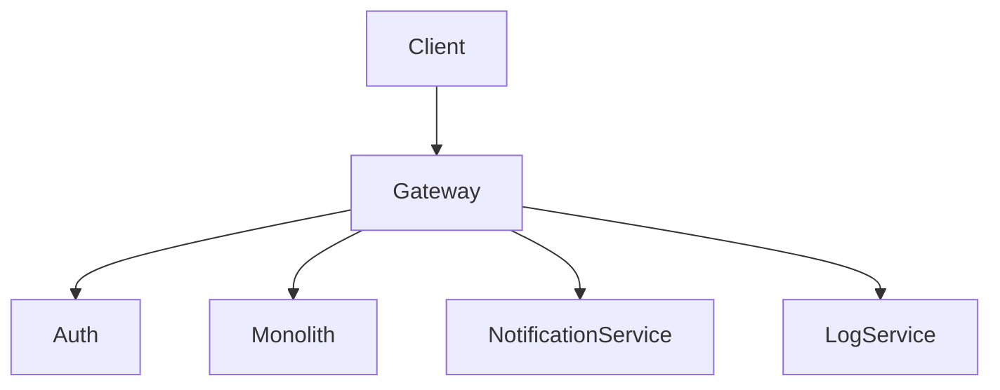
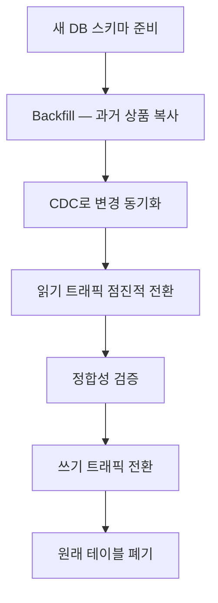
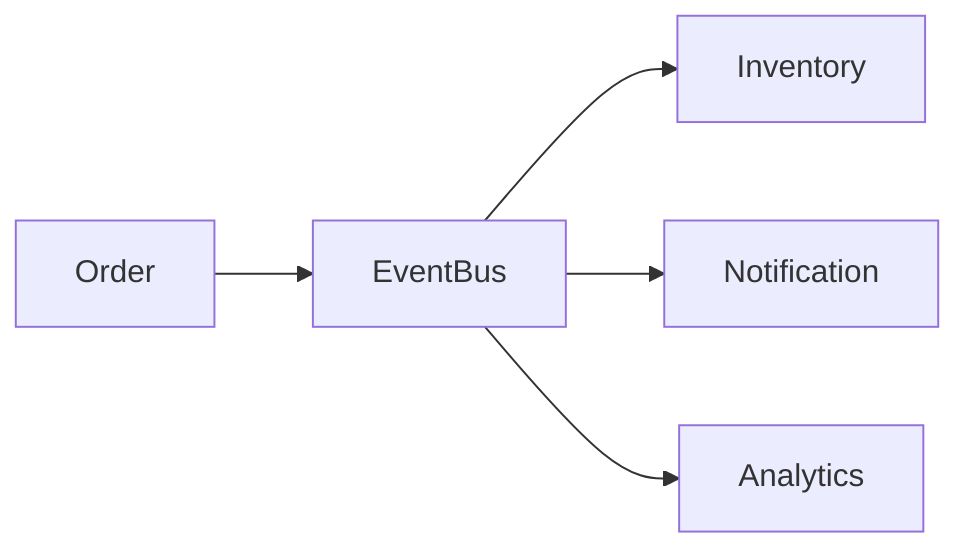
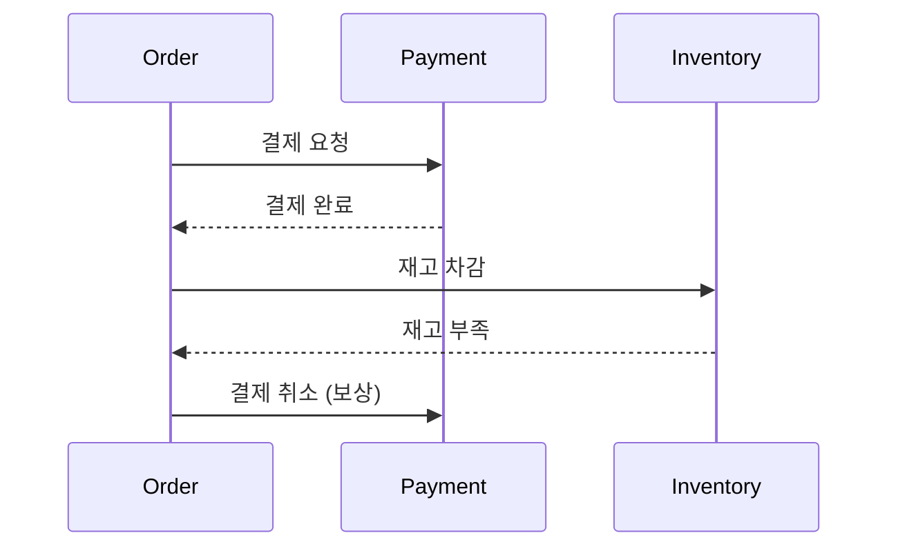
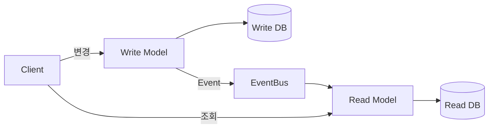
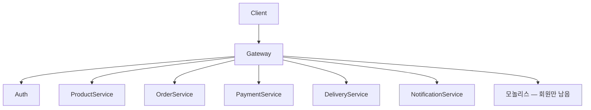

# 41장. 실전 사례 — 모놀리스 전자상거래 전환기

지금까지 우리는 마이크로서비스 전환에 필요한
거의 모든 개념과 패턴을 다루었다.

이 장에서는 그 모든 것을 하나의 이야기로 묶는다.

가상의 전자상거래 회사 **"ShopX"** 가
모놀리스에서 마이크로서비스로 전환하는 여정이다.

각 단계에서 어떤 결정을 내렸고,
어떤 함정을 피했는지를 따라간다.

---

## 시작 — 모놀리스 시절

ShopX는 5년 차 전자상거래 회사다.

* 일 주문량 5만 건
* 개발자 30명
* 단일 PHP/MySQL 모놀리스
* 데이터베이스 한 개
* 새 기능 배포는 매주 화요일

문제는 점점 쌓였다.

* 결제 영역만 트래픽이 5배 더 많은데 전체를 확장해야 한다
* 한 팀이 코드를 수정하면 다른 팀이 멈춘다
* 배포가 큰 이벤트가 되었다
* 한 영역 장애가 전체를 멈춘다

이 시점에서 마이크로서비스 전환을 결정했다.

---

## 단계 1 — 분리 가능성 확인 (1부의 적용)

먼저 1장에서 던진 질문에 답했다.

> 정말 지금 넘어가야 하는가?

답:

* 트래픽 패턴이 영역마다 다르다 ✓
* 배포가 조직 전체의 스트레스다 ✓
* 한 장애가 전체를 멈춘다 ✓
* 도메인 경계가 어느 정도 명확하다 ✓

→ 전환 결정.

그리고 2장에서 본 그림자도 인정했다.

* 네트워크 호출 실패를 다뤄야 한다
* 최종 일관성을 받아들여야 한다
* 운영 부담이 늘어난다

각오를 마치고 시작했다.

---

## 단계 2 — 점진적 전환 결정 (2부의 적용)

4장의 원칙에 따라
빅뱅 재구축은 제외했다.

> 작게, 자주, 검증하며 옮긴다.

5장의 Strangler Fig 패턴을 골랐다.
모놀리스 옆에 새 시스템을 두고
한 도메인씩 옮긴다.

---

## 단계 3 — 첫 추출 (9장의 적용)

9장에서 본 것처럼
**첫 추출은 학습 단계다.**

ShopX는 핵심 도메인을 첫 후보로 두지 않았다.
대신 **알림 발송**을 골랐다.

이유:

* 다른 도메인과 결합이 약하다 (이벤트만 받는다)
* 실패해도 주문이 멈추지 않는다
* 트래픽이 폭발적으로 늘 때가 있다 (마케팅 발송)



3개월 후 알림 서비스가 안정적으로 동작했다.
운영팀은 마이크로서비스 운영을 처음 경험했다.

같은 방식으로

* 로그 수집 서비스
* 검색 인덱싱 서비스
* 이미지 처리 서비스

를 차례로 떼어냈다.

1년이 지나자 분리된 서비스가 5개가 되었다.

---

## 단계 4 — 막힘 — 모놀리스가 Gateway다

이 시점에서 막혔다.

* 핵심 도메인(주문·결제·상품)을 떼어내려 한다
* 그런데 모놀리스가 모든 입구다
* 인증·라우팅·세션이 모놀리스 안에 묶여 있다

6장에서 본 정확히 그 상황이었다.



해결책: **Gateway를 위로 끌어올린다.**

---

## 단계 5 — Gateway와 Auth 도입



* 새 Gateway가 모든 요청의 입구가 된다
* Auth 서비스가 인증을 전담
* 모놀리스는 토큰을 검증만 한다 (스스로 인증하지 않는다)

이 단계가 가장 위험했다.
세션 기반 인증을 JWT로 바꾸면서
6개월 동안 두 인증 방식이 공존했다.

세션 → 토큰 변경 시 12장의 인증 흐름을 그대로 따랐다.

---

## 단계 6 — 핵심 도메인 추출 시작

Gateway가 깔끔해진 후
9장의 매트릭스로 추출 순서를 정했다.

| 도메인 | 효과 | 난이도 | 결정 |
|---|---|---|---|
| 주문 | 큼 (트래픽 집중) | 높음 (강결합) | B (준비 후) |
| 결제 | 큼 (영역 분리 필요) | 매우 높음 (트랜잭션) | B |
| 상품 | 중 (변경 잦음) | 낮음 (조회 위주) | A (우선) |
| 회원 | 큼 (모든 곳에서 참조) | 매우 높음 | D (보류) |
| 배송 | 중 | 중 | A |

**A부터 추출 시작.**

상품 → 배송 → 주문 → 결제 순으로 옮겨갔다.

---

## 단계 7 — 데이터 분리 (7장의 적용)

상품 서비스를 떼어낼 때
7장에서 본 데이터 마이그레이션 절차를 따랐다.



이 동안 23장의 Dual-write/CDC 운영을 했다.
드리프트 검증 스크립트를 매 시간 돌렸다.

처음에 0.3%의 드리프트가 발견되어
원인을 찾는 데 2주가 걸렸다.

---

## 단계 8 — 이벤트 기반 통신 도입

서비스가 늘어나면서
동기 호출 체인이 길어졌다.

```text
Order → Payment → Inventory → Notification
```

13장에서 본 장애 전파 위험이 보였다.

해결책: 이벤트 기반 통신으로 전환.



15장의 이벤트 기반 아키텍처 원칙을 따랐고

* 14장의 At-Least-Once 모델 받아들임
* 16장의 멱등성 설계
* 17장의 순서 깨짐 대응
* 20장의 Outbox로 원자성 보장
* 21장의 Outbox + Inbox로 안전한 전달

가 모두 적용됐다.

---

## 단계 9 — 정합성 보장

19장에서 본 최종 일관성을 인정하고
22장의 Saga 패턴을 도입했다.

주문 흐름의 보상 처리:



복잡한 흐름은 Orchestration,
단순한 흐름은 Choreography를 썼다.

---

## 단계 10 — 복원력과 관측 (7부의 적용)

서비스 수가 늘면서
24·25장의 복원력 패턴이 필수가 되었다.

* 모든 동기 호출에 Timeout
* 외부 의존에는 Circuit Breaker
* 자원 격리 (Bulkhead)
* 비동기는 Backpressure와 DLQ

27장의 관측 가능성 도구를 도입했다.

* Trace ID로 분산 추적
* 메트릭 대시보드
* 중앙 로그 수집 (ELK)

이 인프라 없이는 100개 서비스를 운영할 수 없다.

---

## 단계 11 — CQRS 도입 (8부의 적용)

조회 트래픽이 폭증한 상품 영역에 26장의 CQRS를 도입했다.



조회는 비정규화된 Read DB에서.
쓰기는 정규화된 Write DB에서.

조회 성능이 10배 빨라졌다.
포인트 시스템에는 27·28장의 Event Sourcing도 적용했다.

---

## 단계 12 — 코드 아키텍처 (9부의 적용)

서비스 안의 코드도 정리해야 했다.

처음에 30장의 레이어 아키텍처를 썼는데
31장에서 본 의존성 문제가 발생했다.

서비스 코드가
* DB
* Kafka
* 외부 API

모두에 의존하게 되었다.

32·33장의 헥사고날 아키텍처로 전환했다.

```text
src/
 ├─ domain/        ← 비즈니스 로직만
 ├─ application/   ← 유스케이스
 ├─ port/          ← 인터페이스
 ├─ adapter/       ← DB·Kafka·HTTP
 └─ config/        ← 의존성 주입
```

테스트가 훨씬 쉬워졌다.

---

## 단계 13 — 함정을 피했는가

3년 후 ShopX의 모습을 살펴보자.



* 핵심 도메인 5개가 분리됨
* 모놀리스는 회원 도메인만 남아 마지막 서비스가 됨
* 약 15개의 서비스 (변두리 포함)

37장의 분산 모놀리스 체크리스트로 점검했다.

| 항목 | 결과 |
|---|---|
| 함께 배포해야 하는 서비스 | 없음 |
| 한 장애가 전체 죽음 | 없음 |
| 공유 DB | 없음 |
| 5단계 이상 동기 체인 | 없음 |
| 공유 도메인 라이브러리 | 최소화됨 |

분산 모놀리스는 피했다.

38장의 Nanoservice 체크리스트로도 점검했다.

* 서비스가 15개 정도 — 적정
* 각 서비스가 단독으로 의미 있다 — OK
* 한 팀이 한 서비스 책임 — OK

Nanoservice도 피했다.

---

## 무엇을 배웠는가

ShopX의 3년 여정에서
가장 중요한 학습 다섯 가지:

### 1️⃣ 처음에는 학습이 우선이다

알림·로그·검색 같은 변두리부터 시작해서
운영 경험을 쌓은 것이 결정적이었다.

### 2️⃣ Gateway는 가장 먼저 분리한다

모놀리스가 Gateway면 핵심 추출이 막힌다.

### 3️⃣ 데이터 분리는 코드 분리보다 어렵다

데이터 마이그레이션과 정합성 검증이
전환에서 가장 시간을 많이 쓴 부분이었다.

### 4️⃣ 이벤트 기반은 늦지 않게 도입한다

동기 호출 체인이 길어지면
빨리 이벤트 기반으로 전환해야 한다.

### 5️⃣ 회귀를 두려워하지 않는다

추출했다가 합친 서비스도 있었다.
처음에 너무 작게 쪼갠 것을
한 번씩 통합하는 결정도 필요했다.

---

## 이 장의 핵심

* 마이크로서비스 전환은 한 번의 결정이 아니라 여러 해에 걸친 과정이다
* 1부의 판단 → 2부의 점진적 전환 → 3~9부의 패턴이 단계마다 적용된다
* 첫 추출은 변두리부터, 핵심 도메인은 충분히 준비한 후
* Gateway 위로 끌어올리기는 핵심 추출 전 단계의 결정적 작업이다
* 데이터 분리·정합성 검증·이벤트 기반·복원력·관측 — 모두가 필수다
* 분산 모놀리스와 Nanoservice 함정은 정기적으로 점검해야 한다
* 회귀할 줄 아는 것도 좋은 아키텍처 결정이다
