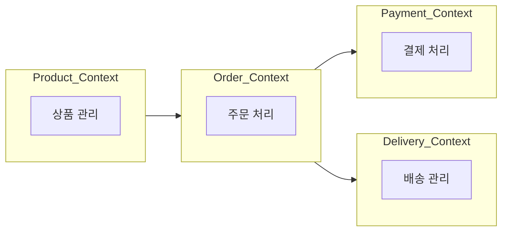

# 4장. 경계를 설계하는 방법

마이크로서비스로 전환하려는 순간  
가장 먼저 마주치는 질문은 이것이다.

> 서비스를 어디서 나눌 것인가?

이 질문에 답하지 못하면  
서비스를 여러 개로 나누어도 결국 하나처럼 얽힌다.

마이크로서비스의 핵심은  
많이 나누는 것이 아니라 **올바르게 나누는 것**이다.

---

## 기술이 아니라 책임으로 나눈다

서비스를 나누는 가장 쉬운 방법은 기술 기준이다.

* API 서버
* 비즈니스 로직 서버
* 데이터 서버

하지만 이렇게 나누면 구조만 갈라질 뿐, 비즈니스 책임은 그대로 섞여 있다.  
결국 함께 수정되고, 함께 배포되고, 함께 장애가 난다.

마이크로서비스에서의 분리는  
기술 계층이 아니라 **비즈니스 책임 단위**로 이루어져야 한다.  
이 사고 방식이 도메인 중심 설계(DDD)다.

---

## DDD의 핵심 질문

DDD는 복잡한 이론이 아니다.  
핵심 질문은 이것이다.

> 이 시스템은 어떤 책임 덩어리들로 이루어져 있는가?

전자상거래 시스템을 예로 들면, 비즈니스 관점에서 책임은 보통 이렇게 나뉜다.

* 상품 관리
* 주문 처리
* 결제 처리
* 배송 관리

각 책임 덩어리는 서로 다른 규칙과 상태를 가진다.  
DDD에서는 이런 책임 영역을 **Bounded Context(경계가 정의된 영역)** 라고 부른다.

---

## 경계를 나눌 때 가장 흔한 함정: “공통 개념”이 경계를 무너뜨린다

여기까지 오면 많은 팀이 다음 고민을 한다.

> “좋아, 상품/주문/결제/배송으로 나눴어.  
> 그런데 사용자 정보는 어디에 두지?”

이 질문이 중요한 이유는,  
**경계를 무너뜨리는 대부분의 원인이 ‘여러 영역에서 동시에 쓰이는 공통 개념’**이기 때문이다.

대표적인 공통 개념이 바로 **사용자(User)** 다.

* 주문은 구매자가 필요하고
* 결제는 결제 주체가 필요하고
* 배송은 수령인이 필요하다

즉, User는 여러 Context에서 “필요”하다.  
이때 접근을 잘못하면 User가 중앙 모델이 되면서 경계가 흐려지기 시작한다.

---

## 왜 “User를 공용 모델처럼 쓰기”가 위험해질 수 있는가

많은 시스템이 이렇게 설계한다.

* User Service
* Order Service
* Payment Service
* Delivery Service

이 구성이 자체로 틀린 것은 아니다.  
문제는 다음 상황이 겹칠 때다.

* Order가 User 테이블을 직접 조회한다
* Payment가 User의 등급/상태를 실시간으로 참조한다
* Delivery가 User의 최신 주소를 매번 조회한다

이렇게 되면 User는 “그저 한 서비스”가 아니라  
사실상의 **중앙 시스템(공유 모델/공유 데이터)** 이 된다.

* User 스키마가 바뀌면 여러 서비스가 같이 수정되고
* User가 느려지면 주문/결제/배송도 같이 느려지고
* User 장애가 나면 전체 흐름이 막힌다

겉으로는 나뉘어 있지만 실제로는 강하게 묶인다.  
이 상태가 흔히 말하는 **분산 모놀리스**로 가는 지점이다.

---

## 그럼 User는 어떻게 다뤄야 하는가

여기서 핵심은 이것이다.

> User를 없애는 게 아니라,  
> 모든 서비스가 **User “전체”를 공유하지 않게** 만드는 것이다.

각 Context는 “자기 일이 돌아가는데 필요한 사용자 정보”만 가지면 된다.

즉, 각 Context는 **자기 관점의 사용자 정보**만 최소한으로 들고 간다.

---

## 주문·결제·배송은 사용자 정보를 이렇게 가진다

### 주문(Order) 관점에서 필요한 사용자 정보

주문은 보통 이것만 있으면 된다.

* buyer_id
* 주문 당시 이름(스냅샷)
* 주문 당시 배송지(스냅샷)

예:

```
Order
- order_id
- buyer_id
- buyer_name_snapshot
- shipping_address_snapshot
```

주문은 “사용자 최신 프로필”을 매번 참조하지 않아도 된다.  
주문은 주문 시점의 정보가 더 중요하다.

---

### 결제(Payment) 관점에서 필요한 사용자 정보

결제는 보통 이것만 있으면 된다.

* payer_id
* 결제 승인에 필요한 최소 검증 결과(또는 상태)

예:

```
Payment
- payment_id
- payer_id
- verification_result
```

결제가 배송지/프로필/마케팅 동의까지 알아야 할 이유는 없다.

---

### 배송(Delivery) 관점에서 필요한 사용자 정보

배송은 보통 이것이면 충분하다.

* 수령인 이름
* 배송지 주소

배송은 사용자 프로필의 변화와 독립적으로 움직일 수 있다.

---

## 전자상거래 Context 구조

아래는 책임 기준(Context 기준)으로 나눈 예시다.



이 구조에서 경계를 지키는 핵심은 단순하다.

* 각 Context는 **자기 데이터**를 가진다
* 다른 Context의 DB를 직접 조회하지 않는다
* 필요한 사용자 정보는 “전체 공유”가 아니라 **최소 정보/스냅샷/자기 관점 데이터**로 가진다

---

## 이 장의 정리

DDD의 목적은 “멋진 용어를 아는 것”이 아니다.  
목적은 딱 하나다.

> 책임을 기준으로 경계를 만들고,  
> 공통 개념 때문에 그 경계가 무너지지 않게 하는 것
