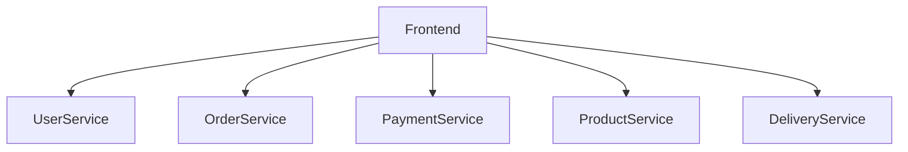
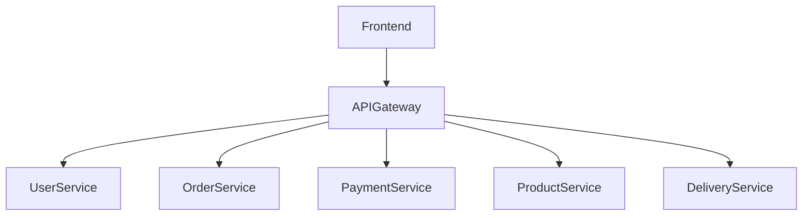

# 7장. 단일 진입점의 설계

서비스를 여러 개로 나누었다고 해서  
외부 세계까지 나눌 필요는 없다.

프론트엔드 입장에서 중요한 것은  
서비스 개수가 아니라  
**접속이 단순한가**이다.

마이크로서비스 아키텍처에서는  
대부분 하나의 관문이 존재한다.

이것이 API Gateway다.

---

## 왜 단일 진입점이 필요한가

서비스가 여러 개로 나뉘면  
프론트엔드가 각 서비스에 직접 붙는 구조도 가능하다.

겉보기에는 단순해 보인다.

하지만 시간이 지나면 문제가 드러난다.

* 인증을 어디서 처리할 것인가?
* 공통 로깅은 누가 담당하는가?
* 에러 형식이 서비스마다 다르면?
* 서비스 주소가 바뀌면 프론트는 어떻게 되는가?
* 서비스가 늘어나면 프론트 복잡도는?

이제 프론트는 내부 서비스 구조를 알아야 한다.  
어떤 서비스가 무엇을 담당하는지도 이해해야 한다.

이 상태는  
서비스를 나눴지만  
결합은 여전히 강한 구조다.

---

## 단일 진입점을 둔 구조

API Gateway를 두면 구조는 이렇게 바뀐다.

이 구조에서 중요한 점은 다음과 같다.

* 프론트는 내부 서비스 개수를 모른다
* 인증과 정책은 Gateway에서 처리된다
* 내부 서비스 변경이 외부에 직접 노출되지 않는다

외부는 단순해지고  
내부는 독립적으로 진화할 수 있다.

---

## API Gateway의 본질

Gateway는 또 하나의 비즈니스 서비스가 아니다.

그 역할은 명확하다.

* 요청을 적절한 서비스로 라우팅한다
* 인증 및 인가를 수행한다
* 공통 정책을 집행한다
* 외부와 내부 사이의 계약을 유지한다

Gateway는  
**정책과 규약을 집행하는 관문**이다.

---

## Gateway가 담당해야 할 것

### 1️⃣ 라우팅

요청을 내부 서비스로 전달한다.  
내부 서비스 구조가 바뀌어도 외부 인터페이스는 유지된다.

---

### 2️⃣ 인증과 인가

* 토큰 검증
* 권한 확인
* 공통 보안 정책

이 기능을 각 서비스에 중복 구현하지 않는다.

---

### 3️⃣ 요청 제한과 보호

* Rate Limit
* 트래픽 제어
* 기본적인 보안 필터링

서비스를 보호하는 1차 방어선이다.

---

### 4️⃣ 공통 로깅과 추적

Gateway는 모든 요청이 지나가는 지점이다.

따라서

* Trace ID 생성
* 공통 로그 형식 유지
* 요청 처리 시간 측정

등을 처리하기에 이상적인 위치다.

---

### 5️⃣ API 계약 유지

서비스가 나뉘면  
API는 단순한 인터페이스가 아니라 계약이 된다.

Gateway는

* 요청/응답 형식 유지
* 에러 포맷 통일
* 버전 분기 처리

등을 통해  
이 계약을 관리한다.

---

## Gateway가 해서는 안 되는 것

Gateway는 강력하다.  
그래서 쉽게 비대해질 수 있다.

다음과 같은 일이 벌어지면 위험하다.

* 비즈니스 판단 로직이 들어간다
* 여러 서비스 데이터를 조합해 복잡한 계산을 한다
* 상태를 저장하기 시작한다
* 도메인 규칙을 구현한다

이 순간 Gateway는  
얇은 관문이 아니라  
또 다른 중앙 서버가 된다.

경계를 나눴지만  
다시 한 곳에 로직이 모이기 시작한다.

---

## 단일 진입점은 단일 장애점이 될 수 있다

Gateway는 모든 요청이 통과하는 지점이다.

따라서 반드시 고려해야 한다.

* 수평 확장 구조
* 타임아웃 설정
* 기본 실패 응답 전략
* 트래픽 폭주 대비

Gateway가 멈추면  
전체 시스템이 멈춘다.

단일 진입점은 필요하지만  
단일 장애점이 되어서는 안 된다.

---

## Gateway와 내부 경계의 관계

Gateway는  
내부 서비스 경계를 없애는 구조가 아니다.

오히려 그 경계를 보호한다.

* 외부는 단순하게 유지하고
* 내부는 독립적으로 발전하도록 돕는다

이 균형이 중요하다.

---

## 이 장의 핵심

마이크로서비스에서는  
내부 구조는 분리되지만  
외부 접점은 단순해야 한다.

API Gateway는

* 얇아야 하고
* 정책 중심이어야 하며
* 도메인 로직을 가지지 않아야 한다
* 고가용성을 전제로 설계되어야 한다

경계를 나누는 것만큼  
그 경계를 외부와 연결하는 방법도 중요하다.