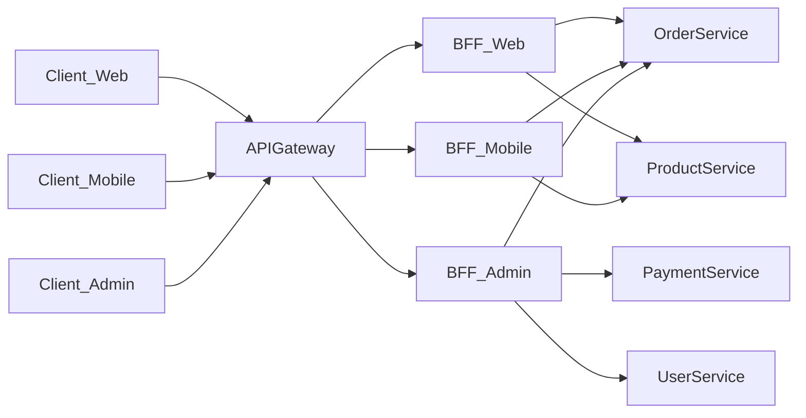

# 8장. 채널을 위한 설계

API Gateway는 외부와 내부를 연결하는 관문이다.  
하지만 모든 프론트엔드가 같은 형태의 API를 원하는 것은 아니다.

웹과 모바일은 다르고,  
관리자 화면과 일반 사용자 화면도 다르다.

이때 등장하는 개념이  
BFF(Backend for Frontend)다.

---

## 왜 Gateway만으로는 부족해지는가

API Gateway의 역할은 분명하다.

* 라우팅
* 인증/인가
* 공통 정책
* 계약 유지

하지만 화면 단에서는 이런 요구가 생긴다.

* 한 화면에서 여러 서비스 데이터를 한 번에 받아오고 싶다
* 모바일은 네트워크 호출을 최소화하고 싶다
* 웹은 상세 데이터를 더 많이 필요로 한다
* 관리자 화면은 내부 필드까지 필요하다

이 요구를 모두 Gateway에서 처리하면  
Gateway가 비대해진다.

비즈니스 조합 로직이 Gateway로 올라오기 시작한다.

그 순간 Gateway는  
정책 관문이 아니라  
중앙 집계 서버가 된다.

---

## BFF의 등장

BFF는 말 그대로  
특정 프론트엔드를 위한 백엔드다.

구조는 다음과 같다.

이 구조에서

* Gateway는 정책과 보안을 담당하고
* BFF는 채널에 맞는 응답을 구성한다
* 실제 도메인 로직은 각 서비스에 남아 있다

---

## BFF의 역할

BFF는 비즈니스 서비스를 대체하지 않는다.

그 역할은 다음과 같다.

* 화면에 맞는 응답 구조로 변환
* 여러 서비스 호출 결과를 조합
* 채널 특화 최적화
* 과도한 네트워크 호출 감소

예를 들어:

웹 화면에서는

* 상품 목록
* 재고 상태
* 할인 정보
* 리뷰 요약

을 한 번에 보여주고 싶을 수 있다.

이때 BFF가 여러 서비스를 호출해  
하나의 응답으로 조합해준다.

---

## BFF가 필요한 상황

다음과 같은 경우 BFF를 고려할 수 있다.

* 웹과 모바일의 요구사항이 크게 다를 때
* 응답 최적화가 채널별로 달라야 할 때
* 특정 채널에서 복잡한 데이터 조합이 필요할 때
* 프론트 팀과 백엔드 팀의 배포 속도가 다를 때

BFF는  
채널 독립성을 높이는 장치다.

---

## BFF의 위험성

하지만 BFF도 쉽게 비대해진다.

다음과 같은 징후가 보이면 위험하다.

* 도메인 규칙이 BFF로 올라오기 시작한다
* 서비스 상태 변경을 BFF에서 처리한다
* BFF가 사실상의 핵심 로직 서버가 된다

이 경우 구조는 다시 중앙 집중형으로 돌아간다.

BFF는  
“조합”은 하되  
“판단”은 하지 않아야 한다.

---

## Gateway와 BFF의 차이

정리해보면 다음과 같다.

| 구분      | API Gateway    | BFF           |
| ------- | -------------- | ------------- |
| 목적      | 정책과 관문         | 채널 최적화        |
| 책임      | 인증, 라우팅, 공통 규약 | 응답 조합, 화면 최적화 |
| 비즈니스 로직 | 없음             | 최소한           |
| 위치      | 외부 경계          | 채널별 경계        |

Gateway는 시스템의 입구이고  
BFF는 채널의 완충지대다.

---

## BFF는 반드시 필요한가?

모든 시스템에 BFF가 필요한 것은 아니다.

* 프론트 채널이 하나뿐이라면
* 응답 구조가 단순하다면
* 화면 조합 로직이 복잡하지 않다면

BFF 없이도 충분하다.

BFF는  
복잡성이 생겼을 때 도입하는 도구다.

---

## 이 장의 핵심

서비스를 나누고  
Gateway로 외부를 단순화했다면,

다음 고민은  
“채널별 요구를 어떻게 수용할 것인가”이다.

BFF는

* 채널별 최적화를 담당하고
* 내부 도메인 로직을 보호하며
* 프론트와 서비스 사이의 완충 역할을 한다

하지만

* 얇게 유지해야 하고
* 판단 로직을 흡수하지 않아야 하며
* 또 다른 모놀리스가 되지 않도록 관리해야 한다

마이크로서비스 아키텍처는  
서비스 개수보다  
경계의 명확성과 역할의 분리가 더 중요하다.