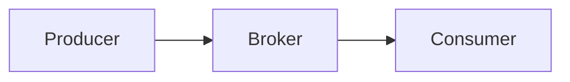
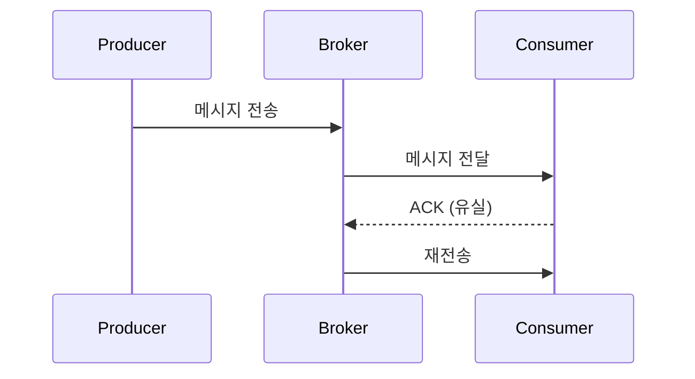
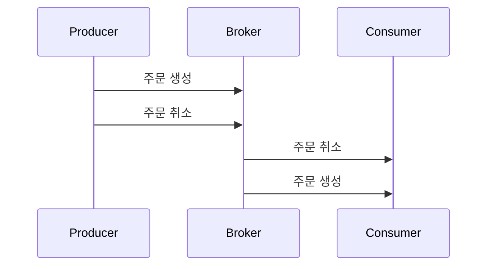

# 9장. 메시지는 정확히 한 번 오지 않는다

마이크로서비스에서 이벤트 기반 통신을 사용하면  
구조는 보통 다음과 같다.

* Producer는 메시지를 발행한다.
* Broker는 메시지를 저장하고 전달한다.
* Consumer는 메시지를 받아 처리한다.

겉으로 보기에는 단순하다.

하지만 이 구조는  
네트워크 위에서 동작한다는 사실을 반드시 기억해야 한다.

---

## 네트워크는 완벽하지 않다

네트워크는 다음과 같은 특성을 가진다.

* 지연될 수 있다.
* 패킷이 유실될 수 있다.
* 연결이 일시적으로 끊길 수 있다.
* 응답(ACK)이 손실될 수 있다.

이 환경에서  
“메시지가 정확히 한 번 전달된다”는 보장을 만드는 것은  
기술적으로 매우 어렵다.

그래서 메시지 시스템은  
세 가지 전달 모델을 제공한다.

---

## 메시지 전달의 세 가지 모델

### 1️⃣ At Most Once — 최대 한 번

* 재전송하지 않는다.
* 중복은 발생하지 않는다.
* 대신 유실될 수 있다.

ACK를 받지 못해도  
다시 보내지 않는다.

장점:

* 단순하다.
* 비용이 낮다.
* 처리량이 높다.

단점:

* 메시지가 사라질 수 있다.

### 2️⃣ At Least Once — 최소 한 번

* ACK를 받지 못하면 재전송한다.
* 유실 가능성은 매우 낮다.
* 대신 중복이 발생할 수 있다.

흐름을 보자.

Consumer는 이미 처리했지만  
ACK가 유실되면 Broker는 재전송한다.

→ 동일 메시지가 두 번 처리될 수 있다.

이것은 예외 상황이 아니라  
설계상 자연스러운 결과다.

### 3️⃣ Exactly Once — 정확히 한 번

이상적인 모델처럼 보인다.

* 유실도 없고
* 중복도 없다.

하지만 이를 보장하려면:

* 브로커는 메시지 처리 상태를 정확히 추적해야 하고
* 소비자의 처리 결과와 일관성을 유지해야 하며
* 재전송과 상태 관리를 전역적으로 통제해야 한다.

이는 사실상  
분산 트랜잭션에 가까운 복잡성을 만든다.

결과적으로:

* 성능 저하
* 구현 복잡성 증가
* 확장성 제한

“정확히 한 번”은  
기술적으로 가능하지만 무료가 아니다.

---

## 어떤 모델이 정답인가

세 모델은 우열 관계가 아니다.

중요한 것은  
**어떤 위험을 감수할 것인가**이다.

### At Most Once가 적합한 경우

유실이 서비스 핵심에 영향을 주지 않는 경우.

예:

* 대량 로그 수집
* 사용자 행동 분석 이벤트
* 메트릭 전송
* 실시간 모니터링 데이터

이 경우 일부 메시지가 사라져도  
전체 통계나 서비스 기능에는 큰 문제가 없다.

오히려 재전송 비용과 중복 처리 부담이  
더 비효율적일 수 있다.

### At Least Once가 적합한 경우

다음과 같은 핵심 도메인 이벤트는  
사라지면 안 된다.

* 주문 생성
* 결제 승인
* 재고 차감
* 회원 상태 변경

이 경우 유실은 치명적이다.

그래서 대부분의 핵심 비즈니스 이벤트는  
At Least Once 모델을 선택한다.

대신 중복을 감수한다.

### Exactly Once는 언제 쓰이는가

특정 금융 처리나  
강력한 정합성이 절대적으로 필요한 시스템에서는  
Exactly Once가 선택될 수 있다.

하지만 일반적인 웹 서비스 환경에서는  
복잡성과 비용이 너무 크다.

---

## At Least Once를 선택하면 생기는 일

많은 핵심 이벤트가  
At Least Once를 기반으로 동작한다는 것은  
다음 현실을 받아들여야 한다는 의미다.

### 1️⃣ 메시지는 중복될 수 있다

재시도, ACK 손실, 브로커 재시작 등으로 인해  
같은 메시지가 여러 번 도착할 수 있다.

중복은 오류가 아니라  
정상 동작의 일부다.

### 2️⃣ 메시지 순서는 보장되지 않을 수 있다

예를 들어 다음 두 이벤트가 있다고 하자.

1. 주문 생성
2. 주문 취소

이론적으로는 생성 → 취소 순서여야 한다.

하지만 실제 도착은 다음과 같을 수 있다.

순서 역전은 충분히 발생할 수 있다.

네트워크 지연, 파티션 재조정, 재시도 등  
여러 요인 때문이다.

### 3️⃣ ACK 시점이 설계에 영향을 준다

Consumer는 언제 ACK를 보내야 하는가?

* DB 저장 후?
* 외부 API 호출 후?
* 메모리 처리 후?

ACK 시점에 따라  
중복 처리 전략과 실패 복구 방식이 달라진다.

이것은 단순한 구현 세부사항이 아니라  
아키텍처 결정이다.

---

## 이벤트 기반 설계의 기본 전제

이벤트 기반 아키텍처를 선택했다면  
다음 사실을 받아들여야 한다.

* 메시지는 유실될 수 있다.
* 메시지는 중복될 수 있다.
* 메시지는 순서가 바뀔 수 있다.
* Exactly Once는 비용이 높다.
* 전달 모델은 목적에 따라 선택해야 한다.

이 전제를 무시하면  
시스템은 언젠가 예상치 못한 방식으로 깨진다.

---

## 이 장의 핵심

이벤트 기반 통신은  
함수 호출의 확장판이 아니다.

네트워크 위에서 동작하는  
비결정적 시스템이다.

* 완벽한 전달은 어렵다.
* 중복은 자연스럽다.
* 순서 역전은 발생할 수 있다.
* 모델 선택은 비용과 위험의 문제다.

대부분의 핵심 도메인 이벤트는  
At Least Once 위에 설계된다.

그리고 그 전제를 받아들인 순간  
다음 질문이 등장한다.

> 중복과 순서 문제를 전제로  
> 시스템의 상태를 어떻게 설계할 것인가?
