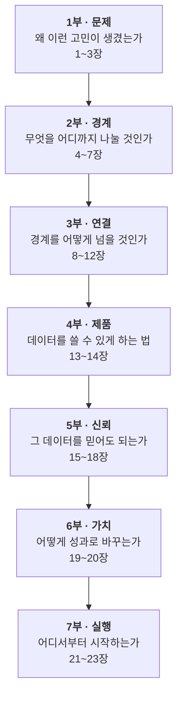
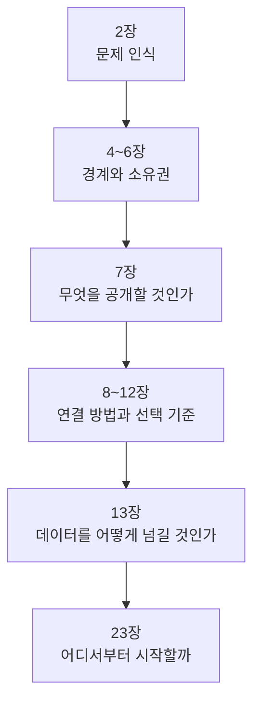

# 0장. 이 책의 지도

*모던 데이터 아키텍처 — 경계와 계약으로 설계하기*

제목의 두 낱말이 책 전체를 떠받친다.  
**경계**는 어디서 나눌 것인가이고,  
**계약**은 그 경계를 넘을 때 무엇을 약속할 것인가다.

이 책은 데이터가 여러 시스템에 흩어진 조직에서  
아키텍처를 어떻게 설계하고 운영할지 다룬다.

먼저 전체 주장을 한 문장으로 적어 둔다.

> 비즈니스 경계로 책임을 나누고,  
> 경계를 넘을 때는 명시적인 계약으로 연결하며,  
> 공통 기반은 플랫폼으로 표준화해서  
> 작은 범위부터 점진적으로 확장한다.

나머지 23개 장은 이 문장을 풀어 쓴 것이다.

---

## 1. 전체 구조



각 부는 하나의 질문에 답한다.

| 부 | 질문 | 장 |
|---|---|---|
| 1부 | 왜 데이터가 흩어졌고 무엇이 문제인가 | 1~3 |
| 2부 | 어디에 경계를 긋고 누가 책임지는가 | 4~7 |
| 3부 | API·이벤트·배치 중 무엇을 언제 쓰는가 | 8~12 |
| 4부 | 데이터를 어떻게 제품처럼 제공하는가 | 13~14 |
| 5부 | 찾고, 믿고, 안전하게 쓰려면 무엇이 필요한가 | 15~18 |
| 6부 | 분석과 머신러닝으로 어떻게 연결하는가 | 19~20 |
| 7부 | 조직과 플랫폼을 어떻게 바꾸는가 | 21~23 |

---

## 2. 읽는 순서

전체를 처음 배운다면 1장부터 순서대로 읽으면 된다.

목적이 분명하다면 아래 경로가 빠르다.

### 모놀리스에서 서비스를 분리하는 중이라면



15~18장은 분리가 끝난 뒤에 읽어도 늦지 않다.

### 데이터 플랫폼을 만든다면

```text
3장 → 13~15장 → 19장 → 21~23장
```

### 거버넌스를 맡았다면

```text
2장 → 6장 → 14~18장 → 23장
```

---

## 3. 반복해서 나오는 개념

몇 개념은 여러 장에 걸쳐 등장한다.  
설명을 한 곳에 모아 두었으니 처음 만났을 때  
아래 장을 펼치면 된다.

| 개념 | 설명하는 장 |
|---|---|
| Data Mesh 네 가지 원칙 | 3장 |
| 유비쿼터스 언어 | 5장 |
| 데이터 소유권 | 6장 |
| API 계약 | 8장 |
| CQRS | 9장 |
| 데이터 프로덕트 | 13장 |
| Bronze / Silver / Gold | 14장 |
| 데이터 품질 | 14장 |
| 메타데이터·카탈로그·계보 | 15장 |
| 데이터 계약 | 16장 |
| 셀프서비스 플랫폼 | 22장 |

다른 장에서 이 개념이 나오면  
한두 문장으로 짚고 넘어간 뒤 해당 장을 가리킨다.

---

## 4. 이 책을 읽는 방법

기술 이름을 외우는 책이 아니다.

Kafka, dbt, Debezium 같은 도구는 계속 바뀐다.  
바뀌지 않는 것은 아래 질문들이다.

```text
이 데이터는 무엇인가?

누가 책임지는가?

어디에서 왔는가?

얼마나 믿을 수 있는가?

누가 어떤 목적으로 쓰는가?

경계를 넘을 때 무엇을 약속했는가?
```

각 장을 덮을 때 이 질문에 조금 더 답할 수 있다면  
그 장은 제 몫을 한 것이다.

---

## 5. 예시에 관하여

설명에는 온라인 쇼핑몰을 예로 든다.

```text
회원 · 상품 · 주문 · 결제 · 배송 · 정산
```

판매자에게 대금을 지급하는 출금,  
유상과 무상으로 나뉘는 포인트도 자주 나온다.

특정 업종에 익숙하지 않아도 읽을 수 있도록  
가장 흔한 형태 하나로 통일했다.

---

## 6. 부록

본문에서 덜어낸 내용과 참고 자료를 부록에 두었다.

| 부록 | 내용 | 언제 보면 되나 |
|---|---|---|
| A. 클라우드 랜딩 존과 Blueprint | 도메인을 실제 클라우드에 배치하는 방법 | 21장을 읽고 클라우드 환경을 설계할 때 |
| B. 지식 그래프와 시맨틱 웹 | 메타데이터 관계를 그래프로 다루는 기술 | 15장 이후 메타데이터를 본격적으로 다룰 때 |
| C. 용어집 | 본문 용어를 주제별로 정리 | 모르는 용어를 만났을 때 |
| D. 흔한 오해 | 본문에서 바로잡은 오해 모음 | 설계 판단이 서지 않을 때 |

A와 B는 처음 읽을 때 건너뛰어도 된다.

C와 D는 순서대로 읽는 것보다  
필요할 때 찾아보는 쪽이 쓸모 있다.

특히 D는 실무에서 결정을 앞두고 다시 보면  
흔한 함정을 미리 피할 수 있다.
