# 10장. 이벤트로 연결하기

> **3부 · 연결** — 경계를 어떻게 넘는가  
> 8장 · 9장 · **10장** · 11장 · 12장

*이벤트의 생성부터 전달·처리·저장·운영까지*

이벤트 기반 아키텍처를 처음 접하면  
보통 Kafka나 메시지 큐부터 떠올리기 쉽다.

하지만 이벤트 기반 아키텍처는  
특정 제품이나 기술을 의미하지 않는다.

핵심은 다음과 같다.

> 시스템에서 발생한 일을  
> **이벤트라는 데이터로 표현하고**,  
> 필요한 시스템이 그 이벤트에 반응하도록  
> 시스템을 연결하는 설계 방식이다.

예를 들어 결제가 완료됐다고 해보자.

기존에는 결제 서비스가 직접

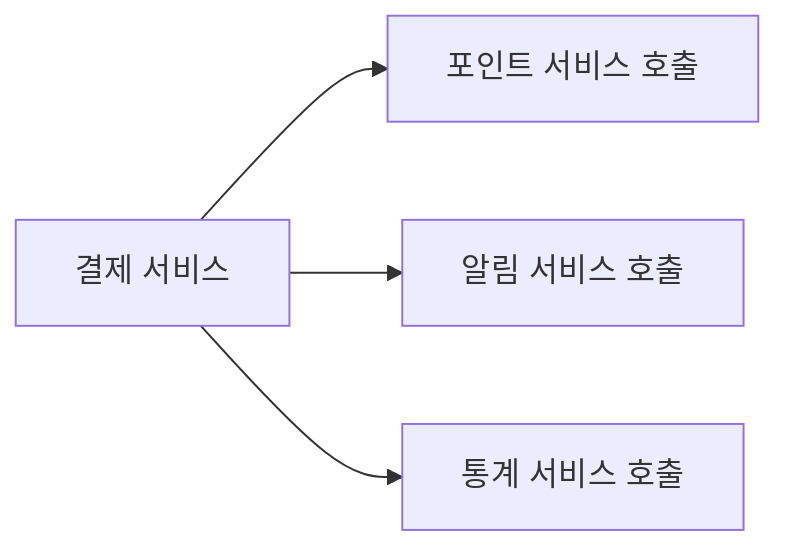

할 수 있다.

이벤트 기반으로 바꾸면

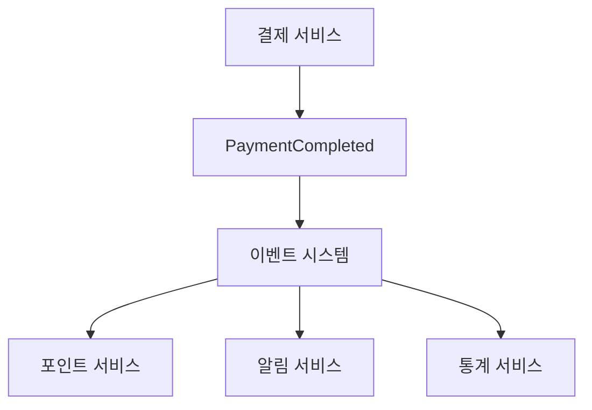

처럼 만들 수 있다.

결제 서비스는

> "결제가 완료됐다."

라는 사실만 알린다.

누가 그 정보를 사용하는지는  
알 필요가 없다.

이것이 이벤트 기반 아키텍처를 이해하는  
가장 중요한 출발점이다.

---

## 1. 이벤트란 무엇인가

이벤트(Event)는

> **이미 발생한 사실**

을 의미한다.

예를 들어 다음은 모두 이벤트가 될 수 있다.

```text
회원이 가입했다.
결제가 완료됐다.
상품이 주문됐다.
주문이 완료됐다.
배송이 시작됐다.
고객 정보가 변경됐다.
```

프로그램에서는 보통 다음처럼 표현할 수 있다.

```text
UserRegistered
PaymentCompleted
OrderCreated
OrderCompleted
DeliveryStarted
CustomerUpdated
```

이벤트 이름을 과거형으로 표현하는 경우가 많은 것도  
이미 발생한 사실을 나타내기 때문이다.

---

## 2. Event, Command, Query를 구분하자

메시지라고 해서 전부 이벤트는 아니다.

처음부터 세 개의 차이를 알아두는 것이 좋다.

### Event

이미 일어난 사실이다.

```text
PaymentCompleted
OrderCompleted
UserRegistered
```

의미는

```text
"결제가 완료됐다."
"주문이 완료됐다."
"회원이 가입했다."
```

이다.

---

### Command

무엇인가를 수행하라는 요청이다.

```text
CreatePayment
CancelOrder
DeductPoint
```

의미는

```text
"결제해라."
"주문을 취소해라."
"포인트를 차감해라."
```

이다.

---

### Query

정보를 달라는 요청이다.

```text
GetPayment
GetOrderHistory
GetPointBalance
```

Query는 일반적으로 시스템 상태를 변경하지 않는다.

정리하면 다음과 같다.

```text
Event
= 이미 발생한 사실

Command
= 무엇인가를 수행하라는 요청

Query
= 정보를 요청
```

이 세 가지를 명확하게 구분하면  
이벤트 기반 시스템의 설계가 훨씬 이해하기 쉬워진다.

---

## 3. 요청/응답 구조와 이벤트 기반 구조

전통적인 서비스 통신은  
다른 서비스를 직접 호출하는 경우가 많다.

예를 들어:

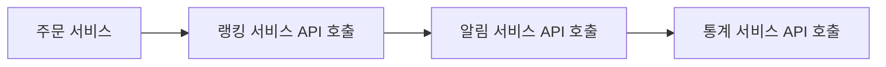

이 구조의 장점은 흐름이 명확하다는 것이다.

하지만 주문 서비스가

```text
랭킹 서비스
알림 서비스
통계 서비스
```

를 모두 알고 있어야 한다.

시스템이 커질수록 서비스 사이의 연결도 증가한다.

---

이벤트 기반에서는 다르게 접근한다.

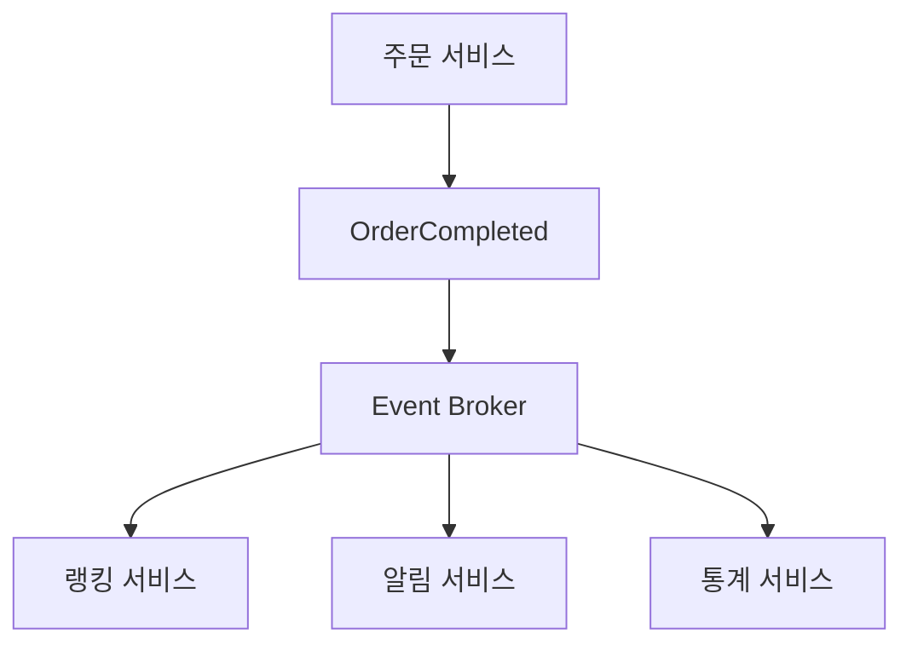

주문 서비스는

```text
주문이 완료됐다.
```

는 사실만 알린다.

랭킹, 알림, 통계 서비스는  
각자 필요한 일을 수행한다.

이렇게 서로 직접 알지 않아도 되는 관계를

**느슨한 결합(Loose Coupling)**

이라고 한다.

---

## 4. 동기 통신과 비동기 통신

이벤트 기반 시스템을 이해하려면  
동기와 비동기의 차이를 알아야 한다.

### 동기 통신

서비스 A가 B에게 요청을 보내고  
응답이 올 때까지 기다린다.

```text
서비스 A
   ↓ 요청
서비스 B
   ↓ 처리
서비스 A
   ↑ 응답
```

대표적으로 HTTP API가 있다.

장점은 단순하다는 것이다.

하지만 B가 느리면  
A도 기다려야 한다.

B에 장애가 발생하면  
A까지 영향을 받을 수도 있다.

---

### 비동기 통신

요청 또는 이벤트를 전달한 뒤  
바로 다음 작업을 진행할 수 있다.

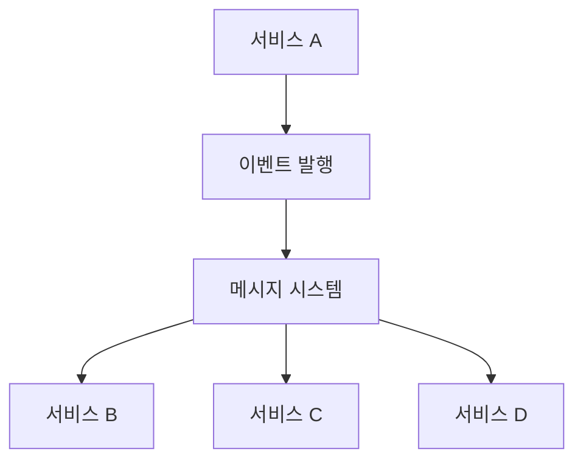

A는 B, C, D의 처리 완료를  
즉시 기다리지 않아도 된다.

이벤트 기반 아키텍처에서는  
이런 비동기 통신을 많이 활용한다.

---

## 5. 이벤트 알림 방식

이벤트를 만들 때 중요한 설계 문제가 있다.

> 이벤트에 변경 사실만 넣을 것인가,  
> 필요한 상태까지 함께 넣을 것인가?

대표적으로 두 가지 접근이 있다.

먼저 변경 사실만 알리는 쪽부터 보자.

가장 작은 정보만 전달한다.

예를 들어:

```json
{
  "customerId": 100
}
```

의 의미는

```text
"고객 100의 정보가 변경됐다."
```

정도이다.

Consumer가 자세한 정보가 필요하다면  
고객 서비스에 다시 요청한다.

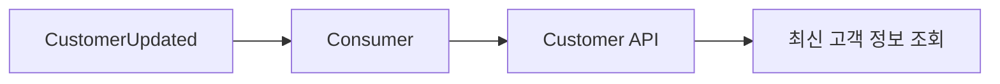

### 장점

이벤트 크기가 작다.

불필요한 개인정보 전파도 줄일 수 있다.

### 단점

추가 API 호출이 필요하다.

원본 서비스가 장애 상태라면  
정보를 가져오지 못할 수 있다.

---

## 6. 상태를 함께 전달하는 방식

이벤트 안에 Consumer가 필요한 데이터까지  
같이 전달할 수도 있다.

이를 흔히

**Event-Carried State Transfer**

라고 한다.

예를 들어:

```json
{
  "customerId": 100,
  "name": "Kim",
  "city": "Busan"
}
```

처럼 보낼 수 있다.

Consumer는 별도 API 호출 없이  
이벤트만으로 필요한 데이터를 사용할 수 있다.

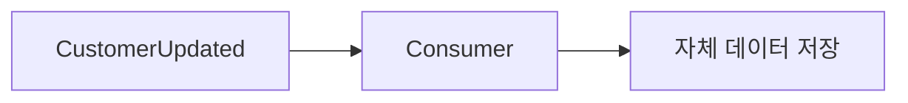

---

## 7. 상태 전송의 장단점

장점은 Consumer의 독립성이 높아진다는 것이다.

하지만 데이터가 여러 시스템으로 복제되므로

```text
데이터 중복
개인정보 관리
삭제 처리
스키마 변경
정합성 관리
```

같은 문제가 발생한다.

따라서 다음 트레이드오프가 있다.

```text
이벤트에 데이터를 많이 포함

→ API 의존성 감소
→ 데이터 관리 복잡성 증가
```

정답은 하나가 아니다.

업무 특성에 따라 결정해야 한다.

---

## 8. Producer와 Consumer

이벤트를 만드는 쪽을

**Producer**

라고 한다.

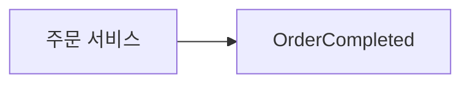

이벤트를 받아 사용하는 쪽을

**Consumer**

라고 한다.

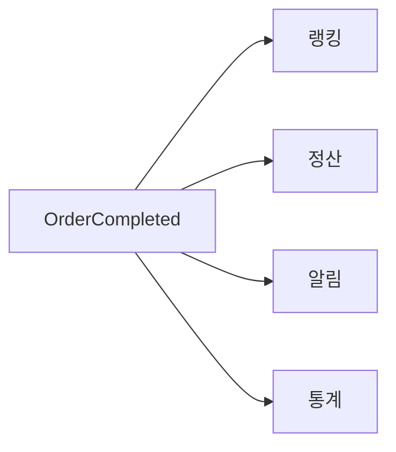

Producer는 일반적으로  
Consumer가 몇 개인지 몰라도 된다.

이것이 이벤트 기반 구조가  
서비스 간 결합도를 줄이는 중요한 이유이다.

---

## 9. 메시지 큐

이벤트나 작업 메시지를 전달하는  
대표적인 방식이 메시지 큐이다.

메시지를 잠시 줄 세워 놓는  
대기열이라고 생각하면 된다.

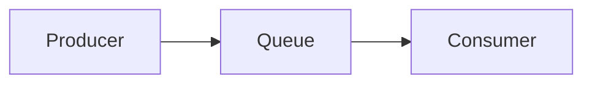

Producer가 순간적으로 많은 작업을 만들어도  
Consumer가 처리할 때까지 큐에 보관할 수 있다.

---

## 10. 메시지 큐가 유용한 경우

메시지 큐는 다음 상황에서 유용하다.

```text
작업이 순간적으로 몰릴 때
처리 속도가 서로 다를 때
작업을 여러 Worker에게 분산할 때
재처리가 필요할 때
```

예를 들어:

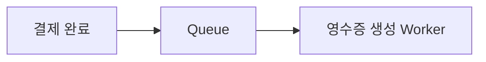

영수증 시스템이 잠시 느려져도  
결제 시스템 전체가 같이 느려질 필요는 없다.

---

## 11. 이벤트 브로커

서비스 사이에서 이벤트를 전달하는 중개자를  
**Event Broker**라고 부른다.

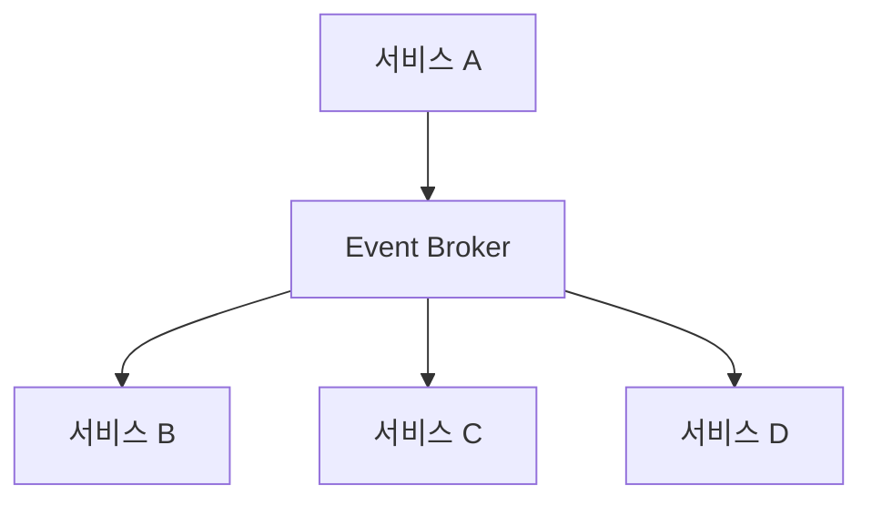

Broker를 사용하면 Producer가 Consumer에게  
직접 연결될 필요가 없다.

---

## 12. 메시지 큐와 이벤트 스트림

이벤트 전달 기술이 모두 같은 역할을 하는 것은 아니다.

```text
Message Queue
Event Stream
Event Router
Stream Processing / Aggregation
```

이 중 가장 헷갈리는 둘을 먼저 비교해 보자.

두 개는 특히 자주 비교된다.

### 메시지 큐

작업을 분배하는 데 초점이 있다.

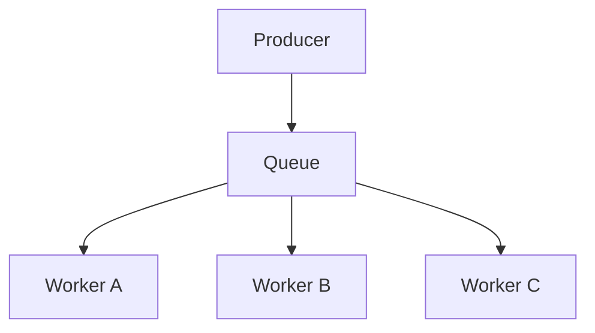

하나의 작업을 여러 Worker 중 하나가  
처리하는 구조가 대표적이다.

---

### 이벤트 스트림

시간 순으로 발생한 이벤트 기록을  
일정 기간 유지하면서

여러 Consumer가 각자의 위치에서  
독립적으로 읽을 수 있다.

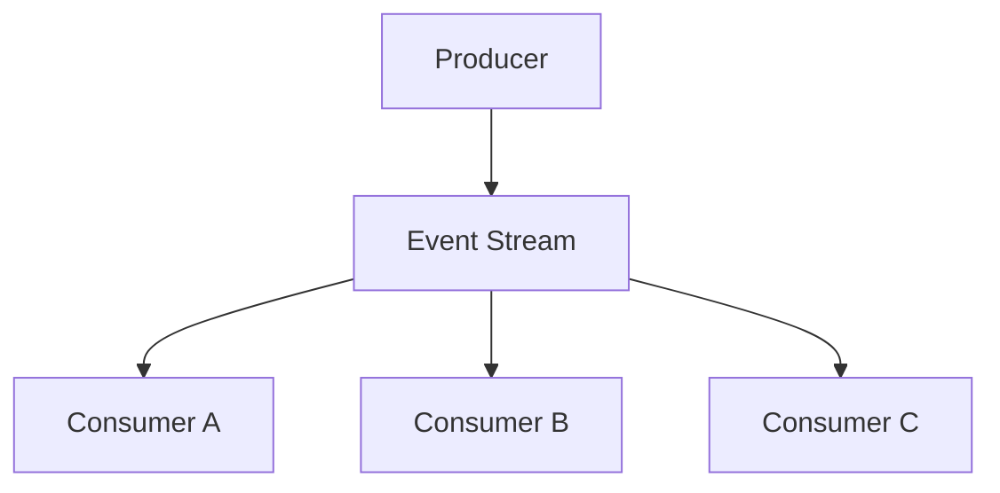

Kafka 같은 시스템을 떠올리면 쉽다.

다만 실제 메시징 제품들은 기능이 많이 겹치므로  
제품 이름만 보고 완전히 구분하면 안 된다.

---

## 13. 이벤트 라우터

이벤트의 내용이나 조건을 보고  
목적지를 결정하는 방식이다.

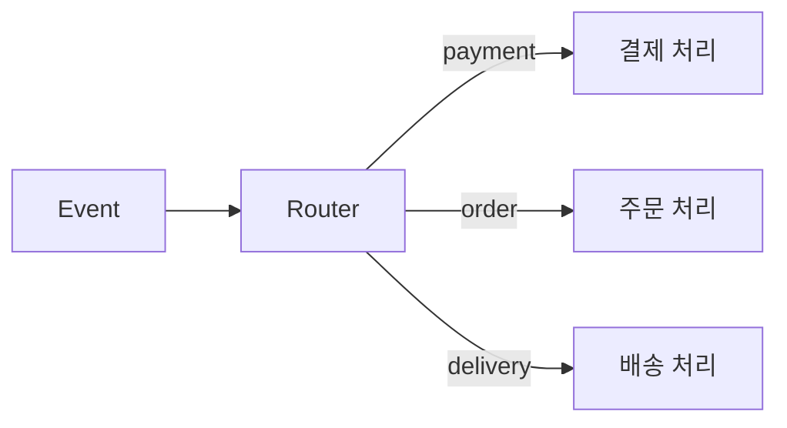

복잡한 서비스 연결 관계를  
중간에서 정리할 때 활용할 수 있다.

---

## 14. Fan-out

하나의 이벤트를  
여러 Consumer가 독립적으로 사용하는 패턴이다.

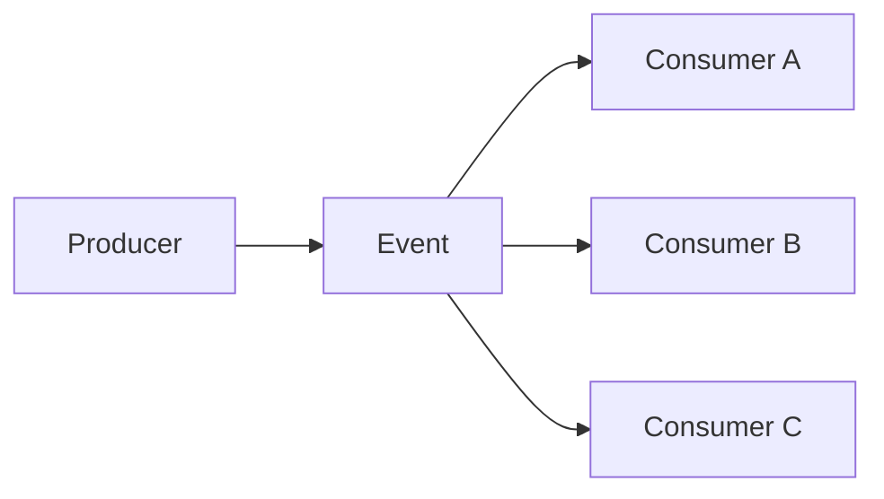

예를 들어 `OrderCompleted` 이벤트를

```text
랭킹
정산
통계
알림
분석
```

시스템이 각각 사용할 수 있다.

---

## 15. 단순 이벤트 처리

이벤트를 어떻게 다루느냐에 따라  
처리 방식을 셋으로 나눠 볼 수 있다.

```text
단순 이벤트 처리
스트림 처리
복합 이벤트 처리
```

가장 단순한 것부터 보자.

하나의 이벤트를 받아  
바로 특정 작업을 수행한다.

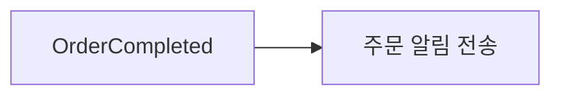

이벤트 하나만 보고 판단하기 때문에  
가장 단순한 처리 방식이다.

---

## 16. 스트림 처리

계속 들어오는 이벤트의 흐름을  
실시간으로 처리한다.

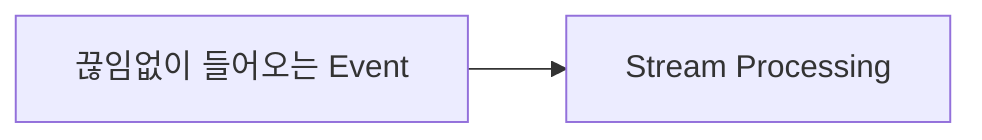

예를 들어 최근 1분 동안 발생한 주문을 모아

```text
총 주문 금액
평균 주문 금액
주문 횟수
```

를 계산할 수 있다.

---

## 17. 복합 이벤트 처리

**CEP(Complex Event Processing)** 는  
여러 이벤트 사이의 관계나 패턴을 분석한다.

예를 들어:

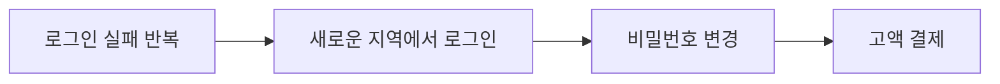

가 짧은 시간 안에 연속해서 발생했다면

```text
이상 거래 의심
```

으로 판단할 수 있다.

CEP와 일반적인 스트림 처리는  
실제 기술이나 제품에서는 영역이 겹칠 수 있다.

따라서 다음 정도로 이해하면 충분하다.

```text
단순 처리
= 개별 이벤트

스트림 처리
= 이벤트의 연속적인 흐름

CEP
= 여러 이벤트 사이의 복잡한 패턴
```

---

## 18. 윈도우

스트림은 끝없이 들어온다.

따라서

> 어느 범위를 계산할 것인가?

를 정해야 한다.

이를 **Window**라고 한다.

---

### Tumbling Window

겹치지 않는 고정 구간이다.

```text
10:00 ~ 10:01
10:01 ~ 10:02
10:02 ~ 10:03
```

예:

```text
1분 단위 주문 금액 집계
```

---

### Sliding Window

구간이 서로 겹친다.

```text
10:00 ~ 10:05
10:01 ~ 10:06
10:02 ~ 10:07
```

예:

```text
매분 최근 5분 평균 방문자 계산
```

---

### Session Window

사용자의 활동 흐름을 기준으로 구간을 만든다.

```text
클릭
클릭
구매
```

이후 일정 시간 활동이 없다면  
하나의 세션이 끝났다고 볼 수 있다.

---

## 19. 애플리케이션에서 직접 이벤트 생성

이벤트는 반드시 애플리케이션 코드에서만 생성할 필요는 없다.

```text
애플리케이션에서 직접 생성
Polling
DB Trigger
CDC
```

네 가지를 차례로 보자.

가장 자연스러운 방법이다.

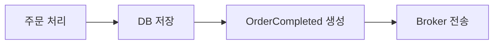

하지만 문제가 있다.

```mermaid
flowchart LR
    n0["DB 저장 성공"] --> n1["이벤트 전송 실패"]
```

한다면

DB에는 정상 처리됐지만  
이벤트를 받아야 할 시스템은 알지 못한다.

이런 문제를 해결하기 위해  
Transactional Outbox Pattern 같은 방식을 사용하기도 한다.

---

## 20. Polling

별도의 프로그램이 DB를  
주기적으로 확인한다.

```text
10:00 DB 조회
10:01 DB 조회
10:02 DB 조회
```

예를 들어:

```sql
SELECT *
FROM orders
WHERE updated_at > :last_checked_time;
```

같은 방식이다.

구현은 비교적 쉽다.

하지만 조회 주기가 너무 짧으면  
DB 부하가 증가한다.

반대로 조회 주기가 길면  
이벤트 전달도 늦어진다.

---

## 21. DB Trigger

DB 데이터가 변경되는 순간  
추가 로직을 자동 실행하는 방식이다.

```mermaid
flowchart LR
    n0["orders INSERT"] --> n1["Trigger"] --> n2["event_outbox INSERT"]
```

즉각적인 처리가 가능하지만  
비즈니스 로직이 DB Trigger에 많이 들어가면

```text
로직 추적
장애 분석
성능 관리
DB 종속성
```

이 복잡해질 수 있다.

---

## 22. CDC

**Change Data Capture**는

> 데이터베이스의 변경 내용을 감지하여  
> 다른 시스템으로 전달하는 기술

이다.

MySQL/MariaDB 환경에서는  
binlog 기반 CDC가 대표적인 방식이다.

```mermaid
flowchart LR
    n0["Application"] --> n1["Database"] --> n2["Transaction Log"] --> n3["CDC Connector"] --> n4["Event Stream"]
```

Debezium 같은 도구가 대표적이다.

단, CDC 전체가 반드시  
트랜잭션 로그 방식만을 의미하는 것은 아니다.

---

## 23. CDC 이벤트와 비즈니스 이벤트는 다르다

이 차이는 반드시 알아야 한다.

예를 들어 데이터베이스에서

```text
balance

1000 → 900
```

으로 변경됐다고 하자.

CDC가 발견한 것은

```text
잔액 데이터가 변경됐다.
```

는 사실이다.

하지만 비즈니스 의미는

```text
주문으로 100을 사용했다.
```

일 수도 있고

```text
관리자가 잔액을 조정했다.
```

일 수도 있다.

따라서

```text
DB Change Event
≠ Business Event
```

이다.

CDC만으로 모든 비즈니스 의미를  
표현할 수 있다고 생각하면 안 된다.

---

## 24. 레거시를 옮길 때도 쓸 수 있다

기존 시스템을 한 번에 걷어내지 않고  
기능을 하나씩 새 서비스로 옮기는 방법이 있다.

이때 이벤트를 기존 시스템과 새 시스템 사이의  
연결 수단으로 쓸 수 있다.  
새 서비스가 기존 시스템의 이벤트를 구독하면  
양쪽을 동시에 고치지 않아도 된다.

점진적으로 옮기는 방법은  
23장 「실행 로드맵」에서 다룬다.

---

## 25. 이벤트를 저장해야 하는 이유

이벤트를 실시간 처리한 뒤  
바로 폐기할 수도 있다.

하지만 장기간 저장하면  
다른 가치를 만들 수 있다.

예를 들어 주문 이벤트를 저장하면

```text
랭킹
통계
정산
과거 분석
이상 거래 탐지
추천 모델
```

등에 다시 사용할 수 있다.

---

## 26. 이벤트 저장소

이벤트를 저장하는 저장소를  
넓은 의미에서 Event Store라고 부를 수 있다.

하지만 주의해야 할 것이 있다.

> 단순히 이벤트를 오래 보관한다고 해서  
> 모두 Event Sourcing의 Event Store가 되는 것은 아니다.

일반적인 이벤트 보관소는  
재처리나 분석을 위한 저장소일 수 있다.

Event Sourcing에서의 Event Store는  
애플리케이션 상태를 구성하는 핵심 기록이라는  
더 강한 의미를 갖는다.

---

## 27. Replay

이벤트를 저장해두면  
과거 이벤트를 다시 처리할 수 있다.

이를 **Replay**라고 한다.

예를 들어 랭킹 계산에 버그가 있었다면

```mermaid
flowchart LR
    n0["과거 주문 이벤트"] --> n1["수정된 계산 코드"] --> n2["랭킹 다시 생성"]
```

할 수 있다.

이벤트 저장의 큰 장점이다.

---

## 28. Event Sourcing

Event Sourcing은

> 현재 상태의 원천을  
> 상태를 만들어낸 이벤트 기록으로 두는 방식

이다.

일반적인 방식에서는

```text
balance = 700
```

처럼 현재 상태를 저장한다.

Event Sourcing에서는

```text
PointCharged +1000
PointUsed -100
PointUsed -200
```

같은 이벤트를 기록한다.

현재 상태는

```text
1000 - 100 - 200
= 700
```

으로 다시 만들 수 있다.

---

## 29. Event Sourcing은 현재 상태를 저장하면 안 되는가

그렇지 않다.

Event Sourcing에서 이벤트가  
궁극적인 원천(Source of Truth)이지만

성능을 위해

```text
Snapshot
Materialized View
Read Model
```

같은 현재 상태 데이터를  
별도로 저장하는 경우도 많다.

예를 들어 이벤트가 백만 건 있다면  
매번 처음부터 재생하는 것은 비효율적이다.

그래서 중간 상태를 Snapshot으로 저장할 수 있다.

```mermaid
flowchart LR
    n0["Event 1 ~ 10000"] --> n1["Snapshot"] --> n2["10001 이후 이벤트만 적용"]
```

---

## 30. 이벤트와 CQRS

CQRS는 읽기와 쓰기에 서로 다른 모델을 사용하는 방식이다.  
DB를 반드시 두 개 만드는 것은 아니라는 점을 포함해  
자세한 내용은 9장 「서비스 경계와 조회 모델」에서 다뤘다.

이벤트를 이용하여  
Read Model을 만들 수도 있다.

```mermaid
flowchart LR
    n0["Command"] --> n1["Write Model"] --> n2["Domain Event"] --> n3["Read Model 갱신"]
```

예를 들어 쓰기 모델에서는  
복잡한 정합성을 유지하고

조회 모델에서는

```text
사용자별 주문 내역
판매자별 오늘 주문 금액
최근 상품 목록
```

처럼 조회 목적에 최적화된 데이터를 만들 수 있다.

---

## 31. 이벤트 데이터를 데이터 제품으로 활용하기

이벤트 데이터를 장기간 보관하면  
데이터 분석에도 활용할 수 있다.

대표적으로 데이터 레이크나 Lakehouse에서는

```mermaid
flowchart LR
    n0["Bronze"] --> n1["Silver"] --> n2["Gold"]
```

구조를 사용할 수 있다.

이를 흔히 **Medallion Architecture**라고 한다.

다만 이 구조는

> 이벤트 기반 아키텍처의 필수 요소가 아니라  
> 데이터 플랫폼에서 사용할 수 있는 별도의 패턴

이다.

---

## 32. 스트리밍 분석

데이터가 발생할 때  
바로 분석할 수도 있다.

```mermaid
flowchart LR
    n0["Event"] --> n1["Streaming Analytics"] --> n2["Dashboard / Alert"]
```

예를 들어:

```text
현재 매출
현재 접속자
최근 5분 오류율
현재 주문 금액
```

을 실시간으로 계산할 수 있다.

---

## 33. 데이터 보강

이벤트 자체에 필요한 정보가  
전부 들어있지 않을 수도 있다.

예를 들어:

```json
{
  "userId": 100,
  "amount": 5000
}
```

만 들어왔는데 분석에는

```text
회원 등급
국가
가입일
```

정보가 필요할 수 있다.

이때 다른 데이터와 결합한다.

```mermaid
flowchart TD
    n0["Event"]
    n2["Reference Data"]
    n3["Enriched Event"]
    n0 --> n3
    n2 --> n3
```

이를 **Data Enrichment**라고 한다.

---

## 34. 스트리밍 플랫폼은 DB와 다르다

Kafka 같은 시스템을  
일반적인 데이터베이스와 똑같이 보면 안 된다.

이벤트 스트리밍 플랫폼은 주로

```text
대규모 순차 이벤트 처리
Consumer별 독립적 소비
Replay
스트림 처리
```

에 강하다.

일반적인 데이터베이스는

```text
특정 데이터 조회
조건 검색
인덱스
JOIN
트랜잭션
```

등에 강하다.

아주 단순화하면:

```text
Event Stream
= 사건의 흐름

Database
= 상태의 저장과 조회
```

라고 이해할 수 있다.

물론 현대 시스템들은 서로의 기능 일부를 제공하기도 하므로  
절대적인 구분은 아니다.

---

## 35. 내부 이벤트와 외부 공개 이벤트

시스템이 커지면  
모든 이벤트를 다른 도메인에 공개해서는 안 된다.

크게 다음처럼 구분할 수 있다.

```text
내부 이벤트
외부 계약용 이벤트
```

책이나 조직에 따라 이를

```text
Internal Stream
Domain Stream
Business Stream
Integration Event
```

등 다양한 이름으로 부를 수 있다.

용어보다 경계를 이해하는 것이 중요하다.

---

## 36. 내부 이벤트

도메인 내부 구현을 위한 이벤트이다.

예를 들어:

```text
OrderValidated
PointDeductionStarted
PointDeductionFinished
```

같은 이벤트이다.

다른 도메인이 이런 이벤트까지  
직접 사용하면 내부 구현을 변경하기 어려워진다.

---

## 37. 외부 계약용 이벤트

다른 도메인이 사용하도록  
명확하게 공개하는 이벤트이다.

예:

```text
OrderCompleted
PaymentCompleted
DeliveryStarted
```

이 이벤트는 다른 팀과 시스템이 사용하므로

```text
스키마
의미
버전
호환성
소유자
```

를 계약처럼 관리해야 한다.

쉽게 비교하면:

```text
Internal Event
≈ private interface

공개 Domain Event
≈ public API
```

라고 생각할 수 있다.

---

## 38. 이벤트 거버넌스

이벤트가 수백 개, 수천 개로 늘어나면  
기술보다 관리가 더 어려워질 수 있다.

다음 질문에 답할 수 있어야 한다.

```text
이 이벤트의 소유자는 누구인가?

누가 사용하고 있는가?

스키마는 어디에 있는가?

현재 버전은 무엇인가?

이 필드를 삭제해도 되는가?

얼마나 오래 보관하는가?

개인정보가 포함되어 있는가?
```

이것을 체계적으로 관리하는 것이  
이벤트 거버넌스이다.

---

## 39. 이벤트의 소유권

일반적으로 이벤트를 발행하는 도메인이  
그 이벤트의 소유자가 된다.

예:

```text
OrderCompleted

Owner
= Order Domain
```

소유자는 보통 다음을 책임진다.

```text
이벤트 의미
스키마
문서
버전
호환성
품질
```

즉 이벤트를 외부에 공개했다는 것은

> 단순히 메시지 하나를 보낸 것이 아니라  
> 다른 시스템과 계약을 만든 것

이라고 이해해야 한다.

---

## 40. Schema Registry

이벤트의 스키마와 버전을 관리하기 위해  
Schema Registry를 사용할 수 있다.

기존 이벤트가:

```json
{
  "userId": 100,
  "amount": 5000
}
```

이라고 하자.

그런데 Producer가 갑자기:

```json
{
  "memberId": 100,
  "price": 5000
}
```

로 바꾸면 기존 Consumer가 깨질 수 있다.

Schema Registry와 호환성 정책을 사용하면

```text
필드 삭제
타입 변경
필수 필드 변경
스키마 버전
```

등을 검사할 수 있다.

단,

> Registry가 있다고 자동으로 안전해지는 것은 아니다.

CI/CD 과정에서 스키마 호환성을 검증하고  
조직의 변경 정책을 함께 적용해야 한다.

---

## 41. Contract-First

이벤트가 많아질수록  
구현 전에 계약을 먼저 정의하는 것이 좋다.

좋지 않은 흐름:

```mermaid
flowchart LR
    n0["코드 구현"] --> n1["이벤트 생성"] --> n2["나중에 문서 작성"]
```

Contract-First 방식:

```mermaid
flowchart LR
    n0["이벤트 의미 정의"] --> n1["스키마 정의"] --> n2["호환성 검토"] --> n3["Producer 구현"] --> n4["Consumer 구현"]
```

REST API의 API-First와  
비슷한 사고방식이다.

---

## 42. AsyncAPI

이벤트 기반 인터페이스를 문서화하는 데  
AsyncAPI 같은 표준을 사용할 수 있다.

초보자 관점에서는 다음과 같이 이해하면 된다.

- **HTTP REST API** — OpenAPI
- **이벤트/메시지 기반 API** — AsyncAPI

이를 통해

```text
채널
메시지
Payload
Schema
Producer
Consumer
```

등을 문서화할 수 있다.

OpenAPI와 완전히 동일한 역할은 아니지만  
비슷한 목적의 계약 문서라고 이해하면 된다.

---

## 43. 셀프서비스와 플랫폼 팀

조직이 커지면  
중앙 플랫폼 팀이 모든 이벤트를 직접 관리하기 어렵다.

그래서 플랫폼 팀은

```text
이벤트 플랫폼
Schema Registry
Event Catalog
모니터링
보안 정책
배포 자동화
```

등을 제공한다.

각 도메인 팀은 그 위에서

```text
이벤트 생성
스키마 등록
배포
소비
```

를 스스로 할 수 있다.

이런 구조를 셀프서비스 방식이라고 볼 수 있다.

---

## 44. 셀프서비스에는 가드레일이 필요하다

셀프서비스는

```text
아무렇게나 만들 수 있다.
```

는 뜻이 아니다.

다음과 같은 검사를 자동화하는 것이 좋다.

```text
이벤트 이름 규칙
스키마 호환성
소유자 등록
보안 검사
보존 기간
개인정보 여부
```

즉,

> 개발자가 빠르게 작업할 수 있도록 하되  
> 위험한 변경은 자동으로 막는 것

이 좋은 플랫폼의 역할이다.

이 생각을 조직 전체로 넓히면  
22장 「플랫폼과 조직」의 이야기가 된다.

---

## 45. 10장 정리

네 가지만 기억하면 된다.

**이벤트는 이미 발생한 사실이다.**  
무엇을 해달라는 Command,  
정보를 달라는 Query와 구분해야 한다.

**Producer는 Consumer가 누구인지 몰라도 된다.**  
이것이 이벤트가 결합도를 낮추는 이유다.

**이벤트에 무엇을 담을지가 설계의 핵심이다.**  
변경 사실만 알릴 것인가,  
필요한 상태까지 함께 보낼 것인가에 따라  
API 의존성과 데이터 관리 부담이 반대로 움직인다.

**내부 이벤트와 공개 이벤트를 나눠야 한다.**  
공개한 이벤트는 메시지 하나가 아니라  
다른 시스템과 맺은 계약이다.

여기까지는 이벤트를 만들고 전달하는 이야기였다.

다음 장에서는 만든 다음에 찾아오는 문제,  
즉 운영을 본다.
