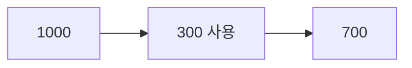
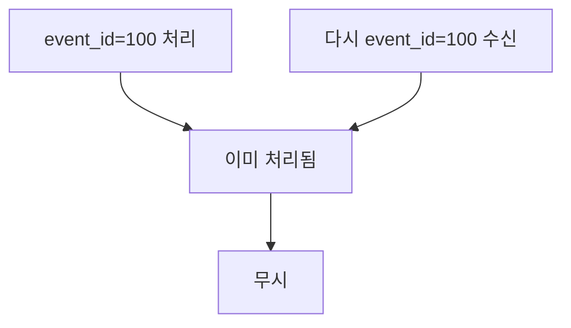
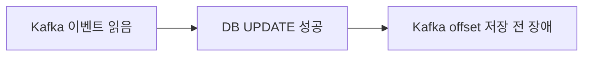
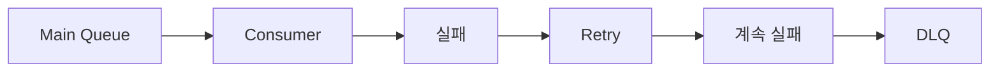
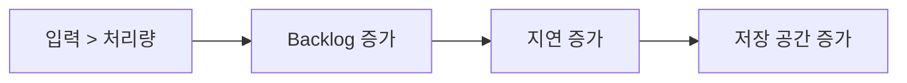
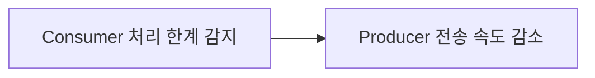
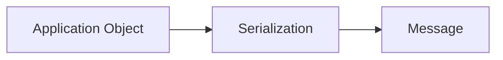
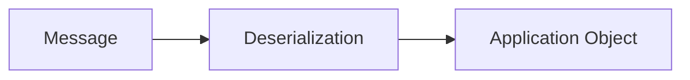
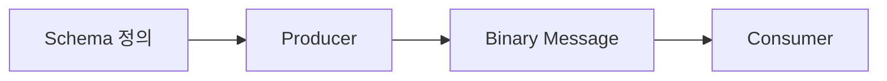
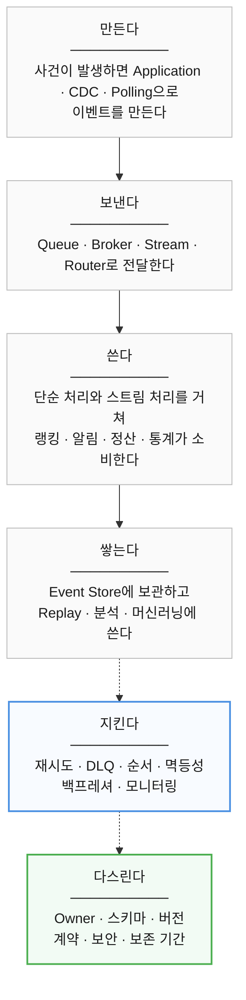

# 11장. 이벤트를 운영한다는 것

> **3부 · 연결** — 경계를 어떻게 넘는가  
> 8장 · 9장 · 10장 · **11장** · 12장

이벤트를 도입하고 한 달이 지났다.

같은 알림이 두 번 갔다는 문의가 들어오고,  
어떤 정산은 순서가 뒤바뀐 채 처리됐다.

처리에 실패한 메시지가 어디로 갔는지도  
아무도 모른다.

10장에서 이벤트를 설계하고 전달하는 방법을 봤다.

하지만 이벤트 기반 시스템의 어려움은  
대부분 만든 다음에 찾아온다.

이 장에서는 운영에서 마주치는 문제를 다룬다.

중복과 순서, 실패와 재처리,  
쌓이는 메시지, 스키마 변경, 보존 기간이다.

이벤트 기반 아키텍처가 공짜가 아닌 이유가 여기 있다.

---

## 1. 이벤트의 불변성

이벤트는 이미 발생한 사건이다.

따라서 기본적으로

**Immutable**

하게 취급하는 것이 좋다.

예를 들어:

```text
OrderCompleted
```

이 잘못된 이벤트였다면  
기존 이벤트를 수정하는 것이 아니라

```text
OrderCancelled
```

또는

```text
OrderCorrected
```

같은 새로운 이벤트를 발생시키는 방식이다.

즉:

```text
과거의 사건을 수정 X

새로운 사건을 추가 O
```

라고 생각하면 된다.

---

## 2. 결과적 일관성

이벤트 기반 시스템은  
여러 시스템이 동시에 갱신되지 않는 경우가 많다.

예를 들어:

```text
10:00:00 결제 완료

10:00:01 통계 반영

10:00:03 정산 반영
```

10:00:02 시점에는

```text
결제 시스템
= 반영 완료

정산 시스템
= 아직 미반영
```

일 수 있다.

하지만 새로운 변경이 없고  
이벤트 전달과 재처리가 정상적으로 계속된다면

결국 같은 상태로 수렴할 수 있다.

이를 **Eventual Consistency**,  
결과적 일관성이라고 한다.

---

## 3. 강한 일관성

강한 일관성이 필요한 시스템도 있다.

단순하게 말하면

> 성공한 최신 변경을  
> 이후의 읽기에서 일관되게 볼 수 있도록 하는 강한 보장

이다.

예를 들어 중요한 잔액 데이터라면



이라는 결과가 즉시 중요할 수 있다.

분산 시스템에서 강한 일관성을 구현하려면  
노드 간 추가적인 조정이 필요하다.

그 결과

```text
지연 증가
처리량 감소 가능성
가용성과의 트레이드오프
```

가 발생할 수 있다.

중요한 것은

```text
강한 일관성
= 무조건 모든 노드를 Lock
```

이 아니라는 것이다.

구현에는 Consensus, Quorum 등  
여러 방식이 사용될 수 있다.

---

## 4. 데이터마다 일관성 요구는 다르다

모든 데이터를  
같은 수준으로 처리할 필요는 없다.

예:

```text
실시간 인기 랭킹

→ 몇 초 지연 가능
→ 결과적 일관성 가능
```

반면:

```text
결제 승인
잔액 차감
재고 확정
```

같은 영역은 더 강한 정합성이  
필요할 수 있다.

따라서

> 업무의 중요도와 요구사항에 따라  
> 일관성 모델을 선택한다.

가 중요하다.

---

## 5. 메시지 전달과 처리 보장

메시징 시스템에서는

```text
At-most-once
At-least-once
Exactly-once
```

라는 표현이 자주 등장한다.

여기서 중요한 것은

> 어떤 범위에서 무엇을 보장하는가?

를 반드시 확인하는 것이다.

Broker 수준의 전달과  
외부 DB까지 포함한 전체 비즈니스 처리는  
다른 문제일 수 있기 때문이다.

---

## 6. At-most-once

최대 한 번 처리되는 방식이다.

```text
0번 또는 1번
```

재전송하지 않는다면  
메시지가 유실될 수 있다.

대신 중복 가능성은 줄어든다.

---

## 7. At-least-once

최소 한 번은 처리하도록  
재전송하는 방식이다.

```text
1번 이상
```

따라서 같은 이벤트가  
여러 번 들어올 수 있다.

실무에서는 매우 흔한 방식이다.

---

## 8. 멱등성

At-least-once 환경에서는  
Consumer의 멱등성이 중요하다.

**Idempotency**란

> 같은 작업을 여러 번 수행해도  
> 최종 결과가 한 번 수행한 것과 동일하도록 만드는 것

이다.

예를 들어:

```text
event_id = 100
```

이라는 주문 이벤트가 두 번 전달됐다고 하자.

잘못된 처리:

```text
100 지급
100 지급

→ 총 200
```

멱등하게 처리하면:



할 수 있다.

---

## 9. Exactly-once

Exactly-once는 이름 그대로

```text
유실 없이
중복 효과 없이
정확히 한 번
```

을 목표로 한다.

하지만 분산 시스템 전체에서  
End-to-End Exactly-once를 구현하는 것은 어렵다.

예를 들어:



가 발생하면

다시 실행된 Consumer가  
같은 이벤트를 또 읽을 수 있다.

따라서 Kafka 자체의 트랜잭션 기능이 있다고 해서

```text
Kafka
DB
외부 결제 API
메일 서비스
```

전체 작업이 자동으로 Exactly-once가 되는 것은 아니다.

현실에서는 흔히

```text
At-least-once
+
멱등성
```

을 이용해  
중복 효과를 방지한다.

---

## 10. 메시지 순서

이벤트는 순서가 중요할 수 있다.

예를 들어:

```text
UserCreated
UserUpdated
UserDeleted
```

순서가 뒤집히면 문제가 발생할 수 있다.

분산 시스템에서는 병렬 처리가 많기 때문에  
전체 이벤트의 순서를 보장하는 것은 비용이 크다.

---

## 11. Kafka와 메시지 순서

Kafka에서는 기본적으로

> **같은 Partition 내부에서 순서가 유지된다.**

라고 이해해야 한다.

예를 들어 하나의 주문과 관련된 이벤트를  
같은 Partition으로 라우팅하면

```text
OrderCreated
PaymentCompleted
OrderCompleted
```

순서를 유지하기 쉬워진다.

흔히 Key를 이용해  
같은 엔티티를 동일 Partition으로 라우팅한다.

하지만 정확한 표현은

```text
같은 Key라서 순서가 보장된다.
```

가 아니라

```text
동일 Partition 안에서 순서가 보장된다.
```

이다.

---

## 12. 전체 순서보다 엔티티 단위 순서

모든 이벤트를 하나의 Partition에 넣으면  
전체 순서를 유지하기 쉽다.

하지만 병렬 처리 성능이 크게 떨어진다.

그래서 현실에서는

```text
user_id
order_id
payment_id
delivery_id
```

같은 특정 Key 단위로  
순서를 관리하는 경우가 많다.

---

## 13. Dead Letter Queue

처리를 계속 실패하는 메시지를  
별도 공간으로 옮길 수 있다.

이를 **Dead Letter Queue, DLQ**라고 한다.



예를 들어:

```text
잘못된 메시지 형식
필수 데이터 누락
Consumer 버그
지원하지 않는 이벤트 버전
```

등으로 실패할 수 있다.

---

## 14. DLQ를 만들었다고 끝이 아니다

DLQ가 있는데 아무도 확인하지 않는다면  
사실상 데이터 쓰레기통이 된다.

따라서 반드시

```text
모니터링
알림
원인 분석
수정
재처리
```

과정이 필요하다.

DLQ는 기술 기능인 동시에  
운영 프로세스가 필요한 영역이다.

---

## 15. Backlog와 Backpressure

Producer가 Consumer보다  
훨씬 빠르게 데이터를 생성한다고 해보자.

```text
Producer
초당 10,000건

Consumer
초당 3,000건
```

그러면 처리되지 못한 메시지가 계속 쌓인다.

이를 **Backlog**라고 볼 수 있다.



---

### Backpressure란 무엇인가

Backpressure는 backlog 자체를 의미하는 것이 아니다.

> Consumer나 하위 시스템의 처리 능력에 맞춰  
> 상위 시스템의 데이터 생산 속도를 조절하는 메커니즘

이다.

예를 들어:



처럼 흐름을 제어할 수 있다.

시스템에 따라

```text
생산 속도 제한
Consumer 확장
버퍼링
Batch 처리
Load Shedding
```

등 다양한 대응 전략을 사용할 수 있다.

---

## 16. 직렬화

Java Object나 Go Struct를  
그대로 네트워크에 보낼 수는 없다.

전송 가능한 데이터 형식으로 변환해야 한다.

이를 **Serialization**,  
직렬화라고 한다.



Consumer에서는 반대로



을 수행한다.

---

## 17. JSON

가장 익숙한 데이터 형식이다.

```json
{
  "userId": 100,
  "amount": 5000
}
```

장점:

```text
사람이 읽기 쉬움
개발하기 쉬움
언어 독립적
범용성이 높음
```

단점:

```text
상대적으로 데이터 크기가 큼
스키마 강제가 약함
타입 표현이 제한적
```

이다.

---

## 18. Avro와 Protocol Buffers

대규모 이벤트 시스템에서는

```text
Apache Avro
Protocol Buffers
Apache Thrift
```

같은 직렬화 기술도 사용된다.

이들은 명확한 스키마를 기반으로  
데이터 타입과 구조를 관리하기 좋다.

예를 들어:



형태로 처리한다.

초보자 관점에서는

```text
JSON
= 유연하고 쉬움

Avro / Protobuf
= 스키마를 강하게 관리하기 좋음
```

정도로 이해하면 충분하다.

---

## 19. 이벤트 스트림의 장기 보존

이벤트 스트리밍 플랫폼에  
데이터를 장기간 보존할 수도 있다.

하지만 보존 기간이 늘어나면

```text
저장 비용
운영 비용
개인정보 관리
삭제 정책
규제 준수
```

등을 고려해야 한다.

따라서 무조건

```text
모든 이벤트 무기한 저장
```

하는 것이 좋은 것은 아니다.

---

## 20. Hot / Cold Storage 분리

최근 데이터와 오래된 데이터를  
다른 저장소에 둘 수도 있다.

예:

- **최근 7일 이벤트** — Event Streaming Platform
- **7일 이전** — Object Storage / Data Lake

이렇게 하면

```text
실시간 처리
= Streaming Platform

장기 분석
= Data Lake
```

처럼 역할을 나눌 수 있다.

---

## 21. 공통 플랫폼과 비즈니스 로직 분리

이벤트 플랫폼에는 가급적  
범용적인 기능을 둔다.

예를 들어:

```text
전송
저장
라우팅
스키마 검사
모니터링
보안
```

이다.

반면 다음 같은 비즈니스 규칙은

```text
환불 가능 여부
주문 계산
출금 환산율
회원 등급
```

해당 도메인 안에 두는 것이 좋다.

플랫폼이 모든 비즈니스 규칙을 알기 시작하면  
플랫폼 자체가 거대한 업무 시스템이 되기 때문이다.

---

## 22. 모든 것을 이벤트 기반으로 만들 필요는 없다

이벤트 기반 아키텍처는 강력하다.

하지만 다음과 같은 복잡성도 가져온다.

```text
Broker
Schema 관리
Retry
DLQ
멱등성
순서 처리
모니터링
분산 추적
결과적 일관성
```

단순 CRUD 시스템에 이 모든 것을 도입하면  
얻는 가치보다 운영 비용이 더 클 수 있다.

따라서 질문은

```text
"이벤트 기반으로 만들 수 있는가?"
```

가 아니라

```text
"이벤트 기반으로 만들 가치가 있는가?"
```

여야 한다.

---

## 23. 이벤트 기반 아키텍처가 잘 맞는 경우

다음과 같은 상황이라면  
EDA가 큰 장점을 줄 수 있다.

```text
하나의 사건에 여러 시스템이 반응해야 한다.

서비스 간 직접 의존성을 줄이고 싶다.

비동기 처리가 필요하다.

실시간 데이터 처리가 중요하다.

대량의 이벤트가 발생한다.

과거 이벤트를 다시 처리해야 한다.

여러 분석 시스템에 데이터를 제공해야 한다.
```

반대로 단순한 내부 관리 시스템이라면  
일반적인 API 구조가 더 적합할 수도 있다.

---

## 24. 11장 정리

네 가지만 기억하면 된다.

**이벤트는 중복될 수 있다고 가정한다.**  
At-least-once가 현실적인 기본값이고,  
그래서 Consumer를 여러 번 처리해도 괜찮게 만든다.  
Exactly-once는 조건이 붙는 보장이다.

**순서는 전체가 아니라 필요한 단위만 보장한다.**  
모든 메시지의 전역 순서를 지키려 하면 처리량을 잃는다.  
같은 주문, 같은 회원처럼 **엔티티 단위**면 대개 충분하다.

**실패한 메시지는 어디론가 가야 하고, 누군가 봐야 한다.**  
DLQ를 만들어 두는 것과 그것을 들여다보는 것은 다른 일이다.  
아무도 보지 않는 DLQ는 쓰레기통이다.

**Kafka를 쓴다고 이벤트 기반 아키텍처가 되는 것은 아니다.**  
설계, 소비, 스키마, 중복, 순서, 장애 처리까지가 EDA다.

### 이벤트의 수명주기

이벤트는 만들고 끝나는 것이 아니다.



위 넷은 10장에서, 아래 둘은 이 장에서 다뤘다.

만드는 것보다 **지키고 다스리는 쪽**이 어렵다.

### 새 이벤트를 설계할 때 던질 질문

```text
이것은 정말 이벤트인가, 아니면 Command인가?

Producer는 누구이고 소유 도메인은 어디인가?

누가 Consumer인가?

어떤 데이터를 담을 것인가? 개인정보가 포함되는가?

중복 전달되어도 안전한가?

순서가 중요한가? 어느 단위까지 중요한가?

실패하면 어떻게 재시도하고, DLQ는 누가 보는가?

얼마나 오래 보관하고, 스키마 변경은 어떻게 관리하는가?

과거 이벤트를 Replay해야 하는가?

무엇을 모니터링할 것인가?
```

이 질문에 답할 수 있다면  
운영에서 만날 문제를 상당 부분 미리 발견할 수 있다.

### 공짜가 아니다

이벤트로 서비스 간 결합은 줄일 수 있다.

대신 새로운 복잡성이 온다.

```text
분산 시스템
비동기 처리
결과적 일관성
중복 처리
장애 복구
운영과 모니터링
```

그래서 좋은 설계의 기준은  
최대한 많이 이벤트로 만드는 것이 아니다.

> **늘어나는 복잡성을 감수할 만큼  
> 분명한 비즈니스 가치가 있는 곳에  
> 이벤트 기반 구조를 쓰는 것.**

다음 장에서는 API와 이벤트와 배치 가운데  
**무엇을 언제 고를지**를 정리한다.
