# 12장. 무엇으로 연결할 것인가

> **3부 · 연결** — 경계를 어떻게 넘는가  
> 8장 · 9장 · 10장 · 11장 · **12장**

8장과 9장에서는 API를,  
10장과 11장에서는 이벤트를 따로 살펴봤다.

하나씩 볼 때는 분명해 보인다.  
그런데 실제 시스템에서 둘 중 하나만 쓰는 경우는 드물다.

업무 하나를 처리하는 데도 API와 이벤트가 함께 등장하고,  
아직 이름조차 꺼내지 않은 선택지가 하나 더 있다.

**배치**다.

이번 장의 질문은 하나다.

> **지금 이 연결에는 무엇이 맞는가?**

API, 이벤트, 배치는 서로를 대체하는 기술이 아니다.  
각각 잘 푸는 문제가 다르다.  
그 차이를 정리하는 것이 이 장의 목적이다.

---

## 1. 하나의 업무에도 여러 방식이 함께 쓰인다

사용자가 10,000원짜리 상품을 주문한다고 해보자.

겉으로는 단순한 기능처럼 보인다.  
하지만 실제로는 여러 시스템이 연결된다.

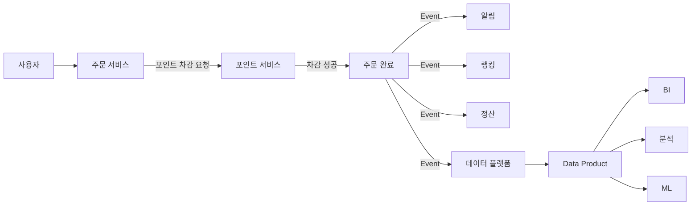

이 그림 하나에 세 가지 방식이 이미 섞여 있다.

포인트 차감은 결과를 바로 알아야 하므로 동기 API로 부른다.

주문이 끝난 뒤의 알림, 랭킹 반영, 정산, 분석 데이터 적재는  
주문 요청 안에서 다 끝날 필요가 없다.  
이런 일은 이벤트로 흘려보낸다.

오래 쌓아 두고 분석할 데이터는  
다시 별도의 데이터 프로덕트로 제공한다.

그래서 중요한 질문은 "API가 좋은가, 이벤트가 좋은가"가 아니다.

> **지금 해결하려는 문제에  
> 어떤 방식이 맞는가?**

이 장은 그 답을 이렇게 찾아간다.

먼저 도메인을 어떤 창구로 이어야 하는지,  
그리고 무엇을 위해 잇는지를 정리한다.  
그다음 API·이벤트·배치를 차례로 보고  
마지막에 선택 기준으로 모은다.

---

## 2. 도메인을 나눠도 통신은 해야 한다

회사 시스템을 회원·결제·상품·주문·배송·정산으로 나눴다고 하자.

각각 다른 책임을 갖지만,  
주문 하나를 처리하려면 회원 정보와 포인트 잔액과 배송 상태가 모두 필요하다.

도메인을 나눈다는 것은 서로 단절시키겠다는 뜻이 아니다.  
독립적인 책임을 유지하면서도 필요한 정보는 주고받을 수 있어야 한다.  
이를 **상호운용성(Interoperability)** 이라고 한다.

문제는 주고받는 방법이다.

가장 간단한 방법은 남의 DB를 직접 조회하는 것이다.

```sql
SELECT *
FROM payment.payment_history
WHERE user_id = 100;
```

처음에는 편하다. 별도의 API도 필요 없다.

하지만 이런 접근이 쌓이면  
결제팀이 테이블 하나를 바꿀 때마다  
누가 그 테이블을 쓰는지 전부 찾아야 한다.

도메인은 나눴는데 실제로는 더 강하게 묶인 상태가 된다.  
7장 「무엇을 공개하고 무엇을 감출 것인가」에서 본 문제다.

그래서 각 도메인은 내부 구현 대신 공개된 계약을 내놓는다.

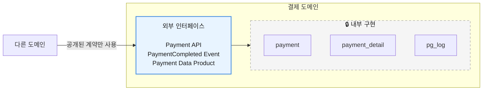

여기서 초보자가 자주 오해하는 것이 하나 있다.

> 도메인을 나누려면  
> 반드시 DB도 각각 분리해야 하는가?

그렇지 않다.

하나의 MariaDB를 쓰면서도  
스키마로 소유권을 나누면 논리적인 경계를 만들 수 있다.

중요한 것은 물리적인 DB 개수가 아니라  
**누가 어떤 데이터에 접근할 책임을 가지고 있는가**다.

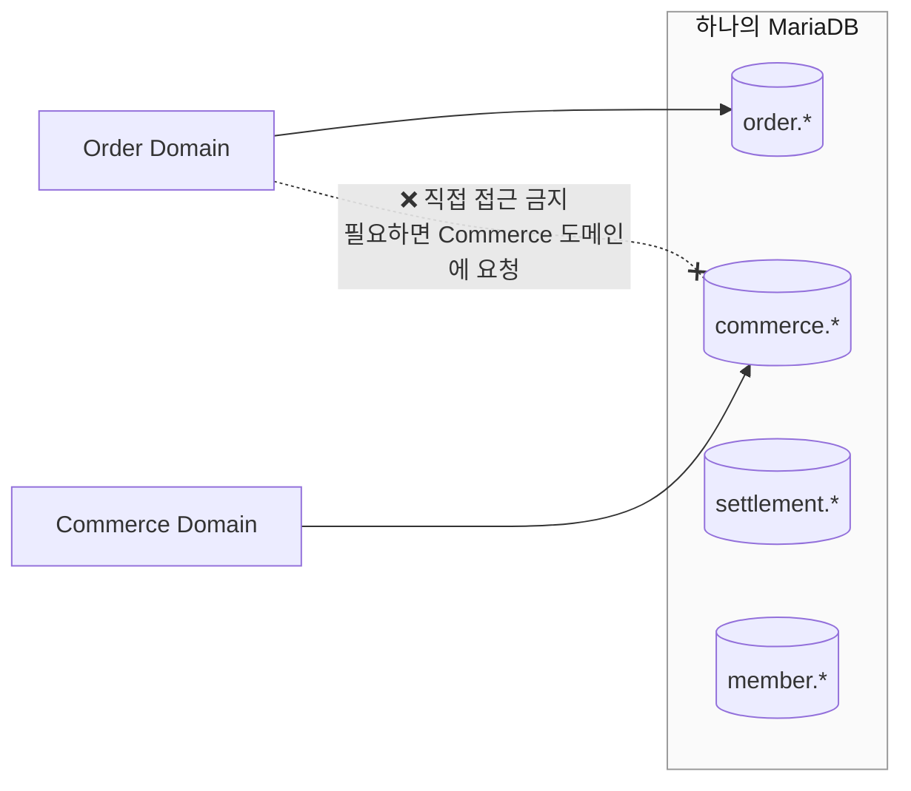

즉,

> **물리적인 데이터베이스 분리와  
> 논리적인 도메인 분리는 서로 다른 문제다.**

정리하면 도메인끼리는 공개된 창구로만 잇는다.

그 창구의 형태가 바로 API, 이벤트, 배치다.  
어떤 형태를 고를지는 무엇을 위해 잇는지에 따라 갈린다.

---

## 3. 운영 데이터와 분석 데이터

연결 방식을 고르기 전에  
데이터가 두 세계를 오간다는 것을 알아 둘 필요가 있다.

하나는 실제 서비스를 처리하는 **운영 영역**이다.  
로그인, 회원가입, 결제, 상품 구매, 주문, 배송 시작 같은 일이다.

여기서는 빠른 응답, 트랜잭션 처리, 현재 상태, 정합성이 중요하다.  
흔히 **OLTP**라고 부른다.

다른 하나는 **분석 영역**이다.  
월간 매출, 사용자 행동 분석, 상품별 주문 통계, 추천 모델, BI 같은 일이다.

전통적으로는 둘 사이를 이렇게 이었다.

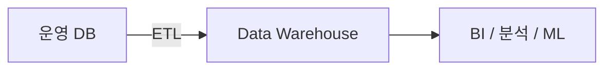

한 방향이었다. 운영에서 분석으로만 흘렀다.

그런데 오늘날에는 이 경계가 흐려졌다.

추천 기능을 생각해보자.  
사용자가 상품을 조회하면 행동 데이터가 쌓이고,  
그 데이터로 만든 추천 결과가 다시 서비스 화면에 나타난다.

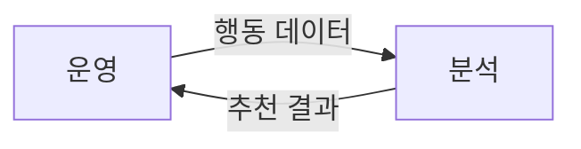

분석 데이터가 다시 운영으로 돌아온다.

그래서 애플리케이션 아키텍처와 데이터 아키텍처를  
서로 다른 문제로 떼어 놓기 어려워졌다.

---

## 4. 데이터 배포와 애플리케이션 통합은 목적이 다르다

연결 방식을 고를 때 먼저 구분해야 할 것이 있다.

무엇을 위해 잇는가다.

**데이터 배포**의 목적은  
데이터를 다른 곳에서 쓸 수 있게 만드는 것이다.  
Batch, CDC, Data Streaming, Data Product, CQRS Read Model이 여기에 속한다.

**애플리케이션 통합**의 목적은  
애플리케이션들이 서로 협력하게 만드는 것이다.  
REST API, gRPC, Message Queue, Event, Command가 여기에 속한다.

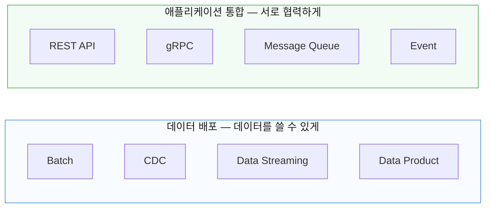

여기 나온 Data Product는  
여러 팀이 반복해서 쓰는 데이터를 제품처럼 정리해 내놓는 것을 말한다.  
지금은 데이터 배포 방식 중 하나로만 알아 두면 되고,  
13장 「데이터 프로덕트」에서 자세히 다룬다.

둘은 목적이 다르지만 실제 시스템에서는 겹치기도 한다.  
이벤트는 애플리케이션을 잇는 데도, 데이터를 나르는 데도 쓰인다.

그래도 "지금 나는 데이터를 넘기려는 것인가,  
아니면 일을 시키려는 것인가"를 먼저 물으면  
선택이 훨씬 쉬워진다.

---

## 5. API는 언제 쓰는가

API는 가장 익숙한 방법이다.

주문 서비스가 현재 포인트 잔액을 알고 싶다고 해보자.

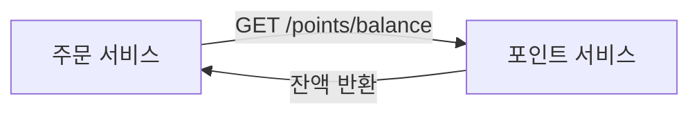

요청하고 응답을 받는다.

현재 상태를 바로 확인하거나  
처리 결과가 즉시 필요할 때 적합하다.  
현재 잔액, 회원 상태, 구매 가능 여부, 결제 승인 결과 같은 것이다.

여기서 정확하게 알아둘 것이 하나 있다.

> **API 자체가 동기 통신을 뜻하는 것은 아니다.**

요청-응답 API가 동기로 쓰이는 경우가 많을 뿐이다.

영상 처리 요청을 보냈다고 해보자.

```http
POST /videos/process
```

서버는 처리가 끝날 때까지 기다리지 않고

```http
202 Accepted
```

를 먼저 돌려줄 수 있다. 실제 처리는 뒤에서 비동기로 한다.

그래서 기준은 API냐 아니냐가 아니라 이렇게 잡는 것이 정확하다.

- **결과가 즉시 필요하다** — 동기 API를 우선 검토
- **나중에 처리해도 된다** — 비동기 API나 메시징을 검토

---

## 6. 동기 API를 써도 강한 일관성은 보장되지 않는다

또 하나 흔한 오해가 있다.

API를 썼으니 데이터가 항상 맞아떨어질 것이라는 생각이다.  
그렇지 않다.

독립된 두 서비스가 있다고 하자.

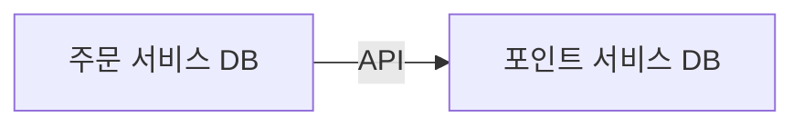

다음 상황이 일어날 수 있다.

```text
1. 포인트 차감 성공
2. 주문 저장 시도
3. 주문 DB 저장 실패
```

API 호출은 성공했는데 전체 업무는 깨진 상태로 남는다.  
포인트만 빠져나갔다.

따라서 여러 시스템에 걸친 정합성은 따로 설계해야 한다.  
Transaction, Idempotency, Saga, Compensation,  
Transactional Outbox, Lock 같은 장치가 이때 쓰인다.

> **동기 API는 결과를 즉시 확인하기 좋은 방법이지,  
> 여러 시스템의 강한 일관성을 자동으로 보장하는 기술이 아니다.**

일관성 자체는 11장 「이벤트를 운영한다는 것」에서 자세히 다뤘다.

---

## 7. 이벤트는 언제 쓰는가

이벤트는 어떤 일이 이미 일어났다는 사실을 표현한다.  
`OrderCompleted`, `PaymentCompleted` 같은 이름을 쓴다.

명령과 구분하는 것이 중요하다.

```text
"포인트 100을 차감해라"   → Command
"포인트 100이 차감됐다"   → Event
```

이벤트를 쓰면 생산자와 소비자의 결합이 느슨해진다.

주문 완료 이벤트에 처음에는 알림과 정산만 붙어 있었다고 하자.  
나중에 랭킹이 필요해져도  
주문 서비스는 거의 바꾸지 않고 소비자만 추가하면 된다.

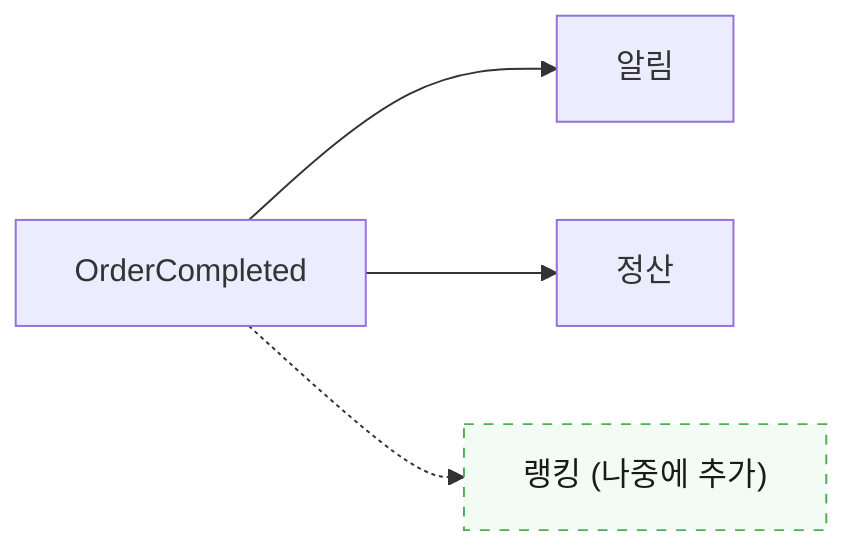

주문 서비스는 누가 그 이벤트를 쓰는지 몰라도 된다.  
여러 시스템이 같은 변경 사실을 나눠 쓸 때 특히 유용하다.

이벤트 설계 자체는 10장 「이벤트로 연결하기」에서 다뤘다.  
여기서는 API·배치와 견주어 언제 고를지만 본다.

---

## 8. 이벤트는 공짜가 아니다

장점이 큰 만큼 복잡성도 함께 온다.

이벤트 중복, 순서, 유실, 재처리, 스키마 변경,  
Consumer 장애, 관측성, 최종적 일관성.  
전부 새로 고민해야 할 문제다.

같은 이벤트가 두 번 올 수 있다면  
Consumer는 두 번 처리해도 괜찮게 만들어야 한다.

그래서 이벤트를 많이 쓸수록 좋은 아키텍처가 된다고 생각하면 안 된다.

모든 것을 이벤트로 만들 필요도 없다.

10,000원짜리 상품 주문을 전부 비동기로 설계했다고 해보자.  
그런데 사용자는 지금 당장 알고 싶다.

```text
잔액이 충분한가?
포인트 차감이 성공했는가?
주문이 성공했는가?
```

이런 핵심 결과를 즉시 보여줘야 한다면  
이벤트만으로 처리하는 쪽이 오히려 복잡해진다.

그래서 보통은 이렇게 나눈다.

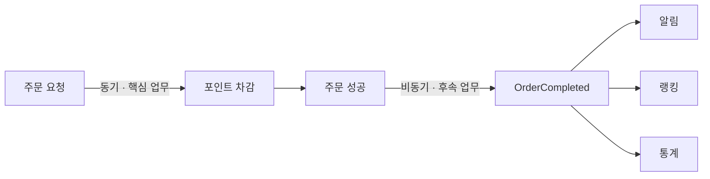

핵심 업무와 후속 업무를 가르는 것.  
이것이 API와 이벤트를 조합하는 가장 흔한 형태다.

---

## 9. 배치는 여전히 좋은 선택이다

모든 데이터를 실시간으로 처리할 필요는 없다.

전날의 판매자별 실적을 계산한다고 해보자.

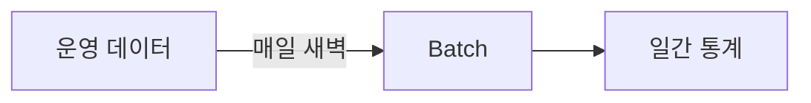

몇 시간 늦게 나와도 문제가 없다면  
복잡한 실시간 시스템을 만들 이유가 없다.

배치가 맞는 일은 이런 것들이다.

```text
일간 통계
월간 정산
장기 리포트
대량 데이터 이동
ML 학습 데이터 생성
아카이빙
```

여기서 중요한 원칙이 하나 나온다.

> **실시간으로 만들 수 있다고 해서  
> 반드시 실시간으로 만들어야 하는 것은 아니다.**

실시간성을 높이면 비용, 운영 난이도, 장애 대응, 복잡성이 함께 올라간다.  
그 값을 치를 이유가 있을 때만 치르면 된다.

---

## 10. 셋을 어떻게 고르는가

아주 단순화하면 이렇게 볼 수 있다.

| 상황                     | 먼저 검토할 방식    |
|------------------------|--------------|
| 지금 처리 결과가 필요하다         | 동기 API       |
| 현재 상태를 조회한다            | API          |
| 어떤 일이 발생했음을 알린다        | Event        |
| 여러 소비자가 같은 변경을 이용한다    | Event        |
| 대량 데이터를 주기적으로 처리한다     | Batch        |
| 여러 소비자가 반복해서 데이터를 활용한다 | Data Product |

조회 부하 자체가 문제라면  
변경 모델과 조회 모델을 나누는 CQRS도 선택지다.  
9장 「서비스 경계와 조회 모델」에서 다뤘다.

다만 이 표는 정답표가 아니다.

실제 결정에서는 지연시간, 정합성, 트래픽,  
소비자 수, 장애 처리, 운영 비용을 함께 봐야 한다.

표는 어디서 생각을 시작할지 알려 줄 뿐이고,  
어디서 멈출지는 그 시스템의 사정이 정한다.

---

## 11. 호출이 실패할 때: Circuit Breaker

방식을 골랐다고 끝이 아니다.  
고른 방식에는 저마다 운영상의 비용이 따라온다.

동기 API의 경우 그중 하나가 장애 전파다.

서비스 A가 서비스 B를 부르고 있다고 하자.

B가 장애인데도 A가 계속 요청을 보내면  
실패한 요청이 A 쪽에 쌓인다.  
결국 B뿐 아니라 A까지 무너진다.

이를 막는 대표적인 패턴이 **Circuit Breaker**다.

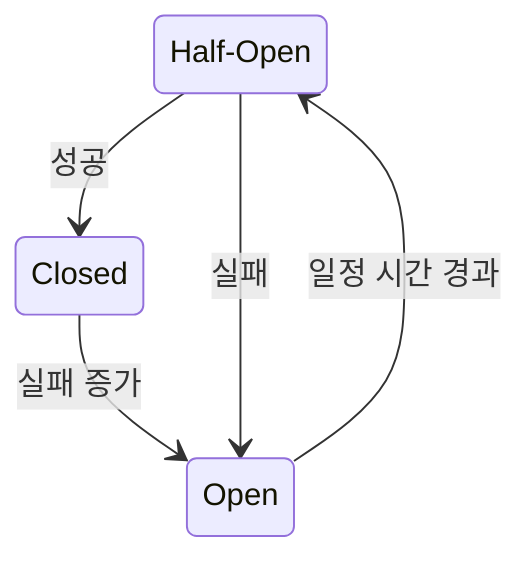

전기 차단기와 같다.  
문제가 생겼을 때 잠시 호출을 끊어  
장애가 옆 시스템으로 번지는 것을 줄인다.

동기 API로 잇는다는 것은  
상대의 장애를 그대로 넘겨받는다는 뜻이기도 하다.  
연결 방식을 고를 때 함께 봐야 할 비용이다.

---

## 12. API Gateway는 어느 경계에 필요한가

서비스가 많아지면 외부 소비자가  
각 서비스를 직접 찾아 부르기 어려워진다.

그래서 외부 클라이언트 앞에 API Gateway를 둔다.

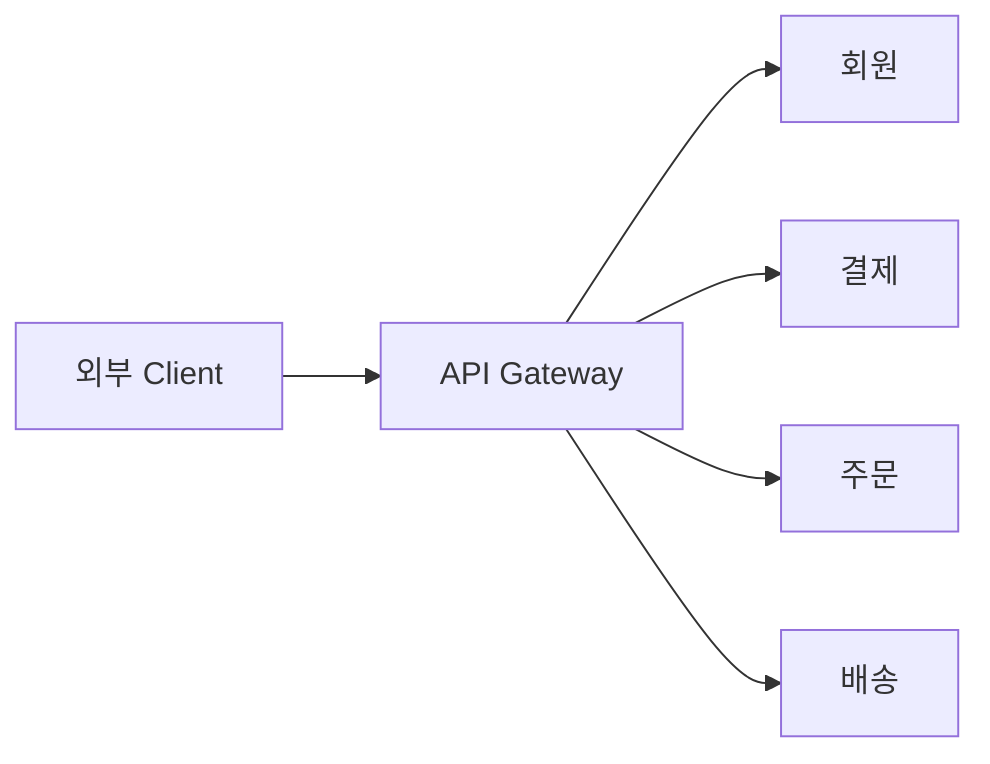

여기서 인증, 인가, 라우팅, Rate Limit,  
로깅, TLS 처리, 공통 보안 정책을 한곳에서 처리할 수 있다.

하지만 내부 서비스끼리의 통신까지  
전부 Gateway를 거쳐야 하는 것은 아니다.

상황에 따라 직접 호출, Service Discovery,  
Service Mesh, 메시징이 더 나을 수 있다.

그래서 질문은 이렇게 바꾸는 편이 낫다.

> "API Gateway를 쓰는 것이 좋은가"가 아니라  
> **"어떤 경계에 Gateway가 필요한가"**

Circuit Breaker와 API Gateway는 서로 다른 장치지만  
묻는 것은 같다.  
이 연결을 어디서 끊고, 어디서 모을 것인가다.

---

## 13. 원칙에도 예외는 있다

지금까지 정리한 것은 기본값이지 법이 아니다.

아키텍처 규칙을 절대적인 법칙으로 만들면  
현실 문제를 못 푸는 경우가 생긴다.

전체 처리 시간을 100ms 이하로 맞춰야 하는데  
중간 계층 때문에 도저히 못 맞춘다고 하자.  
그러면 특정 통신 방식에 예외를 둘 수 있다.

다만 예외에도 근거가 있어야 한다.

```text
❌  "그냥 직접 접근하는 게 편해서"

✅  "명확한 성능 요구사항 때문에
     현재 표준 구조로는 SLA를 만족할 수 없다."
```

> **예외는 허용할 수 있지만  
> 설명할 수 있는 이유가 있어야 한다.**

그리고 하나의 예외가 모든 규칙을 없애지는 않는다.

API Gateway를 거치지 않는 예외를 허용했다고 해서  
API 문서화, 보안, 스키마 관리, 데이터 품질, Owner까지  
함께 사라지는 것은 아니다.

기술적인 구현 방법에는 예외가 있어도  
데이터와 서비스에 대한 책임은 그대로 남는다.

---

## 14. 12장 정리

네 가지만 기억하면 된다.

**API, 이벤트, 배치는 대체 관계가 아니다.**  
각각 푸는 문제가 다르다.  
질문은 "무엇이 더 좋은가"가 아니라  
"지금 문제에 무엇이 맞는가"다.

**동기 API를 쓴다고 강한 일관성이 보장되지 않는다.**  
여러 시스템에 걸친 정합성은 따로 설계해야 한다.

**실시간으로 만들 수 있다고 반드시 실시간일 필요는 없다.**  
실시간성을 높이면 비용과 운영 난이도도 함께 올라간다.

**아키텍처 원칙에 예외는 있을 수 있다.**  
다만 "직접 접근하는 게 편해서"는 근거가 되지 않는다.  
명확한 성능 요구처럼 설명할 수 있는 이유가 있어야 한다.

여기까지가 3부다.

경계를 넘는 방법은 정했다.  
하지만 넘겨받은 데이터를 다른 팀이 실제로 쓰려면  
그것만으로는 부족하다.

어디에 있는지, 무슨 뜻인지,  
믿을 수 있는지, 누가 책임지는지를 알 수 있어야 한다.

4부에서는 데이터를 제품처럼 제공하는 방법을,  
5부에서는 그 데이터를 믿을 수 있게 만드는 장치를 다룬다.

다음 장에서는 여러 팀이 반복해서 쓰는 데이터를  
어떻게 제품처럼 제공할지 본다.
