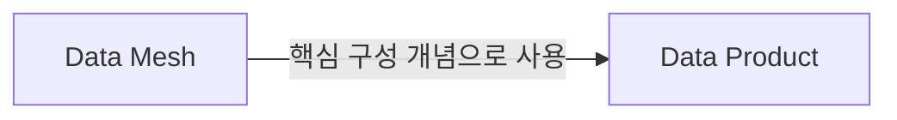
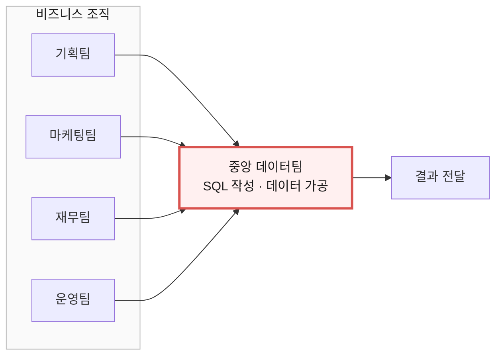
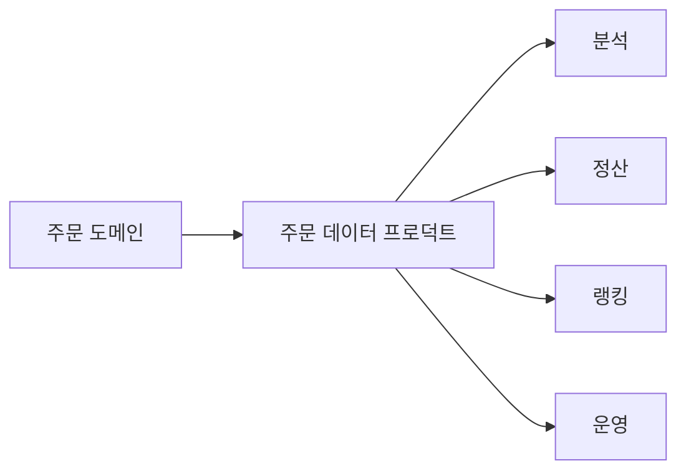
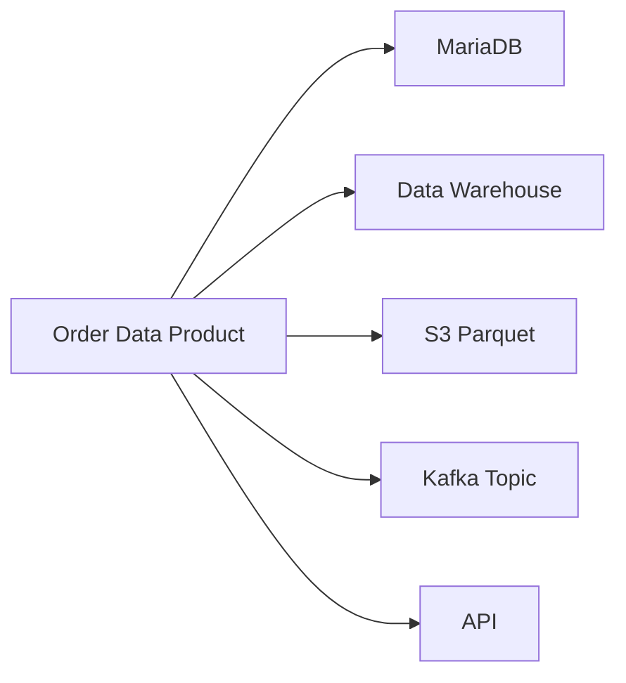
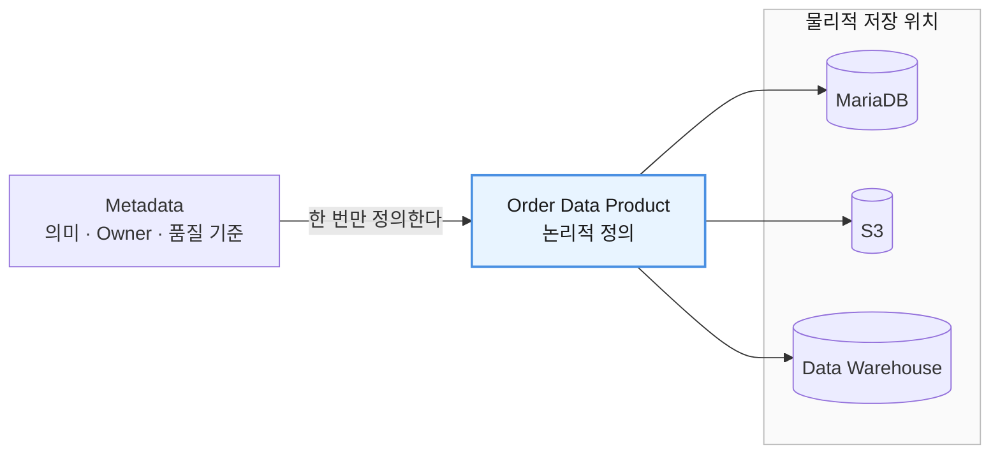
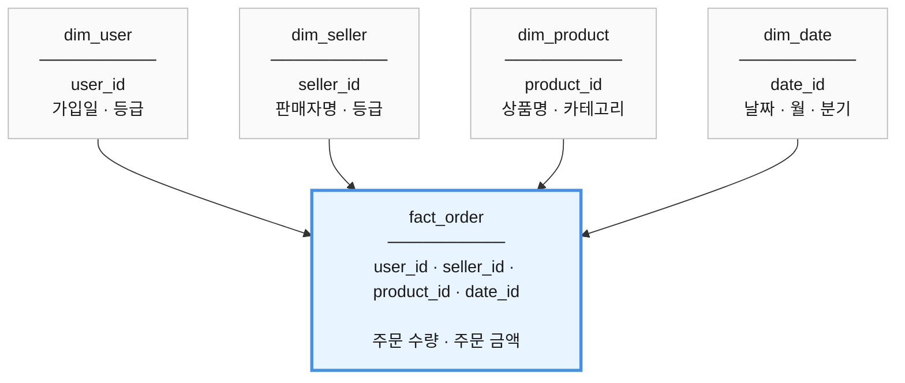
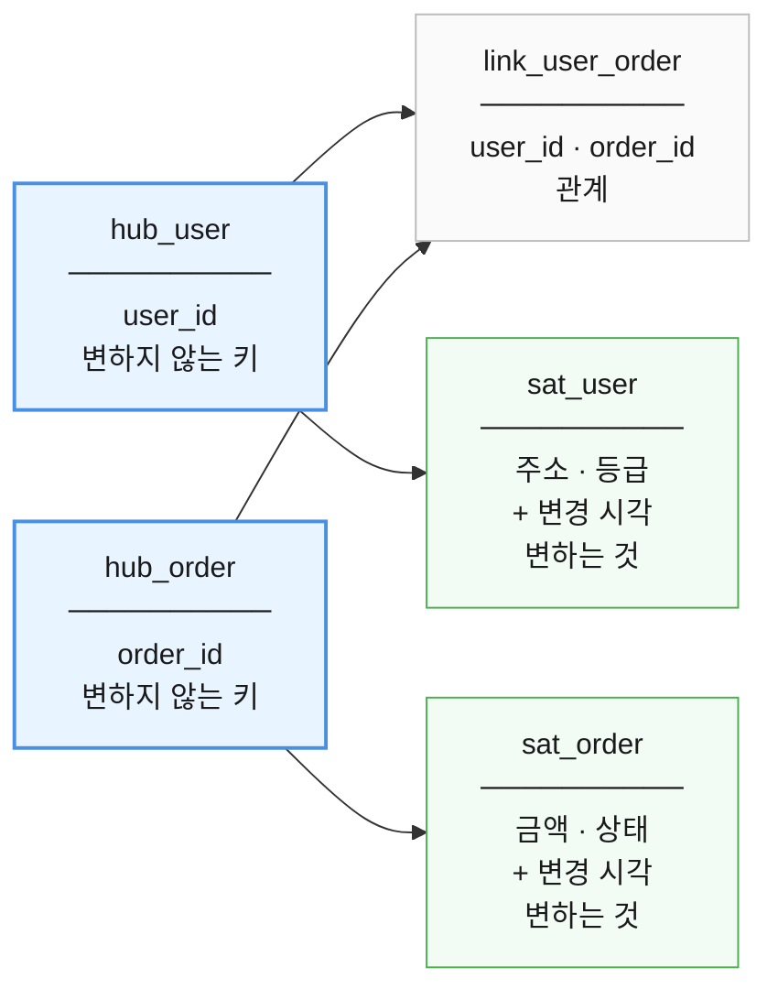
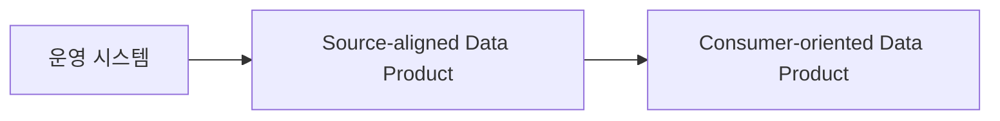
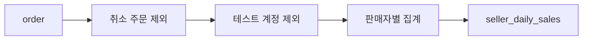

# 13장. 데이터 프로덕트

> **4부 · 제품** — 데이터를 어떻게 쓸 수 있게 하는가  
> **13장** · 14장

*데이터를 ‘저장’하는 데서 ‘제품처럼 제공’하는 단계로*

데이터를 많이 가지고 있다고 해서  
그 조직이 데이터를 잘 활용하는 것은 아니다.

중요한 것은 필요한 사람이 데이터를 쉽게 찾고,  
그 의미를 이해하고, 신뢰하면서 사용할 수 있는가이다.

예를 들어 회사에 다음과 같은 테이블이 있다고 해보자.

```text
order
point_usage
point_type
member
seller
product
payout_rate
```

주문 데이터를 분석하려는 사람에게  
이 테이블들을 그대로 열어주면서 이렇게 말할 수도 있다.

> 필요한 테이블을 JOIN해서 사용하세요.

하지만 분석하는 사람은 곧 여러 질문에 부딪힌다.

```text
어떤 주문 상태를 포함해야 하는가?

취소된 주문은 제외하는가?

테스트 계정은 어떻게 구분하는가?

point_amount의 단위는 무엇인가?

출금 환산율은 현재 값을 사용하는가,
주문 당시 값을 사용하는가?

어느 테이블이 가장 신뢰할 수 있는 원본인가?
```

데이터는 존재하지만  
실제로 사용하기는 쉽지 않은 상태다.

**데이터 프로덕트(Data Product)** 는  
이 문제를 해결하기 위한 사고방식이다.

---

## 1. 데이터 프로덕트란 무엇인가

데이터 프로덕트를 가장 쉽게 설명하면 다음과 같다.

> **다른 사람이 반복적으로 신뢰하여 사용할 수 있도록  
> 데이터와 그 데이터에 필요한 설명·품질·접근 방법 등을  
> 하나의 제품처럼 관리하는 것**

여기서 중요한 점은  
데이터 프로덕트가 단순한 DB 테이블이나 파일 하나를 의미하지 않는다는 것이다.

보통 다음과 같은 요소가 함께 관리된다.

```text
데이터

+ 데이터의 의미
+ 스키마
+ 메타데이터
+ 품질 정보
+ 소유자
+ 갱신 주기
+ 접근 방법
+ 보안 정책
+ 버전 및 변경 정보
```

예를 들어 다음과 같은 데이터 프로덕트를 생각할 수 있다.

```text
이름
Seller Daily Sales

설명
판매자별 일일 판매 실적을 제공한다.

주요 데이터
seller_id
date
total_amount
buyer_count

갱신 주기
5분

소유 도메인
주문 도메인

품질 목표
최근 10분 이내 데이터 유지

제공 방법
SQL / API / File
```

이 정도 정보가 갖춰지면  
다른 팀은 주문 시스템의 내부 구현을 전부 공부하지 않아도 데이터를 사용할 수 있다.

---

## 2. 데이터 프로덕트의 정의는 하나로 고정되어 있지 않다

데이터 프로덕트라는 용어는  
조직과 방법론에 따라 범위가 조금씩 다르다.

어떤 조직은 다음 정도로 본다.

```text
데이터셋
+
메타데이터
+
품질 기준
+
접근 방법
```

반면 Data Mesh처럼 비교적 넓은 관점에서는

```text
데이터
+
메타데이터
+
변환 코드
+
정책
+
인터페이스
+
필요한 인프라 구성
```

까지 하나의 독립적인 데이터 제품으로 볼 수 있다.

따라서 중요한 것은

> **우리 조직에서 무엇을 데이터 프로덕트라고 부를 것인지  
> 먼저 정의하는 것**

이다.

이 장에서는 데이터뿐 아니라  
그 데이터를 이해하고 안정적으로 소비하는 데 필요한 요소까지 포함하는  
비교적 넓은 관점으로 설명한다.

---

## 3. Data Product와 Data Mesh는 같은 것이 아니다

둘은 자주 함께 등장하지만 동일한 개념은 아니다.

**Data Product**는  
데이터를 제품처럼 관리하는 개념이다.

반면 **Data Mesh**는  
대규모 조직에서 데이터를 분산하여 소유하고 운영하는 하나의 아키텍처·조직 운영 방식이다.

Data Mesh가 중요하게 보는 네 가지 원칙은 3장에서 다뤘다.

즉 관계를 단순화하면 다음과 같다.



따라서 데이터 프로덕트를 만들기 위해  
반드시 Data Mesh를 도입해야 하는 것은 아니다.

작은 조직에서도 데이터 프로덕트 개념만 따로 사용할 수 있다.

---

## 4. 왜 데이터 프로덕트가 필요한가

전통적인 데이터 조직에서는  
중앙 데이터팀이 많은 요청을 처리한다.



조직이 작다면 충분히 동작할 수 있다.

하지만 조직과 데이터가 커질수록  
중앙 데이터팀이 모든 도메인의 비즈니스 규칙을 이해하기 어려워진다.

요청도 계속 증가한다.

그러면 데이터팀 자체가 병목이 될 수 있다.

데이터 프로덕트 관점에서는 생각을 바꾼다.



데이터를 만드는 도메인이  
다른 사람이 사용할 수 있는 형태로 제공하는 것이다.

---

## 5. 데이터를 제품처럼 생각한다

API를 제품처럼 제공한다고 생각해보자.

코드만 작성했다고 끝나지 않는다.

```text
API
+
문서
+
사용 방법
+
버전
+
보안
+
모니터링
+
장애 대응
```

등이 필요하다.

데이터도 마찬가지다.

다음과 같은 방식은 좋은 데이터 프로덕트라고 보기 어렵다.

```text
테이블 열어놨습니다.

필요하면 알아서 사용하세요.
```

이 경우 소비자가 직접 알아내야 하는 것이 너무 많다.

```text
어떤 테이블을 써야 하는가?

컬럼의 의미는 무엇인가?

어떤 JOIN이 필요한가?

어떤 데이터를 제외해야 하는가?

언제 갱신되는가?

누가 관리하는가?

숫자가 틀리면 누구에게 문의해야 하는가?
```

좋은 데이터 프로덕트는  
이 지식을 데이터와 함께 제공한다.

---

## 6. 메타데이터

데이터 프로덕트에서 매우 중요한 것이  
**메타데이터(Metadata)** 다.

메타데이터란

> **데이터를 설명하는 데이터**

다.

다음 값이 있다고 해보자.

```text
point_amount = 1000
```

이 숫자만으로는 의미를 알기 어렵다.

```text
충전한 포인트인가?

사용한 포인트인가?

주문한 포인트인가?

남은 포인트인가?

출금 대상 포인트인가?
```

따라서 다음과 같은 설명이 필요하다.

```text
point_amount

의미
주문이 완료된 포인트 수량

단위
개

NULL
허용하지 않음

취소 데이터
포함하지 않음
```

이런 정보가 메타데이터다.

---

## 7. 데이터 프로덕트는 논리적인 개념이다

데이터 프로덕트를 특정 DB 하나라고 생각하면 안 된다.

예를 들어 논리적으로는

```text
Order Data Product
```

하나가 존재한다고 하자.

하지만 실제 구현은 여러 형태일 수 있다.



소비자는 이 모든 저장 기술을 알 필요가 없다.

소비자에게 중요한 것은

> 어떤 주문 데이터를  
> 어떤 품질로  
> 어떤 방식으로 사용할 수 있는가

이다.

즉 다음과 같이 구분할 수 있다.

```text
논리적 데이터 프로덕트
= 무엇을 제공하는가

물리적 구현
= 그것을 어떻게 저장하고 제공하는가
```

---

## 8. 데이터와 메타데이터를 너무 강하게 묶지 않는다

데이터가 여러 위치에 복제되는 경우를 생각해보자.

```text
MariaDB
Data Warehouse
S3
분석 DB
```

각 복제본마다 동일한 메타데이터를 따로 저장하면  
메타데이터 수정 시 여러 곳을 동시에 갱신해야 한다.

그래서 데이터 프로덕트의 논리적 정의와  
물리적 데이터 저장 위치를 구분하는 것이 도움이 된다.



이렇게 보면  
하나의 논리적인 제품과 여러 물리적인 구현을 연결할 수 있다.

---

## 9. CQRS는 데이터 프로덕트의 필수 조건이 아니다

데이터 프로덕트를 설명할 때  
CQRS가 자주 등장한다.

CQRS는

**Command Query Responsibility Segregation**

의 약자로,

> 데이터를 변경하는 모델과  
> 데이터를 조회하는 모델의 책임을 분리하는 것

을 의미한다.

하지만 중요한 점이 있다.

> **모든 데이터 프로덕트에 CQRS가 필요한 것은 아니다.**

운영 시스템의 쓰기 구조와  
데이터 소비자의 조회 구조가 크게 다를 때  
CQRS의 사고방식이 유용한 것이다.

CQRS 자체는 9장 「서비스 경계와 조회 모델」에서 다뤘다.

---

## 10. 운영 모델과 조회 모델

운영 시스템에서는 다음이 중요하다.

```text
트랜잭션
정합성
빠른 INSERT / UPDATE
동시성 처리
```

예를 들어 주문 시스템에는 이런 테이블이 있을 수 있다.

```text
order
point_usage
point_balance
order_item
```

하지만 분석 소비자가 원하는 것은 다를 수 있다.

```text
판매자별 일일 주문 금액
회원별 월간 주문 금액
시간대별 주문 통계
```

그래서 별도의 조회 모델을 만들 수 있다.

```text
seller_daily_sales

seller_id
date
total_amount
buyer_count
```

구조는 다음과 같다.


이렇게 하면 소비자는  
운영 DB의 복잡한 구조를 알 필요가 없다.

---

## 11. 읽기에 최적화한다

데이터 프로덕트는 소비 목적에 따라  
읽기 편한 형태로 구성할 수 있다.

운영 DB에서는 정규화가 유리할 수 있다.

```text
orders
order_items
products
customers
stores
```

하지만 분석할 때 매번 이 테이블을 JOIN해야 한다면 불편하다.

그래서 다음처럼 가공할 수 있다.

```text
sales_analysis

date
customer_id
product_name
store_name
quantity
amount
```

즉 비정규화 자체가 나쁜 것이 아니다.

중요한 것은

- **운영 시스템** — 쓰기와 정합성 중심
- **데이터 프로덕트** — 소비와 조회 중심

처럼 목적에 맞게 설계하는 것이다.

---

## 12. 스타 스키마

조회 중심으로 설계한다고 했는데,  
그럼 구체적으로 어떤 모양인가.

분석용 데이터 프로덕트에서 가장 많이 쓰이는 모양이  
**Star Schema**다.

### 왜 이런 모양이 나왔나

분석에서 나오는 질문은 끝이 없다.

```text
이번 달 주문 금액은 얼마인가?
판매자별로는?
상품 카테고리별로는?
판매자별 × 월별로는?
```

질문이 나올 때마다 테이블을 새로 만들 수는 없다.

그래서 질문을 두 조각으로 쪼갠다.

- **무엇을 재는가** — 주문 금액, 주문 수량
- **어떤 기준으로 나눠 보는가** — 판매자별, 월별, 상품별

재는 값은 가운데 테이블 하나에 모으고,  
나눠 보는 기준은 각각 별도 테이블로 뺀다.

앞엣것을 **Fact**, 뒤엣것을 **Dimension**이라고 부른다.

### 구조



`fact_order`에는 **숫자와 연결 키만** 들어간다.  
행 하나가 주문 하나다. 수천만 건이 쌓인다.

`dim_*`에는 그 키가 무엇인지 설명하는 값이 들어간다.  
판매자 수만큼, 상품 수만큼만 있으므로 훨씬 작다.

예를 들어 `fact_order`에는 `seller_id = 37`만 있고,  
그 판매자의 이름과 등급과 가입일은 `dim_seller`에 있다.

가운데 Fact 하나를 Dimension들이 둘러싸는 모양이라  
별(Star) 스키마라고 부른다.

### 그래서 무엇이 좋아지나

질문이 바뀌어도 테이블 구조는 그대로다.  
어떤 Dimension을 붙이느냐만 달라진다.

```sql
-- 판매자별 × 월별 주문 금액
SELECT s.seller_name, d.month, SUM(f.order_amount)
FROM fact_order f
JOIN dim_seller s ON f.seller_id = s.seller_id
JOIN dim_date   d ON f.date_id   = d.date_id
GROUP BY s.seller_name, d.month;
```

상품 카테고리별로 보고 싶으면  
`dim_seller`를 `dim_product`로 바꾸기만 하면 된다.

새로운 분석 기준이 필요하면  
Dimension 테이블을 하나 더 붙인다.  
`fact_order`는 건드리지 않는다.

판매자 이름이 바뀌어도 `dim_seller` 한 행만 고치면 된다.  
앞 절에서 본 넓은 테이블이었다면  
수천만 행을 전부 고쳐야 했을 것이다.

### 언제 쓰나

집계와 조합이 많은 환경에서 유용하다.  
월별·상품별·판매자별처럼 기준이 계속 바뀌는 분석이 대표적이다.

다만 모든 데이터 프로덕트가 이 모양일 필요는 없다.  
기준 조합이 거의 고정되어 있고 조회가 단순하다면  
앞 절처럼 넓은 테이블 하나로 충분할 때도 많다.

---

## 13. Data Vault

스타 스키마에도 약점이 있다.

원천 시스템이 바뀌면 흔들린다는 점이다.

주문에 새 속성이 생기거나, 판매자 등급 체계가 바뀌거나,  
시스템 하나가 통째로 교체되면  
Fact와 Dimension을 다시 설계해야 하는 일이 생긴다.

"작년 3월 시점에 이 판매자의 등급은 무엇이었나"처럼  
과거 시점을 되짚는 질문에도 약하다.

이런 문제를 다루려고 나온 모델링 방법이 **Data Vault**다.

### 세 가지로 나누는 이유

핵심 발상은 하나다.

> **변하는 것과 변하지 않는 것을 섞지 않는다.**

그래서 테이블을 세 종류로 나눈다.

| 요소 | 담는 것 | 성질 |
|---|---|---|
| **Hub** | 비즈니스 키 (`user_id`, `order_id`) | 거의 변하지 않는다 |
| **Link** | 객체 사이의 관계 (회원 ↔ 주문) | 관계가 늘어난다 |
| **Satellite** | 속성과 그 변경 이력 (주소, 등급, 금액) | 계속 변한다 |



### 무엇이 좋아지나

바뀔 때 **고치지 않고 붙인다.**

주문에 새 속성이 생기면 Satellite를 하나 더 만든다.  
기존 Hub와 Link와 Satellite는 그대로 둔다.

새로운 원천 시스템이 들어와도  
같은 Hub에 Satellite를 하나 더 붙이면 된다.

그리고 Satellite에는 값과 함께 **변경 시각**이 쌓인다.  
덮어쓰지 않으므로 과거 어느 시점의 상태든 되짚을 수 있다.  
감사 추적이 필요한 영역에서 특히 쓸모가 있다.

### 스타 스키마와 무엇이 다른가

둘 중 하나를 고르는 문제가 아니다.  
푸는 문제가 다르고, 실제로는 함께 쓰는 경우가 많다.

| | Data Vault | Star Schema |
|---|---|---|
| 목적 | 원천 데이터를 통합하고 이력을 남긴다 | 분석 질문에 빠르게 답한다 |
| 최적화 대상 | 적재와 변경 수용 | 조회와 집계 |
| 읽기 편한가 | 어렵다. 조인이 많다 | 쉽다 |
| 놓이는 위치 | 안쪽 통합 계층 | 바깥쪽 소비 계층 |


안쪽에 Data Vault로 원본과 이력을 쌓아 두고,  
바깥쪽에 Star Schema로 분석용 모델을 만들어 내놓는 식이다.

### 지금 당장 필요한가

대부분은 아니다.

Data Vault는 원천 시스템이 여럿이고, 자주 바뀌고,  
이력과 감사 추적이 중요할 때 값을 한다.  
그렇지 않다면 관리할 테이블만 몇 배로 늘어난다.

지금은 **변하는 것과 변하지 않는 것을 섞지 않는다**는  
발상만 기억해 두면 충분하다.  
이 생각 자체는 Data Vault를 쓰지 않아도 쓸모가 있다.

---

## 14. 유비쿼터스 언어는 ‘전사 공통 언어’와 조금 다르다

5장에서 본 유비쿼터스 언어를  
데이터 관점에서 다시 보자.

흔한 오해는 이것이다.

```text
회사 전체에서
모든 단어의 의미를 하나로 통일한다.

```

서로 다른 Bounded Context라면  
같은 단어가 서로 다른 의미를 가질 수도 있다.

```text
커머스 Context의 회원

배송 Context의 회원

정산 Context의 회원

```

이 반드시 동일한 모델일 필요는 없다.

데이터 프로덕트를 만들 때 중요한 것은 다음이다.

- **Context 내부** — 언어와 의미를 일관되게 유지
- **Context 사이** — 데이터 계약과 매핑을 명확하게 정의

---

## 15. 의미적 일관성

같은 데이터 프로덕트나 같은 Context 안에서  
같은 이름은 같은 의미를 가져야 한다.

다음과 같은 컬럼은 좋지 않을 수 있다.

```text
amount

```

왜냐하면 이것이 무엇을 의미하는지 불분명하기 때문이다.

```text
결제 금액인가?

주문 포인트 수인가?

출금 금액인가?

수수료인가?

```

차라리 다음처럼 의미를 명확히 드러내는 편이 좋다.

```text
payment_amount
point_amount
payout_amount
fee_amount

```

---

## 16. NULL, 기본값, 데이터 타입

데이터 값이 없는 경우에도  
그 의미를 명확하게 정의해야 한다.

예를 들어:

```text
birthday = NULL

```

이 값이 의미하는 것이 무엇인가?

```text
사용자가 입력하지 않음

정보를 알 수 없음

수집 실패

해당 없음

```

여러 해석이 가능하다.

따라서 데이터 계약에서 의미를 정해야 한다.

데이터 타입도 마찬가지다.

```text
회원 시스템
user_id BIGINT

결제 시스템
user_id VARCHAR

분석 시스템
user_id INT

```

처럼 제각각이면 계속 변환이 필요해진다.

가능한 범위에서 공통 타입 규칙을 갖는 것이 좋다.

---

## 17. 속성의 원자성

하나의 필드에는  
가능하면 하나의 의미를 담는다.

좋지 않은 예:

```text
user_info =
"홍길동/010-1234-5678/부산"

```

더 나은 형태:

```text
user_name
phone_number
address

```

원자성을 유지하면

```text
검색
필터링
JOIN
검증
마스킹

```

이 훨씬 쉬워진다.

---

## 18. 원천 데이터를 무조건 직접 읽어야 하는 것은 아니다

데이터 계보를 단순하게 유지하려면  
권위 있는 원천 데이터를 사용하는 것이 좋다.

하지만

> 모든 데이터 프로덕트가 반드시 운영 원천 DB를 직접 읽어야 한다

는 뜻은 아니다.

다음 구조도 충분히 가능하다.



예를 들어 주문 도메인이  
신뢰할 수 있는 `Order Data Product`를 제공한다면,

정산 데이터 프로덕트가 운영 DB를 다시 직접 읽지 않고  
이 데이터 프로덕트를 입력으로 사용할 수도 있다.

중요한 원칙은 다음과 같다.

> **불필요한 중간 의존성을 만들지 말고,  
> 권위 있는 원천 또는 신뢰할 수 있는 상위 데이터 프로덕트를 사용한다.**

---

## 19. Data Lineage

데이터가 어디에서 왔고  
어떤 과정을 거쳤는지 추적하는 것을

**Data Lineage**라고 한다.

예:



최종 숫자가 이상할 경우

```text
원천 데이터 문제인가?

수집 과정에서 누락됐는가?

필터 조건이 잘못됐는가?

집계 로직이 잘못됐는가?

```

를 역으로 추적할 수 있다.

---

## 20. 13장 정리

세 가지만 기억하면 된다.

**데이터 프로덕트는 테이블이나 파일 하나가 아니다.**  
데이터에 의미·스키마·품질 기준·소유자·갱신 주기·접근 방법이  
함께 붙어 있어야 한다.

**논리적인 제품과 물리적인 구현을 분리한다.**  
하나의 데이터 프로덕트가  
DB, 웨어하우스, 객체 스토리지, 스트림, API로  
동시에 제공될 수 있다.  
소비자는 그 전부를 알 필요가 없다.

**소비 목적에 맞는 읽기 모델을 따로 두면 도움이 된다.**  
운영 시스템은 쓰기와 정합성이 중심이고  
데이터 프로덕트는 조회가 중심이기 때문이다.

다음 장에서는 이렇게 만든 데이터 프로덕트를  
어떻게 믿을 수 있게 만드는지 본다.
