# 14장. 데이터 프로덕트를 신뢰할 수 있게 만들기

> **4부 · 제품** — 데이터를 어떻게 쓸 수 있게 하는가  
> 13장 · **14장**

분석팀에 데이터를 열어 줬다.

돌아온 첫 질문은 기능에 대한 것이 아니었다.

> "이 숫자 믿어도 되나요?"

13장에서 데이터 프로덕트가 무엇인지 봤다.

만드는 것과 믿게 만드는 것은 다른 문제다.

이 장에서는 신뢰를 만드는 요소를 다룬다.

품질과 테스트, 이력 관리, 수집과 제공 방식,  
보안, 그리고 이것들을 떠받치는 플랫폼이다.

---

## 1. 데이터 품질

데이터 프로덕트는  
데이터가 존재하는 것만 책임지는 것이 아니다.

**신뢰할 수 있는 상태인지**도 관리해야 한다.

대표적인 품질 기준은 다음과 같다.

| 품질 항목 | 의미                |
|-------|-------------------|
| 정확성   | 실제 사실과 맞는가        |
| 완전성   | 필요한 데이터가 빠지지 않았는가 |
| 유일성   | 중복이 없는가           |
| 일관성   | 관련 데이터와 의미가 맞는가   |
| 최신성   | 약속한 시간 안에 갱신되는가   |

예를 들어 주문 데이터에는 다음 규칙을 적용할 수 있다.

```text
order_id 중복 금지

seller_id NULL 금지

point_amount > 0

created_at이 미래 시간이면 오류
```

---

## 2. 데이터에도 테스트가 필요하다

소프트웨어에는 테스트가 있다.

```text
Unit Test
Integration Test
```

데이터 파이프라인도 테스트할 수 있다.

```text
Schema Test

NULL Test

Unique Test

Range Test

Freshness Test

Reconciliation
```

예를 들어 다음처럼 구성한다.


문제가 발생하면

```text
배포 중단
알림
격리
재처리
```

같은 정책을 적용할 수 있다.

---

## 3. 데이터 대사

**Reconciliation**은  
원천과 결과가 맞는지 비교하는 것이다.

예를 들어:

```text
운영 DB
어제 주문 1,000,000건
```

그런데 데이터 프로덕트에는

```text
999,950건
```

만 존재한다고 하자.

50건이 누락된 이유를 찾아야 한다.

건수뿐 아니라 금액도 비교할 수 있다.

```text
원천 SUM(point_amount)

vs

데이터 프로덕트 SUM(point_amount)
```

이런 비교를 자동화하면  
데이터 파이프라인의 신뢰성을 높일 수 있다.

---

## 4. 데이터의 불변성은 상황에 따라 적용한다

데이터 프로덕트에서는  
과거 사실이 임의로 바뀌지 않도록 하는 것이 중요하다.

하지만

> 모든 데이터를 절대로 수정하면 안 된다

라고 이해하면 안 된다.

예를 들어 거래 원장, 감사 로그, 이벤트 로그처럼  
과거 사실의 재현이 중요한 데이터는

```text
Append-only
Versioning
History
```

방식이 적합하다.

반면 현재 상태만 중요한 데이터는  
기존 값을 갱신하는 것도 가능하다.

즉,

- **감사 / 이력 중요** — 불변성 적극 활용
- **현재 상태 중요** — 갱신 가능

처럼 데이터 특성에 따라 결정한다.

---

## 5. 이력 관리 방식

대표적인 이력 관리 방식을 살펴보자.

### SCD Type 1

현재값만 중요하다면  
기존 값을 덮어쓴다.

```text
기존

grade = A

변경

grade = B
```

과거 등급이 A였던 사실은 남지 않는다.

---

### SCD Type 2

과거 상태까지 보관해야 한다면  
새로운 행을 만든다.

| seller_id | grade | start | end |
|---|---|---|---|
| 100 | A | 2025-01-01 | 2026-05-31 |
| 100 | B | 2026-06-01 | NULL |

이렇게 하면 특정 시점의 상태를 조회할 수 있다.

SCD는 원래 Dimension 속성의 변화 이력을 관리하기 위한 기법이다.

모든 종류의 이력을 반드시 SCD로 관리하는 것은 아니다.

---

## 6. Snapshot

특정 시점의 전체 상태를 저장할 수도 있다.

```text
2026-09-14 Snapshot

2026-09-15 Snapshot

2026-09-16 Snapshot
```

장점은 특정 시점 상태를 복원하기 쉽다는 것이다.

하지만 바뀌지 않은 데이터도 계속 저장하므로  
저장량이 커질 수 있다.

---

## 7. Append-only

기존 데이터를 수정하지 않고  
새로운 사실을 계속 추가하는 방식이다.

예를 들어:

```text
OrderCreated

OrderCancelled

OrderRefunded
```

처럼 이벤트를 기록한다.

모든 변경 사실을 추적해야 하는 경우 유용하다.

---

## 8. CDC

**Change Data Capture**는  
DB에서 발생한 변경을 감지하는 방식이다.

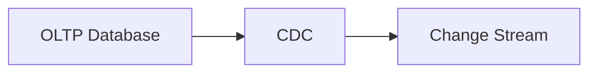

INSERT, UPDATE, DELETE 등의 변경을 감지하여  
다른 데이터 시스템으로 전달할 수 있다.

실시간 데이터 파이프라인에서 많이 활용된다.

---

## 9. 이력 방식에는 하나의 정답이 없다

데이터의 성격에 따라 조합한다.

| 무엇이 중요한가 | 쓰는 방식 |
|---|---|
| 현재 상태만 중요 | Type 1 |
| 과거 속성 변화 중요 | Type 2 |
| 시점 전체 상태 중요 | Snapshot |
| 모든 변경 사실 중요 | Append-only |
| 실시간 변경 전달 필요 | CDC |

하나의 시스템에서도  
여러 방식을 함께 사용할 수 있다.

---

## 10. Raw Data는 필요 없다는 뜻이 아니다

좋은 데이터 프로덕트는

```text
DB Dump 있으니 알아서 사용하세요.
```

라고 하지 않는다.

하지만 Raw Data 자체가 쓸모없다는 뜻은 아니다.

Raw 데이터는 다음과 같은 상황에서 매우 중요하다.

```text
재처리

장애 복구

감사

새로운 변환 로직 적용

과거 데이터 재계산
```

따라서 올바른 이해는 다음과 같다.

> **Raw Data만 제공하면서 소비자용 데이터 프로덕트라고 해서는 안 된다.**

Raw는 내부 처리 계층으로 충분히 가치가 있다.

---

## 11. 데이터 수집 방식

데이터를 가져오는 방법에도  
하나의 정답은 없다.

대표적으로 다음과 같은 방식이 있다.

### Batch

정해진 시간마다 가져온다.

```text
1시간마다

매일

매주
```

실시간성이 높지 않은 데이터에 적합하다.

---

### Event / Streaming

데이터가 발생할 때 전달한다.

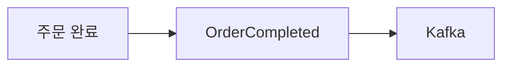

실시간 랭킹이나 모니터링 같은 기능에 적합하다.

---

### API

외부 서비스나 SaaS에서  
API를 통해 데이터를 가져올 수도 있다.

```text
외부 서비스
    ↑
 REST API
    ↑
Data Pipeline
```

실제 환경에서는  
Batch, Event, API를 혼합하는 경우가 많다.

---

## 12. Bronze / Silver / Gold

데이터 처리 구조에서 자주 등장하는 패턴이  
**Medallion Architecture**다.

대표적으로 다음 단계로 나눈다.

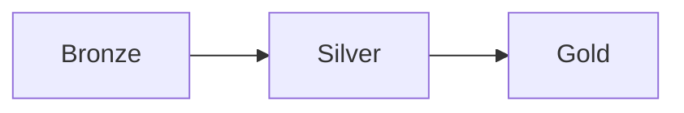

Bronze는 원천에 가까운 데이터다.

```text
Raw Data
```

Silver는 정제된 데이터다.

```text
중복 제거
타입 정리
NULL 처리
표준화
```

Gold는 비즈니스 소비에 적합한 데이터다.

```text
판매자 일별 주문 집계
월별 매출
정산 데이터
```

예를 들어:

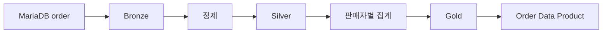

다만 중요한 점이 있다.

> **Bronze/Silver/Gold는 널리 사용되는 구현 패턴 중 하나이지  
> 데이터 프로덕트나 Data Mesh의 필수 구조는 아니다.**

---

## 13. 데이터 제공 방식

소비자가 필요한 방식도 다양하다.

```text
SQL
API
File
Event
Streaming
Dashboard
Cache
Replica
```

예를 들면:

| 요구사항      | 적합한 방식의 예          |
|-----------|--------------------|
| 일일 통계     | Batch / File       |
| BI 분석     | SQL                |
| 외부 시스템 연동 | API                |
| 실시간 랭킹    | Event / Streaming  |
| 고빈도 조회    | Cache / Read Model |

데이터 프로덕트는  
소비자의 요구에 적합한 출력 인터페이스를 제공해야 한다.

---

## 14. Input Port와 Output Port

데이터 프로덕트를 하나의 서비스처럼 생각하면  
입력과 출력을 구분할 수 있다.

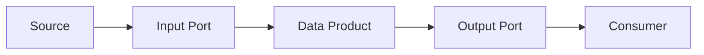

Input Port는 데이터를 받아들이는 계약이고,

Output Port는 소비자가 데이터를 사용하는 계약이다.

이렇게 내부 구현과 외부 계약을 분리하면  
데이터 저장 기술이 바뀌어도 소비자 영향을 줄이기 쉽다.

---

## 15. 데이터 보안

데이터 프로덕트에는  
보안도 포함되어야 한다.

대표적인 방식으로 다음이 있다.

```text
Row Level Security
특정 행만 조회

Column Level Security
특정 컬럼 조회 제한

Masking
민감 데이터 일부 숨김

Metadata Tag
PII, Financial 등의 태그 기반 정책
```

예를 들어 판매자 A에게는

```text
seller_id = A
```

인 행만 보이게 할 수 있다.

분석팀에는

```text
phone_number
email
```

같은 개인 식별 정보가 보이지 않도록 할 수 있다.

---

## 16. 도메인이 데이터 의미를 책임진다

데이터를 가장 잘 이해하는 것은  
대개 데이터를 만드는 도메인이다.

| 데이터 | 책임 도메인 |
|---|---|
| 회원 데이터 | 회원 도메인 |
| 결제 데이터 | 결제 도메인 |
| 주문 데이터 | 주문 도메인 |

중앙 데이터팀이  
모든 비즈니스 규칙을 완벽하게 이해하는 것은 현실적으로 어렵다.

따라서 도메인이

```text
데이터 의미

품질 기준

변경 규칙

소유권
```

을 책임지는 방향이 도움이 된다.

---

## 17. 새로운 데이터에는 새로운 소유권이 생길 수 있다

원천 데이터를 가공하면  
새로운 비즈니스 의미가 만들어질 수 있다.

예를 들어:

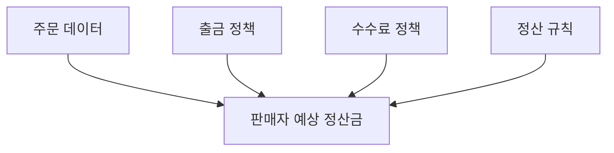

`판매자 예상 정산금`은  
단순한 주문 데이터가 아니다.

새로운 규칙이 적용된 새로운 데이터다.

따라서

```text
원천 데이터 소유자
≠
가공 데이터 소유자
```

일 수 있다.

데이터 프로덕트마다  
최종 책임자를 명확하게 하는 것이 중요하다.

---

## 18. Single Source of Truth는 단순히 ‘숫자 하나’라는 뜻이 아니다

이 표현은 1장에서 다뤘다.  
여기서는 데이터 프로덕트 관점에서 한 걸음 더 들어가 본다.

다음과 같은 상황이 있다고 하자.

| 팀 | 매출 |
|---|---|
| 운영팀 | 100억 |
| 재무팀 | 98억 |
| 분석팀 | 102억 |

숫자가 다르다고 해서  
무조건 하나만 맞는 것은 아니다.

예를 들어 각각 다음을 의미할 수 있다.

```text
PG 승인 금액

회계 인식 매출

환불 제외 순매출
```

모두 올바른 데이터일 수 있다.

따라서 중요한 것은

> **비즈니스 사실별로 어떤 정의를 사용하며  
> 어떤 데이터가 그 정의의 권위 있는 출처인지 명확하게 하는 것**

이다.

무조건 회사 전체에 숫자 하나만 존재하게 만드는 것이 목적은 아니다.

---

## 19. 하지만 도메인마다 마음대로 만들면 안 된다

앞의 세 절은 도메인이 데이터의 의미를 책임진다는 이야기였다.

그렇다고 분산 소유권이

```text
각 팀이 원하는 기술을
아무 규칙 없이 선택한다.
```

는 뜻은 아니다.

그렇게 하면 다음 문제가 생긴다.

```text
ID 규칙 불일치

스키마 불일치

보안 수준 불일치

중복 인프라

높은 운영비

통합 어려움
```

그래서 조직 전체의 최소한의 공통 규칙이 필요하다.

---

## 20. Federated Governance

앞 절의 균형 — 공통 규칙은 필요한데 중앙이 다 정할 수는 없다 —  
이것을 다루는 방식이 **Federated Governance**다.

핵심은 하나다.

> **무엇을 전사가 정하고  
> 무엇을 도메인이 정하는지를 나눈다.**

| 전사가 정한다 | 도메인이 정한다 |
|---|---|
| 개인정보 분류 기준 | 어떤 데이터 프로덕트를 만들지 |
| 식별자와 이름 규칙 | 내부 데이터 모델 |
| 스키마 호환성 정책 | 컬럼의 비즈니스 의미 |
| 품질의 최소 기준 | 그 위의 품질 목표 |
| 접근 통제 방식 | 갱신 주기 |

왼쪽은 **최소한**이어야 한다.  
목록이 길어질수록 중앙집중으로 되돌아간다.

Federated는 연방이라는 뜻이다.  
주(州)가 자기 법을 갖되 연방 헌법은 함께 지키는 구조를 떠올리면 된다.

거버넌스 조직과 역할은 16장 「거버넌스」에서 자세히 다룬다.

---

## 21. Self-Service Data Platform

앞 절이 **무엇을 지킬지**를 정했다면  
이 절은 **어떻게 지키게 할지**의 문제다.

규칙은 정해 놓아도 지키기 어려우면 지켜지지 않는다.

도메인마다 다음을 각자 직접 만든다고 해보자.

```text
수집 시스템
Kafka
ETL
Scheduler
Catalog
Security
Monitoring
CI/CD
```

팀이 다섯이면 다섯 벌이 생긴다.

비용도 문제지만 더 큰 문제가 있다.  
팀마다 보안 설정과 카탈로그 등록 방식이 달라진다.  
앞 절에서 정한 규칙이 실제로는 지켜지지 않는다.

그래서 공통 플랫폼이 이 기능들을 **셀프서비스로** 제공한다.

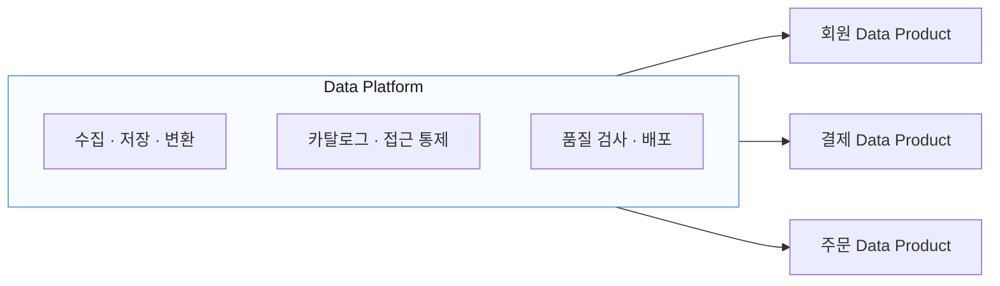

여기서 중요한 것은 **플랫폼이 규칙을 대신 지켜 준다**는 점이다.

플랫폼으로 데이터 프로덕트를 만들면  
카탈로그 등록과 접근 통제와 품질 검사가 기본으로 딸려 온다.  
애써 지키지 않아도 지켜진다.

이것을 **가드레일**이라고 부른다.  
10장 「이벤트로 연결하기」에서 본 것과 같은 생각이다.

역할은 이렇게 갈린다.

| | 묻는 것 | 책임 |
|---|---|---|
| 플랫폼팀 | 어떻게 만들 것인가 | 도구와 기반 |
| 도메인팀 | 무슨 데이터이고 왜 필요한가 | 의미와 품질 |

플랫폼팀이 데이터의 의미까지 책임지기 시작하면  
다시 중앙 데이터팀 병목으로 돌아간다.

---

## 22. 데이터를 찾을 수 있게 만든다

데이터 프로덕트가 많아지면  
어떤 데이터가 있는지 찾는 것 자체가 어려워진다.

그래서 **Data Catalog**를 사용한다.

카탈로그에서는 보통 다음을 찾을 수 있다.

```text
데이터 이름

설명

Owner

Schema

갱신 주기

품질 상태

보안 등급

접근 방법

Lineage
```

쉽게 말하면

> 조직 내부 데이터를 위한 검색 엔진

이라고 생각할 수 있다.

좋은 데이터 환경에서는  
사용자가 데이터팀에 매번 물어볼 필요가 없다.

기존:

```text
“판매자별 주문 데이터 어디 있나요?”
```

셀프서비스:

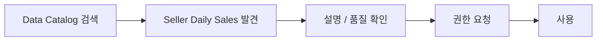

이것을 **Self-Service Discovery**라고 부른다.

앞 절의 플랫폼이 **만들기**를 셀프서비스로 만든다면,  
카탈로그는 **찾기**를 셀프서비스로 만든다.

카탈로그와 메타데이터는 15장 「메타데이터와 데이터 지도」에서 자세히 다룬다.

---

## 23. 데이터 변환도 코드처럼 관리한다

데이터 변환 로직도  
애플리케이션 코드처럼 관리할 수 있다.

예:

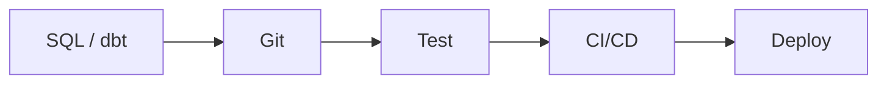

변경할 때 다음을 자동으로 검사할 수도 있다.

```text
Schema Compatibility

Data Quality

Metadata

Dependency

Test
```

이렇게 하면 데이터 구조 변경으로  
소비자 시스템이 갑자기 깨지는 위험을 줄일 수 있다.

---

## 24. 데이터 복제는 성능과 독립성을 얻는 대신 관리 비용을 만든다

모든 소비자가  
원본 데이터 프로덕트를 직접 사용할 필요는 없다.

예를 들어:

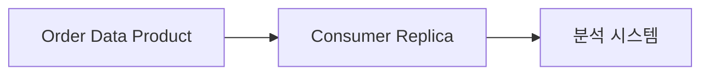

처럼 소비자 쪽에 복제본을 둘 수도 있다.

또는:

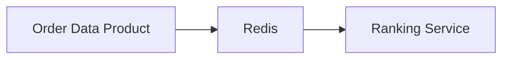

처럼 캐시를 둘 수도 있다.

장점은 다음과 같다.

```text
조회 지연 감소

원본 부하 감소

소비자 장애 격리

소비 목적에 맞는 저장 구조 사용
```

하지만 복제는 새로운 문제를 만든다.

```text
원본과 동기화됐는가?

삭제가 전파됐는가?

누가 복제본을 관리하는가?

개인정보 삭제 요청도 반영됐는가?
```

따라서 복제는 단순한 기술 선택이 아니라  
거버넌스 문제이기도 하다.

---

## 25. 데이터 프로덕트 아키텍처에는 하나의 정답이 없다

어떤 조직은 중앙 플랫폼 의존도가 높을 수 있다.

다른 조직은 도메인 자율성이 더 높을 수도 있다.

다음 두 극단을 생각할 수 있다.

```text
완전 중앙집중
────────────────────────
표준화 쉬움
중복 적음

하지만
중앙팀 병목 가능
```

반대편은 다음과 같다.

```text
완전 분산
────────────────────────
도메인 자율성 높음
빠른 변경 가능

하지만
기술 난립
중복 비용 증가
통합 어려움
```

현실적으로는 그 중간에서 균형을 찾는다.

---

## 26. 데이터 프로덕트 도입은 작게 시작한다

처음부터 다음을 만들려고 하면  
프로젝트가 너무 커지기 쉽다.

```text
전사 Data Mesh

전사 Data Catalog

전사 Streaming Platform

전사 Governance
```

보다 현실적인 방식은 작은 성공 사례를 만드는 것이다.

예를 들어:

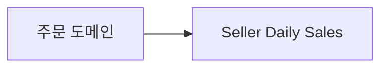

하나부터 시작한다.

여기에

```text
Owner

Schema

Metadata

Quality

Lineage

Security

Access

Refresh Cycle
```

을 제대로 적용한다.

실제 소비자가 사용해보고 문제가 없는지 확인한다.

그 후 좋은 패턴을 다른 도메인으로 확장한다.


이런 점진적인 확장이 훨씬 현실적이다.

---

## 27. 데이터 프로덕트 전체 흐름

이 장의 내용을 하나로 연결하면 다음과 같다.

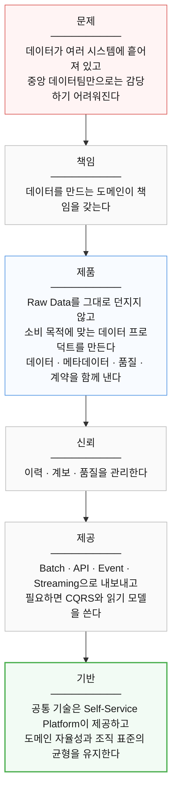

---

## 28. 초보자가 특히 구분해야 하는 것

이 장을 공부하면서 다음 개념들을 서로 같은 것으로 혼동하지 않는 것이 중요하다.

```text
Data Product
≠
Database Table

Data Product
≠
Data Mesh

Data Mesh
≠
Bronze / Silver / Gold

CQRS
≠
Data Product의 필수 조건

Raw Data
≠
쓸모없는 데이터

Single Source of Truth
≠
회사 전체 숫자를 무조건 하나로 통일

Ubiquitous Language
≠
전사에서 모든 용어를 하나로 강제
```

이 구분만 명확하게 이해해도  
13~14장의 내용 대부분을 정확하게 이해한 것이다.

---

## 29. 14장 정리

이 장에서 가장 중요한 것은  
특정 제품이나 기술 이름을 외우는 것이 아니다.

Kafka, dbt, S3, Data Vault, Star Schema,  
Bronze/Silver/Gold 같은 기술과 패턴은  
상황에 따라 얼마든지 바뀔 수 있다.

더 중요한 것은 사고방식이다.

> **데이터를 DB에서 우연히 생기는 부산물이 아니라  
> 누군가가 사용하는 하나의 제품으로 생각한다.**

그리고 그 제품에 대해 다음 질문에 답할 수 있어야 한다.

```text
이 데이터는 무엇인가?

누가 책임지는가?

어디서 왔는가?

어떻게 만들어졌는가?

얼마나 믿을 수 있는가?

언제 갱신되는가?

과거 데이터는 어떻게 관리되는가?

어떻게 사용할 수 있는가?

누가 사용할 수 있는가?

변경되면 소비자에게 어떤 영향을 주는가?
```

이 질문에 명확하게 답할 수 있다면  
그 데이터는 단순한 테이블이나 파일을 넘어  
좋은 데이터 프로덕트에 가까워진다.

### 13~14장의 핵심 문장

> **데이터 프로덕트란 명확한 소유자가 데이터의 의미와 품질을 책임지고,  
> 소비자가 별도의 도움 없이도 쉽게 찾고 이해하고 신뢰하여 사용할 수 있도록 제공하는 데이터 제품이다.**

그리고 조직 차원에서는 다음 원칙으로 정리할 수 있다.

> **도메인은 데이터의 의미와 품질을 책임지고,  
> 공통 플랫폼은 데이터 프로덕트를 쉽게 만들고 운영할 수 있는 기술과 표준을 제공한다.**

이 두 문장을 이해했다면  
13~14장의 가장 중요한 내용을 이해한 것이다.

이 장에서 나온 용어는 부록 C 「용어집」의  
「데이터 제품과 모델링」 항목에 정리해 두었다.
