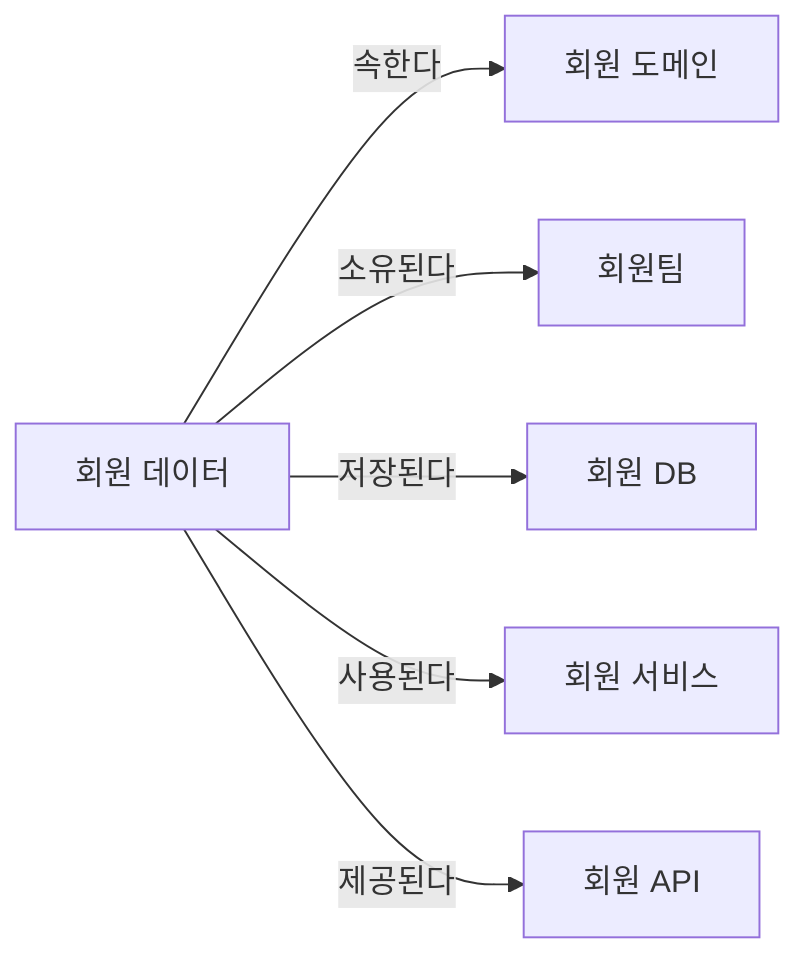
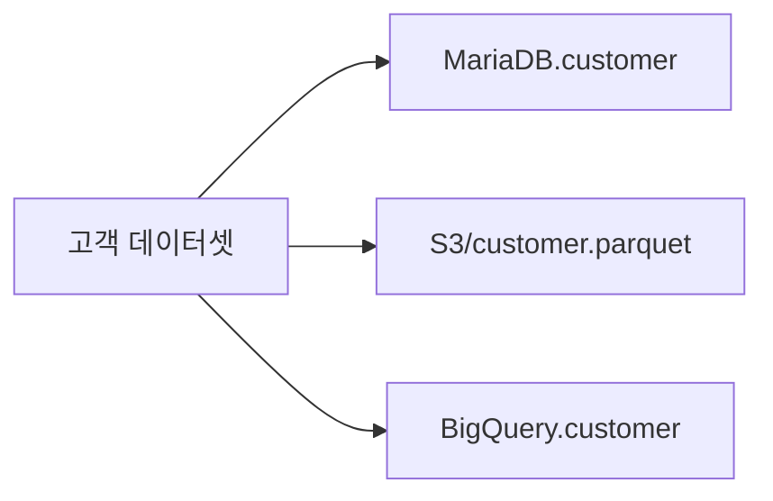
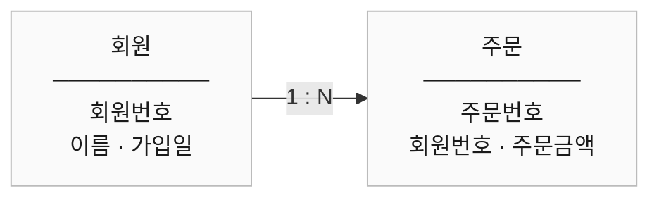
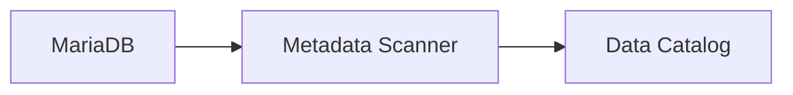
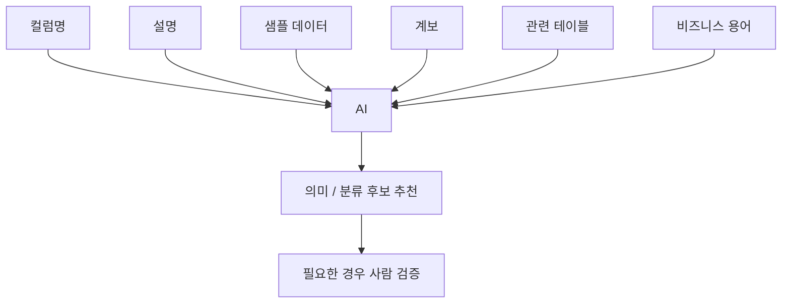
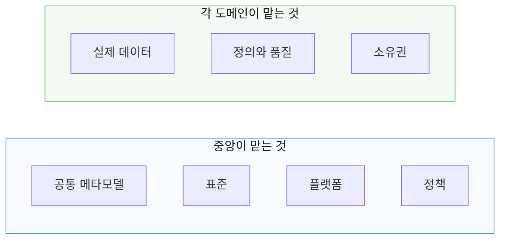
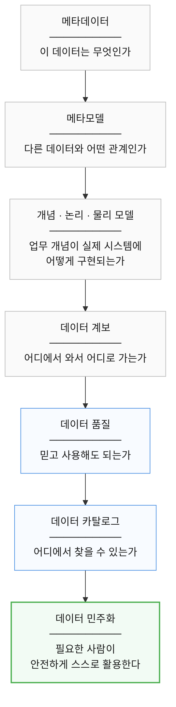

# 15장. 메타데이터와 데이터 지도

> **5부 · 신뢰** — 찾고, 믿고, 안전하게 쓰려면  
> **15장** · 16장 · 17장 · 18장

*데이터 카탈로그와 계보에서 데이터 민주화까지*

데이터 시스템이 작을 때는  
개발자 몇 명이 구조를 대부분 기억할 수 있다.

어떤 테이블에 어떤 데이터가 있고,  
누가 만들었으며 어디에서 사용하는지  
코드나 DB를 보면 어느 정도 파악할 수 있다.

하지만 서비스가 커지면 상황이 달라진다.

```text
회원 DB
결제 DB
배송 DB
Kafka
Redis
S3
Data Warehouse
BI
ML
외부 API
```

수많은 시스템에 데이터가 흩어지기 시작한다.

그러면 단순히 데이터를 저장하는 것만으로는  
데이터를 제대로 관리하기 어려워진다.

사람들은 이런 질문을 하기 시작한다.

```text
이 데이터는 무슨 뜻이지?

누가 관리하지?

어디에서 만들어졌지?

어디에서 사용하고 있지?

지금 믿고 사용해도 되는 데이터인가?

이 컬럼을 변경하면
어떤 시스템까지 영향을 받을까?
```

이런 질문에 답하기 위해 필요한 것이  
**메타데이터(Metadata)** 다.

이번 장에서는 메타데이터가 무엇인지부터 시작해


가 어떻게 연결되는지 알아본다.

---

## 1. 메타데이터란 무엇인가?

메타데이터를 가장 쉽게 표현하면

> **데이터를 설명하는 데이터**

다.

예를 들어 다음 값이 있다고 하자.

```text
amount = 10000
```

이것만 봐서는 `10000`이 무엇을 의미하는지 알기 어렵다.

하지만 다음 정보가 함께 있다면 이해할 수 있다.

```text
테이블
order

컬럼
amount

의미
주문에 사용된 금액

데이터 타입
BIGINT

소유자
주문 서비스팀

생성 시스템
주문 서비스

사용 시스템
정산 / 통계 / 랭킹
```

이런 정보가 바로 메타데이터다.

즉,

```text
실제 데이터
= 10000

메타데이터
= 이 10000이 무엇을 의미하는지 설명하는 정보
```

라고 이해하면 된다.

---

## 2. 메타데이터가 왜 필요한가?

데이터가 많아질수록  
데이터 자체보다 **데이터를 이해하기 위한 정보**가 중요해진다.

예를 들어 다음과 같은 컬럼이 있다고 하자.

```text
status
```

이름만 보면 정확한 의미를 알 수 없다.

```text
회원 상태인가?

결제 상태인가?

주문 상태인가?

정산 상태인가?
```

또 값이 `2`라고 하더라도

```text
2 = 완료?

2 = 취소?

2 = 정지?
```

인지 알 수 없다.

그래서 데이터와 함께

```text
의미
정의
소유자
출처
품질
사용처
변경 이력
```

등을 관리해야 한다.

메타데이터는 결국

> **회사 데이터 전체를 이해하기 위한 지도**

역할을 한다.

---

## 3. 비즈니스 메타데이터

메타데이터를 분류하는 방법에 절대적인 표준은 없다.  
조직이나 제품에 따라 조금씩 다르게 나눈다.

다만 실무에서는 다음 다섯 영역으로 나누어 보면 이해하기 쉽다.

| 영역 | 답하는 질문 |
|---|---|
| 비즈니스 | 업무적으로 무엇을 뜻하는가 |
| 기술 | 기술적으로 어떻게 생겼는가 |
| 운영 | 지금 정상으로 만들어지고 있는가 |
| 사용·협업 | 사람들이 어떻게 쓰고 있는가 |
| 품질 | 믿고 써도 되는가 |

하나씩 보자.

비즈니스 메타데이터는

> **데이터가 업무적으로 무엇을 의미하는지**

설명한다.

예를 들어

```text
활성 사용자란 무엇인가?

주문 금액은 어떤 금액인가?

결제 완료는 언제 완료로 보는가?

환불 금액에 수수료가 포함되는가?
```

같은 질문에 답한다.

예를 들어

```text
용어
활성 사용자

정의
최근 30일 안에
1회 이상 로그인한 회원
```

처럼 정의할 수 있다.

대표적으로 다음 정보가 포함될 수 있다.

```text
비즈니스 용어
용어 정의
업무 규칙
데이터 소유자
사용 목적
관련 도메인
```

핵심은

> 사람들이 같은 용어를  
> 같은 의미로 사용하도록 만드는 것이다.

---

## 4. 기술 메타데이터

기술 메타데이터는

> **데이터가 기술적으로 어떻게 구성되어 있는지**

설명한다.

예를 들어

```text
DB
스키마
테이블
컬럼
데이터 타입
PK
FK
파일 포맷
암호화 여부
```

등이다.

```text
table
payment

column
amount

type
BIGINT

nullable
false
```

같은 정보가 대표적인 기술 메타데이터다.

개발자와 데이터 엔지니어가  
데이터 구조를 이해할 때 많이 사용한다.

---

## 5. 운영 메타데이터

운영 메타데이터는

> **데이터가 실제 시스템에서 어떻게 처리되고 있는지**

설명한다.

예를 들어

```text
최근 배치 실행 시간
배치 성공 여부
처리 건수
데이터 갱신 시간
파이프라인 실행 시간
오류 여부
```

등이다.

```text
정산 배치

실행 시각
03:00

최근 결과
성공

처리 건수
1,200,000건
```

같은 정보다.

운영 메타데이터를 보면

> 데이터가 지금 정상적으로 만들어지고 있는가?

를 판단할 수 있다.

---

## 6. 사용·협업 메타데이터

데이터를 사람들이 어떻게 이용하는지도  
중요한 메타데이터가 될 수 있다.

예를 들어

```text
조회 수
즐겨찾기
댓글
리뷰
평점
태그
사용 설명
```

등이다.

어떤 데이터에 다음 설명이 붙어 있다고 하자.

```text
이 데이터는 실시간 데이터가 아닙니다.

매일 오전 4시 이후 사용하세요.

정산팀에서 관리합니다.
```

이런 정보는 자동으로 생성된  
DB 스키마 정보보다 실제 사용자에게  
더 유용할 수도 있다.

---

## 7. 데이터 품질도 메타데이터다

데이터가 존재한다고 해서  
무조건 믿고 사용할 수 있는 것은 아니다.

예를 들어 다음 데이터가 있다고 하자.

```text
sales_summary
```

그런데 상태가 다음과 같다면 어떨까?

```text
최근 갱신
3일 전

최근 배치
실패

NULL 비율
20%
```

데이터는 존재하지만  
분석에 사용하기에는 위험하다.

따라서 다음과 같은 품질 정보도  
메타데이터로 관리할 수 있다.

```text
정확성
완전성
최신성
일관성
유효성
```

예를 들어

```text
member.phone_number

NULL 비율
0.1%

형식 오류
0.03%

마지막 갱신
5분 전
```

처럼 관리할 수 있다.

---

## 8. 메타모델이란?

메타데이터를 단순히 모으는 것만으로는 부족하다.

중요한 것은

> **각 메타데이터가 어떤 관계를 가지는가**

이다.

이 관계의 구조를 정의한 것이  
**메타모델(Metamodel)** 이다.

쉽게 표현하면

> **메타데이터 관계의 설계도**

다.

예를 들어 다음 정보가 있다고 하자.

```text
회원 데이터
회원 도메인
회원 서비스
회원팀
회원 DB
회원 API
```

이 정보들이 따로 존재한다면  
가치가 제한적이다.

하지만 다음처럼 연결하면 달라진다.



이제 데이터를 중심으로  
업무와 기술의 관계를 탐색할 수 있다.

---

## 9. 메타모델은 데이터 지도를 만든다

메타모델을 잘 구성하면 다음 질문에  
답할 수 있게 된다.

```text
이 데이터는 어느 도메인에 속하는가?

누가 책임지는가?

어느 애플리케이션에서 사용하는가?

어느 DB에 저장되어 있는가?

어떤 비즈니스 용어와 연결되는가?

어떤 데이터 프로덕트의 일부인가?
```

그래서 메타모델은

> **조직 전체 데이터 생태계의 지도**

라고 생각하면 이해하기 쉽다.

---

## 10. 논리적인 데이터와 물리적인 데이터를 구분하자

같은 의미의 데이터가  
여러 시스템에 존재할 수 있다.

예를 들어 비즈니스 관점에서는

```text
고객 데이터
```

하나지만 실제 시스템에는

```text
MariaDB.customer

S3/customer.parquet

BigQuery.customer

customer.csv
```

처럼 여러 형태로 존재할 수 있다.

따라서


를 구분해서 관리하면 좋다.

예를 들어



처럼 표현할 수 있다.

이렇게 하면

> 같은 데이터가  
> 어디에 어떤 형태로 존재하는가?

를 알 수 있다.

---

## 11. 데이터 도메인

데이터 도메인은 단순히  
DB를 나누는 기준이 아니다.

> **특정 업무와 관련된 데이터, 규칙, 책임을 묶은 영역**

이라고 이해하는 것이 좋다.

예를 들면

```text
회원
커머스
결제
배송
주문
정산
```

같은 영역이다.

데이터 도메인에는 보통

```text
데이터
업무 규칙
사람
프로세스
기술
책임
```

등이 함께 존재한다.

---

## 12. 데이터 프로덕트

데이터 프로덕트가 무엇인지는 13장에서 다뤘다.

메타데이터 관점에서 기억할 것은  
데이터 프로덕트 자체도 관리 대상이라는 점이다.

```text
판매자별 일별 주문 통계
```

라는 데이터 프로덕트가 있다면

```text
정의
소유자
갱신 주기
품질 기준
사용 방법
관련 API
관련 데이터
접근 권한
```

등을 메타데이터로 함께 관리할 수 있다.

---

## 13. 데이터 모델의 세 단계

데이터 모델은 보통 다음 세 단계로 나눠 설명한다.


쉽게 기억하면 된다.

```text
개념 모델
= 무엇이 존재하는가?

논리 모델
= 어떤 구조와 관계인가?

물리 모델
= 실제 기술 환경에서 어떻게 구현하는가?
```

---

## 14. 개념적 데이터 모델

개념적 데이터 모델은  
가장 높은 수준의 모델이다.

기술 구현보다  
비즈니스 개념에 집중한다.

예를 들어 커머스라면

```text
회원
상품
주문
결제
환불
```

정도를 표현한다.

```text
회원
  ↓ 주문한다

주문
  ↓ 포함한다

상품

주문
  ↓ 결제된다

결제
```

이 단계에서는

```text
BIGINT
VARCHAR
INDEX
PK
```

같은 구현 정보는 중요하지 않다.

개념 모델은

> **비즈니스 세계의 지도**

라고 보면 된다.

---

## 15. 논리적 데이터 모델

논리 모델에서는  
개념 모델을 좀 더 구체화한다.

주요 속성과 관계가 들어간다.



이렇게

```text
1:1
1:N
N:M
```

등을 표현한다.

하지만 아직 반드시  
특정 DBMS의 세부 구현까지 정할 필요는 없다.

---

## 16. 물리적 데이터 모델

물리 모델에서는  
실제 시스템에 데이터를 어떻게 저장할지 결정한다.

예를 들어

```sql
CREATE TABLE orders
(
    order_id   BIGINT PRIMARY KEY,
    user_id    BIGINT         NOT NULL,
    amount     DECIMAL(12, 2) NOT NULL,
    created_at DATETIME       NOT NULL
);
```

같은 수준이다.

여기서는 실제 환경에 맞춰

```text
데이터 타입
키
인덱스
파티셔닝
암호화
저장 방식
성능
```

등을 결정한다.

관계형 DB라면 PK나 FK를 사용할 수 있고,

NoSQL이나 분산 저장소라면  
전혀 다른 형태의 물리 설계가 사용될 수도 있다.

---

## 17. 세 모델을 연결하면

전체 흐름을 보면 다음과 같다.

```text
비즈니스 세계

회원
주문
결제

     ↓

개념 모델

회원 → 주문 → 결제

     ↓

논리 모델

회원번호
주문번호
결제금액

     ↓

물리 모델

users
orders
payments

     ↓

실제 DB
```

메타데이터 시스템에서는  
이 관계가 연결되어 있으면 매우 유용하다.

예를 들어

> "주문 금액"이라는 비즈니스 용어가  
> 실제 어떤 DB의 어떤 컬럼인가?

를 추적할 수 있다.

---

## 18. 비즈니스 용어집

회사에서는 같은 용어를  
서로 다르게 이해하는 경우가 많다.

예를 들어

```text
활성 사용자
```

라고 했을 때

```text
최근 7일 로그인 사용자

최근 30일 로그인 사용자

최근 결제 사용자

탈퇴하지 않은 사용자
```

등 여러 의미가 가능하다.

그래서 비즈니스 용어에는  
가능하면 다음과 같은 정보를 함께 관리해야 한다.

```text
용어
정의
적용 범위
도메인
소유자
관련 데이터
관련 용어
```

특히 같은 단어라도  
도메인에 따라 의미가 달라질 수 있다.

```text
회원팀의 고객
= 가입 회원

결제팀의 고객
= 결제 경험이 있는 사용자

영업팀의 고객
= 계약 대상 기업
```

따라서 용어는

```text
용어
+
도메인
+
맥락
```

을 함께 관리하는 것이 중요하다.

---

## 19. 메타데이터는 가능한 부분부터 자동 수집한다

대규모 시스템에서 모든 메타데이터를  
사람이 직접 작성하는 것은 현실적이지 않다.

예를 들어 회사에

```text
테이블 10,000개
컬럼 100,000개
```

가 있다면 일일이 등록하기 어렵다.

따라서 기술 메타데이터는  
가능하면 자동으로 가져온다.



스캐너를 이용해

```text
DB
테이블
컬럼
데이터 타입
스키마
```

등을 자동으로 가져올 수 있다.

---

## 20. 자동 수집만으로는 부족하다

자동 스캐너는 다음 정보는 쉽게 알 수 있다.

```text
컬럼
amount

타입
BIGINT

NULL
허용하지 않음
```

하지만

```text
이 amount가 결제금액인가?

주문 금액인가?

환불 전 금액인가?
```

는 자동으로 정확하게 알기 어렵다.

따라서 현실적인 방식은

```text
자동 수집
+
사람의 보완
```

이다.

자동화는 기술 구조를 가져오고,

사람은

```text
비즈니스 의미
주의사항
소유자
업무 규칙
```

등을 보완한다.

---

## 21. 데이터 계보란?

메타데이터에서 매우 중요한 것이  
**데이터 계보(Data Lineage)** 다.

데이터 계보는

> **데이터가 어디에서 만들어지고  
> 어떤 변환을 거쳐  
> 어디로 이동하는지를 나타내는 정보**

다.

예를 들어


가 하나의 데이터 계보다.

---

## 22. 데이터 계보가 중요한 이유

예를 들어 경영 대시보드의  
매출 수치가 이상하다고 하자.

계보가 없다면

```text
Dashboard 문제인가?

집계 테이블 문제인가?

ETL 문제인가?

원본 데이터 문제인가?
```

를 하나씩 조사해야 한다.

하지만 계보가 있다면

```text
Dashboard
   ↑
monthly_sales
   ↑
daily_sales
   ↑
ETL
   ↑
payment
```

순서로 원인을 추적할 수 있다.

---

## 23. 변경 영향도 분석

계보는 변경 작업에도 중요하다.

예를 들어 개발자가

```text
payment.amount
```

컬럼을 변경하려고 한다.

계보를 확인하면


까지 연결되어 있다는 것을 알 수 있다.

그러면 변경 전에

> 어떤 시스템이 영향을 받는가?

를 파악할 수 있다.

이를 **영향도 분석(Impact Analysis)** 이라고 한다.

---

## 24. 계보 자동화에도 한계가 있다

계보도 가능한 부분은 자동으로 수집할 수 있다.

예를 들어

```text
SQL 분석
ETL 분석
Spark Job 분석
API 연동
```

등을 이용할 수 있다.

하지만 모든 시스템과 모든 변환을  
자동으로 완벽하게 파악할 수 있는 것은 아니다.

도구마다 지원 범위가 다르기 때문이다.

따라서 중요한 계보는

```text
자동 수집
+
수동 보완
```

을 함께 사용할 수 있다.

또한

```text
테이블 수준
컬럼 수준
프로세스 수준
```

중 어디까지 관리할지도 정해야 한다.

깊이가 세밀해질수록  
관리 비용도 증가한다.

---

## 25. 데이터 카탈로그

메타데이터를 모아 놓았다면  
사용자가 쉽게 검색할 수 있어야 한다.

이를 위한 대표적인 도구가  
**데이터 카탈로그(Data Catalog)** 다.

쉽게 말하면

> **회사 데이터용 검색 포털**

이라고 보면 된다.

예를 들어

```text
주문
```

을 검색하면

```text
주문 데이터 프로덕트
주문 관련 테이블
관련 API
데이터 소유자
관련 Dashboard
데이터 품질
데이터 계보
```

등을 확인할 수 있다.

---

## 26. 데이터 카탈로그의 핵심 목적

데이터 카탈로그의 중요한 역할은  
세 가지 질문에 쉽게 답하도록 만드는 것이다.

```text
무엇인가?

어디에 있는가?

믿고 사용해도 되는가?
```

여기에

```text
누가 관리하는가?

어디에서 사용하는가?
```

까지 알 수 있다면 더욱 좋다.

---

## 27. 데이터 민주화

이런 환경의 궁극적인 목표 중 하나가  
**데이터 민주화(Data Democratization)** 다.

데이터 민주화는

```text
모든 직원에게
모든 DB 권한을 준다
```

는 뜻이 아니다.

정확하게는

> **필요한 사람이  
> 필요한 데이터를 쉽게 찾고,  
> 의미를 이해하고,  
> 품질을 판단하고,  
> 적절한 권한을 받아  
> 스스로 활용할 수 있도록 만드는 것**

이다.

예를 들어 기획자가

```text
최근 30일
판매자별 주문 데이터를 보고 싶다.
```

고 했을 때

매번 개발자에게 질문하는 것이 아니라


하는 것이 목표다.

---

## 28. 데이터 민주화와 보안은 반대 개념이 아니다

데이터 민주화를

> 모든 데이터를 공개하는 것

으로 이해하면 안 된다.

예를 들어

```text
개인정보
결제정보
인사정보
재무정보
```

등에는 반드시 접근 통제가 필요하다.

따라서 좋은 데이터 민주화는

> **셀프서비스 + 적절한 거버넌스**

를 함께 제공한다.

---

## 29. 데이터 계약

데이터를 제공하는 팀과 사용하는 팀 사이의 약속을  
**데이터 계약(Data Contract)** 이라고 한다.

스키마, 갱신 주기, 가용성 목표, 변경 통보 기간 같은  
내용을 정해 둔다.

데이터 계약은 16장 「거버넌스」에서 다룬다.

메타데이터 관점에서 중요한 것은  
계약 내용도 카탈로그에서 확인할 수 있어야 한다는 점이다.

---

## 30. AI와 메타데이터

메타데이터가 잘 정리되어 있으면  
AI를 활용하기도 쉬워진다.

예를 들어 사용자가

```text
최근 30일 동안
판매자별 주문 금액을 볼 수 있는
데이터를 찾아줘.
```

라고 질문할 수 있다.

시스템에 다음 관계가 있다면

| 비즈니스 용어 | 실제 데이터 |
|---|---|
| 판매자 | 셀러 |
| 주문 | order |
| 주문 금액 | order.amount |

AI가 관련 데이터 프로덕트를  
찾는 데 도움을 줄 수 있다.

또한 AI와 ML을 이용해

```text
자동 분류
태그 추천
관련 데이터 추천
품질 이상 탐지
메타데이터 보완 후보 생성
```

등을 구현할 수도 있다.

---

## 31. AI가 모든 의미를 자동으로 알아내는 것은 아니다

이 부분은 중요하다.

예를 들어

```text
cust_no
```

라는 컬럼을 보고 AI가

```text
고객 식별자일 가능성이 높다.
```

라고 추천할 수는 있다.

하지만 항상 정확한 것은 아니다.

따라서 현실적으로는



형태가 안전하다.

특히 개인정보나 보안 분류처럼  
중요한 영역은 사람의 검증이 필요할 수 있다.

---

## 32. 처음부터 모든 데이터를 관리하려 하지 말자

메타데이터 프로젝트에서  
흔히 발생하는 실수가 있다.

```text
모든 DB

모든 테이블

모든 컬럼

모든 API

모든 서비스

모든 비즈니스 용어
```

를 한 번에 관리하려는 것이다.

범위가 지나치게 커지면  
구축도 어렵고 유지도 어렵다.

좋은 접근은


다.

---

## 33. 중앙 조직과 도메인의 역할

회사 전체 메타데이터를  
중앙팀 하나가 직접 관리하는 것도 어렵다.

따라서 다음과 같이 역할을 나눌 수 있다.



예를 들어 중앙에서

```text
데이터 프로덕트란 무엇인가?

Owner는 어떻게 지정하는가?

품질을 어떻게 표현하는가?

계보를 어떤 방식으로 연결하는가?
```

를 정한다.

각 도메인은 이 기준에 따라

```text
회원
커머스
배송
정산
```

데이터를 관리한다.

---

## 34. 데이터 오너십

메타데이터 관리에서 특히 중요한 것은

> **누가 책임지는 데이터인가?**

를 명확하게 하는 것이다.

예를 들어

```text
payment_transaction

Owner
커머스팀

품질 담당
커머스 데이터 담당자
```

처럼 관리할 수 있다.

소유자가 없다면

```text
설명이 오래되어도 아무도 수정하지 않고

품질 문제가 발생해도 책임자가 없으며

문의할 사람도 찾기 어렵다.
```

좋은 메타데이터 관리에는  
명확한 오너십이 필요하다.

---

## 35. 메타데이터도 낡는다

메타데이터도 데이터다.

시간이 지나면 틀릴 수 있다.

예를 들어

```text
담당팀 변경

테이블 삭제

API 버전 변경

비즈니스 정의 변경

데이터 파이프라인 변경
```

등이 발생한다.

따라서 메타데이터 역시

```text
모니터링
검증
갱신
피드백
```

이 필요하다.

---

## 36. 피드백 루프

예를 들어 사용자가

```text
이 데이터 설명이 잘못됐습니다.
```

라고 신고했다고 하자.

좋은 시스템이라면


으로 이어져야 한다.

이런 구조가 있어야  
메타데이터 품질도 지속적으로 좋아진다.

---

## 37. 기술만 도입한다고 성공하지 않는다

좋은 데이터 카탈로그를 설치했다고 해서  
메타데이터 관리가 자동으로 성공하는 것은 아니다.

사람들이 실제로

```text
설명을 작성하고

소유자를 지정하고

품질을 관리하고

용어를 정리하고

잘못된 정보를 수정해야
```

한다.

즉 메타데이터 관리는

```text
기술
+
프로세스
+
조직
+
사람
+
문화
```

가 함께 필요한 영역이다.

---

## 38. 실무 예제로 전체 흐름 이해하기

다음 데이터가 있다고 하자.

```text
commerce.order
```

메타데이터가 없다면

개발자는

```text
DB를 확인하고

소스코드를 검색하고

다른 개발자에게 물어보고

관련 문서를 찾아야
```

이 테이블을 이해할 수 있다.

하지만 메타데이터가 잘 관리되어 있다면  
다음처럼 볼 수 있다.

```text
데이터 프로덕트
실시간 주문 데이터

도메인
커머스

소유자
주문팀

물리 데이터
commerce.order

주요 컬럼
buyer_id
seller_id
point_amount
amount

갱신
실시간

사용 시스템
정산
랭킹
통계

관련 비즈니스 용어
주문
포인트
판매자
주문 금액
```

계보도 확인할 수 있다.


품질 정보도 볼 수 있다.

```text
최근 갱신
정상

파이프라인
정상

품질 검사
통과
```

그러면 새로운 개발자나 분석가도

> 이 데이터가 무엇이고  
> 어디서 만들어지며  
> 누가 책임지고  
> 어디에서 사용하는지

빠르게 이해할 수 있다.

---

## 39. 15장 정리

이 장의 개념을 하나로 연결하면 다음과 같다.



이 흐름을 문장으로 옮기면 이렇다.

데이터가 많아질수록  
데이터 자체보다 데이터를 이해하기 위한 정보가 중요해진다.

**메타데이터**는 이 데이터가 무엇이고, 어디에 있고,  
누가 관리하고, 어디에서 만들어졌고, 어디에서 쓰이고,  
믿어도 되는지를 알려준다.

**메타모델**은 그 정보들을 관계로 연결한다.  
연결되어야 지도가 된다.

**개념·논리·물리 모델**은  
비즈니스 개념이 실제 시스템에 어떻게 구현되는지를 보여준다.

**데이터 계보**는 데이터의 이동과 변환을 추적하고,  
**데이터 품질** 정보는 그 데이터를 신뢰할 수 있는지 알려준다.

**데이터 카탈로그**는 사람들이 필요한 데이터를 스스로 찾게 해준다.

그리고 이 모든 것의 목적이 **데이터 민주화**다.

여기서 더 나아가 조직의 데이터·서비스·사람·용어를  
그래프로 연결하고(지식 그래프),  
분산된 데이터를 하나처럼 다루고(데이터 패브릭),  
데이터 프로덕트를 상품처럼 찾아 쓰게 하는(데이터 마켓플레이스)  
접근법이 있다.  
부록 B 「지식 그래프와 시맨틱 웹」에서 다룬다.

### 무엇보다 중요한 원칙

> **처음부터 모든 데이터를 완벽하게 관리하려고 하지 않는 것**

핵심 도메인과 중요한 데이터부터 시작해  
소유자와 정의와 품질과 계보를 명확하게 만들고  
점진적으로 범위를 넓힌다.

그리고 메타데이터의 가치는  
설명문을 많이 쓰는 데 있지 않다.

> **데이터의 의미, 구조, 출처, 품질, 소유권과  
> 다른 시스템과의 관계를 연결해  
> 조직이 데이터를 이해하고 신뢰할 수 있게 만드는 것.**

궁극적인 목표는 하나다.

> **조직의 구성원이 필요한 데이터를 스스로 발견하고,  
> 의미를 이해하고, 신뢰성을 판단하며,  
> 적절한 권한 아래 안전하게 활용할 수 있는 환경.**

이것이 **메타데이터를 통한 데이터 민주화**다.

이 장에서 나온 용어는 부록 C 「용어집」의  
「메타데이터와 거버넌스」 항목에 정리해 두었다.  
그래프 관련 기술은 「메타데이터 심화」에 있다.
