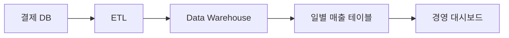
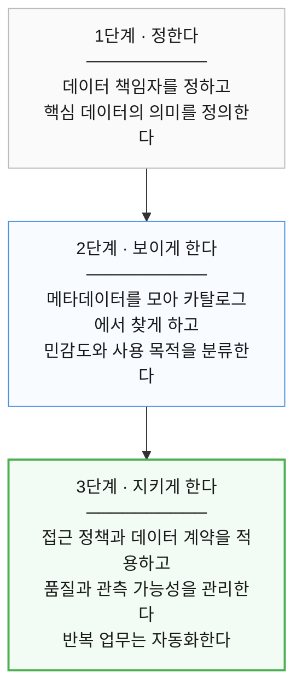

# 16장. 거버넌스

> **5부 · 신뢰** — 찾고, 믿고, 안전하게 쓰려면  
> 15장 · **16장** · 17장 · 18장

*데이터를 책임 있게 관리하고 안전하게 활용하는 법*

회사가 작을 때는 데이터 관리가 비교적 단순하다.

어떤 데이터가 필요하면  
담당 개발자에게 물어보면 된다.

```text
"회원 가입일은 어디에 있어요?"

"member 테이블의 created_at입니다."
```

문제가 생겨도 누가 만든 데이터인지  
대략 알고 있기 때문에 해결하기 쉽다.

하지만 회사가 성장하면 상황이 달라진다.

회원, 결제, 배송, 정산, 마케팅처럼  
여러 도메인이 생기고,

각 도메인마다 데이터베이스, API, 이벤트,  
데이터 파이프라인과 분석 시스템이 만들어진다.

그러면 자연스럽게 이런 질문이 생긴다.

```text
이 데이터의 정확한 의미는 무엇이지?

어느 데이터가 기준이지?

누가 이 데이터를 책임지지?

잘못됐으면 누가 고치지?

누가 접근할 수 있지?

개인정보는 어디에 저장되어 있지?

이 데이터를 다른 목적으로 써도 되나?
```

이런 문제를 조직적으로 해결하기 위한 체계가  
**데이터 거버넌스(Data Governance)** 다.

그리고 데이터의 중요도와 사용 목적에 따라  
적절한 보호 조치를 적용하는 것이  
**데이터 보안(Data Security)** 이다.

두 영역은 서로 밀접하게 연결되어 있다.

---

## 1. 데이터 거버넌스란 무엇인가

데이터 거버넌스를 어렵게 생각할 필요는 없다.

간단히 말하면,

> **데이터를 누가 책임지고,  
> 어떤 의미와 규칙에 따라  
> 관리하고 사용할지 정하는 체계다.**

예를 들어 `회원가입일`이라는 데이터가 있다고 하자.

거버넌스가 없다면 팀마다 의미가 달라질 수 있다.

| 팀 | 회원가입일의 의미 |
|---|---|
| 회원팀 | 최초 가입 완료일 |
| 마케팅팀 | 본인인증 완료일 |
| 통계팀 | 최근 재가입일 |

모두 `회원가입일`이라는 이름을 쓰는데  
실제 의미가 다르다.

이 상태에서 보고서를 만들면  
팀마다 숫자가 다르게 나온다.

거버넌스를 적용하면 다음과 같이 정리할 수 있다.

```text
데이터명
회원 가입일

정의
최초 회원가입 절차가 완료된 시각

소유자
회원 도메인

저장 위치
member.created_at

개인정보 여부
아님

주요 사용 목적
회원 가입 통계
```

즉 데이터의 의미와 책임을  
공식적으로 정의하는 것이다.

---

## 2. 좋은 거버넌스는 데이터를 막지 않는다

거버넌스라고 하면 흔히

```text
승인
통제
제한
규칙
```

을 떠올린다.

잘못 만든 거버넌스는 실제로  
업무를 느리게 만들기도 한다.

예를 들어 데이터 하나를 보기 위해


를 거쳐야 한다면  
사용자는 거버넌스를 피하려 할 것이다.

좋은 거버넌스의 목적은 그 반대다.

> **믿을 수 있는 데이터를  
> 필요한 사람이 안전하게 사용할 수 있게 만드는 것**

이 핵심이다.

따라서 좋은 거버넌스는

```text
통제
+
자율성
+
안전성
+
접근성
```

사이의 균형을 맞춰야 한다.

---

## 3. 회사가 커질수록 거버넌스가 필요한 이유

조직이 커지면 데이터의 양뿐 아니라  
데이터를 사용하는 사람과 시스템도 늘어난다.

처음에는 한두 사람이 알고 있던 지식이  
더 이상 개인의 기억만으로 관리되지 않는다.

예를 들어 `활성 사용자`라는 지표도

- **서비스팀** — 최근 7일 로그인 사용자
- **마케팅팀** — 최근 30일 활동 사용자

처럼 달라질 수 있다.

데이터가 잘못됐을 때도

```text
서비스팀 문제인가?

데이터 파이프라인 문제인가?

분석팀 문제인가?
```

를 알기 어려워진다.

개인정보나 금융정보가 포함되기 시작하면  
더 복잡해진다.

조직은 최소한 다음을 알아야 한다.

```text
어떤 데이터를 보유하는가

어디에 저장되어 있는가

왜 사용하는가

누가 책임지는가

누가 접근하는가

얼마나 보관하는가
```

이런 질문에 답할 수 있게 만드는 것이  
데이터 거버넌스의 중요한 역할이다.

---

## 4. 데이터 거버넌스와 데이터 보안

두 개념은 관련되어 있지만 동일하지 않다.

데이터 거버넌스는 주로 이런 질문을 한다.

```text
이 데이터는 무엇인가?

누가 책임지는가?

어떤 목적으로 사용하는가?

어떤 품질을 유지해야 하는가?

얼마나 보관해야 하는가?
```

데이터 보안은 이런 질문을 한다.

```text
누가 접근할 수 있는가?

어떤 작업까지 허용할 것인가?

암호화가 필요한가?

마스킹해야 하는가?

접근 기록을 남겨야 하는가?
```

쉽게 관계를 표현하면 다음과 같다.

```text
데이터 거버넌스
→ 관리 원칙과 책임을 정의

데이터 보안
→ 정책·프로세스·기술적 통제로
   데이터를 보호
```

데이터 보안은 단순히 기술만을 뜻하지 않는다.

접근 정책, 조직의 책임, 운영 절차, 감사 같은  
관리적 활동도 함께 포함한다.

---

## 5. 가장 먼저 정해야 할 것은 책임이다

거버넌스를 시작할 때  
가장 먼저 솔루션을 구매할 필요는 없다.

먼저 정해야 할 것은

> **누가 무엇을 책임지는가**

이다.

조직마다 명칭과 책임 범위는 다르지만,  
대표적으로 다음과 같은 역할을 사용한다.

| 역할 | 무엇을 책임지나 | 대표 질문 |
|---|---|---|
| 최고 데이터 책임자 (CDO) | 회사 전체의 데이터 방향 | 우리는 데이터를 어떤 원칙으로 다루는가 |
| 데이터 오너 | 특정 데이터 영역 | 이 데이터는 무엇을 뜻하는가 |
| 데이터 스튜어드 | 실무 관리 | 정의와 품질이 실제로 지켜지는가 |
| 애플리케이션 오너 | 시스템 | 이 시스템이 정상 동작하는가 |
| 데이터 사용자 · 비즈니스 사용자 | 쓰는 쪽 | 무엇이 필요한가 |
| 데이터 생성자 | 만드는 쪽 (주로 시스템) | 이 데이터는 어디서 생기는가 |

하나씩 보자.

---

## 6. 최고 데이터 책임자

CDO(Chief Data Officer)는  
조직의 전체적인 데이터 전략을 책임하는 역할이다.

조직에 따라 CDO가 없을 수도 있으며  
다른 임원이나 데이터 조직이 역할을 나눠 맡기도 한다.

주요 관심사는 다음과 같다.

```text
데이터 전략

데이터 관리 원칙

데이터 표준

거버넌스 운영 방향
```

즉 개별 테이블을 관리하기보다  
회사 전체의 데이터 방향을 결정하는 역할에 가깝다.

---

## 7. 데이터 오너

Data Owner는 특정 데이터 영역에 대한  
책임을 갖는 역할이다.

예를 들어 다음처럼 나눌 수 있다.

- **회원 데이터** — 회원 도메인
- **결제 데이터** — 커머스 도메인
- **배송 데이터** — 주문 도메인

Data Owner는 보통 다음과 같은 내용을 결정하거나  
그 결정에 대한 책임을 가진다.

```text
데이터 정의

사용 목적

품질 기준

분류 기준

접근 정책
```

Data Owner가 반드시 개발자일 필요는 없다.

데이터의 비즈니스 의미를 잘 이해하는 사람이  
오히려 적절한 경우도 많다.

---

## 8. 데이터 스튜어드

Data Steward는 쉽게 말해

> **데이터 관리 실무 담당자**

라고 이해하면 된다.

Data Owner가

```text
"이 데이터는 이런 기준으로 관리합니다."
```

라고 방향을 정한다면,

Data Steward는 실제로

```text
정의 관리

메타데이터 관리

품질 확인

표준 준수 확인
```

같은 일을 수행할 수 있다.

다만 Data Steward의 정확한 업무 범위는  
조직마다 상당히 다르다.

---

## 9. 애플리케이션 오너

Application Owner는  
데이터가 아니라 시스템을 책임한다.

예를 들어

```text
결제 API

회원 서비스

정산 시스템

배송 시스템
```

등이다.

주요 관심사는

```text
시스템 운영

유지보수

배포

장애 대응

접근 제어 구현
```

등이다.

---

## 10. Data Owner와 Application Owner의 차이

두 역할은 비슷해 보이지만  
관점이 다르다.

Data Owner는 이런 질문을 한다.

```text
결제 완료란 무엇인가?

결제 금액은 어떤 값을 의미하는가?

환불 데이터는 어떻게 정의하는가?
```

Application Owner는 이런 질문을 한다.

```text
결제 API가 정상 동작하는가?

DB 연결에 문제가 없는가?

배포가 정상적으로 이루어졌는가?

권한 검사가 제대로 동작하는가?
```

즉,

- **Data Owner** — 데이터의 의미와 책임
- **Application Owner** — 시스템의 기술적 운영

으로 이해하면 쉽다.

---

## 11. 데이터 사용자와 비즈니스 사용자

Data User는 실제로 데이터를 사용하는 사람이다.

예를 들면

```text
SQL 조회

대시보드 확인

리포트 작성

데이터 분석
```

등이다.

Business User는 비즈니스 요구를 제시하는 역할이다.

예를 들어

```text
"월별 결제 전환율을 보고 싶습니다."

"신규 가입자의 30일 유지율이 필요합니다."
```

와 같은 요구사항을 만든다.

한 사람이 두 역할을 동시에 수행할 수도 있다.

---

## 12. 데이터 생성자

Data Creator는 데이터를 만드는  
사람이나 시스템이다.

예를 들어

```text
회원가입 API

결제 시스템

관리자 입력

외부 제휴 시스템
```

등이 있다.

현대 시스템에서는 사람이 직접 만드는 것보다  
애플리케이션이 생성하는 데이터가 더 많은 경우가 일반적이다.

---

## 13. 중앙 집중과 도메인 자율성

대규모 조직에서는 중앙 데이터팀이  
모든 데이터의 비즈니스 의미를 이해하기 어렵다.

그래서 상황에 따라

- **중앙 조직** — 공통 원칙과 표준
- **각 도메인** — 자기 데이터에 대한 책임

구조를 사용할 수 있다.

특히 Data Mesh 같은 접근에서는

> **도메인 데이터 소유권과  
> 연합형 거버넌스(Federated Governance)**

를 중요한 원칙으로 본다.

하지만 모든 회사가 반드시  
이 구조를 사용해야 하는 것은 아니다.

조직 규모와 구조에 따라  
중앙 집중형 거버넌스가 더 적합할 수도 있다.

중요한 것은 구조보다

> **책임과 의사결정 권한이 명확해야 한다는 것**

이다.

---

## 14. 거버넌스 프레임워크

거버넌스 프레임워크는 쉽게 말해

> 조직이 데이터를 관리하는 전체 운영 방식

이다.

프레임워크에는 역할만 들어가는 것이 아니다.

```text
역할

책임

정책

표준

절차

가이드라인
```

등이 함께 정의되어야 한다.

예를 들어 이런 질문에 답할 수 있어야 한다.

```text
Data Owner는 무엇을 승인하는가?

품질 문제가 발생하면 누가 처리하는가?

개인정보 접근은 누가 승인하는가?

데이터 정의 변경은 어떤 절차를 따르는가?
```

---

## 15. 데이터 생명주기

데이터 거버넌스는  
데이터가 저장된 순간만 관리하지 않는다.

데이터의 전체 수명주기를 살펴본다.


회원 데이터를 예로 들면


까지 관리 대상이 될 수 있다.

---

## 16. RACI로 책임을 명확하게 하기

복잡한 업무에서는 누가 무엇을 해야 하는지  
명확하게 표현할 필요가 있다.

이때 자주 사용하는 방법 중 하나가 RACI다.

```text
R - Responsible
실제 수행자

A - Accountable
최종 책임자

C - Consulted
의견을 제공하는 사람

I - Informed
결과를 전달받는 사람
```

예를 들어 개인정보 접근 정책을 변경한다면

```text
A
Data Owner

R
Data Steward

C
보안팀 / Application Owner

I
Data User
```

처럼 정의할 수 있다.

핵심은

> **최종 책임자가 누구인지 모르는 상태를 없애는 것**

이다.

---

## 17. 거버넌스 조직의 역할

회사에 별도의 Governance Team이 있다면  
모든 데이터를 직접 관리하기보다는

전체적인 관리 체계를 운영하는 역할을 맡는다.

예를 들어

```text
정책과 표준 관리

교육

정기 리뷰

감사

성숙도 평가

개선 영역 식별
```

등이다.

쉽게 말하면

- **Data Owner** — 자기 데이터 책임
- **Governance Team** — 회사 전체의 관리 체계 책임

이다.

---

## 18. 거버넌스는 기술 프로젝트만이 아니다

회사가 거버넌스를 시작할 때 흔히

```text
데이터 카탈로그를 사자.

품질 관리 솔루션을 도입하자.

권한 관리 도구를 구축하자.
```

부터 생각한다.

하지만

```text
데이터 책임자가 없고

정의가 합의되지 않았고

조직 간 책임도 불명확하다면
```

도구만으로 해결하기 어렵다.

일반적으로는


순서로 생각하는 것이 이해하기 쉽다.

---

## 19. 데이터 카탈로그

Data Catalog는 쉽게 말하면

> **회사의 데이터 검색 시스템**

이다.

예를 들어 `결제 금액`을 검색했을 때

```text
데이터명
payment_amount

정의
실제 승인된 결제 금액

Owner
커머스 도메인

위치
payment_order.amount

개인정보 여부
아님

품질 상태
정상
```

같은 정보를 확인할 수 있다.

현대적인 카탈로그는 테이블 목록만 보여주지 않는다.  
비즈니스 용어, 소유자, 출처, 계보, 분류, 품질,  
사용 현황까지 함께 관리할 수 있다.

카탈로그를 어떻게 구축하는지는 15장에서 다뤘다.  
거버넌스에서 중요한 것은 카탈로그가  
누가 무엇을 책임지는지 드러내는 창구라는 점이다.

---

## 20. 애플리케이션 리포지터리

Application Repository는

> 조직에 어떤 애플리케이션이 존재하는지 관리하는 목록

이라고 생각하면 된다.

예를 들어

```text
Commerce API

Owner
커머스 개발팀

중요도
Critical

주요 데이터
결제 / 주문

개인정보
일부 포함
```

같은 정보를 관리할 수 있다.

데이터와 애플리케이션을 연결하면

```text
이 데이터는 어느 시스템에서 만들어졌는가?
```

도 추적하기 쉬워진다.

---

## 21. 메타데이터와 데이터 계보

메타데이터는 데이터를 설명하는 데이터다.  
컬럼 이름, 타입, 설명, 소유자, 개인정보 여부,  
생성 시스템 같은 정보가 여기에 해당한다.

데이터 계보는 데이터가 어디에서 생성되고  
어떤 변환을 거쳐 어디에서 사용되는지 추적하는 것이다.



이렇게 기록해 두면 결제 DB의 컬럼을 바꿀 때

```text
어떤 파이프라인이 영향을 받지?

어떤 리포트가 깨질 수 있지?
```

를 분석할 수 있다.

메타데이터와 계보를 어떻게 모으고 관리하는지는  
15장 「메타데이터와 데이터 지도」에서 다뤘다.

거버넌스 관점에서 기억할 것은  
이 정보가 없으면 책임도 통제도 성립하지 않는다는 점이다.

---

## 22. 데이터 계약

Data Contract는

> **데이터 제공자와 소비자 사이의 명시적인 약속**

이라고 이해하면 된다.

API Contract와 비슷한 생각이다.

예를 들어 결제 이벤트를 제공한다면

- **payment_id** — bigint / 필수
- **user_id** — bigint / 필수
- **amount** — 0 이상
- **제공 주기** — 실시간
- **변경** — 호환성에 영향을 주면 사전 협의

같은 내용을 정할 수 있다.

---

## 23. 데이터 계약에 들어갈 수 있는 내용

Data Contract의 범위에는  
하나의 국제 표준이 정해져 있는 것은 아니다.

조직이나 도구에 따라 달라진다.

기술적인 내용으로는

```text
스키마

데이터 타입

품질 기준

전송 방식

가용성

버전

변경 정책
```

등이 포함될 수 있다.

필요하다면 비즈니스나 보안 측면의

```text
사용 목적

허용된 소비자

보존 조건

개인정보 처리 조건
```

까지 포함할 수도 있다.

즉 Data Contract를  
단순한 스키마 정의서로만 볼 필요는 없다.

---

## 24. 사용 약정

Usage Agreement는

> **데이터를 어떤 목적으로 사용할 수 있는지**

를 정하는 약속이다.

예를 들어

```text
사용 목적
마케팅 분석

사용 조직
마케팅팀

외부 반출
금지

제3자 재배포
금지
```

처럼 정의할 수 있다.

중요한 것은

> 데이터를 가지고 있다는 사실과  
> 그 데이터를 어떤 목적으로든 사용할 수 있다는 것은  
> 같은 의미가 아니라는 점이다.

---

## 25. 데이터 계약을 자동 검증하기

Data Contract가 문서로만 존재하면  
실제 데이터가 계약을 지키는지 확인하기 어렵다.

그래서 계약을 검증 가능한 규칙으로 만들 수 있다.

예를 들어

- **user_id** — NULL 불가
- **amount** — 0 이상
- **created_at** — 미래 시각 불가

라고 정의했다면 데이터 파이프라인에서


과 같은 흐름을 만들 수 있다.

이런 방식은 소프트웨어의 테스트와  
CI/CD 사고방식과 비슷하다.

---

## 26. 데이터 관측 가능성

Data Observability는

> 데이터와 데이터 파이프라인의 상태를  
> 지속적으로 관찰할 수 있는 능력

을 의미한다.

서비스를 운영할 때

```text
CPU
Memory
Error
Latency
```

를 관찰하듯,

데이터에서도 대표적으로

```text
최신성(Freshness)

데이터 양(Volume)

스키마 변화

데이터 품질

데이터 흐름(Lineage)
```

같은 요소를 관찰할 수 있다.

이것들은 이해를 돕기 위한 대표적인 예이며  
공식적으로 고정된 하나의 목록은 아니다.

---

## 27. 계약과 관측 가능성

둘의 관계는 다음처럼 이해하면 쉽다.

- **Data Contract** — 정상 상태를 정의
- **Data Observability** — 실제 상태를 관찰

예를 들어 계약에

```text
5분 이내에 새로운 데이터가 도착해야 한다.
```

라고 되어 있는데,

마지막 데이터가 30분 전에 들어왔다면  
이상 상태를 감지할 수 있다.

---

## 28. 데이터 품질은 가능한 한 앞단에서 해결한다

데이터 품질 문제를 분석 시스템에서 계속 고치는 것은  
장기적으로 관리 비용을 높인다.

좋지 않은 구조는 다음과 같다.


가능하면


하는 편이 좋다.

이를 흔히

> **업스트림에서 품질 문제를 해결한다**

고 표현한다.

---

## 29. 모든 데이터에 동일한 품질 수준이 필요한 것은 아니다

데이터의 목적에 따라 요구되는 품질 수준은 다르다.

예를 들어

- **정산 금액** — 매우 높은 정확성 필요
- **추천 시스템 행동 로그** — 일부 손실을 허용할 수도 있음

처럼 다르게 판단할 수 있다.

중요한 것은

> 데이터의 비즈니스 중요도에 맞는  
> 현실적인 품질 목표를 세우는 것

이다.

---

## 30. 작게 시작해서 넓혀 간다

거버넌스를 시작하면서

```text
모든 데이터 자동 분류

모든 접근 ABAC 적용

모든 Data Contract 자동 검증

완전한 셀프서비스
```

를 한 번에 만들려고 하면  
프로젝트가 지나치게 커진다.

처음에는 회원·결제·정산처럼  
중요한 데이터 몇 개부터 시작하는 것이 좋다.

순서는 조직 상황에 따라 달라지지만  
대체로 다음 흐름이 이해하기 쉽다.



핵심은

> **작게 시작하고 반복적으로 개선하는 것**

이다.

---

## 31. 거버넌스가 사용자에게 가치를 줘야 한다

사용자 입장에서 거버넌스가

```text
승인

통제

문서 작업

규칙
```

으로만 느껴지면 정착하기 어렵다.

좋은 거버넌스는

```text
필요한 데이터를 쉽게 찾고

정확한 의미를 확인하고

믿을 수 있는지 판단하고

책임자를 쉽게 찾고

적절한 권한을 빠르게 받는 것
```

을 가능하게 해야 한다.

즉,

> **거버넌스가 업무를 방해하는 것이 아니라  
> 업무를 더 쉽게 만들어야 한다.**

---

## 32. 결국 조직 문화가 중요하다

앞에서 도구보다 역할과 책임이 먼저라고 했다.

그런데 역할을 정해 놓아도  
그 역할을 실제로 수행하지 않으면 종이에만 남는다.

결국 사람과 조직이

```text
데이터에 책임을 가지고

공통 정의를 따르고

문제를 발견하면 수정하고

도메인 간에 협력
```

해야 한다.

그래서 데이터 거버넌스는  
기술 프로젝트이면서 동시에

> **조직 변화 프로젝트**

다.

---

## 33. 리더십의 역할

거버넌스는 한 팀만의 업무가 아니다.

여러 조직의 업무 방식과 책임에 영향을 준다.

따라서 리더는

```text
왜 필요한지

어떤 원칙으로 운영할지

누가 책임지는지

조직이 어떤 가치를 얻는지
```

를 명확하게 설명해야 한다.

경영진이나 CDO, CTO, CISO 같은 역할의 지원이  
필요한 경우도 많다.

---

## 34. 16장 정리

네 가지만 기억하면 된다.

**거버넌스는 누가 어떤 기준으로 데이터를 관리할지 정하는 체계다.**  
같은 이름의 데이터가 팀마다 다른 의미를 갖는 상태를 없애는 일이다.

**도구보다 역할과 책임이 먼저다.**  
책임자가 없고 정의가 합의되지 않은 상태에서  
카탈로그를 사도 문제는 그대로 남는다.

**데이터 계약은 제공자와 소비자의 명시적인 약속이다.**  
스키마, 품질 기준, 갱신 주기, 변경 정책을 정해 두면  
문서로만 두지 않고 자동으로 검증할 수도 있다.

**좋은 거버넌스는 데이터를 막지 않는다.**  
믿을 수 있는 데이터를 필요한 사람이  
안전하게 쓸 수 있게 만드는 것이 목적이다.

다음 장에서는 이 정보를 바탕으로  
데이터를 실제로 지키는 방법을 본다.
