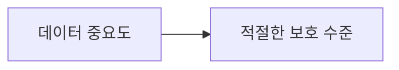
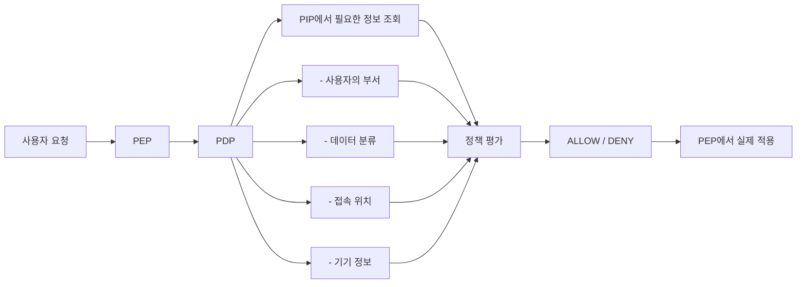
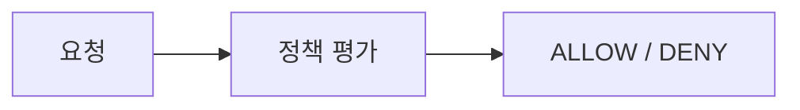
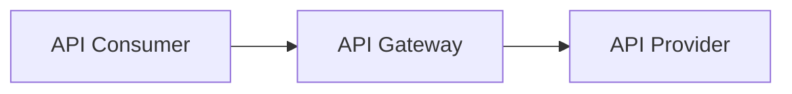
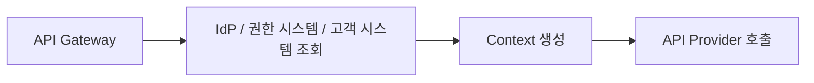
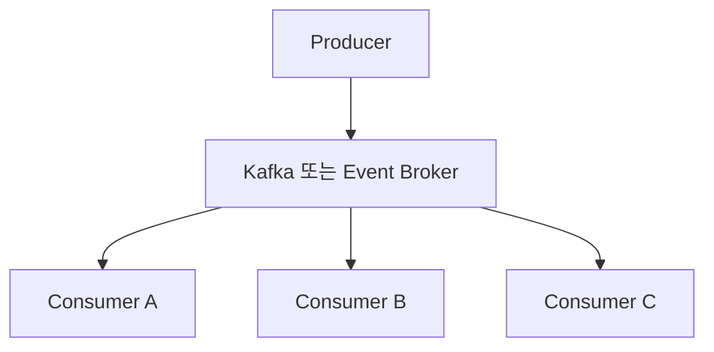
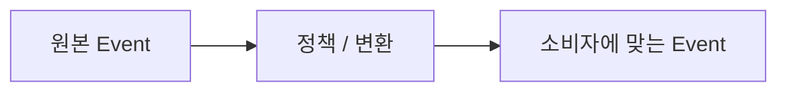

# 17장. 보안과 접근 제어

> **5부 · 신뢰** — 찾고, 믿고, 안전하게 쓰려면  
> 15장 · 16장 · **17장** · 18장

분석용으로 복사해 둔 테이블을 열어 봤다.

운영 DB에서 그대로 떠온 탓에  
전화번호와 이메일이 마스킹 없이 들어 있었다.

누가 이 테이블을 조회할 수 있는지도  
정리된 적이 없다.

16장에서 누가 무엇을 책임지는지 정했다.

그 정보가 있어야 보호도 할 수 있다.

이 장에서는 데이터를 실제로 지키는 방법을 다룬다.

분류와 라벨, 접근 제어 모델, 행과 열 단위 통제,  
그리고 API와 이벤트 각각의 보안이다.

---

## 1. 데이터 보안

이제 거버넌스를 통해

```text
데이터가 무엇인지

누가 책임지는지

얼마나 중요한지

왜 사용하는지
```

알게 되었다.

이 정보를 바탕으로  
실제 보호 조치를 적용할 수 있다.

보호 대상은 다양하다.

```text
개인정보

금융정보

건강정보

기업 기밀

지적재산
```

등이 있다.

---

## 2. 데이터 중심 보안

기존 보안은 주로

```text
네트워크

서버

애플리케이션

방화벽
```

같은 시스템 경계를 보호하는 데 집중했다.

하지만 현대 시스템에서 데이터는

```text
DB
S3
Kafka
DW
API
SaaS
```

등 여러 환경으로 이동한다.

그래서 데이터가 어디에 있든  
데이터 자체의 중요도를 기준으로 보호하는

**Data-Centric Security**

관점이 중요해졌다.

---

## 3. 신뢰 경계

Trust Boundary는

> 같은 신뢰 수준과 보안 규칙이 적용되는 영역의 경계

라고 이해하면 된다.

예를 들어 커머스 도메인 내부에서 사용되던 데이터가


으로 전달되는 순간,

사용 목적과 사용자가 달라질 수 있다.

따라서 경계를 넘을 때는

```text
누가 사용하는가?

어떤 목적인가?

어떤 데이터가 필요한가?

민감한 정보가 포함되어 있는가?
```

를 다시 확인할 필요가 있다.

---

## 4. 데이터 분류

Data Classification은

> 데이터의 중요도와 민감도를 구분하는 것

이다.

예를 들어 조직에서 다음과 같이 정할 수 있다.

```text
Public
공개 가능

General
일반 내부 데이터

Confidential
기밀

Highly Confidential
매우 민감한 데이터
```

명칭과 단계는 회사마다 달라질 수 있다.

---

## 5. 분류가 필요한 이유

회사 홈페이지의 공개 공지와  
고객의 신용카드 정보를

같은 수준으로 보호할 필요는 없다.

- **공개 정보** — 낮은 보호 수준
- **신용카드 정보** — 높은 보호 수준

즉,



을 결정하기 위해 분류가 필요하다.

---

## 6. 데이터 라벨

분류 결과를 실제 데이터에 표시하는 것을  
라벨링이라고 생각할 수 있다.

예를 들어

```text
credit_card_number

Classification
→ Highly Confidential
```

이라는 메타데이터를 붙인다.

시스템은 이 라벨을 보고

```text
마스킹

암호화

접근 제한

감사 강화
```

같은 정책을 적용할 수 있다.

---

## 7. 데이터 사용 목적도 분류할 수 있다

데이터 자체의 민감도뿐 아니라  
어떤 목적으로 사용되는지도 분류할 수 있다.

예를 들어

- **DATA_SCIENCE** — 분석과 연구
- **AD_HOC_USAGE** — 일회성 분석
- **HR_ONLY** — 인사 업무
- **FINANCIAL_REPORTING** — 재무 보고
- **DQ_INVESTIGATION** — 데이터 품질 조사

처럼 정의할 수 있다.

따라서 같은 데이터라도

```text
HR 업무에는 허용

마케팅에는 금지
```

처럼 다른 정책을 적용할 수 있다.

---

## 8. 접근 제어

Access Control은

> 누가 어떤 데이터에  
> 어떤 행동을 할 수 있는지 결정하는 것

이다.

대표적으로

```text
ACL

RBAC

ABAC
```

같은 모델이 있다.

---

## 9. ACL

ACL은 Access Control List의 약자다.

대상마다

> 누가 무엇을 할 수 있는가

를 목록으로 관리한다.

예를 들어

```text
문서 A

사용자 A
→ 읽기

사용자 B
→ 읽기 / 쓰기

사용자 C
→ 접근 불가
```

와 같은 방식이다.

세밀하게 설정할 수 있지만  
사용자와 대상이 많아지면 관리가 복잡해질 수 있다.

---

## 10. RBAC

RBAC는 Role-Based Access Control이다.

사용자 개인에게 직접 권한을 주기보다  
역할(Role)에 권한을 부여한다.


예를 들어

- **HR** — 직원 정보 조회
- **Finance** — 재무 데이터 조회
- **Developer** — 개발 환경 접근

처럼 정의한다.

기업 시스템에서 널리 사용되는 접근 방식이다.

---

## 11. RBAC의 한계

조직이 커지면 역할이 지나치게 많아질 수 있다.

```text
HR

HR 관리자

HR 조회 전용

서울 HR

부산 HR

채용 HR
```

처럼 역할을 계속 만들게 된다.

이를 **Role Explosion** 문제라고 한다.

또한 RBAC만으로는

```text
접속 시간

접속 위치

사용 기기

데이터 민감도
```

같은 동적인 조건을 표현하기 불편할 수 있다.

---

## 12. ABAC

ABAC는 Attribute-Based Access Control이다.

역할 하나만 보는 것이 아니라  
여러 속성을 조합해서 접근 여부를 판단한다.

예를 들어

```text
사용자 부서 = HR

AND

데이터 분류 = Confidential

AND

관리되는 회사 기기 = true
```

이면 접근을 허용하는 식이다.

NIST가 설명하는 ABAC 역시  
Subject, Object, Action, Environment 등의 속성과  
정책을 기반으로 접근 결정을 내리는 방식이다.

---

## 13. PAP, PDP, PIP, PEP

여기에서 하나 주의할 점이 있다.

PAP, PDP, PIP, PEP는  
ABAC 자체의 필수 요소라고 보기보다는,

**XACML 계열을 포함한 정책 기반 접근 제어 아키텍처에서  
널리 사용하는 역할 구분**이라고 이해하는 것이 정확하다.

대표적으로 다음 역할을 가진다.

### PAP

Policy Administration Point

```text
정책을 작성하고 관리
```

### PDP

Policy Decision Point

```text
정책을 평가하고
ALLOW / DENY 결정
```

### PIP

Policy Information Point

```text
판단에 필요한 속성 정보 제공
```

### PEP

Policy Enforcement Point

```text
결정 결과를 실제 시스템에 적용
```

---

## 14. 정책 기반 접근 제어의 흐름

예를 들어 사용자가 민감한 HR 데이터를 요청한다고 하자.



이런 방식으로 접근을 제어할 수 있다.

---

## 15. 신원 제공자

RBAC나 ABAC를 사용하려면 먼저

> **이 사용자가 누구인가**

를 알아야 한다.

이 역할을 수행하는 시스템을  
Identity Provider(IdP)라고 부른다.

IdP는 보통

```text
사용자 ID

부서

직급

그룹

역할
```

등의 신원 정보를 제공할 수 있다.

---

## 16. SSO, SAML, OAuth, OpenID Connect

SSO는 Single Sign-On이다.

한 번 인증한 사용자가  
여러 서비스에서 다시 로그인하지 않도록 해준다.

기업 환경에서 SAML을 사용하는 경우가 많고,  
현대적인 웹과 모바일 환경에서는  
OpenID Connect도 널리 사용된다.

특히 OAuth와 OpenID Connect의 차이는  
정확하게 이해할 필요가 있다.

```text
OAuth 2.0
→ 클라이언트가 보호된 리소스에
   제한된 접근 권한을 얻기 위한
   권한 부여 프레임워크

OpenID Connect
→ OAuth 2.0 위에
   사용자 인증과 신원 정보를 추가
```

따라서

```text
OAuth = 로그인 기술
```

이라고만 이해하면 부정확하다.

---

## 17. 정책을 중앙에서 관리하기

서비스마다 이런 코드를 반복해서 작성하면

```text
if user.role == ...
if department == ...
if purpose == ...
```

규칙이 여러 곳에 흩어질 수 있다.

상황에 따라 정책을 별도로 관리하고



하도록 만들 수 있다.

이때 데이터 카탈로그의 분류 정보나  
Data Contract의 사용 목적도 정책 판단의 재료가 될 수 있다.

---

## 18. 데이터 제품과 보안

Data Product가 여러 개 존재한다면  
각 데이터 제품마다

```text
보안

품질

메타데이터

관측 가능성
```

을 관리해야 한다.

공통 기능을 데이터 제품 본체에 모두 넣는 대신  
별도의 공통 컴포넌트나 사이드카 형태로  
분리하는 아키텍처도 사용할 수 있다.

다만 사이드카는 하나의 구현 패턴이지  
반드시 사용해야 하는 표준은 아니다.

---

## 19. 소비자마다 다른 데이터를 보여주기

같은 데이터셋이라고 해서  
모든 사용자에게 모든 컬럼을 보여줄 필요는 없다.

예를 들어 고객 데이터가

```text
이름

이메일

전화번호

주소

결제정보
```

를 가지고 있다고 하자.

마케팅팀에는

```text
이름

이메일

지역
```

정도만 제공하고,

정산팀에는

```text
회원 ID

결제 관련 정보
```

만 제공할 수 있다.

---

## 20. 데이터를 보호하는 방법

상황에 따라 다양한 기법을 사용할 수 있다.

- **Filtering** — 필요 없는 데이터 제외
- **Masking** — 민감한 값을 일부 숨김
- **Tokenization** — 실제 값을 다른 토큰으로 치환
- **De-identification** — 개인을 직접 식별하기 어렵게 처리

각 방식의 법적·보안적 효과는 다를 수 있으므로  
사용 목적에 맞는 방법을 선택해야 한다.

---

## 21. Row-Level Security

RLS는 행 단위 접근 제어다.

예를 들어 영업 담당자가

```sql
SELECT *
FROM sales;
```

를 실행해도,

실제 결과는 해당 담당 지역 데이터만  
보이도록 제한할 수 있다.

개념적으로는

- **사용자 A** — 부산 지역 데이터만
- **사용자 B** — 서울 지역 데이터만

처럼 동작한다.

---

## 22. Column-Level Security

CLS는 컬럼 단위 접근 제어다.

예를 들어

```text
user_id
nickname
phone
resident_number
```

가 있을 때,

일반 직원에게는

```text
user_id
nickname
```

만 보이고,

민감한 컬럼은 숨길 수 있다.

---

## 23. 도메인 내부와 도메인 간 보안

상황에 따라 도메인 내부 보안과  
도메인 간 보안을 다르게 설계할 수 있다.

도메인 내부에서는

```text
개발자
운영자
관리자
```

처럼 세밀한 권한을 관리한다.

반면


처럼 도메인 경계를 넘는 데이터 공유에는

```text
Data Contract

Usage Agreement

공통 보안 정책
```

같은 좀 더 명시적인 약속을 적용할 수 있다.

---

## 24. API 기반 아키텍처의 보안

API 환경에서는 보통



구조를 볼 수 있다.

API Gateway는 상황에 따라

```text
인증

Access Token 검증

Rate Limit

접근 정책 적용

감사 로그
```

등을 담당할 수 있다.

이 경우 API Gateway가  
정책 집행점인 PEP 역할을 할 수도 있다.

---

## 25. 인증과 권한은 다르다

Authentication은

> **누구인가?**

를 확인한다.

Authorization은

> **무엇을 할 수 있는가?**

를 결정한다.

따라서

```text
로그인 성공
```

했다고 해서

```text
모든 데이터 접근 가능
```

이라는 뜻은 아니다.

---

## 26. Security Context

API에서는 사용자 ID와 역할만으로  
권한 판단이 부족할 수 있다.

예를 들어 주문 API라면

```text
user_id

role

customer_id

department

delegation

purpose
```

같은 추가적인 정보가 필요할 수 있다.

이런 정보를 보안 컨텍스트로 전달하거나  
정책 판단 시 조회할 수 있다.

---

## 27. 보안 Context를 어디에서 얻을 것인가

Gateway가 정보를 모아서 전달할 수도 있다.



반대로 API Provider가  
필요한 정보를 직접 조회할 수도 있다.

두 방식 모두 장단점이 있다.

Gateway가 모든 것을 처리하면  
공통화하기 쉽지만 Gateway가 복잡해질 수 있다.

Provider가 직접 조회하면  
도메인에 맞는 최신 판단을 하기 좋지만  
추가 API 호출이 늘어날 수 있다.

---

## 28. 이벤트 기반 아키텍처의 보안

이벤트 기반에서는 보안이 조금 더 복잡하다.



하나의 이벤트가 여러 소비자에게  
전달될 수 있기 때문이다.

---

## 29. Kafka의 권한 제어를 이해할 때 주의할 점

Apache Kafka는 기본적으로  
리소스 단위의 ACL 기반 권한 제어를 제공할 수 있다.

Kafka 생태계의 상용 플랫폼이나  
추가 제품에서는 RBAC 같은 기능도 제공할 수 있다.

따라서

```text
Kafka는 RBAC만 지원한다.
```

라고 이해하면 부정확하다.

더 중요한 점은 Topic에 접근할 수 있다고 해서

```text
특정 필드만 보여주기

개인정보만 마스킹하기

사용 목적별 메시지 필터링
```

같은 세밀한 데이터 수준의 정책까지  
자동으로 해결되는 것은 아니라는 것이다.

필요하다면 별도의 처리 계층을 사용해야 한다.

---

## 30. 소비자별 이벤트를 만들 수도 있다

예를 들어 원본 고객 이벤트가

```text
user_id

email

purchase_amount
```

를 포함한다고 하자.

마케팅 소비자에는

```text
email
purchase_amount
```

를 제공하고,

통계 소비자에는

```text
익명 user_id
purchase_amount
```

만 제공할 수도 있다.

즉,



형태다.

다만 소비자별 이벤트가 늘어나면  
운영 복잡도도 함께 증가한다.

---

## 31. 데이터를 결합하면 보안 책임도 따라온다

예를 들어

```text
회원 데이터
Confidential

+

결제 데이터
Highly Confidential
```

를 합쳐 새로운 데이터 제품을 만들었다고 하자.

새로운 데이터라고 해서  
기존 데이터의 민감도가 사라지는 것은 아니다.

따라서 데이터가 변환되거나 결합되더라도

```text
출처

분류

소유권

사용 제한
```

같은 정보를 추적할 필요가 있다.

이 때문에 메타데이터와 Lineage가 중요하다.

---

## 32. 개인정보와 데이터 윤리

데이터가 많아지고  
여러 곳으로 복제될수록  
개인정보 보호도 어려워진다.

```text
운영 DB

Kafka

S3

Data Warehouse

Feature Store

ML Dataset
```

사용자가 개인정보 삭제를 요청했는데  
운영 DB만 삭제했다고 끝나는 문제가 아닐 수 있다.

어떤 데이터가 어디에 존재하고  
어디까지 전달되었는지 알아야 한다.

AI 활용이 증가하면서  
질문은 더욱 넓어진다.

```text
어떤 데이터를 수집했는가?

왜 수집했는가?

어떤 데이터와 결합했는가?

AI 모델에서 어떻게 사용했는가?

모델의 결과가 사람에게 어떤 영향을 미치는가?
```

데이터의 정확성뿐 아니라  
데이터 사용 방식의 적절성도 중요해지는 것이다.

현대의 데이터 거버넌스는  
품질과 보안을 넘어

개인정보, 윤리, 투명성, 규제 준수까지  
함께 고려해야 한다.

---

## 33. 거버넌스와 보안 전체 흐름

이번 장을 하나의 흐름으로 연결하면 다음과 같다.

```text
데이터 소유권
↓
데이터 정의
↓
메타데이터
↓
Data Catalog / Lineage
↓
Data Contract
↓
데이터 분류와 사용 목적
↓
보안 정책
↓
ACL / RBAC / ABAC
↓
Filtering / Masking / RLS / CLS
↓
API / Event / Data Product
↓
품질 / Observability / 감사
```

앞부분에서는

> **누가 데이터를 책임지는가**

를 배웠다.

중간에서는

> **데이터가 무엇인지 어떻게 설명하고  
> 제공자와 소비자 사이의 약속을 어떻게 관리하는가**

를 살펴봤다.

후반부에서는

> **그 정보와 정책을 실제 시스템의 보안으로  
> 어떻게 연결하는가**

를 살펴봤다.

---

## 34. 핵심 용어 정리

이 장에서 나온 용어는 부록 C 「용어집」의
「보안」 항목에 정리해 두었다.

---

## 35. 17장 정리

데이터 보안을 제대로 하려면  
먼저 데이터를 이해해야 한다.

```text
이 데이터가 무엇인가?

누가 책임지는가?

어디에서 만들어졌는가?

누가 사용하는가?

왜 사용하는가?

얼마나 민감한가?
```

이 질문에 답할 수 있게 만드는 것이  
데이터 거버넌스다.

그리고 그 정보를 이용해

```text
접근 제어

암호화

마스킹

필터링

모니터링

감사
```

등을 적용하는 것이 데이터 보안이다.

따라서 두 영역은 서로 떨어져 있지 않다.

> **데이터 거버넌스는 데이터를 올바르게 이해하고  
> 책임 있게 관리하기 위한 체계이고,  
> 데이터 보안은 그 데이터의 위험과 사용 목적에 맞춰  
> 적절하게 보호하는 체계다.**

마지막으로 이 장에서 가장 기억해야 할 것은  
거버넌스의 목적이 데이터를 막는 데 있지 않다는 점이다.

> **좋은 데이터 거버넌스와 보안의 목적은  
> 믿을 수 있는 데이터를, 필요한 사람이,  
> 허용된 목적과 범위 안에서  
> 안전하고 편리하게 사용할 수 있도록 만드는 것이다.**
