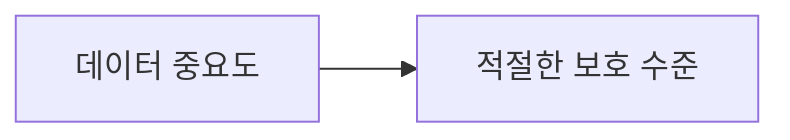
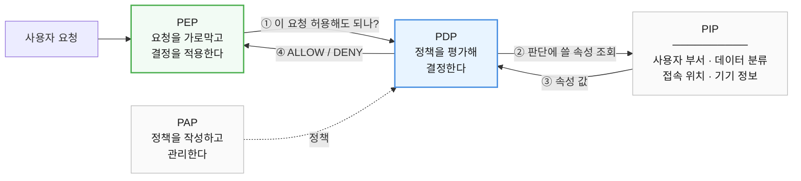
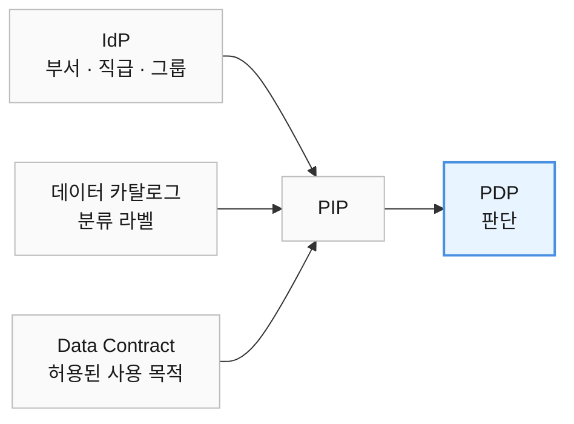
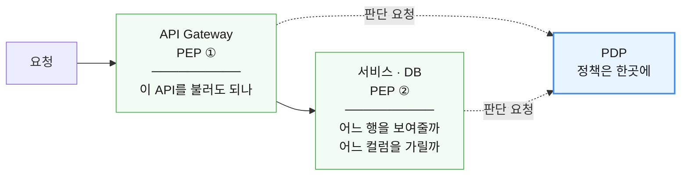
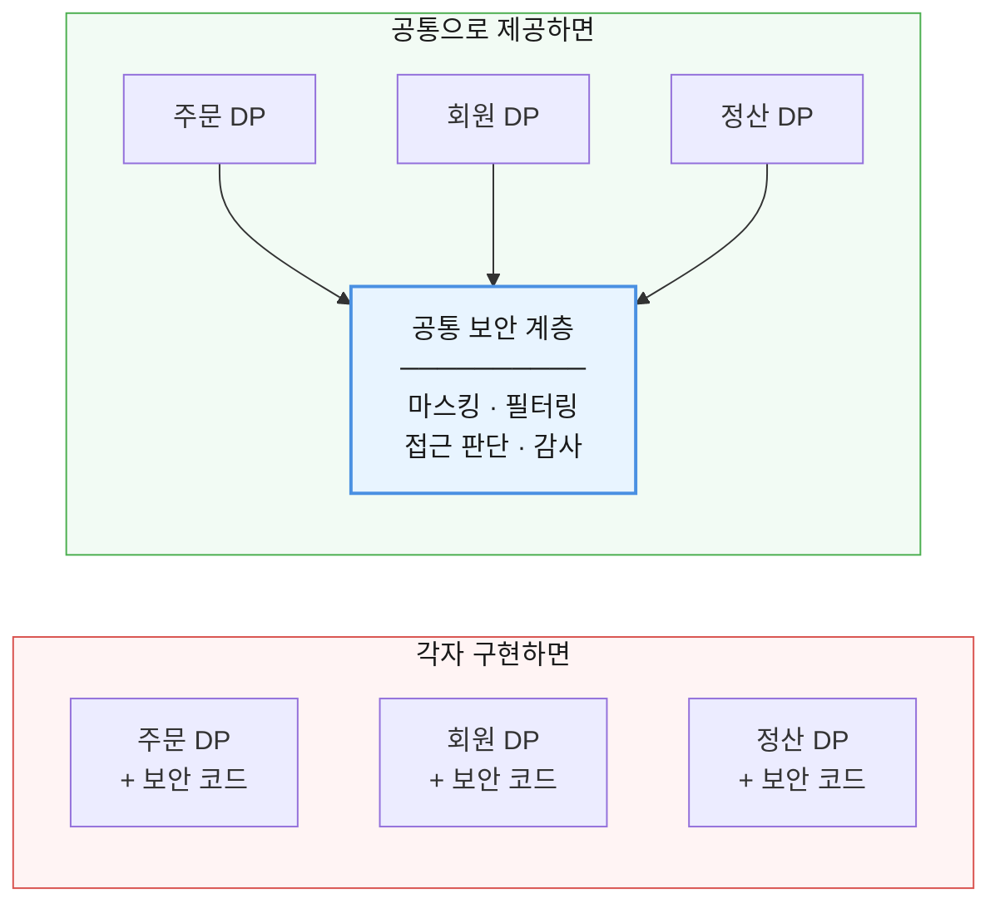
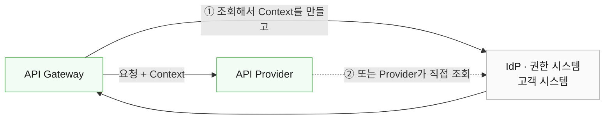
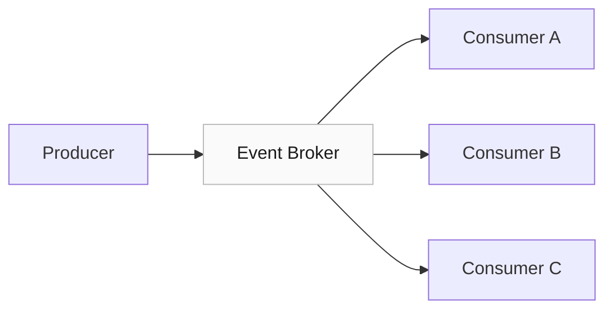
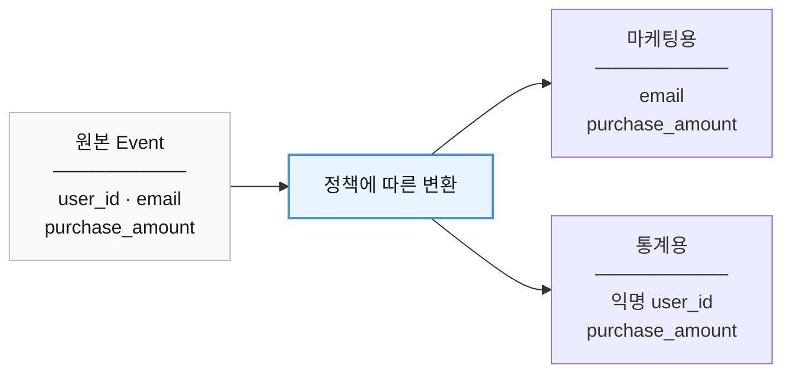
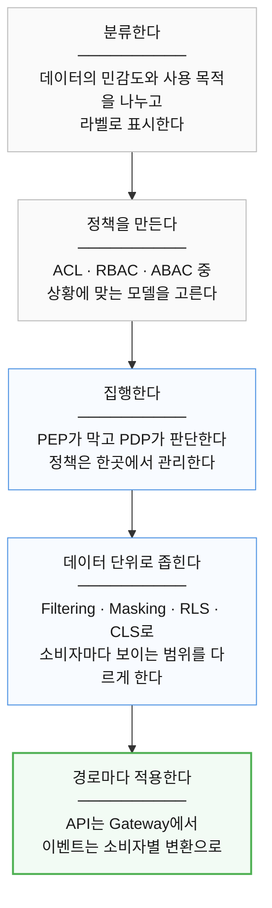

# 17장. 보안과 접근 제어

> **5부 · 신뢰** — 찾고, 믿고, 안전하게 쓰려면  
> 15장 · 16장 · **17장** · 18장

분석용으로 복사해 둔 테이블을 열어 봤다.

운영 DB에서 그대로 떠온 탓에  
전화번호와 이메일이 마스킹 없이 들어 있었다.

누가 이 테이블을 조회할 수 있는지도  
정리된 적이 없다.

16장에서 누가 무엇을 책임지는지 정했다.

그 정보가 있어야 보호도 할 수 있다.

이 장에서는 데이터를 실제로 지키는 방법을 다룬다.

분류와 라벨, 접근 제어 모델, 행과 열 단위 통제,  
그리고 API와 이벤트 각각의 보안이다.

---

## 1. 데이터 보안

이제 거버넌스를 통해

```text
데이터가 무엇인지

누가 책임지는지

얼마나 중요한지

왜 사용하는지
```

알게 되었다.

이 정보를 바탕으로  
실제 보호 조치를 적용할 수 있다.

보호 대상은 다양하다.

```text
개인정보

금융정보

건강정보

기업 기밀

지적재산
```

등이 있다.

---

## 2. 데이터 중심 보안

기존 보안은 주로

```text
네트워크

서버

애플리케이션

방화벽
```

같은 시스템 경계를 보호하는 데 집중했다.

하지만 현대 시스템에서 데이터는

```text
DB
S3
Kafka
DW
API
SaaS
```

등 여러 환경으로 이동한다.

그래서 데이터가 어디에 있든  
데이터 자체의 중요도를 기준으로 보호하는

**Data-Centric Security**

관점이 중요해졌다.

---

## 3. 신뢰 경계

Trust Boundary는

> 같은 신뢰 수준과 보안 규칙이 적용되는 영역의 경계

라고 이해하면 된다.

예를 들어 커머스 도메인 내부에서 사용되던 데이터가


으로 전달되는 순간,

사용 목적과 사용자가 달라질 수 있다.

따라서 경계를 넘을 때는

```text
누가 사용하는가?

어떤 목적인가?

어떤 데이터가 필요한가?

민감한 정보가 포함되어 있는가?
```

를 다시 확인할 필요가 있다.

---

## 4. 데이터 분류

Data Classification은

> 데이터의 중요도와 민감도를 구분하는 것

이다.

예를 들어 조직에서 다음과 같이 정할 수 있다.

```text
Public
공개 가능

General
일반 내부 데이터

Confidential
기밀

Highly Confidential
매우 민감한 데이터
```

명칭과 단계는 회사마다 달라질 수 있다.

---

## 5. 분류가 필요한 이유

회사 홈페이지의 공개 공지와  
고객의 신용카드 정보를

같은 수준으로 보호할 필요는 없다.

- **공개 정보** — 낮은 보호 수준
- **신용카드 정보** — 높은 보호 수준

즉,



을 결정하기 위해 분류가 필요하다.

---

## 6. 데이터 라벨

분류 결과를 실제 데이터에 표시하는 것을  
라벨링이라고 생각할 수 있다.

예를 들어

```text
credit_card_number

Classification
→ Highly Confidential
```

이라는 메타데이터를 붙인다.

시스템은 이 라벨을 보고

```text
마스킹

암호화

접근 제한

감사 강화
```

같은 정책을 적용할 수 있다.

---

## 7. 데이터 사용 목적도 분류할 수 있다

데이터 자체의 민감도뿐 아니라  
어떤 목적으로 사용되는지도 분류할 수 있다.

예를 들어

- **DATA_SCIENCE** — 분석과 연구
- **AD_HOC_USAGE** — 일회성 분석
- **HR_ONLY** — 인사 업무
- **FINANCIAL_REPORTING** — 재무 보고
- **DQ_INVESTIGATION** — 데이터 품질 조사

처럼 정의할 수 있다.

따라서 같은 데이터라도

```text
HR 업무에는 허용

마케팅에는 금지
```

처럼 다른 정책을 적용할 수 있다.

---

## 8. 인증과 권한은 다르다

무엇을 얼마나 지켜야 하는지는 정했다.  
다음은 누구에게 열어 줄 것인가다.

그 전에 자주 섞여 쓰이는 두 낱말부터 구분하자.

Authentication은

> **누구인가?**

를 확인한다.

Authorization은

> **무엇을 할 수 있는가?**

를 결정한다.

따라서

```text
로그인 성공
```

했다고 해서

```text
모든 데이터 접근 가능
```

이라는 뜻은 아니다.

---

## 9. 접근 제어

Access Control은

> 누가 어떤 데이터에  
> 어떤 행동을 할 수 있는지 결정하는 것

이다.

대표적으로

```text
ACL

RBAC

ABAC
```

같은 모델이 있다.

---

## 10. ACL

ACL은 Access Control List의 약자다.

대상마다

> 누가 무엇을 할 수 있는가

를 목록으로 관리한다.

예를 들어

```text
문서 A

사용자 A
→ 읽기

사용자 B
→ 읽기 / 쓰기

사용자 C
→ 접근 불가
```

와 같은 방식이다.

세밀하게 설정할 수 있지만  
사용자와 대상이 많아지면 관리가 복잡해질 수 있다.

---

## 11. RBAC

RBAC는 Role-Based Access Control이다.

사용자 개인에게 직접 권한을 주기보다  
역할(Role)에 권한을 부여한다.


예를 들어

- **HR** — 직원 정보 조회
- **Finance** — 재무 데이터 조회
- **Developer** — 개발 환경 접근

처럼 정의한다.

기업 시스템에서 널리 사용되는 접근 방식이다.

---

## 12. RBAC의 한계

조직이 커지면 역할이 지나치게 많아질 수 있다.

```text
HR

HR 관리자

HR 조회 전용

서울 HR

부산 HR

채용 HR
```

처럼 역할을 계속 만들게 된다.

이를 **Role Explosion** 문제라고 한다.

또한 RBAC만으로는

```text
접속 시간

접속 위치

사용 기기

데이터 민감도
```

같은 동적인 조건을 표현하기 불편할 수 있다.

---

## 13. ABAC

ABAC는 Attribute-Based Access Control이다.

역할 하나만 보는 것이 아니라  
여러 속성을 조합해서 접근 여부를 판단한다.

예를 들어

```text
사용자 부서 = HR

AND

데이터 분류 = Confidential

AND

관리되는 회사 기기 = true
```

이면 접근을 허용하는 식이다.

NIST가 설명하는 ABAC 역시  
Subject, Object, Action, Environment 등의 속성과  
정책을 기반으로 접근 결정을 내리는 방식이다.

---

## 14. 정책을 누가 정하고, 누가 판단하고, 누가 막는가

ABAC처럼 조건이 여러 개가 되면 규칙 자체가 복잡해진다.

그 규칙을 서비스 코드 안에 직접 박아 두면  
같은 규칙이 여러 곳에 흩어지고, 바꿀 때마다 전부 찾아다녀야 한다.

그래서 보통 세 가지 일을 서로 다른 자리에 맡긴다.

- 규칙을 **정하는** 자리
- 규칙으로 **판단하는** 자리
- 판단 결과를 **집행하는** 자리

사용자가 민감한 HR 데이터를 요청했다고 하자.  
요청 하나가 이렇게 흘러간다.



네 자리에는 각각 이름이 붙어 있다.

| 이름 | 하는 일 | 실제로는 이런 것 |
|---|---|---|
| **PEP** (Policy Enforcement Point) | 요청을 가로막고 결정을 적용한다 | API Gateway, DB 프록시 |
| **PDP** (Policy Decision Point) | 정책을 평가해 ALLOW / DENY를 낸다 | 정책 엔진 |
| **PIP** (Policy Information Point) | 판단에 필요한 속성을 제공한다 | IdP, 데이터 카탈로그 |
| **PAP** (Policy Administration Point) | 정책을 작성하고 관리한다 | 정책 관리 콘솔 |

### 판단 재료는 어디에서 오는가

PIP가 가져오는 속성은 사용자 쪽에만 있는 것이 아니다.

앞에서 데이터에 붙여 둔 분류 라벨과  
16장에서 본 Data Contract의 사용 목적도  
그대로 판단 재료가 된다.



그래서 데이터를 분류해 두는 일이 문서 작업으로 끝나지 않는다.  
**분류가 곧 정책의 입력이 된다.**

### 그럼 게이트웨이에서 다 막으면 되지 않나

자연스럽게 드는 생각이다.  
서비스마다 조건문을 쓰지 말고 API Gateway 한곳에서 검사하면 되지 않을까.

절반은 맞다. Gateway는 대표적인 PEP다.

다만 두 가지를 구분해야 한다.

**첫째, 막는 자리를 옮기는 것과 규칙을 한곳에 두는 것은 다른 문제다.**

조건문을 각 서비스에서 Gateway로 옮기기만 하면  
규칙은 여전히 코드 안에 있다.  
흩어져 있던 것이 한 덩어리가 됐을 뿐,  
정책을 바꿀 때마다 Gateway를 고쳐서 배포해야 한다.

PDP를 따로 두는 이유가 여기에 있다.  
규칙을 **코드가 아니라 정책 데이터로** 관리하면  
막는 쪽을 건드리지 않고 규칙만 바꿀 수 있다.

**둘째, Gateway가 판단할 수 없는 것이 있다.**

`GET /orders`를 호출해도 되는지는 Gateway가 판단할 수 있다.

하지만 그 결과에서

```text
어느 행을 보여줄 것인가
전화번호 컬럼을 가릴 것인가
```

는 데이터가 있는 곳에서만 정할 수 있다.  
Gateway는 아직 결과를 보지 못했기 때문이다.

그래서 PEP는 보통 한 군데가 아니다.



행과 열 단위로 좁히는 방법은 이 장 뒤쪽에서 따로 다룬다.

---

### 이름보다 중요한 것

중요한 것은 약어가 아니라 **역할이 나뉘어 있다**는 점이다.

막는 쪽(PEP)과 판단하는 쪽(PDP)이 분리되어 있으므로  
정책이 바뀌어도 각 서비스의 코드를 고칠 필요가 없다.

한 가지 덧붙이면, 이 네 이름은  
ABAC의 필수 구성요소는 아니다.

XACML 계열을 포함한 정책 기반 접근 제어 아키텍처에서  
널리 쓰이는 역할 구분이라고 이해하는 편이 정확하다.

---

## 15. 이 사용자가 누구인지 어떻게 아는가

RBAC든 ABAC든 판단의 출발점은 같다.

> **이 사용자가 누구인가**

이걸 모르면 역할도 속성도 확인할 수 없다.

이 일을 맡는 시스템을 **Identity Provider(IdP)** 라고 부른다.

IdP는 보통 다음과 같은 신원 정보를 제공한다.

```text
사용자 ID
부서
직급
그룹
역할
```

앞 절에서 PDP가 판단에 쓰려고 PIP에 조회하던 사용자 속성이  
대개 여기에서 온다.

### 서비스마다 로그인하게 할 수는 없다

회사에 서비스가 열 개라고 해서  
사용자를 열 번 로그인시킬 수는 없다.

한 번 인증한 사용자가 여러 서비스를 그대로 쓰게 해주는 것이  
**SSO(Single Sign-On)** 다.

SSO를 실제로 구현하는 규약은 여러 가지다.

| 규약 | 주로 쓰이는 곳 |
|---|---|
| SAML | 기업 내부 시스템 |
| OpenID Connect | 웹과 모바일 |

### OAuth와 OpenID Connect는 다르다

이 둘은 자주 섞여 쓰이는데 하는 일이 다르다.

| | 무엇을 하는가 |
|---|---|
| **OAuth 2.0** | 클라이언트가 보호된 리소스에 제한된 접근 권한을 얻기 위한 **권한 부여** 프레임워크 |
| **OpenID Connect** | OAuth 2.0 위에 **사용자 인증**과 신원 정보를 얹은 것 |

즉 OAuth 자체는 "이 사용자가 누구인가"에 답하는 기술이 아니다.

```text
OAuth = 로그인 기술
```

이라고만 이해하면 부정확하다.

앞에서 본 인증과 권한의 구분이 여기에도 그대로 적용된다.

---

## 16. 데이터 제품마다 보안을 새로 만들 것인가

앞에서 PEP가 한 군데가 아니라고 했다.

데이터 프로덕트에서도 같은 문제가 생긴다.

주문·회원·정산 데이터 프로덕트가 각각 있다면  
셋 모두 누가 어디까지 볼 수 있는지 판단하고 적용해야 한다.

이걸 데이터 프로덕트마다 직접 구현하면  
프로덕트가 열 개일 때 보안 코드도 열 벌이 된다.

비용도 문제지만 더 큰 문제가 있다.  
팀마다 마스킹 방식이 달라지고 감사 로그 형식도 달라진다.  
어디가 어떻게 막혀 있는지 아무도 전체를 알지 못하게 된다.

그래서 보안을 데이터 프로덕트 본체에서 떼어낸다.



떼어내는 방법은 여러 가지다.

- 플랫폼이 제공하는 공통 컴포넌트를 거쳐 데이터를 내보낸다
- 데이터 프로덕트 옆에 보안 처리를 맡는 별도 프로세스를 붙인다 (**사이드카**)
- 저장소 자체의 행·열 단위 통제 기능을 쓴다

사이드카는 그중 한 가지 구현 패턴이지  
반드시 써야 하는 표준은 아니다.

14장에서 본 셀프서비스 플랫폼과 같은 생각이다.  
플랫폼이 보안을 기본으로 딸려 보내면  
각 도메인이 애써 지키지 않아도 지켜진다.

---

## 17. 소비자마다 다른 데이터를 보여주기

같은 데이터셋이라고 해서  
모든 사용자에게 모든 컬럼을 보여줄 필요는 없다.

예를 들어 고객 데이터가

```text
이름

이메일

전화번호

주소

결제정보
```

를 가지고 있다고 하자.

마케팅팀에는

```text
이름

이메일

지역
```

정도만 제공하고,

정산팀에는

```text
회원 ID

결제 관련 정보
```

만 제공할 수 있다.

---

## 18. 데이터를 보호하는 방법

상황에 따라 다양한 기법을 사용할 수 있다.

- **Filtering** — 필요 없는 데이터 제외
- **Masking** — 민감한 값을 일부 숨김
- **Tokenization** — 실제 값을 다른 토큰으로 치환
- **De-identification** — 개인을 직접 식별하기 어렵게 처리

각 방식의 법적·보안적 효과는 다를 수 있으므로  
사용 목적에 맞는 방법을 선택해야 한다.

---

## 19. Row-Level Security

RLS는 행 단위 접근 제어다.

예를 들어 영업 담당자가

```sql
SELECT *
FROM sales;
```

를 실행해도,

실제 결과는 해당 담당 지역 데이터만  
보이도록 제한할 수 있다.

개념적으로는

- **사용자 A** — 부산 지역 데이터만
- **사용자 B** — 서울 지역 데이터만

처럼 동작한다.

---

## 20. Column-Level Security

CLS는 컬럼 단위 접근 제어다.

예를 들어

```text
user_id
nickname
phone
resident_number
```

가 있을 때,

일반 직원에게는

```text
user_id
nickname
```

만 보이고,

민감한 컬럼은 숨길 수 있다.

---

## 21. 도메인 내부와 도메인 간 보안

상황에 따라 도메인 내부 보안과  
도메인 간 보안을 다르게 설계할 수 있다.

도메인 내부에서는

```text
개발자
운영자
관리자
```

처럼 세밀한 권한을 관리한다.

반면


처럼 도메인 경계를 넘는 데이터 공유에는

```text
Data Contract

Usage Agreement

공통 보안 정책
```

같은 좀 더 명시적인 약속을 적용할 수 있다.

---

## 22. API에서는 보안 정보를 어떻게 넘기나

앞에서 Gateway가 문 앞의 PEP가 된다고 했다.

API 환경에서 Gateway는 보통 이런 일을 맡는다.

```text
인증
Access Token 검증
Rate Limit
접근 정책 적용
감사 로그
```

문제는 그다음이다.

Gateway를 통과한 요청이 Provider에 도착했을 때,  
Provider는 이 요청이 누구 것이고 어떤 목적인지 모른다.

그런데 Provider도 PEP다.  
어느 행을 보여줄지, 어느 컬럼을 가릴지는 여기서 정해야 한다.

판단하려면 재료가 필요하다.

### 사용자 ID와 역할만으로는 부족하다

주문 API라면 이런 정보까지 있어야 판단할 수 있다.

```text
user_id
role
customer_id
department
delegation
purpose
```

이렇게 판단에 필요한 정보 묶음을  
**Security Context**라고 부른다.

### 누가 Context를 만드나

두 가지 방식이 있다.



| 방식 | 좋은 점 | 치르는 값 |
|---|---|---|
| Gateway가 모아서 넘긴다 | 한곳에서 공통화하기 쉽다 | Gateway가 점점 복잡해진다 |
| Provider가 직접 조회한다 | 도메인에 맞는 최신 판단을 한다 | 호출이 늘어난다 |

어느 쪽이든, 문 앞에서 한 번 막았다고 끝이 아니라  
안쪽에서도 판단할 재료가 있어야 한다는 점은 같다.

---

## 23. 이벤트 기반 아키텍처의 보안

API는 요청이 들어올 때 막으면 된다.

이벤트는 다르다.



한 번 발행하면 여러 소비자에게 전달되고,  
발행하는 쪽은 앞으로 누가 이 이벤트를 받을지 모른다.

### 브로커 권한으로 되는 것과 안 되는 것

Kafka는 리소스 단위의 ACL로 권한을 제어할 수 있다.  
"이 컨슈머가 이 토픽을 구독해도 되나"까지는 여기서 정한다.

| 하고 싶은 것 | 브로커 권한으로 |
|---|---|
| 이 토픽을 구독해도 되나 | 정할 수 있다 |
| 이 컨슈머에게만 전화번호를 가리기 | 정할 수 없다 |
| 허용된 사용 목적의 메시지만 보내기 | 정할 수 없다 |

토픽 접근은 전부 아니면 전무다.  
구독 권한을 준 순간 그 토픽의 모든 메시지, 모든 필드가 넘어간다.

Kafka 생태계의 상용 제품에서는 RBAC 같은 기능도 제공하므로  
"Kafka는 ACL만 된다"고 단정할 필요는 없다.  
다만 어느 쪽이든 **메시지 내부의 필드 단위 통제는 별개의 문제**다.

### 그럼 어떻게 하나

세 가지 방법이 있다.

**하나. 애초에 민감한 값을 담지 않는다.**

이벤트에는 식별자만 싣고, 필요한 쪽이 API로 조회하게 한다.  
가장 단순하지만 조회가 늘어나고, 실시간성이 떨어질 수 있다.

**둘. 소비자별로 이벤트를 따로 만든다.**

원본 고객 이벤트가 이렇다고 하자.

```text
user_id
email
purchase_amount
```

이것을 정책에 따라 변환해서 소비자마다 다른 이벤트를 내보낸다.



소비자별로 토픽이 나뉘므로  
브로커의 구독 권한만으로 통제가 된다는 것이 장점이다.

다만 토픽과 변환 파이프라인이 늘어나 운영 복잡도가 올라간다.

**셋. 소비자 쪽에서 걸러 쓰게 한다.**

가장 쉽지만 가장 약하다.  
소비자가 규칙을 지킨다고 믿어야 하기 때문이다.

신뢰 경계 안쪽에서만 쓸 만한 방법이다.

앞에서 본 공통 보안 계층을 여기에 두면  
변환 규칙을 소비자마다 따로 만들지 않아도 된다.

---

## 24. 데이터를 결합하면 보안 책임도 따라온다

예를 들어

```text
회원 데이터
Confidential

+

결제 데이터
Highly Confidential
```

를 합쳐 새로운 데이터 제품을 만들었다고 하자.

새로운 데이터라고 해서  
기존 데이터의 민감도가 사라지는 것은 아니다.

따라서 데이터가 변환되거나 결합되더라도

```text
출처

분류

소유권

사용 제한
```

같은 정보를 추적할 필요가 있다.

이 때문에 메타데이터와 Lineage가 중요하다.

---

## 25. 개인정보와 데이터 윤리

데이터가 많아지고  
여러 곳으로 복제될수록  
개인정보 보호도 어려워진다.

```text
운영 DB

Kafka

S3

Data Warehouse

Feature Store

ML Dataset
```

사용자가 개인정보 삭제를 요청했는데  
운영 DB만 삭제했다고 끝나는 문제가 아닐 수 있다.

어떤 데이터가 어디에 존재하고  
어디까지 전달되었는지 알아야 한다.

AI 활용이 증가하면서  
질문은 더욱 넓어진다.

```text
어떤 데이터를 수집했는가?

왜 수집했는가?

어떤 데이터와 결합했는가?

AI 모델에서 어떻게 사용했는가?

모델의 결과가 사람에게 어떤 영향을 미치는가?
```

데이터의 정확성뿐 아니라  
데이터 사용 방식의 적절성도 중요해지는 것이다.

현대의 데이터 거버넌스는  
품질과 보안을 넘어

개인정보, 윤리, 투명성, 규제 준수까지  
함께 고려해야 한다.

---

## 26. 17장 정리

이 장의 흐름을 한 장으로 보면 다음과 같다.



네 가지만 기억하면 된다.

**보안은 데이터를 이해한 다음에 온다.**  
무엇이고 누가 책임지고 얼마나 민감한지 모르면  
무엇을 어느 수준으로 지켜야 할지도 정할 수 없다.  
16장에서 정한 책임과 정의가 여기서 재료가 된다.

**인증과 권한은 다른 문제다.**  
로그인에 성공했다는 것이 모든 데이터를 봐도 된다는 뜻은 아니다.

**막는 방식은 전부 아니면 전무가 아니다.**  
Filtering, Masking, RLS, CLS로  
같은 데이터셋에서 소비자마다 다른 범위를 보여줄 수 있다.

**데이터를 결합해도 민감도는 사라지지 않는다.**  
그래서 출처와 분류를 따라갈 수 있어야 하고,  
메타데이터와 계보가 여기서도 필요하다.

> **좋은 보안의 목적은 데이터를 막는 것이 아니라,  
> 믿을 수 있는 데이터를 필요한 사람이  
> 허용된 목적과 범위 안에서 안전하게 쓰게 만드는 것이다.**

다음 장에서는 여러 도메인이 함께 쓰는  
회원·상품 같은 기준 데이터를 어떻게 관리할지 본다.

이 장에서 나온 용어는 부록 C 「용어집」의  
「보안」 항목에 정리해 두었다.
