# 18장. 마스터 데이터 관리

> **5부 · 신뢰** — 찾고, 믿고, 안전하게 쓰려면  
> 15장 · 16장 · 17장 · **18장**

회사가 작고 시스템이 몇 개 없을 때는  
데이터를 일관되게 관리하기 어렵지 않다.

하지만 회사가 성장하면 회원, 결제, CRM, 상품, 정산,  
분석 시스템처럼 여러 시스템이 생긴다.

그러면 자연스럽게 같은 고객이나 상품 정보가  
여러 시스템에 중복해서 저장된다.

문제는 시간이 지나면서  
각 시스템의 데이터가 조금씩 달라진다는 것이다.

```text
회원 시스템
홍길동 / 010-1234-5678

CRM
홍 길동 / 01012345678

결제 시스템
홍길동 / 010-9999-9999
```

사람이 보면 같은 고객일 가능성이 높다.

하지만 시스템 입장에서는  
서로 다른 고객으로 판단할 수도 있다.

이런 문제를 해결하기 위한 체계가

**마스터 데이터 관리  
MDM, Master Data Management**

이다.

이번 장에서는 MDM이 무엇인지부터 시작해서  
도메인 중심의 현대적인 데이터 아키텍처에서  
MDM을 어떻게 적용해야 하는지 살펴본다.

---

## 1. 마스터 데이터란 무엇인가

마스터 데이터는 여러 업무 시스템에서  
반복적으로 사용하는 핵심 기준 데이터다.

대표적인 예는 다음과 같다.

```text
고객
상품
직원
조직
협력사
공급업체
계정
지역
```

예를 들어 상품 데이터에는 이런 정보가 있을 수 있다.

```text
상품 ID
상품명
상품 분류
브랜드
제조사
판매 상태
```

이 상품 정보는 상품 시스템만 사용하는 것이 아니다.

```text
상품 시스템
주문 시스템
결제 시스템
재고 시스템
정산 시스템
통계 시스템
```

여러 시스템에서 동일한 상품을 사용한다.

따라서 시스템마다 상품 정보가 다르면  
기업 전체의 데이터 신뢰성이 떨어진다.

---

## 2. 왜 MDM이 필요한가

최근 시스템은 업무 영역에 따라  
도메인 단위로 분리되는 경우가 많다.

예를 들어 다음과 같다.

```text
회원 도메인
결제 도메인
상품 도메인
정산 도메인
배송 도메인
```

각 도메인이 자신의 데이터를 직접 관리하면  
팀의 독립성과 개발 속도를 높일 수 있다.

하지만 데이터 관점에서는  
몇 가지 문제가 발생한다.

---

### 같은 데이터가 여러 곳에 존재한다

고객 정보가 회원 시스템뿐 아니라  
CRM과 결제 시스템에도 저장될 수 있다.

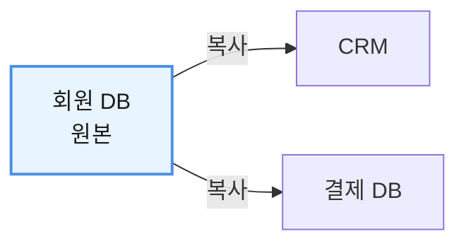

복사한 다음이 문제다.

고객이 전화번호를 바꿨는데  
회원 시스템만 수정되었다고 해보자.

| 시스템 | 전화번호 | |
|---|---|---|
| 회원 시스템 | 010-2222-3333 | 변경 반영 |
| CRM | 010-1111-1111 | 옛 값 |
| 결제 시스템 | 010-1111-1111 | 옛 값 |

복사한 쪽은 원본이 바뀐 것을 모른다.

이제 어느 값이 최신 값인지 판단하기 어려워진다.

---

### 같은 정제 작업을 여러 번 만든다

각 도메인이 데이터를 독립적으로 관리하면  
비슷한 데이터 처리 기능도 반복해서 개발할 수 있다.

예를 들어 전화번호를

```text
01012345678
```

에서

```text
010-1234-5678
```

형태로 바꾸는 기능을

```text
회원팀
CRM팀
마케팅팀
정산팀
```

이 각각 구현할 수 있다.

결과적으로 같은 기능을  
여러 번 개발하고 유지보수하게 된다.

---

### 같은 이름인데 의미가 다를 수 있다

다음 데이터가 있다고 하자.

```text
customer_status
```

회원 시스템에서는

```text
ACTIVE
BLOCKED
WITHDRAWN
```

을 의미할 수 있다.

반면 마케팅 시스템에서는

```text
NORMAL
VIP
DORMANT
```

를 의미할 수도 있다.

둘 다 이름은 `고객 상태`지만  
실제로 표현하는 개념은 다르다.

이런 상황에서 데이터를 단순히 합치면  
잘못된 분석 결과가 만들어질 수 있다.

---

## 3. MDM이 해결하려는 문제

MDM의 목적을 간단하게 표현하면 다음과 같다.

> 여러 시스템에 존재하는 핵심 데이터를  
> 동일한 대상으로 식별하고  
> 신뢰할 수 있는 기준을 제공하는 것

예를 들어 동일한 고객이  
여러 시스템에서 다음처럼 관리된다고 하자.

```text
회원 고객 ID = U1001
CRM 고객 ID  = C8821
결제 고객 ID = P5512
```

MDM은 이 세 레코드가

```text
동일한 고객
```

이라는 사실을 관리할 수 있다.

그리고 필요하다면 다음과 같은  
통합된 기준 데이터를 만들 수 있다.

```text
Master Customer ID = M000123

이름     = 홍길동
전화번호 = 010-1234-5678
국가     = KR
```

이렇게 만들어진 신뢰할 수 있는 기준 레코드를  
흔히 **골든 레코드(Golden Record)** 라고 한다.

---

## 4. MDM은 단순한 데이터 통합이 아니다

MDM을 처음 접하면

```text
여러 DB의 데이터를
한 DB에 모으는 것
```

이라고 생각하기 쉽다.

하지만 이것만으로는 부족하다.

데이터를 추출하고 변환해서  
다른 장소로 옮기는 것은 ETL에서도 할 수 있다.

```text
Extract
데이터 추출

Transform
데이터 변환

Load
데이터 적재
```

MDM에서는 그보다 더 많은 판단이 필요하다.


즉 MDM의 핵심은

> 데이터를 한곳에 모으는 것보다  
> 어떤 데이터가 같은 대상이며  
> 어떤 값을 신뢰해야 하는지를 관리하는 것

이다.

---

## 5. MDM에서 흔히 하는 작업

고객 데이터를 예로 들어보자.

다음처럼 표현이 다른 전화번호가 있을 수 있다.

```text
01012345678
010-1234-5678
+82 10 1234 5678
```

MDM에서는 이런 데이터를  
같은 형식으로 표준화할 수 있다.

다음 두 레코드도 살펴보자.

```text
홍길동
01012345678

홍 길동
010-1234-5678
```

이 둘이 동일한 사람인지  
매칭 규칙을 통해 판단할 수 있다.

또 다음과 같은 작업도 MDM 영역과 연결된다.

```text
데이터 품질 검사
중복 제거
엔터티 매칭
표준화
데이터 보강
병합 규칙
승인 프로세스
데이터 수명주기 관리
```

중요한 점은 MDM이 특정 제품이나 DB를 뜻하는 것이 아니라  
이런 문제를 해결하기 위한 **관리 체계와 아키텍처**라는 것이다.

---

## 6. MDM은 특정 데이터베이스 기술과 관계없다

MDM을 구현할 때 관계형 DB를 사용할 수도 있고  
NoSQL이나 그래프 DB를 활용할 수도 있다.

하지만

```text
MDM = NoSQL
```

처럼 이해하면 안 된다.

MDM에서 중요한 것은 저장 기술보다

```text
동일 엔터티 식별
중복 제거
관계 관리
기준값 결정
품질 관리
거버넌스
```

다.

저장 기술은 이를 구현하기 위한  
선택지 중 하나일 뿐이다.

---

## 7. 모든 데이터를 MDM으로 관리하면 안 된다

MDM을 도입할 때 가장 흔한 실수 중 하나는

```text
회사의 모든 데이터를
MDM으로 관리하자
```

는 생각이다.

예를 들어 다음 데이터를 모두 MDM에 넣는다고 생각해 보자.

```text
고객
상품
결제 로그
클릭 로그
서버 로그
세션
내부 설정
```

시스템은 지나치게 복잡해진다.

MDM은 일반적으로

> 여러 시스템이나 도메인에서 공통으로 사용하며  
> 잘못되었을 때 비즈니스 영향이 큰 핵심 데이터

에 적용하는 것이 적절하다.

---

## 8. MDM의 네 가지 대표적인 구현 스타일

MDM에는 하나의 정답 구조가 있는 것이 아니다.

대표적으로 다음 네 가지 스타일을 많이 사용한다.

| 스타일               | 핵심                 |
|-------------------|--------------------|
| 레지스트리             | 동일한 대상을 연결         |
| 통합(Consolidation) | 여러 데이터를 모아 통합      |
| 중앙집중(Centralized) | MDM이 기준 데이터를 직접 관리 |
| 공존(Coexistence)   | MDM과 운영 시스템이 함께 관리 |

이 분류는 절대적인 성숙도 순서가 아니다.

조직의 시스템 구조와 목적에 따라  
필요한 방식을 선택하거나 섞어서 사용할 수 있다.

---

## 9. 레지스트리 스타일

레지스트리는 비교적 가벼운 MDM 방식이다.

실제 데이터를 모두 중앙으로 옮기는 것이 아니라

```text
회원 U1001
CRM C8821
결제 P5512

→ 동일한 고객
```

이라는 관계를 관리한다.

구조를 단순하게 표현하면 다음과 같다.

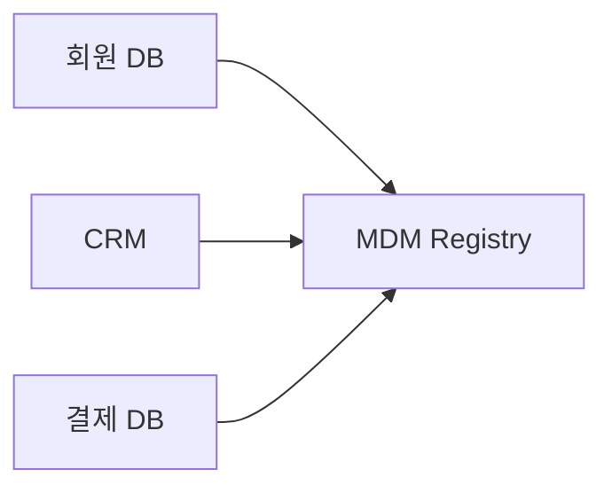

기존 운영 시스템을 크게 변경하지 않아도 된다는 장점이 있다.

그래서 기존 시스템의 변경 부담이 큰 조직에서는  
좋은 출발점이 될 수 있다.

다만

```text
MDM은 반드시 레지스트리부터 시작해야 한다
```

는 의미는 아니다.

조직 상황에 따라 처음부터  
통합 스타일이나 중앙집중 방식을 사용할 수도 있다.

---

## 10. 통합 스타일

통합 스타일에서는 여러 시스템의 데이터를  
MDM 저장소에 모은다.

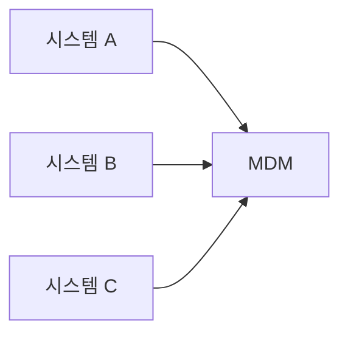

MDM에서는 데이터를

```text
정제
매칭
중복 제거
병합
```

해서 신뢰할 수 있는 데이터를 만든다.

그리고 이를 분석이나 보고에서 사용할 수 있다.


이 방식에서는 MDM에서 개선된 데이터가  
반드시 운영 시스템으로 다시 돌아갈 필요는 없다.

---

## 11. 중앙집중식 스타일

중앙집중식에서는  
MDM이 마스터 데이터의 권위 있는 관리 지점이 된다.

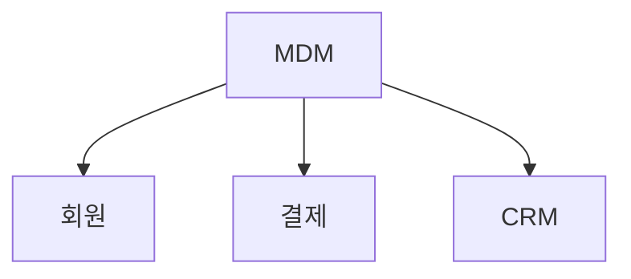

고객 주소가 변경되면

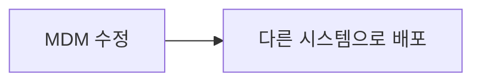

하는 방식이다.

데이터 일관성을 강하게 관리할 수 있지만  
기존 시스템이 MDM의 규칙을 따르도록  
변경해야 할 수도 있다.

따라서 기존 시스템이 많은 기업에서는  
적용 비용이 커질 수 있다.

---

## 12. 공존 스타일

공존 스타일에서는

```text
MDM
```

에도 데이터가 존재하고

```text
회원
CRM
결제
```

같은 운영 시스템에도 데이터가 존재한다.

그리고 서로 변경 내용을 주고받는다.

```text
CRM
 ↕
MDM
 ↕
회원 / 결제
```

예를 들어 CRM에서 주소가 변경되면

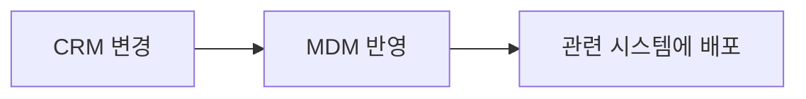

할 수 있다.

기존 시스템을 유지하면서  
MDM을 적용할 수 있다는 장점이 있다.

하지만 양방향 동기화 때문에  
운영 복잡도가 높아진다.

```text
동시에 변경되면 어느 쪽이 우선인가?

동기화에 실패하면 어떻게 복구할 것인가?

변경 순서는 어떻게 관리할 것인가?
```

같은 문제를 해결해야 한다.

---

## 13. Single Source of Truth를 오해하지 말자

1장에서 본 것처럼 Single Source of Truth는  
데이터가 물리적으로 한 DB에만 있다는 뜻이 아니다.

MDM에서도 마찬가지다.  
공존 스타일처럼 여러 시스템에  
같은 데이터가 존재할 수도 있다.

중요한 것은

> 조직이 어떤 값을 권위 있는 기준으로  
> 신뢰해야 하는지 알 수 있다는 것

이다.

따라서 MDM의 기준 데이터는  
하나의 물리적 저장소라기보다  
**하나의 신뢰 가능한 기준**이라고 이해하는 편이 정확하다.

---

## 14. 배치와 실시간 처리

MDM은 다른 시스템과  
지속적으로 데이터를 주고받는다.

이때 크게 배치와 실시간 방식을 사용할 수 있다.

배치는 일정 시간마다  
데이터를 한꺼번에 처리한다.

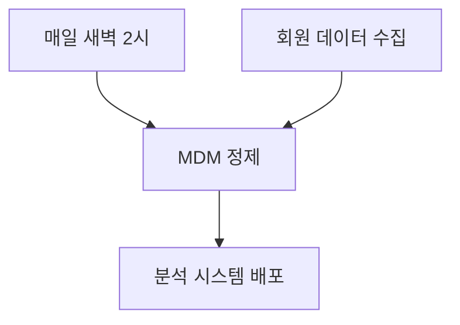

대량 처리에 적합하다.

반대로 운영 중 즉시 반영해야 하는 데이터는  
API나 이벤트를 사용할 수 있다.


MDM이라고 해서  
무조건 실시간이어야 하는 것은 아니다.

데이터의 중요도와 업무 요구사항에 따라

```text
배치
API
이벤트
스트리밍
```

을 적절히 선택한다.

---

## 15. 일관성과 속도 사이의 균형

모든 시스템의 데이터를 항상 완벽하게 같게 유지하려면  
상당한 비용이 필요할 수 있다.

반대로 처리 속도만 생각하면  
잠시 동안 시스템 간 데이터가 다를 수 있다.

예를 들어

```text
결제 차단 상태
```

는 매우 빠르게 반영해야 할 수 있다.

반면

```text
상품 통계 분류
```

는 몇 분이나 몇 시간 늦어도  
문제가 없을 수 있다.

따라서 MDM 설계에서는

> 데이터마다 어느 수준의 일관성과  
> 어느 정도의 지연을 허용할 것인지

정해야 한다.

---

## 16. 운영 시스템이 MDM을 항상 직접 호출할 필요는 없다

다음과 같은 구조를 생각해 보자.


이 구조에서는 MDM 장애가  
주문 장애로 바로 이어질 수 있다.

따라서 핵심 트랜잭션 경로에서  
무조건 MDM을 실시간 호출하도록 만들 필요는 없다.

필요에 따라

```text
로컬 복제본
캐시
이벤트 동기화
데이터 프로덕트
API
```

등을 사용할 수 있다.

---

## 17. MDM 설계는 데이터의 출처부터 파악한다

MDM을 만들기 전에  
데이터가 어디에서 생성되는지 알아야 한다.

예를 들어 고객 데이터라고 해도  
모든 속성이 같은 시스템에서 만들어지는 것은 아니다.

- **이름** — 회원 시스템
- **결제 가능 상태** — 결제 시스템
- **마케팅 등급** — CRM
- **본인인증 정보** — 인증 시스템

따라서 MDM에서는

```text
어떤 속성의 기준 시스템은 어디인가?
```

를 명확하게 정의해야 한다.

이를 흔히 권위 있는 소스  
또는 Source of Truth 관점에서 바라본다.

---

## 18. 참조 데이터와 마스터 데이터

마스터 데이터와 함께 자주 등장하는 것이  
**참조 데이터(Reference Data)** 다.

마스터 데이터는  
기업의 핵심 대상을 표현한다.

```text
고객
상품
직원
협력사
```

참조 데이터는  
다른 데이터를 분류하거나 설명하는 기준값이다.

```text
국가 코드
통화 코드
지역 코드
상품 분류 코드
```

예를 들어

```text
고객 = 홍길동
국가 = KR
```

이라면

`홍길동`은 마스터 데이터이고  
`KR`은 참조 데이터다.

둘은 개념적으로는 다르지만  
실제 데이터 관리 체계에서는 함께 관리하는 경우가 많다.

---

## 19. 참조 데이터도 일관성이 필요하다

대한민국을 나타내는 값이

```text
시스템 A = KR
시스템 B = KOR
시스템 C = 410
```

처럼 다를 수 있다.

모두 같은 의미지만  
그대로는 데이터 결합이 어렵다.

따라서 중앙 기준과  
각 시스템의 로컬 값을 매핑할 수 있다.

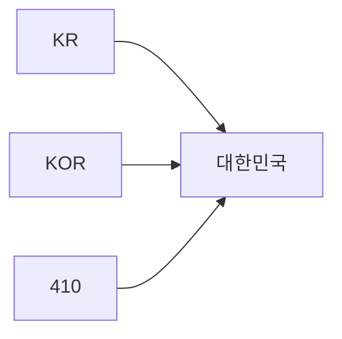

기존 시스템을 한꺼번에 변경하기 어렵다면  
이런 매핑 방식이 현실적인 해결책이 된다.

---

## 20. 마스터 식별자

여러 시스템에서 동일한 고객이  
각기 다른 ID를 가지고 있다고 하자.

```text
회원 ID = U1001
CRM ID  = C881
결제 ID = P553
```

MDM에서는 이를

```text
Master Customer ID = M000123
```

으로 연결할 수 있다.

이 마스터 식별자는

> 여러 시스템에 흩어진 동일한 대상을  
> 하나의 엔터티로 연결하는 역할

을 한다.

---

## 21. 애플리케이션 키와 대리 키

기존 업무 시스템의 ID를  
마스터 식별자로 사용할 수도 있다.

이를 애플리케이션 키 관점에서 볼 수 있다.

하지만 서로 다른 시스템에서  
같은 숫자가 사용될 수도 있다.

```text
회원 ID = 100

CRM ID = 100
```

둘은 전혀 다른 대상을 의미할 수도 있다.

그래서 MDM에서 별도의  
**대리 키(Surrogate Key)** 를 만들기도 한다.

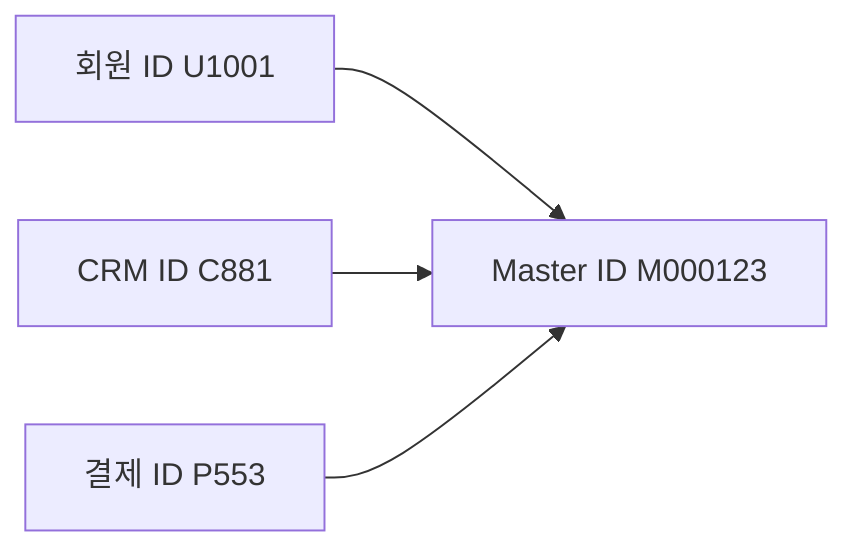

대리 키 자체에는 특별한 비즈니스 의미를 넣지 않고  
대상을 안정적으로 식별하는 역할을 맡기는 것이 일반적이다.

---

## 22. 결정적 식별자도 주의해서 사용한다

같은 데이터를 다시 적재할 때마다  
새로운 랜덤 GUID를 만든다고 생각해 보자.

첫 번째 적재에서는

```text
홍길동
→ GUID A
```

두 번째 적재에서는

```text
홍길동
→ GUID B
```

가 만들어질 수 있다.

이 문제를 해결하기 위해  
같은 입력값이면 항상 같은 식별자가 만들어지는  
결정적 식별자를 사용할 수도 있다.

하지만 주의할 점이 있다.

예를 들어

```text
이름 + 전화번호
```

로 식별자를 만들었는데  
고객이 전화번호를 변경한다면

```text
같은 고객
→ 다른 ID
```

가 되어버릴 수 있다.

따라서 이름, 주소, 전화번호처럼  
변경 가능한 업무 속성을 영구 마스터 ID의 기반으로 사용할 때는  
매우 신중해야 한다.

---

## 23. 마스터 ID를 모든 시스템에 강제할 필요는 없다

마스터 ID가 존재한다고 해서

```text
모든 시스템
→ 무조건 Master ID 사용
```

하도록 할 필요는 없다.

각 시스템은 기존 로컬 ID를 유지하고

```text
Local ID ↔ Master ID
```

관계만 관리할 수도 있다.

MDM과 직접 관련 없는 시스템이라면  
자체 식별자만 사용하는 것도 가능하다.

---

## 24. 어디까지 MDM으로 관리할 것인가

앞에서 모든 데이터를 MDM으로 관리하면 안 된다고 했다.

그럼 어디까지가 MDM의 몫인가.

기준은 하나다. **얼마나 넓게 쓰이는 데이터인가.**


| 범위 | 어떤 데이터인가 | 예 | 어떻게 관리하나 |
|---|---|---|---|
| **엔터프라이즈** | 회사 전체가 같은 의미로 이해해야 한다 | 고객, 상품, 국가 코드 | 전사 기준을 만든다. **MDM의 몫** |
| **도메인** | 몇 개 도메인이 함께 쓴다 | 정산 등급, 배송 권역 | 관련 팀끼리 합의한다 |
| **로컬** | 한 시스템 안에서만 쓴다 | 화면 정렬 순서, 내부 캐시 키 | 그 팀이 알아서 한다 |

위로 갈수록 맞춰야 할 사람이 늘어난다.  
합의 비용이 커진다는 뜻이다.

그래서 **위 칸에 올릴 데이터는 적을수록 좋다.**

어떤 데이터를 MDM으로 가져올지 고민된다면  
이 질문 하나면 대체로 정리된다.

> 이 값이 틀리면  
> 몇 개 팀이 곤란해지는가?

한 팀만 곤란하면 그 팀이 알아서 하면 된다.  
회사 전체가 곤란하면 전사 기준이 필요하다.

덧붙이면 이 3단 구분은 유용한 설계 관점이지  
MDM의 공식 표준으로 외울 것은 아니다.

---

## 25. 모든 MDM을 중앙에서 관리할 필요도 없다

회사 전체가 사용하는 데이터는  
중앙 MDM에서 관리할 수 있다.

예를 들어

```text
고객
상품
조직
```

같은 데이터다.

하지만 몇 개 도메인만 사용하는 데이터라면

```text
배송 관련 분류
정산 관련 분류
특정 파트너 등급
```

해당 도메인 수준에서  
관리하는 것이 더 효율적일 수 있다.

즉 현대적인 MDM의 핵심은

```text
모든 것의 중앙화
```

가 아니라

```text
필요한 범위의 일관성 확보
```

다.

---

## 26. MDM이 만든 기준을 어떻게 내보낼 것인가

기준 데이터를 만들었다면 다른 도메인이 가져다 써야 한다.

가장 쉬운 방법은 MDM DB에 바로 붙게 하는 것이다.

```sql
SELECT *
FROM mdm.customer_master
WHERE master_id = 'M000123';
```

그런데 이러면 7장 「무엇을 공개하고 무엇을 감출 것인가」에서 본  
문제가 그대로 돌아온다.

MDM 내부 테이블에 여러 팀이 의존하게 되고,  
매칭 규칙을 바꾸려고 컬럼 하나 손대면  
누가 깨지는지 알 수 없게 된다.

MDM도 다른 도메인과 똑같이 **공개 계약**을 내놓는다.

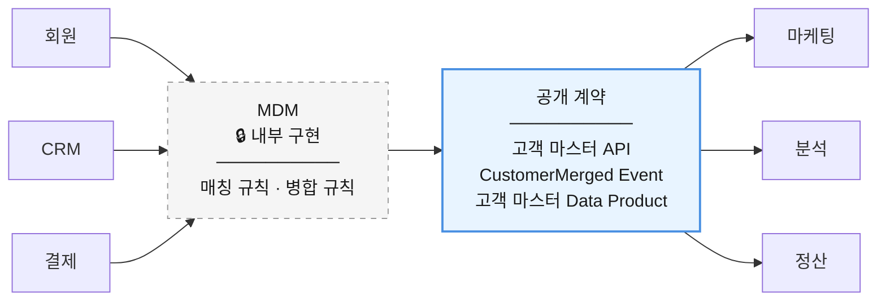

소비자는 MDM이 몇 개 시스템에서 데이터를 모으는지,  
어떤 매칭 규칙을 쓰는지 알 필요가 없다.

정해진 인터페이스만 쓰면 된다.

MDM은 특별한 시스템처럼 보이지만  
**경계와 계약이라는 점에서는 다른 도메인과 다르지 않다.**

---

## 27. MDM과 헷갈리기 쉬운 것들

MDM은 하는 일이 겹치는 개념이 많다.

말로 구분하면 계속 헷갈리므로  
상황 하나를 놓고 각자 무엇을 하는지 보자.

> 같은 고객인데  
> 회원 DB의 주소는 **부산**,  
> CRM의 주소는 **서울**이다.

| | 이 상황에서 하는 일 |
|---|---|
| **통합 뷰** | 부산과 서울을 **둘 다 보여준다.** 어느 쪽이 맞는지는 보는 사람이 판단한다 |
| **MDM** | **어느 쪽이 기준인지 정한다.** 그렇게 정한 값이 골든 레코드다 |
| **데이터 큐레이션** | 이 질문에는 관심이 없다. 주소를 재료로 **「수도권 고객 비율」 같은 새 데이터를 만든다** |
| **데이터 웨어하우스** | 정해진 값을 받아 **분석용으로 쌓아 둔다** |
| **데이터 프로덕트** | 정해진 기준값을 다른 팀이 쓰기 좋게 **포장해서 내보낸다** |

다섯 중 **"어느 값이 맞는가"에 답하는 것은 MDM뿐이다.**

나머지는 그 답을 가져다 쓰거나, 아예 다른 질문을 한다.

하나씩 조금 더 보자.

### 통합 뷰 — 보여주기까지가 역할이다

여러 시스템의 데이터를 하나의 쿼리로 묶어  
마치 한 테이블처럼 보여줄 수 있다.

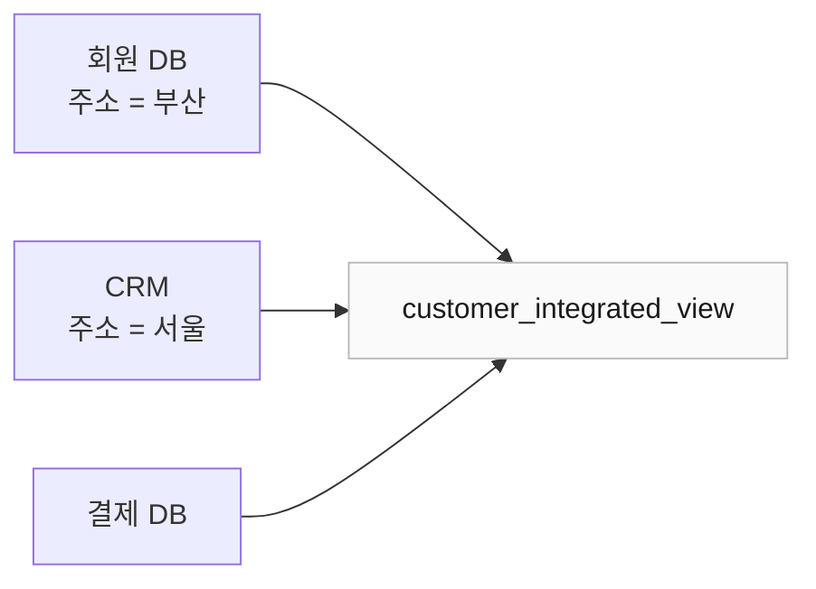

여기까지는 MDM과 비슷해 보인다.

차이는 값이 어긋났을 때 드러난다.

통합 뷰는 부산과 서울을 나란히 보여주고 끝난다.  
그것만으로도 "이 고객 정보가 어디에 어떻게 있는지"를 아는 데 쓸모가 있다.

MDM은 거기서 멈추지 않는다.

어느 시스템의 값을 더 믿을지, 언제 갱신된 값인지를 따져  
**하나의 기준값을 정해야 한다.** 그리고 그 결정에 책임을 진다.

### 큐레이션 — 묻는 질문 자체가 다르다

데이터 큐레이션은 여러 데이터를 골라 정리하고 결합해  
특정 목적에 더 가치 있는 데이터로 만드는 일이다.

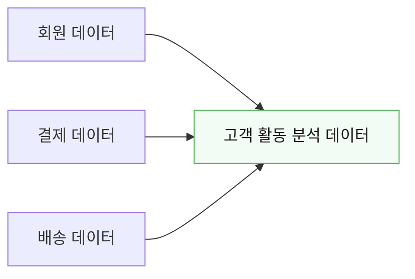

앞의 주소 상황으로 돌아가 보자.

큐레이션은 "부산과 서울 중 뭐가 맞나"를 묻지 않는다.  
주소를 재료 삼아 "수도권 고객 비율" 같은  
**없던 데이터를 만드는 쪽**에 관심이 있다.

다만 둘의 경계가 깔끔하게 갈리지는 않는다.

수집·정제·통합·표준화·품질 관리·메타데이터를 똑같이 쓰고,  
MDM도 표준화와 병합과 외부 데이터 보강과 파생 속성 생성을 한다.

그래서 이렇게 나누면 틀린다.

```text
MDM은 기존 데이터만 정리한다.
큐레이션만 새로운 데이터를 만든다.
```

정확한 차이는 무엇이 중심이냐다.

- **MDM** — 핵심 엔터티의 기준과 식별성
- **큐레이션** — 특정 소비 목적에 맞는 구성과 가공

### 데이터 웨어하우스 — 기준값을 받아 쓰는 쪽

둘은 경쟁 관계가 아니라 순서 관계다.


"지역별 매출"을 뽑으려면 먼저 고객의 지역이 하나로 정해져야 한다.  
그 결정은 MDM이 하고, 웨어하우스는 그 값을 받아 집계한다.

웨어하우스의 **Gold 계층**과 MDM 결과를 같은 것으로 보면 안 된다.

Gold는 특정 분석 목적에 맞춰 이미 가공된 결과물이다.  
「월별 지역별 매출」 같은 것이다.

MDM이 관리하는 것은 그 집계에 들어가는 재료,  
즉 여러 업무 시스템이 공통으로 재사용할 **핵심 엔터티**다.

### 데이터 프로덕트 — 층위가 다르다

이 둘은 비교 대상이 아니다.

- **MDM** — 핵심 데이터를 식별하고 기준을 정하는 **체계**
- **데이터 프로덕트** — 데이터를 쓰기 좋게 제공하는 **방식**

그래서 이렇게 말하면 틀린다.

```text
고객 마스터는 MDM인가, 데이터 프로덕트인가?
```

둘 다다.

기준값을 정하는 과정은 MDM이고,  
그 결과를 계약과 함께 내놓는 형태가 데이터 프로덕트다.  
앞 절에서 본 구조가 그것이다.

반대로 데이터 프로덕트라고 해서  
모두 MDM을 거치는 것도 아니다.

주문 이력이나 행동 로그처럼  
한 도메인이 만들어 그대로 내보내는 데이터 프로덕트가 훨씬 많다.

---
## 28. MDM 기능 자체도 공통 서비스가 될 수 있다

각 도메인이 다음 기능을  
따로 개발할 필요는 없다.

```text
데이터 프로파일링
중복 탐지
매칭
표준화
검증
```

중앙에서

```text
데이터 품질 서비스
```

로 만들어서

```text
회원 도메인
상품 도메인
정산 도메인
```

이 공통으로 사용할 수도 있다.

이렇게 하면 중복 구현을 줄이고  
품질 기준도 통일하기 쉽다.

---

## 29. 데이터뿐 아니라 처리 로직도 재사용할 수 있다

각 팀이 같은 데이터 변환 로직을  
반복해서 만드는 것도 비효율적이다.

예를 들어

```text
전화번호 표준화
주소 정규화
중복 고객 판단
```

같은 기능이다.

따라서 결과 데이터뿐 아니라

```text
SQL
변환 코드
스크립트
매핑 규칙
```

도 공유할 수 있다.

그리고 이런 로직을  
Git 같은 저장소에서 버전 관리할 수 있다.

다만 공통 로직의 변경은  
여러 팀에 동시에 영향을 미칠 수 있다.

그래서

```text
버전 관리
테스트
호환성 관리
변경 승인
```

이 함께 필요하다.

---

## 30. 통합 허브를 통한 데이터 재게시

여러 데이터를 중앙의 통합 허브에서 처리한 뒤  
다시 배포할 수도 있다.

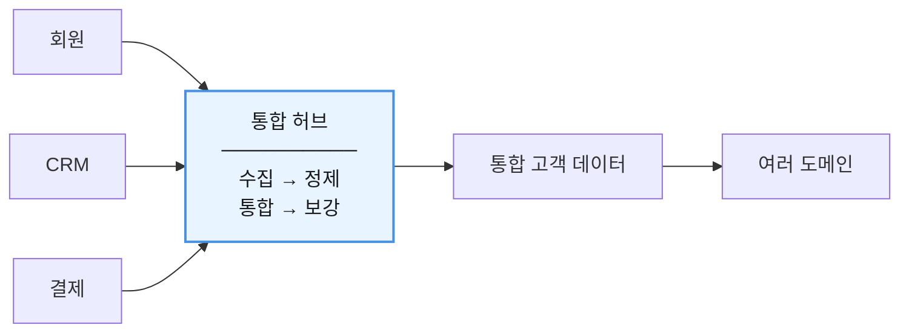

이런 구조는 공통 규칙을  
한곳에서 적용하기 쉽다는 장점이 있다.

---

## 31. 통합 허브의 위험

중앙 허브가 모든 데이터의  
필수 경로가 되면 문제가 생길 수 있다.


중앙 병목이 될 수도 있다.

또 허브에서 데이터를 변경한다면

```text
어떤 데이터가 원본인가?

어떤 규칙이 적용되었는가?

누가 언제 변경했는가?
```

를 추적해야 한다.

이때 중요한 것이  
**데이터 계보(Data Lineage)** 다.

---

## 32. 원본 문제를 허브에서만 고치면 안 된다

회원 시스템의 주소가 잘못됐다고 생각해 보자.

```mermaid
flowchart LR
    SRC["회원 DB<br/>❌ 잘못된 주소"] --> FIX["MDM에서 정제"] --> OK["소비 시스템에는<br/>정상 주소"]

    style SRC fill:#fff4f4,stroke:#d9534f,color:#1a1a1a
    style OK fill:#f2fbf4,stroke:#4caf50,color:#1a1a1a
```

겉으로는 해결된 것처럼 보인다.

하지만 원본 시스템은  
여전히 잘못된 값을 가지고 있다.

따라서 다음 질문을 결정해야 한다.

```text
MDM에서만 수정할 것인가?

원본 시스템에도 수정 내용을 돌려보낼 것인가?

어느 쪽이 수정 책임을 가지는가?
```

이 문제는 기술보다  
거버넌스와 오너십 문제에 가깝다.

---

## 33. 애그리게이트 데이터 프로덕트

여러 도메인이 계속 같은 데이터들을  
반복해서 결합한다고 해보자.

```text
회원 + 결제 + 배송
```

세 개 팀에서 같은 조합을  
각각 만들 필요는 없다.

별도의 통합 데이터 프로덕트를 만들 수 있다.

```mermaid
flowchart LR
    hub["고객 활동 데이터 프로덕트"]
    s0["회원"] --> hub
    s1["결제"] --> hub
    s2["배송"] --> hub
```

다른 팀들은 이 결과를 재사용한다.

이렇게 하면  
중복된 통합 작업을 줄일 수 있다.

---

## 34. 도메인 간 협업 방식

도메인끼리 데이터를 공유하는 방식도  
상황에 따라 달라질 수 있다.

대표적으로 다음과 같이 이해할 수 있다.

| 방식     | 특징                   |
|--------|----------------------|
| 분리     | 서로 맞추지 않고 각자 처리      |
| 파트너십   | 여러 팀이 함께 규칙을 설계      |
| 고객/공급자 | 한 팀이 제공하고 다른 팀이 소비   |
| 순응주의자  | 소비자가 공급자의 모델을 그대로 사용 |

어느 방식이 항상 좋은 것은 아니다.

공유 데이터의 중요도와  
팀 간 관계에 따라 선택한다.

---

## 35. 데이터 거버넌스가 필요한 이유

MDM은 기술만으로 해결할 수 없다.

다음 질문에 답할 수 있어야 한다.

```text
누가 이 데이터를 책임지는가?

어떤 시스템의 값을 믿는가?

누가 수정할 수 있는가?

중복 레코드는 누가 병합하는가?

품질 기준은 무엇인가?

스키마 변경은 누가 승인하는가?
```

이런 규칙을 결정하고 운영하는 것이  
데이터 거버넌스의 중요한 역할이다.

---

## 36. 데이터 계약도 활용할 수 있다

도메인끼리 데이터를 주고받을 때  
규칙을 명확하게 정의하는 것도 도움이 된다.

예를 들면 다음과 같다.

```text
customer_id는 필수

국가 코드는 정해진 표준 사용

전화번호 형식 정의

스키마 변경 시 사전 통보

특정 품질 기준 보장
```

이런 약속을  
**데이터 계약(Data Contract)** 형태로 관리할 수 있다.

---

## 37. 메타데이터와 데이터 계보

MDM에서도 메타데이터와 계보가 필요하다.

```text
customer_status
```

라는 컬럼이 회원 이용 상태인지,  
결제 가능 상태인지, 마케팅 상태인지  
값만 봐서는 알 수 없기 때문이다.

또 고객 마스터가

```mermaid
flowchart LR
    n0["회원 DB"] --> n1["CRM 결합"] --> n2["중복 제거"] --> n3["주소 표준화"] --> n4["고객 마스터"] --> n5["분석 시스템"]
```

같은 과정을 거쳤다면  
문제가 생겼을 때 어느 단계에서 틀어졌는지  
추적할 수 있어야 한다.

메타데이터, 데이터 카탈로그, 데이터 계보는  
15장 「메타데이터와 데이터 지도」에서 다뤘다.

---

## 38. 머신러닝도 활용할 수 있다

MDM에서는 동일한 엔터티를  
정확히 찾는 것이 중요하다.

예를 들어

```text
홍길동
01012345678
부산

홍 길동
010-1234-5678
부산
```

같은 데이터가 동일한 고객인지  
판단해야 한다.

규칙 기반 매칭뿐 아니라  
통계적 방법이나 머신러닝 기반  
엔터티 매칭을 활용할 수도 있다.

하지만

```text
ML을 사용하면 MDM이 완성된다
```

는 의미는 아니다.

ML은 MDM을 고도화하기 위한  
선택 가능한 기술 중 하나다.

먼저 데이터 모델, 품질 규칙,  
오너십과 거버넌스가 마련되어야 한다.

---

## 39. MDM은 작게 시작하는 것이 좋다

처음부터

```text
회사 전체의 모든 데이터를
하나의 MDM에서 통합
```

하려고 하면 프로젝트가  
지나치게 커질 수 있다.

현실적으로는 다음처럼 접근할 수 있다.

```mermaid
flowchart LR
    n0["현재 데이터 상태 파악"] --> n1["중요한 마스터 데이터 선정"] --> n2["식별 관계와 중복 파악"] --> n3["품질·매칭 규칙 적용"] --> n4["마스터 데이터 제공"] --> n5["필요한 경우 운영 시스템과 동기화"]
```

기존 시스템을 크게 변경하기 어렵다면  
레지스트리 스타일이 좋은 출발점이 될 수도 있다.

하지만 조직 상황에 따라  
다른 방식부터 시작할 수도 있다.

---

## 40. 가장 복잡한 단계는 양방향 동기화다

MDM의 수정 사항을 운영 시스템에 다시 전달하고  
운영 시스템의 변경도 MDM으로 가져오는 구조는  
강력하지만 복잡하다.

```text
운영 시스템
     ↕
    MDM
     ↕
다른 운영 시스템
```

이런 공존 구조에서는

```text
변경 우선순위
충돌 처리
실패 복구
변경 이력
배포 순서
```

같은 규칙이 반드시 필요하다.

따라서 모든 조직이  
공존 스타일을 목표로 할 필요는 없다.

비즈니스에 필요한 수준까지만 구현하면 된다.

---

## 41. MDM에서 가장 중요한 균형

현대적인 데이터 아키텍처에는  
두 가지 서로 다른 요구가 존재한다.

한쪽은

```text
도메인의 자율성
빠른 개발
독립적인 변경
```

이다.

다른 한쪽은

```text
전사 데이터 일관성
데이터 품질
재사용성
```

이다.

모든 것을 도메인에 맡기면  
데이터가 파편화될 수 있다.

반대로 모든 데이터를 중앙에서 관리하면  
중앙 조직이 병목이 될 수 있다.

이 균형을 잡는 기준이 앞에서 본 데이터의 범위다.

전사 기준이 필요한 데이터에만 전사 기준을 두고,  
나머지는 도메인과 팀에 맡긴다.

둘 중 하나를 고르는 문제가 아니라  
**데이터마다 다르게 판단하는 문제**다.

---

## 42. 18장 정리

이 장의 흐름을 한 장으로 보면 다음과 같다.

```mermaid
flowchart TB
    S1["문제<br/>──────────<br/>회사가 커지면 같은 고객·상품이<br/>여러 시스템에 따로 저장되고<br/>시간이 지나면서 값이 달라진다"]
    S2["식별<br/>──────────<br/>흩어진 레코드가 같은 대상인지<br/>매칭 규칙으로 판단한다"]
    S3["기준 결정<br/>──────────<br/>표준화하고 병합해서<br/>어떤 값을 믿을지 정한다<br/>(골든 레코드)"]
    S4["제공<br/>──────────<br/>API · 이벤트 · 데이터 프로덕트로<br/>필요한 도메인이 재사용한다"]
    S5["떠받치는 것<br/>──────────<br/>오너십 · 품질 규칙 · 메타데이터<br/>데이터 계보 · 변경 관리 · 거버넌스"]

    S1 --> S2 --> S3 --> S4
    S4 -.-> S5

    style S1 fill:#fff4f4,stroke:#d9534f,color:#1a1a1a
    style S2 fill:#fafafa,stroke:#bbb,color:#1a1a1a
    style S3 fill:#f8fbff,stroke:#4a90e2,color:#1a1a1a
    style S4 fill:#f2fbf4,stroke:#4caf50,stroke-width:2px,color:#1a1a1a
    style S5 fill:#fafafa,stroke:#bbb,stroke-dasharray: 5 5,color:#1a1a1a
```

MDM을

```text
중앙 DB 하나 만드는 기술
```

이라고 이해하면 안 된다.

MDM은

> 여러 시스템에 흩어진 핵심 데이터를  
> 동일한 대상으로 식별하고,  
> 신뢰할 수 있는 기준을 정하며,  
> 필요한 곳에서 일관되게 사용할 수 있도록 하는  
> 데이터 관리 체계

다.

목적은 거대한 중앙 데이터베이스를 만드는 것이 아니다.

사용자가 데이터를 쓸 때마다

```text
이 고객이 같은 고객인가?
어느 값이 최신 값인가?
어떤 값을 믿어야 하는가?
```

를 고민하지 않아도 되게 만드는 것이다.

그리고 이 장에서 가장 중요한 원칙은 이것이다.

```text
모든 데이터를 중앙화하지 않는다.

정말 중요한 데이터에 집중한다.

도메인의 자율성을 최대한 유지한다.

공통으로 사용되는 핵심 데이터에는
신뢰할 수 있는 기준을 만든다.
```

한 문장으로 정리하면,

> **도메인에는 자율성을 주되,  
> 여러 시스템이 반드시 같은 의미로 이해해야 하는 핵심 데이터에는  
> 공통 기준을 마련하는 것이 현대적인 MDM의 핵심이다.**

여기까지가 5부다.

찾고(15장), 규칙을 정하고(16장), 지키고(17장),  
기준을 세우는(18장) 네 가지를 봤다.

다음 부에서는 이렇게 믿을 수 있게 만든 데이터를  
실제 성과로 바꾸는 이야기를 한다.
