# 19장. 데이터를 소비하는 환경

> **6부 · 가치** — 어떻게 성과로 바꾸는가  
> **19장** · 20장

*제공된 데이터를 누가 어떻게 쓰는가*

데이터를 많이 가지고 있다고 해서  
그 데이터가 자동으로 가치가 되는 것은 아니다.

회원 데이터, 결제 데이터, 배송 데이터, 주문 데이터가  
수년 동안 쌓여 있더라도 실제 업무에서 찾기 어렵고,  
의미를 알 수 없으며, 분석하기 힘들다면 활용 가치는 낮다.

데이터가 실제 가치가 되려면 다음 흐름이 필요하다.

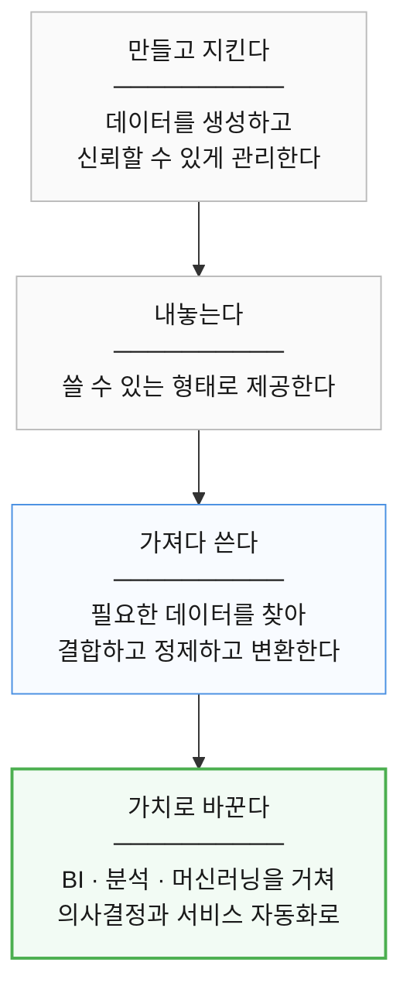

앞의 두 칸은 지금까지 다뤘다.  
이 장은 **세 번째 칸**, 제공된 데이터를 누가 어떻게 쓰는가다.

앞 장들에서는 데이터를 어떻게 관리하고,  
어떻게 신뢰할 수 있게 제공할 것인지 살펴봤다.

이번 장에서는 그 다음 질문을 다룬다.

> 제공된 데이터를 누가, 어떻게 사용하고  
> 실제 비즈니스 가치로 연결할 것인가?

이번 장의 핵심은 단순히  
“분석 도구를 사용하자”가 아니다.

개인이 일회성으로 하던 데이터 작업을  
조직이 반복해서 사용할 수 있는 체계로 만드는 것이 핵심이다.

---

## 1. 데이터 제공과 데이터 소비

먼저 **데이터 제공**과 **데이터 소비**를 구분할 필요가 있다.

두 활동은 서로 연결되어 있지만  
목적과 책임이 다르다.

### 데이터 제공

데이터 제공자는 자신이 책임지는 데이터를  
다른 사람이 신뢰하고 사용할 수 있도록 만든다.

예를 들어 커머스 도메인이 다음 데이터를 관리한다고 하자.

```text
커머스 도메인

결제
주문
환불
상품
```

커머스 도메인은 단순히 테이블을 보유하는 데서 끝나지 않는다.

다른 시스템이나 분석 조직이 사용할 수 있도록  
데이터의 의미와 접근 방법을 명확하게 제공해야 한다.

이때 중요한 것은 다음과 같다.

* 데이터의 의미와 정의
* 데이터 품질
* 접근 방법
* 보안과 권한
* 스키마와 변경 관리
* 소유자와 책임 범위

이런 관점에서 관리되는 데이터를  
일반적으로 **데이터 프로덕트(Data Product)** 라고 부를 수 있다.

다만 데이터 프로덕트에 대한  
전 세계적으로 하나뿐인 절대적인 정의가 있는 것은 아니다.

조직마다 구현 방식은 다르지만,

> 다른 소비자가 신뢰하고 재사용할 수 있도록  
> 책임과 품질을 갖추어 관리하는 데이터 자산

정도로 이해하면 충분하다.

---

### 데이터 소비

데이터 소비자는 제공된 데이터를 이용해  
업무 문제를 해결한다.

예를 들어 분석팀이 다음 데이터를 사용한다고 하자.

```text
회원 데이터
+
결제 데이터
+
배송 데이터
+
주문 데이터
```

이 데이터들을 이용해 다음 질문에 답할 수 있다.

```text
판매자별 상품 수 대비 주문 금액은?

신규 회원의 30일 결제 전환율은?

지난달 주문 금액이 감소한 판매자는?

결제 경험이 있는 사용자의 재방문율은?
```

여기서는 단순 조회만으로 끝나지 않는다.

데이터를

```text
결합
정제
변환
집계
분석
```

해야 한다.

이것이 **데이터 소비 영역**이다.

---

## 2. 소비자마다 필요한 데이터가 다르다

같은 데이터라도  
누가 사용하느냐에 따라 필요한 형태가 달라진다.

예를 들어 결제 데이터가 다음처럼 저장되어 있다고 하자.

```text
payment_id
user_id
amount
payment_method
status
created_at
```

경영진은 다음을 보고 싶을 수 있다.

```text
일별 매출
월별 매출
전월 대비 성장률
```

마케팅팀은 다음이 필요할 수 있다.

```text
회원별 누적 결제금액
첫 결제일
최근 결제일
결제 빈도
```

추천 시스템은 또 다른 형태가 필요하다.

```text
최근 7일 결제 횟수
최근 30일 결제금액
최근 활동 패턴
```

같은 원본 데이터라도  
소비 목적에 따라 필요한 데이터 모델이 달라진다.

따라서 데이터 제공자가  
모든 소비자의 요구사항까지 직접 구현하려 하면 문제가 생긴다.

커머스 팀이

```text
마케팅용 데이터도 만들어 주세요.
재무용 데이터도 만들어 주세요.
추천용 데이터도 만들어 주세요.
경영 보고서용 데이터도 만들어 주세요.
```

라는 요청을 계속 받는다면  
본래 도메인 업무보다 데이터 요청 대응에 더 많은 시간을 쓰게 된다.

그래서 기본적으로 다음과 같이 책임을 나누는 편이 좋다.


---

## 3. 소비자 특화 변환

소비자가 자신의 목적에 맞게 데이터를 가공하는 것을  
**소비자 특화 변환(Consumer-Specific Transformation)** 이라고 볼 수 있다.

예를 들어 각각의 도메인이 다음 데이터 프로덕트를 제공한다고 하자.

```text
회원 Data Product
결제 Data Product
배송 Data Product
주문 Data Product
```

분석 영역에서는 이들을 결합해  
다음 데이터를 만들 수 있다.

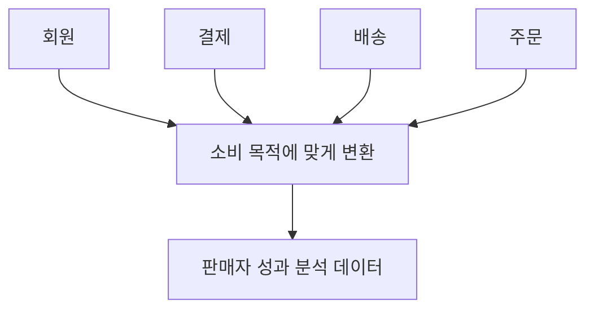

이 구조에서 중요한 원칙은 간단하다.

> 제공자는 자신의 데이터를 책임지고,  
> 소비자는 자신의 비즈니스 목적에 맞는 변환을 책임진다.

---

## 4. 소비자가 모두 제각각 만들면 생기는 문제

소비자에게 모든 것을 자유롭게 맡기는 것도 좋은 해결책은 아니다.

각 팀이 자체적으로 환경을 구축한다고 생각해보자.

```text
마케팅팀
회원 DB → 자체 ETL → 마케팅 DB

분석팀
회원 DB → 자체 ETL → 분석 DB

AI팀
회원 DB → 자체 ETL → ML 저장소
```

처음에는 빠르게 움직일 수 있다.

하지만 시간이 지나면 조직 안에 다음과 같은 것들이 쌓인다.

```text
서로 다른 ETL
서로 다른 스케줄러
서로 다른 저장소
서로 다른 모니터링
서로 다른 데이터 정의
```

결국 비슷한 문제를 여러 팀이 반복해서 해결하게 된다.

따라서

> 소비자는 자유롭게 데이터를 활용하되,  
> 공통적인 데이터 소비 기반을 사용하는 것

이 중요해진다.

---

## 5. 공통 소비 환경

그래서 팀마다 따로 만들지 않고 함께 쓰는 자리를 둔다.

이 책에서는 이것을 **소비 환경**이라고 부르겠다.

> 특정 업무 목적을 위해  
> 여러 데이터 프로덕트를 가져다 쓰고,  
> 결합·변환·저장·분석하는 논리적인 영역

이름보다 하는 일이 중요하다.

참고로 이 중에서 **저장소 부분만 떼어 보면**  
업계에서 흔히 말하는 **데이터 마트(Data Mart)** 에 가깝다.

특정 업무 영역을 위해 분석용으로 따로 마련한 저장소라는 뜻이다.

다만 여기서 말하는 소비 환경은 저장소보다 넓다.  
다음 절에서 무엇까지 포함하는지 본다.

예를 들면 다음과 같다.

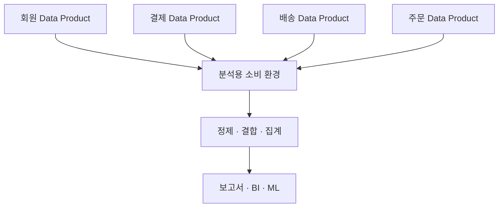

---

## 6. 소비 환경은 데이터베이스 하나가 아니다

`저장소`라는 말 때문에

```text
소비 환경 = 특정 DB 하나
```

라고 생각하기 쉽다.

하지만 데이터를 가져다 쓰려면 저장소만으로는 안 된다.

상황에 따라 다음이 함께 들어간다.

```text
Database
Data Warehouse
Data Lake
ETL / ELT
데이터 파이프라인
스케줄러
BI
머신러닝
모니터링
CI/CD
```

따라서 소비 환경은

> 특정 업무 목적을 위한 작은 데이터 플랫폼

정도로 이해하면 쉽다.

---

## 7. 소비 환경에서 만들어지는 데이터

소비 환경 안에서는 여러 종류의 데이터가 생성될 수 있다.

### 복사된 데이터

원본과 의미는 거의 같지만  
다른 저장소로 복사한 데이터다.

```text
Commerce DB

payment
   ↓ 복제

분석용 소비 환경

payment_copy
```

운영 시스템의 부하를 분리하거나  
분석에 더 적합한 기술을 사용하기 위해 복사할 수 있다.

다만 운영 DB를 직접 조회하는 것이  
항상 잘못된 것은 아니다.

데이터가 작거나 부하가 낮거나,  
Read Replica 등을 활용해 충분히 감당할 수 있다면  
직접 조회도 가능하다.

핵심은

> 분석 부하가 운영 서비스에 영향을 주지 않도록 설계하는 것

이다.

---

### 통합된 데이터

여러 데이터를 결합해  
새로운 비즈니스 문맥을 만든 데이터다.

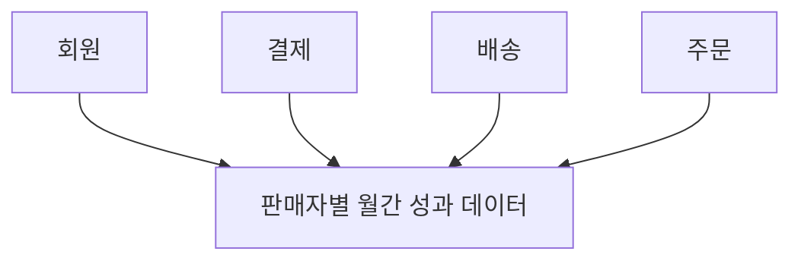

이 데이터는 각각의 원본에는 존재하지 않았지만  
결합을 통해 새로운 의미가 생긴다.

---

### 새롭게 생성된 데이터 프로덕트

소비 환경에서 만든 결과가 여러 곳에서 반복 사용된다면  
새로운 데이터 프로덕트로 발전할 수 있다.

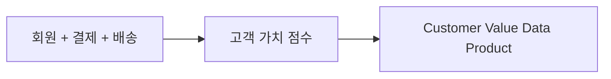

이 데이터는 다시

```text
마케팅
CRM
추천
운영
```

등에서 사용할 수 있다.

---

## 8. 모든 가공 데이터가 데이터 프로덕트는 아니다

분석 과정에서 데이터를 한 번 결합했다고 해서  
모두 데이터 프로덕트가 되는 것은 아니다.

예를 들어


라면 굳이 별도의 데이터 프로덕트를 만들 이유가 없다.

반대로 다음과 같은 상황이라면  
정식 데이터 프로덕트로 관리할 가치가 있다.

```text
반복적으로 사용됨
여러 소비자가 사용함
명확한 책임자가 필요함
품질 관리가 필요함
안정적인 인터페이스가 필요함
```

즉,

```text
일회성 분석 결과
≠
데이터 프로덕트
```

이다.

---

## 9. Consumer가 다시 Provider가 될 수 있다

데이터 세계에서는 역할이 고정되어 있지 않다.

처음에는 어떤 조직이  
다른 데이터 프로덕트를 사용하는 Consumer일 수 있다.

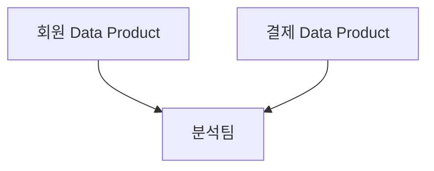

하지만 분석팀이

```text
고객 LTV
고객 등급
판매자 수익성 지표
```

같은 데이터를 만들고  
다른 조직에 제공하기 시작하면  
분석팀은 새로운 Provider가 된다.

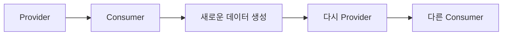

따라서 데이터의 출처와 변환 과정을 추적하는  
**Data Lineage**가 중요해진다.

---

## 10. 공식 데이터의 출처를 명확히 한다

데이터가 여러 번 복제되고 가공되면  
같은 이름을 가진 데이터가 여러 곳에 존재할 수 있다.

예를 들어

| 저장소 | 매출 값 |
|---|---|
| Commerce DB | 10,000원 |
| Analytics DB | 9,500원 |
| Marketing DB | 11,000원 |

처럼 모두 다른 매출 숫자를 보여준다면 문제가 된다.

그래서 다음을 명확히 해야 한다.

```text
이 데이터의 공식 정의는 무엇인가?
누가 책임지는가?
어디가 신뢰할 수 있는 출처인가?
```

이런 공식적인 출처를  
Golden Source 또는 Authoritative Source 등의 표현으로 부르기도 한다.

중요한 것은 명칭보다

> 어떤 데이터를 공식 기준으로 사용할 것인지  
> 조직이 합의하고 관리하는 것

이다.

---

## 11. 소비 환경의 경계를 정하는 방법

소비 환경을 무조건 많이 만드는 것이 좋은 것은 아니다.

너무 잘게 쪼개면

```text
소비 환경 A
소비 환경 B
소비 환경 C
소비 환경 D
...
```

사이에 데이터 이동과 통합이 계속 발생한다.

반대로 모든 것을 하나에 몰아넣으면  
거대한 중앙 데이터 플랫폼이 되어버린다.

따라서 적절한 경계를 찾아야 한다.

가장 중요한 기준은 다음 두 가지다.

```text
비즈니스 목적
+
기술 요구사항
```

---

### 비즈니스 목적

먼저 다음을 질문한다.

```text
무슨 문제를 해결하려는가?
누가 이 데이터를 사용하는가?
결과를 어디에 사용할 것인가?
```

예를 들어

```text
판매자별 상품 수 대비 판매 효율을 분석한다.
```

가 하나의 목적일 수 있다.

---

### 기술 요구사항

같은 데이터를 사용하더라도  
기술 조건이 다르면 구조를 분리할 수도 있다.

예를 들어

```text
월간 경영 보고서
```

는 하루 단위 배치로도 충분할 수 있다.

하지만

```text
실시간 이상 결제 탐지
```

는 수초 이하의 지연시간이 필요할 수 있다.

같은 결제 데이터를 사용한다고 해서  
반드시 같은 시스템에 넣을 필요는 없다.

---

## 12. 기술보다 비즈니스 문제가 먼저다

데이터 프로젝트를 시작하면  
기술부터 생각하기 쉽다.

```text
Kafka를 쓸까?
Spark를 쓸까?
MongoDB를 쓸까?
BigQuery를 쓸까?
```

하지만 좋은 설계는 반대 순서로 시작한다.


즉,

> 기술이 문제를 결정하는 것이 아니라  
> 문제가 기술을 결정해야 한다.

---

## 13. 비기능 요구사항

기능 요구사항이

```text
매출을 계산한다.
```

라면,

비기능 요구사항은

```text
얼마나 빨라야 하는가?
얼마나 많은 데이터를 처리해야 하는가?
얼마나 안전해야 하는가?
얼마나 오래 보관해야 하는가?
```

를 결정한다.

데이터 시스템에서는 특히 다음을 살펴본다.

```text
성능
확장성
지연시간
가용성
보안
비용
데이터 크기
증가 속도
쿼리 패턴
데이터 보존기간
일관성 요구사항
```

---

## 14. 저장소를 어떻게 고르는가

데이터 저장소는 기술의 인기가 아니라  
실제 데이터 특성을 기준으로 고른다.

봐야 할 축은 두 개다. **무엇을 저장하는가**와 **어떻게 읽는가**다.

### 무엇을 저장하는가

| 데이터가 이렇다면 | 검토할 것 |
|---|---|
| 정형이고 관계와 트랜잭션이 중요하다 | RDBMS |
| JSON 중심이고 구조가 자주 바뀐다 | Document DB |
| 대규모 파일이고 분석용이다 | Object Storage, Data Lake, 분석용 저장소 |

다만 이렇게 외우면 안 된다.

```text
RDB = 강한 일관성
NoSQL = 최종 일관성

RDB = 스키마 고정
NoSQL = 스키마 없음
```

현대 데이터베이스는 제품과 구성에 따라 여러 일관성 모델을 제공한다.  
NoSQL에서도 스키마 관리가 필요할 수 있고,  
RDBMS도 JSON 타입이나 온라인 스키마 변경 같은 유연성을 제공한다.

실제 제품이 무엇을 제공하는지 확인해야 한다.

### 어떻게 읽는가

저장할 데이터만 보고 고르면 절반만 본 것이다.

소비자가 어떻게 읽을지에 따라 맞는 저장 형태가 달라진다.

| 읽는 방식 | 예 | 맞는 저장 형태 |
|---|---|---|
| PK로 한 건씩 찾는다 | 주문 상세 조회, 회원 정보 | **행 지향** — RDBMS, 키-값 저장소 |
| 수십억 건을 훑어 집계한다 | 월별 매출, 판매자별 통계 | **열 지향** — 분석용 웨어하우스, Parquet |

왜 갈리는지는 저장 방식을 보면 알 수 있다.

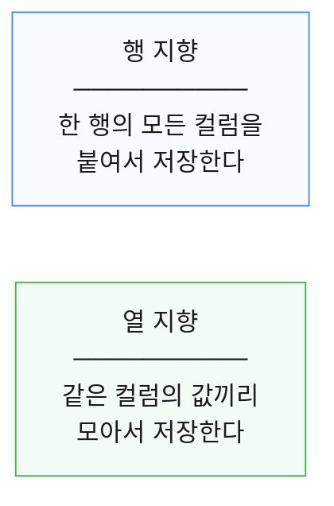

`SELECT * FROM orders WHERE order_id = 1` 처럼 한 건을 통째로 꺼낼 때는  
행 지향이 유리하다. 그 행만 읽으면 끝나기 때문이다.

반대로 `SELECT SUM(amount) FROM orders` 처럼 한 컬럼만 대량으로 훑을 때는  
열 지향이 유리하다. `amount`만 읽으면 되고,  
비슷한 값이 모여 있어 압축도 잘 된다.

행 지향에서 대량 집계를 돌리면  
읽지 않아도 될 컬럼까지 전부 읽게 된다.

### 둘 다 필요하면

둘 다 두면 된다.

주문 처리는 운영 DB에서 하고,  
주문 통계는 분석용 저장소에 따로 쌓는 식이다.

변경 모델과 조회 모델을 나누는 생각은  
9장 「서비스 경계와 조회 모델」에서 다뤘다.

다만 같은 데이터를 두 곳에 두면 동기화 비용이 생긴다.  
그 대가는 14장 「데이터 프로덕트를 신뢰할 수 있게 만들기」에서 다뤘다.

---
## 15. 데이터 기술을 너무 많이 늘리지 않는다

문제마다 가장 적합한 데이터베이스를 선택하는 접근을  
**Polyglot Persistence**라고 부르기도 한다.

개념 자체는 유용하다.

하지만 지나치게 적용하면 조직 안에

```text
MySQL
PostgreSQL
MongoDB
Cassandra
Redis
Elasticsearch
ClickHouse
BigQuery
...
```

가 계속 늘어난다.

그러면 각각에 대해

```text
운영
백업
모니터링
보안
장애 대응
업그레이드
전문 인력
```

이 필요하다.

따라서 조직 차원에서는  
몇 가지 표준 저장소를 정해 두고,

명확한 이유가 있을 때만  
새로운 기술을 추가하는 것이 현실적이다.

---

## 16. 데이터 파이프라인

저장소를 정했다면  
데이터가 어떻게 이동하고 가공되는지 설계해야 한다.

이를 **Data Pipeline**이라고 한다.

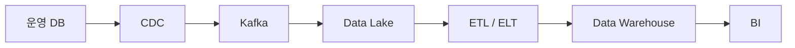

파이프라인은 단순 이동만 뜻하지 않는다.  
수집·정제·변환·검증·통합·저장·배포까지 포함한다.

돌리는 방식은 크게 둘이다.

| | 언제 쓰나 | 예 |
|---|---|---|
| **배치** | 일정 주기로 모아서 처리 | 월간 보고서, 정산 |
| **스트리밍** | 들어오는 대로 계속 처리 | 이상거래 탐지, 실시간 추천 |

둘의 선택 기준은 12장 「무엇으로 연결할 것인가」에서 다뤘다.  
여기서 기억할 것은 하나다.

> 같은 데이터를 쓴다고 해서  
> 같은 방식으로 처리해야 하는 것은 아니다.

---

## 17. ETL과 ELT

전통적인 방식은 ETL이다.

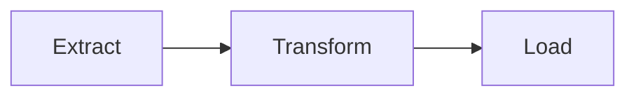

먼저 데이터를 가져오고  
가공한 후 대상 시스템에 저장한다.

ELT는 순서가 다르다.

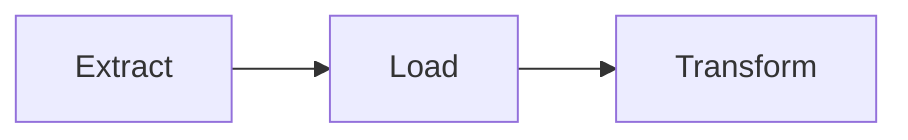

먼저 데이터를 저장한 뒤  
저장된 데이터를 필요에 따라 변환한다.

현대적인 클라우드 데이터 플랫폼에서는  
ELT 방식이 널리 사용된다.

하지만 ETL이 구식이라는 뜻은 아니다.

보안, 데이터 품질, 대상 시스템 특성에 따라  
ETL이 더 적합한 경우도 있다.

---

## 18. 파이프라인도 운영해야 한다

데이터 파이프라인 역시 프로그램이다.

그런데 애플리케이션 코드는 Git에 넣고 테스트하고 CI/CD로 배포하면서,  
파이프라인은 서버에 스크립트 하나 올려 두고 끝내는 경우가 많다.

같은 것이 필요하다.

```text
Git
Versioning
Test
CI/CD
Monitoring
```

특히 파이프라인의 **입력 · 변환 · 출력**을 명확히 나누면  
입력 저장소가 바뀌어도 변환 로직을 다시 쓰지 않아도 된다.

그리고 데이터가 정상적으로 **이동**했다고 해서  
데이터 자체가 정상이라는 보장은 없다.

필수 컬럼 존재 여부, NULL 비율의 급증, 중복 ID,  
음수 금액, 참조 무결성, 건수의 비정상적 감소 같은 것을  
파이프라인 안에서 자동으로 검사한다.

변환을 코드처럼 관리하는 방법과 품질 검사의 종류는  
14장 「데이터 프로덕트를 신뢰할 수 있게 만들기」에서 다뤘다.

여기서는 그 장치들이 **소비 환경의 파이프라인에도 똑같이 필요하다**는 점만 기억하면 된다.

---

## 19. 가져올 수 있는가와 가져와도 되는가

운영 시스템에서 분석 환경으로 데이터를 복사할 때는

```text
가져올 수 있는가?
```

뿐 아니라

```text
가져와도 되는가?
```

를 생각해야 한다.

예를 들어 분석에 필요하지 않은

```text
이름
전화번호
이메일
CI
IP
```

까지 무조건 복사할 필요는 없다.

필요하다면

```text
제거
마스킹
토큰화
가명처리
```

등을 적용한다.

---

## 20. 메타데이터와 데이터 계보

파이프라인이 복잡해질수록 다음 질문이 어려워진다.

```text
이 테이블은 어디에서 왔는가?

이 컬럼은 어떻게 계산했는가?

누가 이 데이터를 관리하는가?

어떤 데이터가 바뀌면 이 보고서가 영향을 받는가?
```

그래서

```text
Owner
Schema
Source
Transformation
Version
Lineage
```

같은 메타데이터를 관리해야 한다.

특히 데이터가


처럼 여러 단계를 지나간다면  
Data Lineage가 중요하다.

메타데이터와 계보를 어떻게 관리하는지는 15장에서 다뤘다.

---

## 21. 계층화된 데이터 모델

분석 환경에서는 데이터를 단계별로 나누기도 한다.

대표적인 예가 Bronze / Silver / Gold 구조다.  
원본에 가까운 데이터, 정제·검증된 데이터,  
비즈니스 목적에 맞게 가공된 데이터로 나눈다.

각 단계를 어떻게 나누는지는  
14장 「데이터 프로덕트를 신뢰할 수 있게 만들기」에서 다뤘다.

여기서 기억할 것은 하나다.  
이것은 유용한 설계 패턴이지  
모든 시스템이 반드시 따라야 하는 규칙은 아니다.

단순한 환경이라면


만으로 충분할 수도 있다.

---

## 22. 같은 구성을 매번 다시 고르지 않는다

새 팀이 분석 환경을 만든다고 하자.

저장소는 뭘 쓸지, 적재는 어떻게 돌릴지,  
권한은 어떻게 줄지, 모니터링은 무엇을 걸지를  
팀마다 처음부터 정한다.

세 번째 팀쯤 되면 같은 회의를 세 번 한 셈이 되고,  
조금씩 다른 환경이 세 벌 남는다.

그래서 자주 쓰는 구성을 **미리 한 벌로 묶어 둔다.**

이렇게 미리 만들어 둔 표준 구성을 **Blueprint**라고 부른다.  
원래 건축 도면이라는 뜻인데, 여기서는  
"이대로 만들면 되는 기본 설계" 정도로 이해하면 된다.

예를 들어 「분석용」 한 벌은 이런 식이다.

| 항목 | 기본값 |
|---|---|
| 저장소 | 분석용 웨어하우스 |
| 적재 | 매일 새벽 배치 |
| 오케스트레이션 | 공통 스케줄러 |
| 권한 | 도메인 단위 읽기, 개인정보 컬럼 마스킹 |
| 모니터링 | 적재 실패 알림, 건수 급감 알림 |
| 메타데이터 | 카탈로그 자동 등록 |
| 배포 | 공통 CI/CD 파이프라인 |

목적별로 몇 벌을 준비해 둘 수 있다.

```text
분석용
실시간 처리용
ML용
리포트용
```

팀은 맞는 것을 골라 시작하고, 필요한 부분만 바꾼다.

중요한 것은 이것이 **강제가 아니라는 점**이다.

> 기본값을 제공해 반복 설계를 줄이는 것

이 목적이다.

특수한 요구사항이 있다면 그 부분을 바꿀 수 있어야 한다.  
바꿀 수 없으면 기본값이 아니라 규제가 된다.

14장에서 본 셀프서비스 플랫폼이 이런 기본값을 제공하는 쪽이다.  
클라우드 환경에서 같은 생각을 어떻게 적용하는지는  
부록 A 「클라우드 랜딩 존과 Blueprint」에서 다룬다.

---
## 23. 숫자를 사람이 읽을 수 있게 만든다

소비 환경에 데이터를 잘 쌓아 뒀다고 하자.

그런데 기획자가 테이블을 열어 보면 이렇게 되어 있다.

```text
settle_amt   payment_status_cd   member_seq
```

결국 데이터팀에 물어보게 된다.

데이터를 만드는 일과  
그 데이터를 사람이 쓸 수 있게 만드는 일은 다르다.

뒤쪽을 맡는 것이 **BI(Business Intelligence)** 다.

BI는 이런 질문에 답한다.

```text
어제 매출은 얼마였는가?
이번 달 주문 금액은 증가했는가?
어떤 판매자의 성과가 좋아졌는가?
```

이를 위해 대시보드, 보고서, KPI, 차트,  
그리고 직접 파 볼 수 있는 임시 분석 화면을 제공한다.

그래서 BI는 그래프를 그리는 도구가 아니라  
**데이터를 의사결정으로 잇는 마지막 구간**이다.


다만 화면을 보기 좋게 만드는 것만으로는 부족하다.

그 화면에 찍히는 **숫자가 무엇인지** 먼저 합의되어야 한다.

---

## 24. 시맨틱 계층

**Semantic Layer**는 앞의 두 문제를 한꺼번에 푼다.

### 첫째, 이름을 이어 준다

| 데이터베이스에는 | 현업은 이렇게 부른다 |
|---|---|
| `payment_status_cd` | 결제상태 |
| `settle_amt` | 매출 |
| `member_seq` | 회원 |
| `seller_idx` | 판매자 |

현업 사용자가 `settle_amt`를 몰라도  
`매출`을 골라 쓸 수 있게 해준다.

### 둘째, 계산식을 정한다

이쪽이 더 중요하다.

`매출`이라는 말 하나에도 계산식이 여럿이다.

```text
매출 = 결제완료 금액
매출 = 결제완료 금액 - 환불
매출 = 결제완료 금액 - 환불 - 취소
```

시맨틱 계층은 이 중 하나를 **공식 계산식으로 못 박는다.**

없으면 이렇게 된다.

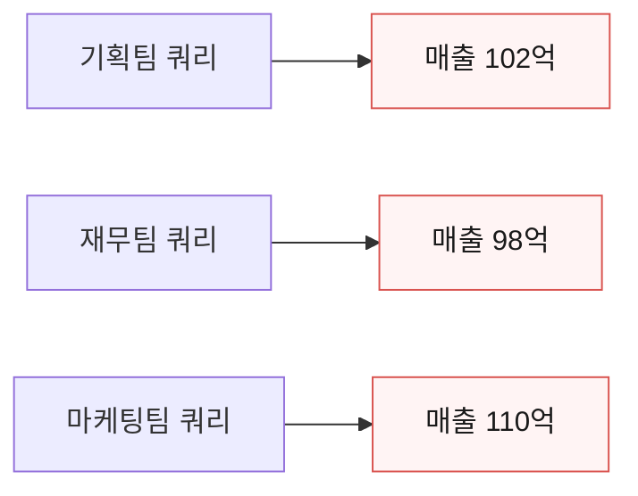

셋 다 틀리지 않았는데 회의에서 숫자가 맞지 않는다.  
그리고 회의 시간의 절반을 "그 숫자 어떻게 뽑으셨어요"에 쓴다.

그래서 시맨틱 계층은

> 조직의 비즈니스 용어와 지표를 통일하는 공통 언어

역할을 한다.

13장의 유비쿼터스 언어, 15장의 비즈니스 용어집과 같은 문제를  
BI 화면 쪽에서 푸는 장치라고 보면 된다.

---

## 25. Self-Service Analytics

전통적인 분석 조직에서는  
현업이 데이터를 보고 싶을 때 데이터팀에 요청한다.

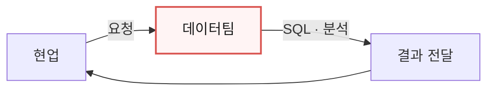

간단한 질문에도 며칠이 걸리고  
데이터팀은 단순 조회 요청에 묻힌다.

그래서 현업이 직접 하게 하자는 것이  
**Self-Service Analytics**다.

### 개발자가 아닌데 어떻게 직접 하나

여기서 바로 의문이 생긴다.

SQL을 모르는 기획자가 어떻게 데이터를 가져다 쓰는가.

답은 앞에서 만들어 둔 것들에 있다.

| 필요한 것 | 어디서 왔나 | 현업이 할 수 있게 되는 일 |
|---|---|---|
| 데이터 카탈로그 | 15장 | 「주문」으로 검색해 쓸 만한 데이터를 찾는다 |
| 시맨틱 계층 | 앞 절 | `settle_amt`가 아니라 **「매출」을 골라 쓴다** |
| 미리 만든 데이터셋 | 소비 환경 | 이미 결합·집계된 것을 그대로 쓴다 |
| BI 도구 | 앞 절 | 끌어다 놓기와 필터로 화면을 만든다 |

즉 현업이 SQL을 배우는 것이 아니라,  
**SQL이 필요 없는 지점까지 미리 깔아 두는 것**이다.

그중에서도 시맨틱 계층이 결정적이다.

`매출`이라는 항목 하나에 계산식이 이미 박혀 있으므로  
현업은 그것을 고르고 기간과 조건만 바꾸면 된다.

시맨틱 계층이 없으면 셀프서비스는 성립하지 않는다.  
결국 컬럼 이름을 물어보러 데이터팀에 가게 된다.

### 어디까지가 셀프서비스인가

물론 전부를 맡길 수는 없다.

| 현업이 스스로 하는 것 | 데이터팀이 하는 것 |
|---|---|
| 기존 지표를 기간·조건별로 본다 | 새 데이터 소스를 연결한다 |
| 만들어 둔 데이터셋을 필터하고 집계한다 | 지표 계산식을 새로 정의한다 |
| 화면을 만들고 공유한다 | 파이프라인을 만들고 운영한다 |

그래서 셀프서비스의 목적은  
**모든 직원을 데이터 엔지니어로 만드는 것이 아니다.**

현업이 간단한 질문과 탐색과 일회성 분석과 가설 검증을  
스스로 할 수 있게 하는 것이다.

그러면 데이터팀은 단순 조회 요청 대신

```text
데이터 플랫폼
데이터 품질
데이터 프로덕트
거버넌스
```

같은 일에 집중할 수 있다.

경계를 넘는 요청이 반복해서 들어온다면  
그건 현업이 욕심을 내는 것이 아니라  
**플랫폼에 빠진 것이 있다는 신호**로 보는 편이 낫다.

---
## 26. Data Discovery

셀프서비스에서는  
**Data Discovery**도 중요하다.

정형 분석은 일반적으로 질문이 먼저 있다.


반면 데이터 탐색은  
데이터를 보면서 질문을 발견하기도 한다.

```mermaid
flowchart LR
    n0["데이터 탐색"] --> n1["이상한 패턴 발견"] --> n2["왜 이런 현상이 발생했지?"] --> n3["새로운 가설"] --> n4["추가 분석"]
```

즉,

> 질문에 답하는 분석뿐 아니라  
> 새로운 질문을 발견하는 분석도 중요하다.

---

## 27. 공식 관리 데이터와 셀프서비스 데이터를 구분한다

셀프서비스를 허용하면  
각 사용자가 새로운 데이터를 만들 수 있다.

예를 들어

```text
VIP 후보군
실험용 고객 점수
특정 캠페인 사용자 그룹
```

이런 데이터를 공식 데이터와 똑같이 취급하면 문제가 발생한다.

그래서 크게 두 종류로 나눌 수 있다.

### 관리형 데이터

```text
공식 매출
공식 회원수
공식 주문 금액
```

처럼 조직에서 공식적으로 사용하는 데이터다.

다음이 명확해야 한다.

```text
정의
품질
소유자
권한
거버넌스
```

---

### 셀프서비스 데이터

사용자가 분석이나 실험 과정에서  
임시로 만든 데이터다.

빠르게 바뀔 수 있고  
공식 지표로 사용하기에는 검증이 부족할 수 있다.

따라서 조직에서는

```text
Certified
Managed
Experimental
Personal
```

같은 방식으로 데이터의 상태를 구분할 수도 있다.

---

## 28. 셀프서비스 결과를 운영화한다

셀프서비스에서 좋은 분석이 발견됐다고 하자.

처음에는 분석가 한 명이 수동으로 계산했지만  
계속 사용할 가치가 확인되었다.

그렇다면 다음 단계로 넘어가야 한다.

```mermaid
flowchart LR
    n0["실험"] --> n1["가치 검증"] --> n2["정의 정리"] --> n3["품질 검증"] --> n4["자동화"] --> n5["관리형 데이터"]
```

이를 **운영화(Operationalization)** 라고 생각할 수 있다.

즉,

> 개인의 분석을  
> 조직이 반복해서 사용할 수 있는 시스템으로 바꾸는 과정

이다.

---

## 29. 19장 정리

네 가지만 기억하면 된다.

**제공자와 소비자의 책임을 나눈다.**  
제공자는 재사용 가능한 데이터를 안정적으로 제공하고,  
소비자는 자기 목적에 맞는 변환을 책임진다.  
제공자가 모든 소비자의 요구를 직접 구현하면  
본래 업무보다 데이터 요청 대응에 시간을 더 쓰게 된다.

**소비자가 제각각 만들면 같은 문제를 여러 번 푼다.**  
그래서 공통 소비 기반이 필요하다.

**시맨틱 계층은 지표 정의를 통일하는 공통 언어다.**  
`매출`이 팀마다 다르게 계산되면  
회의에서 숫자가 맞지 않는다.

**셀프서비스의 목적은 모두를 엔지니어로 만드는 것이 아니다.**  
현업이 간단한 질문과 탐색을 스스로 할 수 있게 하고,  
데이터팀은 플랫폼과 품질에 집중하게 하는 것이다.

다음 장에서는 여기서 한 걸음 더 나간  
머신러닝과 그 운영을 본다.
