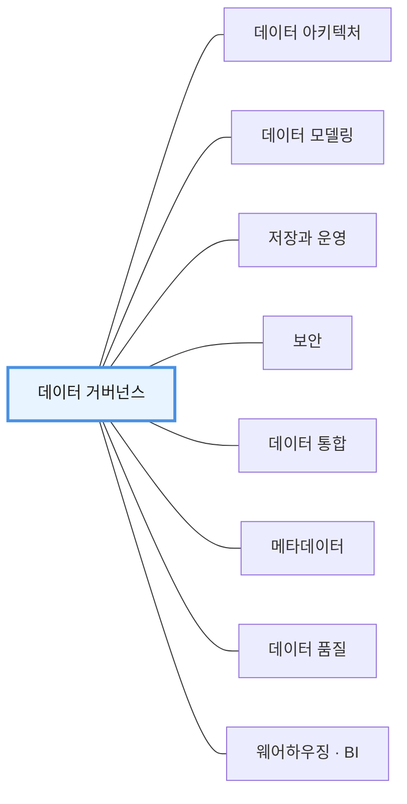
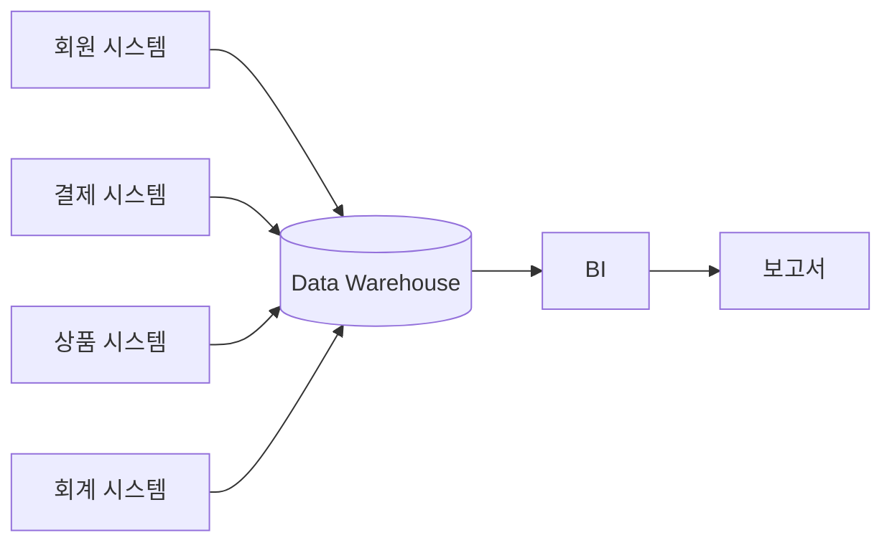
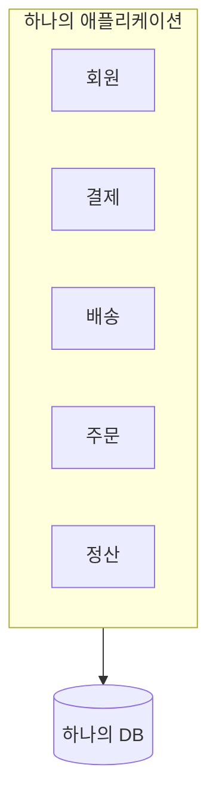
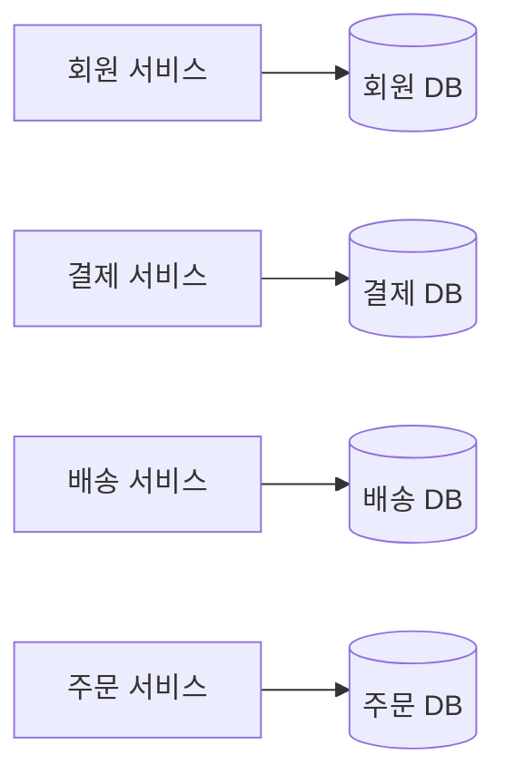
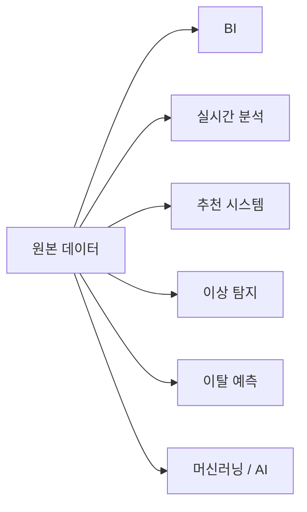

# 1장. 데이터는 이미 흩어져 있다

> **1부 · 문제** — 왜 데이터가 흩어졌고 무엇이 문제인가  
> **1장** · 2장 · 3장

*데이터는 왜 한곳에 모이지 않게 되었나*

기업이 데이터를 많이 가지고 있다고 해서  
곧바로 데이터 중심 조직이 되는 것은 아니다.

데이터 중심 조직은 필요한 데이터를 쉽게 찾고,  
그 데이터의 의미를 이해할 수 있으며,  
신뢰할 수 있는 상태로 활용할 수 있는 조직이다.

그리고 가장 중요한 것은  
데이터가 실제 비즈니스 의사결정과  
서비스 개선으로 이어져야 한다는 점이다.

현대의 데이터 환경은 과거와 크게 달라졌다.

클라우드, SaaS, 마이크로서비스, 실시간 처리,  
머신러닝과 AI가 보편화되면서  
데이터는 더 이상 한곳에만 존재하지 않는다.

이 장에서는 이러한 변화 속에서  
왜 기존의 중앙집중형 데이터 관리 방식이  
한계에 부딪히기 시작했는지 살펴본다.

---

## 1. 데이터 관리란 무엇인가

데이터 관리는 단순히  
DB를 안정적으로 운영하는 일이 아니다.

데이터가 만들어진 순간부터  
더 이상 필요하지 않아 삭제될 때까지  
전체 수명주기를 관리하는 활동이다.


이 과정에서는 계속 여러 질문이 발생한다.

```text
이 데이터는 정확한가?

누가 이 데이터를 책임지는가?

누가 사용할 수 있는가?

어디에서 만들어졌는가?

어떤 과정을 거쳐 변환되었는가?

얼마나 보관해야 하는가?

개인정보는 안전하게 보호되고 있는가?
```

따라서 데이터 관리는  
기술만의 문제가 아니다.

조직, 정책, 보안, 품질, 책임, 아키텍처가  
모두 함께 움직여야 한다.

---

## 2. 데이터 관리의 기본 틀: DAMA-DMBOK

앞 절의 말이 추상적으로 들린다면  
이 분야의 표준 체계를 한 번 보는 것이 도움이 된다.

대표적인 것이 **DAMA-DMBOK**다.

데이터 관리를 여러 전문 영역으로 나누고  
그 가운데에 **데이터 거버넌스**를 둔다.



여기서 두 가지만 읽으면 된다.

**하나, 데이터 관리는 기술 하나가 아니라 여러 영역의 묶음이다.**

앞 절에서 "조직, 정책, 보안, 품질, 책임, 아키텍처가  
모두 함께 움직여야 한다"고 한 것이 이 그림이다.

**둘, 그 가운데에 거버넌스가 있다.**

누가 어떤 기준으로 책임질지 정하지 않으면  
나머지 영역을 아무리 잘 만들어도 따로 논다.  
거버넌스는 16장 「거버넌스」에서 자세히 다룬다.

이 틀은 지금도 유용하다.

다만 현대의 분산 시스템, 클라우드, 데이터 제품,  
실시간 데이터와 같은 환경에서는  
이 기본 틀을 새로운 아키텍처 방식과 함께 해석할 필요가 있다.

즉,

**DAMA-DMBOK가 잘못됐다기보다는  
현대적인 분산 데이터 환경에 맞는 보완이 필요하다**

고 이해하는 편이 정확하다.

---

## 3. 중앙집중형 데이터 관리가 등장한 이유

과거 기업 시스템은 지금보다 비교적 단순했다.

여러 업무 시스템에서 만들어진 데이터를  
한곳에 모아 분석하는 것이 효율적이었다.

대표적인 구조가  
엔터프라이즈 데이터 웨어하우스, 즉 EDW다.



이 방식은 매우 큰 장점이 있었다.

여러 시스템에 흩어진 데이터를 통합할 수 있었고,  
회사의 공식적인 데이터를 한곳에서 관리할 수 있었다.

여기서 자주 등장하는 개념이

**Single Source of Truth**

즉, 진실의 단일 원천이다.

다만 이 개념을

> 모든 데이터를 반드시 하나의 DB에 저장한다

라고 이해하면 안 된다.

더 중요한 의미는

> 회사가 중요한 지표와 데이터에 대해  
> 어떤 정의를 공식 기준으로 사용할지 합의되어 있다

는 것이다.

예를 들어 회사에서 `매출`이라는 용어를 사용할 때

```text
결제 성공 금액 - 환불 금액
```

을 공식 매출이라고 정의했다면  
어떤 시스템에서 계산하더라도  
동일한 정의를 사용하도록 만드는 것이 중요하다.

물리적으로 데이터가 여러 곳에 존재하더라도  
정의와 기준이 일관적이라면  
Single Source of Truth의 목표를 달성할 수 있다.

---

## 4. 그런데 기업 환경이 크게 변했다

현대 기업의 애플리케이션 구조는  
점점 더 분산되고 있다.

과거에는 하나의 거대한 시스템과  
하나의 DB를 사용하는 경우가 많았다.



하지만 지금은 서비스가 여러 개로 나뉘는 경우가 많다.



여기에 클라우드와 외부 서비스까지 추가된다.

```text
사내 DB

AWS / GCP / Azure

S3

Kafka

외부 PG

외부 SaaS

AI 서비스

Data Warehouse
```

즉 데이터는 애초부터  
여러 환경에 분산되어 존재한다.

이러한 상황에서 모든 데이터를 다시 중앙으로 가져와  
하나의 팀이 모두 이해하고 관리하는 방식은  
조직이 커질수록 부담이 커질 수 있다.

여기서 중요한 점은

**중앙집중형이 잘못됐다는 뜻이 아니라는 것**이다.

조직이 작고 데이터 구조가 단순하다면  
중앙집중형 방식이 오히려 가장 효율적일 수 있다.

문제는 규모가 커지면서  
중앙 시스템과 중앙 조직이 모든 요구를 감당하기 어려워질 때다.

---

## 5. 분석과 AI가 데이터를 더욱 복잡하게 만든다

과거에는 데이터를 주로  
보고서와 통계에 사용했다.


하지만 지금은 같은 데이터를  
여러 목적으로 사용한다.



같은 사용자 데이터라도  
목적에 따라 다른 형태로 가공된다.

```text
BI용 데이터

추천 모델용 데이터

마케팅 분석용 데이터

ML 학습 데이터

실시간 처리용 데이터
```

이 과정에서 데이터가 여러 장소로 복제된다.


그리고 새로운 문제가 발생한다.

```text
어느 데이터가 최신인가?

어느 데이터가 공식 데이터인가?

왜 같은 지표인데 값이 다른가?

이 데이터를 누가 책임지는가?
```

그래서 현대 데이터 환경에서는  
데이터 자체만 관리하는 것으로 부족하다.

데이터가 **어디에 있고, 무슨 뜻이며, 누가 책임지는지**를  
함께 관리해야 한다.

---

## 6. 1장 정리

세 가지만 기억하면 된다.

**데이터 관리는 DB를 안정적으로 운영하는 일이 아니다.**  
데이터가 만들어진 순간부터 폐기될 때까지  
의미·책임·품질·보안을 함께 관리하는 활동이다.

**중앙집중형 데이터 웨어하우스는 지금도 유효하다.**  
다만 클라우드, 마이크로서비스, SaaS, AI가 보편화되면서  
데이터는 애초부터 여러 곳에 흩어져 생겨난다.

**같은 데이터가 여러 목적으로 복제되기 시작했다.**  
BI, 추천, 이상 탐지, 학습 데이터가 각각 다른 형태를 요구한다.

그 결과 새로운 질문이 생긴다.

```text
어느 데이터가 최신인가?

어느 데이터가 공식인가?

왜 같은 지표인데 값이 다른가?
```

다음 장에서는 이 질문들이  
왜 저장 기술을 바꾸는 것만으로 풀리지 않는지 본다.
