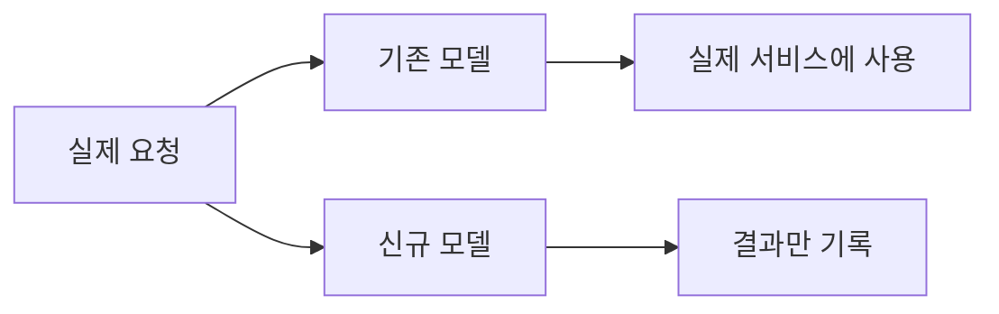
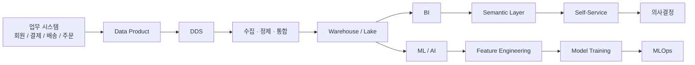

# 20장. 머신러닝과 MLOps

> **6부 · 가치** — 어떻게 성과로 바꾸는가  
> 19장 · **20장**

추천 모델을 만들어 배포했다.

석 달이 지났다.

그동안 사용자 구성은 꽤 달라졌는데  
모델 성능을 확인한 사람은 아무도 없다.

19장에서 데이터를 소비하는 환경을 만들었다.

여기서 한 걸음 더 나가면 머신러닝이 있다.

이 장에서는 모델을 만드는 이야기보다  
모델을 계속 운영하는 이야기를 주로 다룬다.

좋은 모델 하나를 만드는 것보다  
모델을 반복해서 만들 수 있는 체계가 어렵기 때문이다.

데이터 활용이 아직 그 단계가 아니라면  
이 장은 건너뛰어도 된다.

---

## 1. 고급 분석과 머신러닝

데이터 활용이 발전하면  
머신러닝을 사용할 수 있다.

예를 들어

```text
구매 가능성이 높은 사용자는 누구인가?

이탈 위험 사용자는 누구인가?

이 결제는 이상거래인가?

어떤 상품을 추천해야 하는가?
```

같은 문제를 해결할 수 있다.

하지만 여기에서 중요한 점이 있다.

> 모델을 만드는 것보다  
> 모델을 지속적으로 운영하는 것이 더 어렵다.

그래서 등장하는 것이 MLOps다.

---

## 2. MLOps란 무엇인가

MLOps는

> 머신러닝 모델을 안정적으로 개발하고,  
> 검증하고, 배포하고, 운영하기 위한 엔지니어링 체계

라고 이해하면 된다.

흔히

```text
ML + DevOps
```

라고 설명하지만, 실제로는 DevOps보다 관리 대상이 많다.

일반 애플리케이션은 주로

```text
Code
```

를 관리한다.

ML 시스템에서는 다음을 함께 관리해야 한다.

```text
Code
Data
Feature
Model
Configuration
Environment
```

---

## 3. 머신러닝 전체 생애주기

MLOps에서는 모델 하나만 보지 않고  
프로젝트 전체 흐름을 관리한다.


이 과정은 한 번으로 끝나는 것이 아니라  
계속 반복된다.

---

## 4. 프로젝트 시작부터 표준화한다

새로운 ML 프로젝트를 시작할 때마다

```text
Git 저장소
폴더 구조
환경
CI/CD
실험 기록 방식
```

을 새로 정의하면 비효율적이다.

따라서 조직에서는

```text
프로젝트 템플릿
표준 코드 구조
공통 라이브러리
공통 실행 환경
```

을 제공할 수 있다.

다만 모든 프로젝트를 똑같이 만들 필요는 없다.

반복되는 부분을 표준화하고  
특수한 부분만 개별적으로 설계하는 것이 목적이다.

---

## 5. Experiment Tracking

머신러닝 실험에서는 작은 차이만으로도  
모델 결과가 달라질 수 있다.

예를 들어

```text
데이터셋
Feature
Algorithm
Hyperparameter
Code Version
```

이 달라지면 결과도 달라진다.

그래서 실험할 때마다 다음을 기록한다.

```text
어떤 데이터를 사용했는가?

어떤 피처를 사용했는가?

어떤 파라미터인가?

성능은 얼마인가?

어떤 코드 버전인가?
```

이것을 **Experiment Tracking**이라고 한다.

MLflow 같은 도구가 대표적인 예다.

---

## 6. 재현 가능성

머신러닝에서는

```text
지난달 만들어진 모델을
오늘 동일한 조건에서 다시 만들 수 있는가?
```

가 중요하다.

이를 위해

```text
Code Version
Data Version
Feature Version
Parameter
Environment
```

를 함께 관리해야 한다.

이를 **Reproducibility**, 즉 재현 가능성이라고 한다.

---

## 7. Feature Engineering

원본 데이터를 그대로 모델에 사용하는 것보다  
새로운 의미를 가진 입력값을 만들어 사용하는 경우가 많다.

예를 들어 원본에는

```text
주문 이벤트
조회 이벤트
결제 이벤트
```

가 있을 수 있다.

이를 이용해 다음과 같은 피처를 만든다.

```text
최근 7일 주문 횟수
최근 30일 체류시간
마지막 결제 후 경과일
최근 30일 결제금액
```

이처럼 모델이 사용할 입력 변수를 만드는 과정을  
**Feature Engineering**이라고 한다.

---

## 8. Feature Store

여러 모델이 같은 피처를 반복 사용한다면  
각 팀이 따로 구현하는 것은 비효율적일 수 있다.

이때 **Feature Store**를 사용할 수 있다.

예를 들어

```text
Feature Store

user_7d_order_count
user_30d_watch_minutes
days_since_last_payment
```

처럼 공통 피처를 관리할 수 있다.

주요 장점은 다음과 같다.

```text
피처 재사용
정의 일관성
학습과 서비스 간 계산 차이 감소
유지보수 개선
```

하지만 Feature Store는  
모든 ML 시스템에 반드시 필요한 것은 아니다.

모델이 적고 피처 공유가 거의 없다면  
기존 Data Warehouse나 DB만으로도 충분할 수 있다.

즉,

> 반복적으로 사용하고 운영할 가치가 있는 피처를  
> 중앙 관리할 필요가 있을 때 도입한다.

---

## 9. 모델 제공 방식

학습한 모델을 실제 서비스에서 사용하는 방식은 여러 가지다.

대표적으로 다음 세 가지를 생각할 수 있다.

| 방식     | 특징                 | 예           |
|--------|--------------------|-------------|
| API    | 요청 시 즉시 추론         | 실시간 추천      |
| Batch  | 일정 주기로 대량 추론       | 일일 이탈예측     |
| Stream | 들어오는 이벤트를 지속적으로 추론 | 실시간 이상거래 탐지 |

여기서 `Stream 모델`이라는 별도의 모델 종류가 있는 것은 아니다.

정확히는

> 스트림으로 들어오는 이벤트를 모델이 계속 추론하는 구조

라고 이해하면 된다.

---

## 10. Model Registry

모델이 계속 만들어지면  
파일 이름만으로 관리하기 어렵다.

```text
model_v1
model_v2
model_final
model_final2
really_final
```

같은 상황이 발생한다.

그래서 **Model Registry**를 사용할 수 있다.

```text
Order Prediction

v1 → Archived
v2 → Staging
v3 → Production
```

같이 버전과 상태를 관리한다.

모델과 함께 다음 정보도 기록할 수 있다.

```text
학습 데이터
피처
성능
작성자
배포 시점
모델 버전
```

---

## 11. 모델 배포 후 모니터링

모델을 배포했다고 프로젝트가 끝나는 것은 아니다.

운영 환경에서는 계속 상태를 확인해야 한다.

```text
모델 성능
응답시간
오류율
입력 데이터 품질
입력 데이터 분포
예측 결과 분포
```

특히 시간이 지나면서  
운영 환경의 데이터가 달라질 수 있다.

---

## 12. Drift를 구분해서 이해한다

`Drift`라는 말을 하나의 현상처럼 사용하기 쉽지만  
조금 더 구분하는 것이 좋다.

### Data Drift

입력 데이터의 분포가 달라지는 현상이다.

예를 들어 예전에는

```text
20대 사용자 70%
```

였는데 어느 순간

```text
40대 사용자 60%
```

가 되었다면 입력 분포가 크게 바뀐 것이다.

---

### Prediction Drift

모델이 출력하는 예측값의 분포가 달라지는 현상이다.

예를 들어 기존에는

```text
고위험 사용자 5%
```

였는데 갑자기

```text
고위험 사용자 40%
```

가 된다면 점검이 필요하다.

---

### Concept Drift

입력과 실제 결과 사이의 관계 자체가 바뀌는 현상이다.

예전에 구매 가능성을 높이던 행동이  
시장이나 사용자 행동 변화로 더 이상 같은 의미를 가지지 않을 수 있다.

중요한 점은

> Drift가 발생했다고 해서 반드시 모델 성능이 떨어졌다는 뜻은 아니며,  
> 모델 성능 저하 역시 Drift 하나만으로 설명되는 것은 아니다.

따라서 여러 신호를 함께 봐야 한다.

---

## 13. 모델 재학습

모델은 필요할 때 다시 학습할 수 있다.

재학습 기준은 여러 방식으로 정할 수 있다.

```text
매주 재학습

신규 데이터 일정량 누적

성능 기준 이하로 하락

Data Drift 발생

중요한 비즈니스 이벤트 발생
```

다만 모든 모델을 자주 재학습할 필요는 없다.

데이터 분포가 안정적이고  
모델 성능도 유지되고 있다면  
재학습 빈도가 매우 낮아도 된다.

즉,

> 재학습 주기는 모델의 특성과 데이터 변화 속도를 기준으로 결정한다.

---

## 14. 자동 재학습과 자동 배포는 구분한다

재학습을 자동화한다고 해서


까지 자동으로 해야 하는 것은 아니다.

위험도가 높은 시스템에서는


를 사용할 수 있다.

자동화 수준 역시  
업무 위험도에 따라 결정해야 한다.

---

## 15. 안전한 모델 배포

새 모델을 만들었다고  
기존 모델을 한 번에 교체할 필요는 없다.

### A/B 테스트

```text
기존 모델 → 일부 사용자
신규 모델 → 일부 사용자
```

로 나누어 실제 서비스 지표를 비교한다.

반드시 50:50일 필요는 없다.

```text
99:1
95:5
90:10
```

처럼 작은 비율로 시작할 수도 있다.

---

### Shadow Deployment

실제 요청을 두 모델이 모두 처리하지만  
사용자에게는 기존 모델 결과만 보여준다.



신규 모델을 실제 트래픽에서  
안전하게 검증하는 방법이다.

A/B 테스트와 Shadow 방식은 유용한 선택지이지만  
모든 모델에 반드시 필요한 절차는 아니다.

---

## 16. 모델 지표와 비즈니스 지표

모델의 기술적인 정확도가 높아졌다고 해서  
반드시 비즈니스가 좋아지는 것은 아니다.

예를 들어 추천 모델의 정확도가 올라갔어도

```text
체류시간
재방문율
주문율
매출
```

이 개선되지 않았다면  
비즈니스 관점에서는 성공이라고 보기 어려울 수 있다.

따라서

```text
Model Metric
+
Business Metric
```

을 함께 본다.

예를 들어

```text
추천 정확도 ↑
      ↓
실제 체류시간 ↑
      ↓
주문 전환율 ↑
```

까지 연결되어야 한다.

---

## 17. ONNX와 모델 상호운용성

머신러닝 환경에서는  
팀마다 서로 다른 프레임워크를 사용할 수 있다.

모델을 다른 실행 환경에서도 사용할 수 있도록  
ONNX 같은 모델 교환 포맷을 활용할 수 있다.

다만

```text
ONNX로 변환하면
어디에서든 100% 동일하게 실행된다.
```

라고 생각해서는 안 된다.

연산자 지원 여부나 런타임 구현에 따라  
제약이 있을 수 있다.

따라서

> ONNX는 모델의 상호운용성을 높이는 수단

정도로 이해하는 것이 정확하다.

---

## 18. MLOps의 본질

결국 MLOps의 목적은

```text
좋은 모델 하나 만들기
```

가 아니다.

```text
좋은 모델을
반복해서 만들고
검증하고
배포하고
감시하고
개선할 수 있는 체계
```

를 만드는 것이다.

즉,

> 모델이 아니라 모델을 만드는 공장을 만드는 것

이라고 생각하면 이해하기 쉽다.

---

## 19. 표준화와 자동화

이번 장 전체에서 반복해서 등장하는 개념이 있다.

```text
표준화
자동화
재사용
```

이다.

사람이 매번

```text
DB 생성 요청
권한 요청
ETL 생성
DNS 요청
파이프라인 배포
모델 배포
```

를 직접 처리하면 속도가 느리고 실수도 생긴다.

가능한 영역은

```text
템플릿
CI/CD
Infrastructure as Code
Policy as Code
자동 테스트
자동 모니터링
```

등으로 자동화할 수 있다.

---

## 20. 코드와 환경 설정을 분리한다

환경마다 별도의 코드를 만들어 관리하는 것은 좋지 않다.

```text
dev 코드
stage 코드
prod 코드
```

를 따로 관리하면 변경이 복잡해진다.

대신 다음 구조를 사용하는 것이 좋다.

```text
공통 Code

+ Dev Config
+ Stage Config
+ Prod Config
```

DB 주소나 API Endpoint, Secret, 모델 버전 같은 값은  
코드에 직접 하드코딩하지 않고 설정으로 관리한다.

---

## 21. 거버넌스도 자동화한다

회사에서 다음과 같은 정책을 가지고 있다고 하자.

```text
개인정보는 암호화한다.

특정 데이터는 외부 공개하지 않는다.

민감정보 접근은 제한한다.

특정 지역의 저장소만 사용한다.
```

문서에 적어놓는 것만으로는  
사람의 실수를 완전히 막기 어렵다.

가능하다면 시스템이


하도록 만들 수 있다.

이를 흔히

```text
Policy as Code
```

와 같은 접근으로 구현한다.

즉,

```text
Governance
+
Automation
```

을 결합하는 것이다.

---

## 22. 이번 장 전체를 하나로 연결해 보기

19~20장에 등장한 용어가 많아서  
처음에는 각각 별개의 주제처럼 느껴질 수 있다.

하지만 하나로 연결하면 단순하다.



그리고 이 모든 것을 밑에서 지원하는 기반이 있다.

```text
Platform
Governance
Security
Metadata
Lineage
Automation
```

---

## 23. DDS, BI, MLOps의 공통점

세 개를 비교해 보면  
사실 같은 방향을 향하고 있다.

- **DDS** — 데이터 소비를 표준화하고 재사용
- **BI** — 분석과 지표를 표준화하고 재사용
- **MLOps** — ML 개발과 운영을 표준화하고 재사용

결국 조직의 데이터 활용은 다음 방향으로 발전한다.


---

## 24. 데이터가 가치가 되는 과정

이번 장의 제목인  
**데이터를 비즈니스 가치로 전환한다**는 말을 다시 생각해보자.

단순히

```text
데이터 → 분석
```

을 의미하는 것이 아니다.

전체 흐름은 더 길다.


이 연결이 만들어져야  
데이터가 실제 가치가 된다.

---

## 25. 19~20장에서 기억할 개념

이번 장에서 모든 기술 이름을 외울 필요는 없다.

다음 흐름만 이해하면 충분하다.

**데이터 프로덕트**는  
신뢰할 수 있는 데이터를 다른 소비자에게 제공한다.

**DDS**는 이 책에서 사용하는 개념으로,  
특정 유스케이스를 위해 데이터를 소비·통합·가공하는 논리적 영역이다.

**데이터 파이프라인**은  
수집·정제·변환·검증·이동을 반복 가능하게 만든다.

**Blueprint**는  
반복되는 데이터 아키텍처를 표준 템플릿으로 만든다.

**BI와 Semantic Layer**는  
기술적인 데이터를 비즈니스 사용자가 이해할 수 있는 정보로 만든다.

**Self-Service Analytics**는  
현업 사용자가 데이터팀에 매번 의존하지 않고 직접 탐색하게 한다.

**관리형 데이터**는  
가치가 검증된 데이터와 분석 결과를 공식적으로 운영한다.

**MLOps**는  
머신러닝의 데이터 준비부터 학습, 배포, 모니터링, 재학습까지 관리한다.

그리고 이 모든 것의 기반에는

```text
표준화
자동화
재사용
거버넌스
보안
메타데이터
데이터 계보
```

가 존재한다.

---

## 26. 20장 정리

> **데이터의 가치는 많이 저장하는 데서 생기는 것이 아니라,  
> 신뢰할 수 있는 데이터를 사람들이 쉽게 찾고 소비하며,  
> 반복 가능한 분석·의사결정·자동화로 연결할 수 있을 때 만들어진다.**

좋은 데이터 아키텍처의 최종 목표는  
거대한 데이터베이스를 만드는 것이 아니다.

조직의 사람들이 데이터를 믿을 수 있고,

필요한 데이터를 쉽게 찾을 수 있고,

필요한 형태로 안전하게 사용할 수 있으며,

좋은 분석과 모델이 발견되면  
그 결과를 다시 조직 전체가 사용할 수 있는 시스템으로 발전시키는 것.

그것이 **데이터를 비즈니스 가치로 전환하는 데이터 아키텍처**의 핵심이다.
