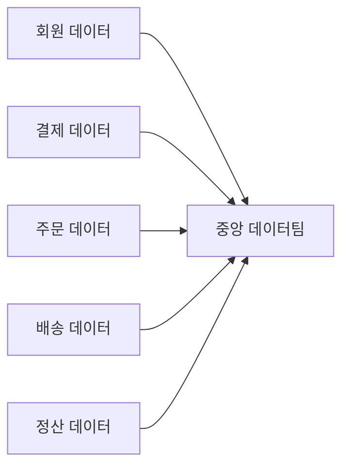
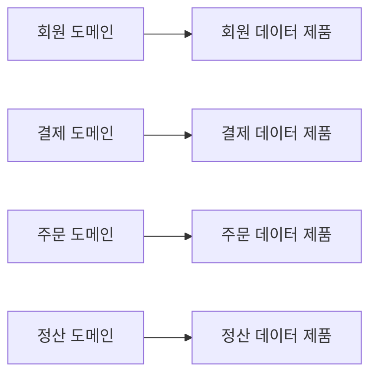
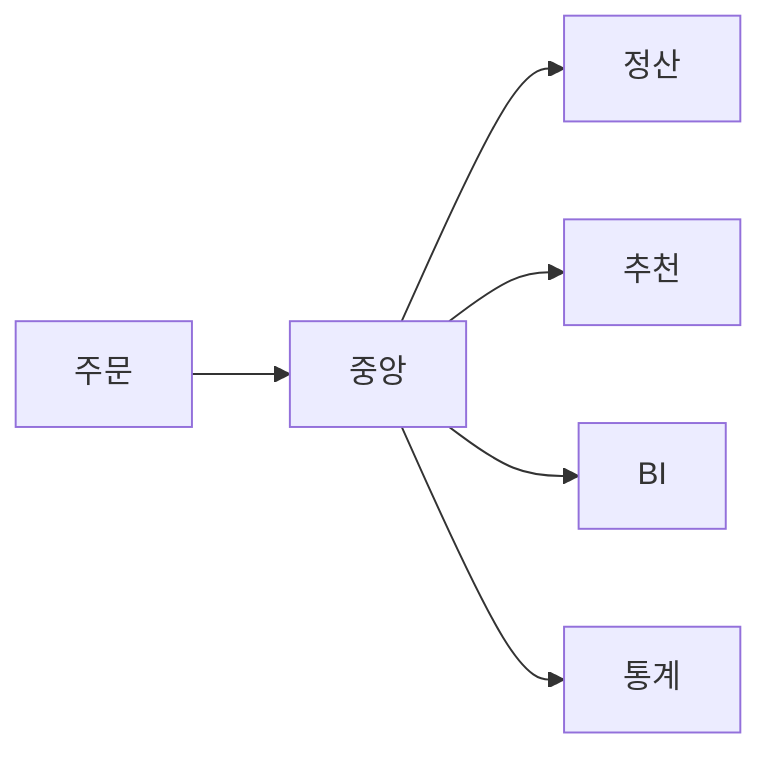
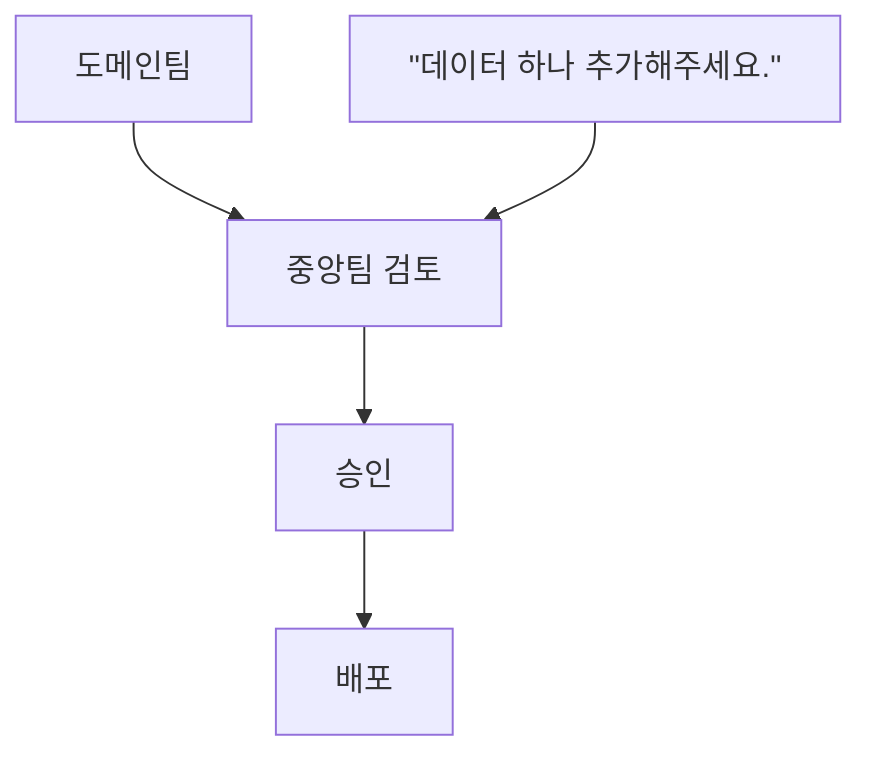
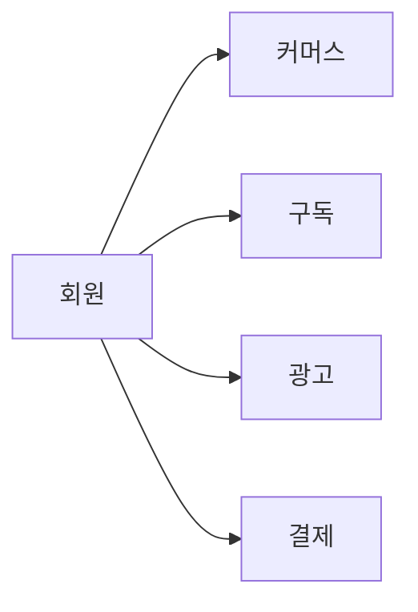
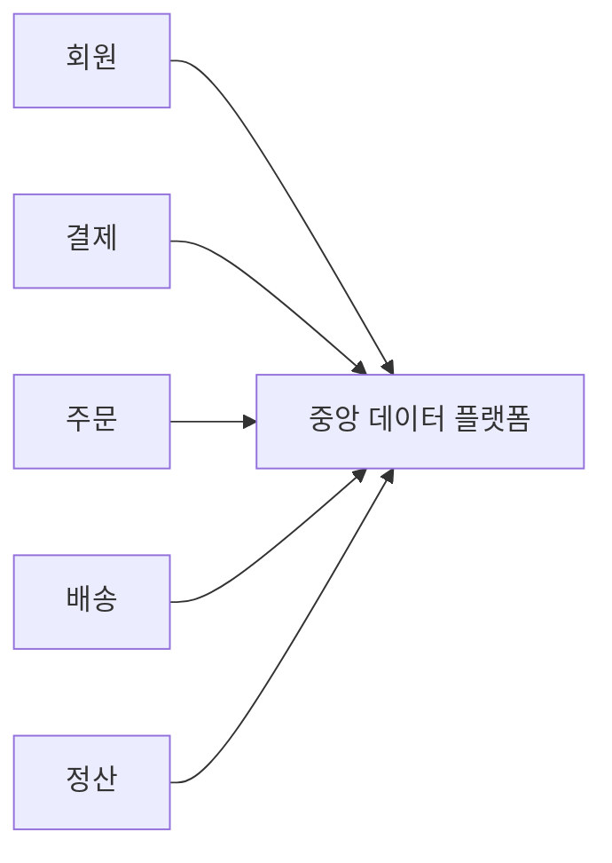
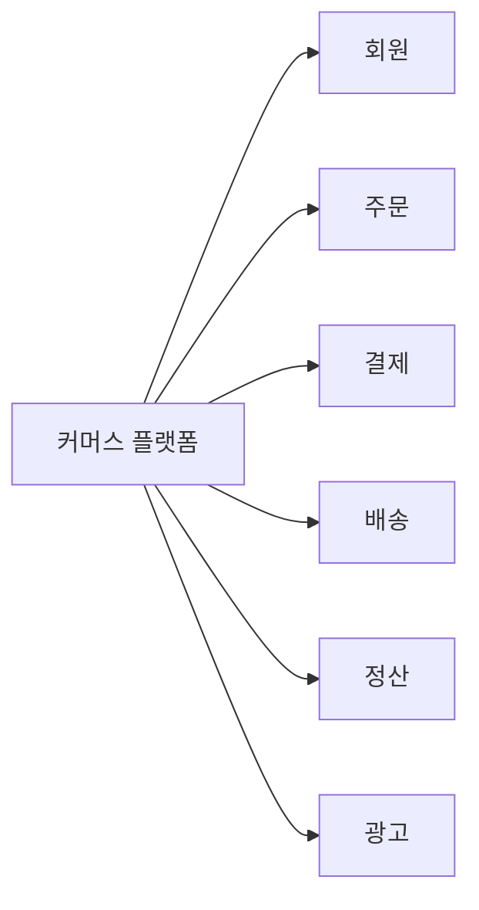

# 21장. 도메인 토폴로지

> **7부 · 실행** — 어디서부터 시작하는가  
> **21장** · 22장 · 23장

앞 장까지는 데이터 도메인이 무엇인지,  
그리고 비즈니스를 어떤 기준으로 나눠야 하는지를 살펴봤다.

이제 다음 단계로 넘어가야 한다.

```text
회원
결제
배송
주문
정산
```

이렇게 도메인을 나눴다고 해서  
아키텍처 설계가 끝난 것은 아니다.

실제 시스템을 만들려면 다음과 같은 질문에  
답해야 한다.

```text
각 도메인의 데이터는 누가 관리할까?

다른 도메인의 데이터는 어떻게 사용할까?

도메인끼리 직접 연결할까?

중앙 데이터 플랫폼을 둘까?

어떤 기능을 공통으로 제공할까?

클라우드에서는 각 도메인을 어디에 배치할까?
```

이번 장에서는 이런 문제를 다룬다.

핵심 주제는 크게 두 가지다.

```text
도메인 토폴로지
→ 도메인들을 어떻게 연결하고 운영할 것인가?

랜딩 존 토폴로지
→ 그것을 실제 클라우드 환경에
   어떻게 배치할 것인가?
```

---

## 1. 도메인 토폴로지란 무엇인가

토폴로지(Topology)는 어렵게 생각할 필요가 없다.

쉽게 말하면

> 구성 요소들이 어디에 있고,  
> 서로 어떻게 연결되어 있는지를 나타내는 구조

다.

예를 들어 회사에 다음과 같은 도메인이 있다고 하자.

```text
회원
결제
배송
주문
정산
```

도메인을 나눈 뒤에는  
이들의 관계를 정해야 한다.

예를 들어 주문 도메인은  
회원 정보가 필요할 수 있다.

정산 도메인은  
주문 결과를 필요로 할 수 있다.


그렇다면 다음을 결정해야 한다.

```text
주문이 회원 DB를 직접 조회할까?

회원 도메인이 API를 제공할까?

이벤트를 받을까?

중앙 데이터 플랫폼에서 가져올까?
```

이러한 관계를 설계하는 것이  
**도메인 토폴로지**다.

---

## 2. 먼저 알아야 할 것: 정답은 하나가 아니다

도메인 아키텍처에는  
모든 회사에 적용되는 하나의 정답이 없다.

어떤 조직은 빠른 개발과  
팀의 자율성을 중요하게 생각한다.

```text
각 팀이 기술을 선택

각 팀이 직접 운영

각 팀이 빠르게 변경
```

반대로 어떤 조직은

```text
보안

데이터 품질

규제 준수

감사

표준화
```

를 더 중요하게 생각할 수 있다.

따라서 아키텍처를 설계한다는 것은  
결국 여러 요소 사이에서 균형점을 찾는 일이다.

| 한쪽을 택하면 | 다른 쪽을 잃는다 |
|---|---|
| 자율성 | 통제 |
| 개발 속도 | 표준화 |
| 독립성 | 운영 효율 |
| 분산 | 중앙집중 |

---

## 3. 데이터 제품이란 무엇인가

도메인 구조를 이해하려면  
먼저 **데이터 제품(Data Product)** 개념이 필요하다.

6장에서 본 것처럼 데이터 제품은  
DB 테이블이나 파일 하나를 뜻하지 않는다.

다른 사람이 신뢰하고 사용할 수 있도록  
의미·품질·소유자·접근 방법까지 함께 관리한 데이터다.

무엇을 갖춰야 데이터 제품이라고 부를 수 있는지는  
13장에서 다뤘다.

이 장에서는 데이터 제품을  
도메인이 외부에 내놓는 단위 정도로 생각하면 충분하다.

---

## 4. 데이터 메시와 도메인 소유권

데이터 메시(Data Mesh)를 이야기할 때  
가장 중요한 개념 중 하나가

**도메인 중심 데이터 소유권**이다.

기존에는 이런 구조가 많았다.



모든 데이터를 중앙 데이터팀이 관리한다.

문제는 중앙 데이터팀이  
모든 비즈니스 의미를 정확히 알기 어렵다는 것이다.

예를 들어 주문 데이터는  
주문 서비스를 만드는 팀이 가장 잘 이해한다.

그래서 데이터 메시에서는

```text
회원 데이터 → 회원 도메인

결제 데이터 → 결제 도메인

주문 데이터 → 주문 도메인
```

처럼 데이터의 비즈니스 책임을  
해당 도메인에 가깝게 둔다.

---

## 5. 데이터 메시의 핵심 원칙

데이터 메시의 핵심은  
특정 네트워크 구조나 특정 제품이 아니다.

3장에서 본 네 가지 원칙,
즉 도메인 소유권·데이터 제품·셀프서비스 플랫폼·연합형 거버넌스가
함께 있어야 한다.

따라서

```text
데이터 메시
= 모든 것을 완전히 분산
```

이라고 이해하면 안 된다.

공통 플랫폼이나 중앙 인프라도 충분히 사용할 수 있다.

---

## 6. 도메인 토폴로지 패턴

이제 여러 가지 도메인 구조를 살펴보자.

여기서 중요한 주의사항이 있다.

앞으로 나오는

```text
완전 연합형

거버넌스 기반

부분 연합형

가치 사슬 정렬형

큰 단위 도메인

중앙집중형
```

같은 이름은

> 데이터 아키텍처 업계에서 반드시 따라야 하는  
> 공식 표준 분류

라고 생각하면 안 된다.

조직의 중앙화와 분산 정도를 이해하기 위한  
**대표적인 설계 패턴**으로 보는 것이 좋다.

---

## 7. 완전 연합형 도메인 토폴로지

가장 분산된 구조부터 살펴보자.

완전 연합형에서는  
각 도메인이 자신의 데이터를 직접 책임진다.



각 도메인은 상당한 자율성을 가진다.

예를 들어

```text
데이터 구조

품질 기준

데이터 제품

배포 방식

기술 선택
```

을 자체적으로 결정할 수 있다.

---

## 8. 완전 연합형의 장점

가장 큰 장점은  
**도메인의 자율성**이다.

주문 데이터를 가장 잘 이해하는 사람이  
주문 도메인 개발자라면,

주문 데이터에 대한 중요한 판단도  
그 팀이 하는 것이 자연스럽다.

중앙팀에게 매번 요청하지 않아도 되므로

```text
변경 속도 ↑

도메인 전문성 ↑

자율성 ↑
```

을 기대할 수 있다.

---

## 9. 자율성이 '마음대로'를 의미하지는 않는다

도메인이 자율적으로 운영된다고 해서

```text
각 팀 마음대로 하면 된다
```

는 뜻은 아니다.

조직 전체에서 반드시 지켜야 하는  
공통 규칙은 존재한다.

예를 들면

```text
개인정보 정책

접근 권한 규칙

보안 정책

메타데이터 규칙

데이터 표준
```

등이다.

따라서 이상적인 형태는

- **도메인 내부의 세부 구현** — 도메인이 결정
- **회사 공통 원칙** — 모두 준수

다.

이를 **연합형 거버넌스** 관점으로  
이해하면 된다.

---

## 10. Peer-to-Peer는 하나의 방식일 뿐이다

완전 분산된 구조에서는  
도메인들이 직접 데이터를 주고받을 수도 있다.

```text
회원 ↔ 결제

회원 ↔ 주문

주문 ↔ 배송

주문 ↔ 정산
```

이런 방식을 Peer-to-Peer라고 생각할 수 있다.

하지만 중요한 점이 있다.

> 데이터 메시가 Peer-to-Peer 구조를  
> 반드시 요구하는 것은 아니다.

도메인들은 공통 플랫폼이나  
이벤트 플랫폼 등을 통해 연결될 수도 있다.

Peer-to-Peer는  
가능한 연결 방식 중 하나일 뿐이다.

---

## 11. 도메인이 많아지면 연결 문제가 생긴다

도메인이 3~4개 정도라면  
직접 연결도 큰 문제가 아닐 수 있다.

하지만 도메인이 수십 개가 되면  
연결 관계가 복잡해진다.

관리해야 하는 것도 늘어난다.

```text
네트워크

인증

권한

API 버전

이벤트 스키마

장애 대응

데이터 계약
```

즉,

```text
도메인 자율성 ↑

하지만

전체 복잡도 ↑
```

라는 트레이드오프가 생긴다.

---

## 12. 지나치게 작은 데이터 제품도 문제다

데이터 제품을 작게 나누면  
독립성과 재사용성이 좋아질 수 있다.

하지만 지나치게 작게 나누면  
데이터 소비자가 힘들어진다.

예를 들어 하나의 분석을 위해

```text
회원 제품

배송 제품

주문 제품

결제 제품

정산 제품
```

을 모두 찾아야 할 수도 있다.

그러면

```text
데이터 검색

권한 요청

스키마 이해

조인

품질 확인
```

같은 작업이 증가한다.

따라서 데이터 제품 역시

> 작을수록 무조건 좋은 것이 아니다.

---

## 13. 완전 연합형이 어려운 이유

완전 연합형은 매력적이지만  
실제로 운영하려면 높은 성숙도가 필요하다.

첫 번째 문제는  
**표준화**다.

예를 들어 같은 회원 ID를

```text
user_id

member_id

member_no

customer_seq
```

처럼 도메인마다 다르게 사용할 수 있다.

시간 표현도

```text
2026-09-15

20260915

2026-09-15T10:30:00+09:00
```

처럼 달라질 수 있다.

이런 차이가 누적되면  
데이터 통합이 어려워진다.

---

## 14. 전문 인력 문제

각 도메인이 데이터 제품까지 직접 운영하려면  
단순한 서비스 개발 능력만으로는 부족할 수 있다.

필요한 역량의 예는 다음과 같다.

```text
DataOps

클라우드

보안

데이터 모델링

데이터 품질

카탈로그

오케스트레이션

관측성
```

도메인이 많아질수록  
이런 역량을 가진 인력이 더 많이 필요해진다.

그래서 완전 연합형은

```text
높은 기술 성숙도

높은 자동화 수준

잘 구축된 Self-Service 플랫폼
```

이 있는 조직에서 더 현실적이다.

---

## 15. 거버넌스 기반 도메인 토폴로지

완전 연합형의 복잡도를 줄이기 위해  
중앙 기능을 일부 도입할 수 있다.

핵심 개념은 다음과 같다.

> 데이터의 비즈니스 책임은 도메인에 두면서,  
> 공통 배포와 거버넌스 기능은 중앙에서 제공한다.

예를 들면


과 같은 구조다.

---

## 16. 중앙 배포 계층

예를 들어 주문 데이터가

```text
정산

추천

BI

통계
```

에서 필요하다고 하자.

직접 연결한다면

```text
주문 → 정산

주문 → 추천

주문 → BI

주문 → 통계
```

가 된다.

중앙 배포 계층을 사용하면



처럼 만들 수 있다.

---

## 17. 중앙 계층에서 제공할 수 있는 기능

공통 계층에서는 다음과 같은 일을 할 수 있다.

```text
스키마 검사

권한 검사

데이터 마스킹

데이터 라우팅

메타데이터 등록

품질 검사

감사 로그
```

이렇게 하면  
모든 도메인이 동일한 기능을 다시 만들 필요가 없다.

---

## 18. 중앙화의 가장 큰 위험

중앙 기능이 많아지면  
다시 중앙팀이 병목이 될 수 있다.

예를 들어



과정이 오래 걸리면  
도메인의 자율성과 속도가 사라진다.

따라서 중앙 플랫폼의 이상적인 모습은

```text
중앙팀이 직접 작업

X

중앙팀이 Self-Service 플랫폼 제공

O
```

에 가깝다.

---

## 19. 부분 연합형 도메인 토폴로지

현실에서는 모든 팀의 기술 수준이 같지 않다.

예를 들어

- **신규 서비스팀** — 클라우드 / 자동화에 익숙
- **레거시 서비스팀** — 기존 시스템 유지가 우선

일 수 있다.

이럴 때는 서로 다른 운영 방식을  
함께 사용할 수 있다.

- **성숙한 도메인** — 높은 자율성
- **지원이 필요한 도메인** — 중앙 플랫폼 지원

이런 방식을 부분 연합형이라고 이해할 수 있다.

---

## 20. 부분 연합형의 위험

운영 방식이 섞이면  
책임이 애매해질 수 있다.

예를 들어

- **원본 데이터** — 도메인 팀
- **데이터 제품** — 중앙 데이터팀

이라고 하자.

데이터가 잘못됐을 때

```text
도메인팀
"우리가 준 데이터는 정상입니다."

중앙팀
"원본부터 이상했습니다."
```

라는 문제가 생길 수 있다.

따라서

> 누가 무엇을 책임하는지

명확하게 정의해야 한다.

---

## 21. 가치 사슬 정렬 도메인 토폴로지

도메인을 개별 기능만으로 보지 않고  
하나의 **비즈니스 가치 흐름**으로 묶을 수도 있다.

이를 이해하려면  
가치 사슬(Value Chain)을 알아야 한다.

가치 사슬은

> 고객에게 하나의 가치를 제공하기 위해  
> 여러 업무가 연결되는 흐름

이다.

---

### 예시: 쇼핑몰


이러한 흐름 전체가  
하나의 가치 사슬이 될 수 있다.

---

### 예시: 마켓플레이스 판매자


이 도메인들은 서로 다른 책임을 가지지만  
하나의 강한 비즈니스 흐름을 만든다.

그래서 하나의 큰 가치 흐름 안에서  
관련 도메인을 그룹화할 수 있다.

---

## 22. 가치 사슬 구조의 장점

같은 가치 사슬 안에 있는 도메인들은  
서로 데이터를 많이 주고받는다.

따라서 가까운 곳에 배치하거나  
공통 정책을 적용하면 효율적일 수 있다.

예를 들어

- **같은 가치 사슬 내부** — 비교적 유연한 데이터 공유
- **가치 사슬 외부** — 명확한 데이터 계약

같은 구조를 만들 수 있다.

---

## 23. 공유 도메인의 문제

하지만 모든 도메인이  
하나의 가치 사슬에만 속하는 것은 아니다.

대표적인 예가 회원이다.



여러 비즈니스 영역에서 동시에 사용한다.

이런 도메인은

```text
공통 도메인

공유 도메인

독립 플랫폼 도메인
```

같은 별도 전략이 필요할 수 있다.

---

## 24. 큰 단위로 나눈 도메인

오래된 대기업에서는  
비즈니스 기준보다 기존 시스템이나 조직 기준으로  
큰 덩어리가 만들어져 있는 경우가 많다.

예를 들어

```text
한국 플랫폼

일본 플랫폼

광고 플랫폼

커머스 플랫폼
```

처럼 나뉘어 있을 수 있다.

각 플랫폼 안에는  
수십~수백 개 시스템이 들어 있을 수 있다.

---

## 25. 큰 단위 도메인의 문제

가장 큰 문제는  
**비즈니스 경계와 시스템 경계가 일치하지 않는다는 것**이다.

예를 들어

- **플랫폼 A** — 회원 존재
- **플랫폼 B** — 회원 존재
- **플랫폼 C** — 회원 존재

라면 이런 문제가 생긴다.

```text
누가 회원의 실제 소유자인가?

어느 회원 데이터가 기준인가?

회원 데이터 품질은 누가 책임지는가?
```

따라서

> 현재 시스템 구조가  
> 반드시 올바른 도메인 구조인 것은 아니다.

---

## 26. 도메인은 비즈니스 기준으로 나눈다

다음과 같은 기준으로 도메인을 나누는 것은  
조심해야 한다.

```text
서버

DB

기존 애플리케이션

개발팀 이름
```

도메인의 가장 중요한 기준은

```text
비즈니스 책임

비즈니스 능력

데이터 소유권
```

이다.

물론 현실에서는 조직과 시스템 구조도 고려하지만,  
출발점은 비즈니스가 되어야 한다.

---

## 27. 공통으로 쓰는 핵심 데이터는 기준이 필요하다

도메인을 나누면 회원이나 상품처럼  
여러 도메인이 함께 쓰는 데이터가 남는다.

이런 핵심 데이터를 일관된 기준으로 관리하는 체계를  
**MDM(Master Data Management)** 이라고 한다.

시스템마다 같은 회원을 `member_id`, `user_no`, `customer_seq`로  
다르게 부른다면 데이터를 맞추기 어렵다.  
교환할 때 쓸 공통 표현을 정해 두기도 하는데  
이를 **Canonical Model**이라고 부른다.

둘 다 18장 「마스터 데이터 관리」에서 자세히 다룬다.

여기서는 토폴로지를 정할 때  
도메인에 맡길 데이터와 전사 기준이 필요한 데이터를  
구분해야 한다는 점만 기억하면 된다.

## 28. 중앙집중형 도메인 토폴로지

이번에는 중앙화 정도가 높은 구조다.



중앙 플랫폼은

```text
데이터 저장

데이터 변환

품질 관리

메타데이터

카탈로그

공통 분석
```

같은 기능을 담당한다.

---

## 29. 중앙집중형의 장점

각 팀이 같은 기능을  
반복해서 만들지 않아도 된다.

예를 들어

```text
Spark

Kafka

Airflow

데이터 카탈로그

데이터 품질 도구
```

를 각 팀이 하나씩 운영하기보다  
공통 플랫폼으로 제공할 수 있다.

장점은

```text
운영 비용 절감

기술 표준화

데이터 재사용

보안 관리 단순화
```

다.

---

## 30. 중앙집중형의 단점

중앙팀으로 일이 집중될 수 있다.


또한 조직 문화가

```text
데이터 문제
= 중앙 데이터팀 문제
```

가 되어버릴 수도 있다.

그래서 다음과 같이 책임을 구분하는 것이 좋다.

- **공통 기술 플랫폼** — 플랫폼팀
- **데이터의 비즈니스 의미와 품질** — 도메인팀

---

## 31. 중앙화와 분산은 스펙트럼이다

중앙화와 분산을

```text
중앙집중
VS
분산
```

으로만 보면 안 된다.

실제로는 그 사이에 많은 형태가 있다.


그리고 하나의 회사에서도  
여러 형태를 동시에 사용할 수 있다.

예를 들면

- **규제 데이터** — 중앙 관리
- **추천 데이터** — 자율성 높음
- **레거시** — 중앙 지원
- **신규 플랫폼** — Self-Service

같은 형태다.

---

## 32. 좋은 도메인 경계

도메인 경계를 설계할 때  
가장 중요한 원칙 중 하나는

> **높은 응집도와 낮은 결합도**

다.

---

### 높은 응집도

같이 변경되는 비즈니스 기능은  
가까이 배치한다.

예를 들어 주문 처리 안에서

```text
주문 요청

주문 기록

관련 정책 계산
```

처럼 매우 밀접한 기능은  
같은 도메인 안에 있을 수 있다.

---

### 낮은 결합도

다른 도메인의 내부 구조에  
직접 의존하지 않는다.

예를 들어


이라면 정산이 주문 DB 내부 구조를  
직접 알아야 하는 것보다

```text
API

이벤트

데이터 제품
```

같은 명확한 경계를 통해  
데이터를 전달받는 것이 좋다.

---

## 33. 너무 큰 도메인도 좋지 않다

다음처럼 모든 것을 하나에 넣으면



다시 거대한 사일로가 될 수 있다.

---

## 34. 너무 작은 도메인도 좋지 않다

반대로

```text
회원 닉네임

회원 프로필

회원 설정

회원 등급

회원 인증
```

을 모두 독립 도메인으로 만들면  
의존성과 통신이 지나치게 많아질 수 있다.

따라서 도메인은

> 비즈니스 책임과 변경 단위를 기준으로  
> 적절한 크기를 찾는 것이 중요하다.

---

## 35. 21장 정리

네 가지만 기억하면 된다.

**중앙화와 분산은 양자택일이 아니라 스펙트럼이다.**  
완전 중앙집중과 완전 연합 사이에  
여러 형태가 있다.

**완전 연합형은 매력적이지만 높은 성숙도를 요구한다.**  
표준화, 자동화, 셀프서비스 플랫폼,  
그리고 각 도메인의 데이터 역량이 함께 있어야 한다.

**한 회사 안에서도 데이터마다 다른 방식을 쓸 수 있다.**  
규제 데이터는 중앙에서,  
실험 성격의 데이터는 자율성 높게 운영하는 식이다.

**도메인은 비즈니스 책임으로 나눈다.**  
서버, DB, 기존 애플리케이션, 팀 이름은  
출발점이 되기 어렵다.

다음 장에서는 이 구조를 실제로 지탱하는  
플랫폼과 조직을 본다.
