# 22장. 플랫폼과 조직

> **7부 · 실행** — 어디서부터 시작하는가  
> 21장 · **22장** · 23장

아키텍처 가이드 문서를 잘 만들어 공유했다.

API 규칙, 이벤트 규칙, 도메인 경계,  
데이터 품질 기준까지 꼼꼼히 정리했다.

여섯 달이 지났다.  
문서대로 하는 팀은 거의 없다.

좋은 아키텍처 문서를 만들었다고  
조직이 그대로 움직이지는 않는다.

이 장에서는 기술 바깥의 문제를 다룬다.

도메인 팀과 플랫폼 팀의 역할,  
팀 사이의 상호작용 방식,  
그리고 좋은 방법을 조직에 정착시키는 법이다.

플랫폼의 목표는 대신 해주는 것이 아니라  
다른 팀이 스스로 할 수 있게 만드는 것이다.

---

## 1. 좋은 기술만으로 조직은 바뀌지 않는다

여기까지는 주로 기술을 이야기했다.

하지만 데이터 아키텍처를 바꾸는 것은  
기술만의 문제가 아니다.

다음 요소가 함께 바뀌어야 한다.

```text
기술
+
프로세스
+
조직
+
사람
+
문화
```

Kafka를 설치하고  
API Gateway를 도입했다고 해서  
회사 전체 아키텍처가 자동으로 좋아지는 것은 아니다.

---

## 2. 도메인 팀

도메인 팀은 특정 비즈니스 영역을 책임진다.

예를 들면:

```text
회원 팀
결제 팀
주문 팀
배송 팀
정산 팀
```

도메인 팀은 단순히 프로그램만 개발하는 것이 아니라  
자신의 비즈니스 영역과 데이터에 대한 책임을 가진다.

예를 들어 주문 팀이라면

```text
주문 비즈니스 규칙

주문 애플리케이션

주문 데이터 모델

주문 데이터 품질

주문 API / Event

주문 Data Product
```

등을 책임질 수 있다.

핵심은

> **도메인 데이터의 주인은  
> 해당 비즈니스를 가장 잘 이해하는 도메인 팀이다.**

라는 생각이다.

---

## 3. 중앙 데이터 플랫폼 팀

도메인 팀이 자기 데이터를 책임진다고 해서  
모든 기술을 직접 만들어야 하는 것은 아니다.

예를 들어 주문팀마다

```text
Kafka
데이터 파이프라인
CI/CD
모니터링
데이터 카탈로그
저장소
```

를 처음부터 직접 구축한다면  
중복 작업이 너무 많아진다.

그래서 중앙 데이터 플랫폼 팀이  
공통 기반을 제공할 수 있다.

---

## 4. 플랫폼 팀의 목표는 대신 해주는 것이 아니다

데이터 제품이 몇 개 없을 때는  
중앙팀이 직접 많은 작업을 처리할 수 있다.

하지만 팀이 늘어나면 이렇게 된다.

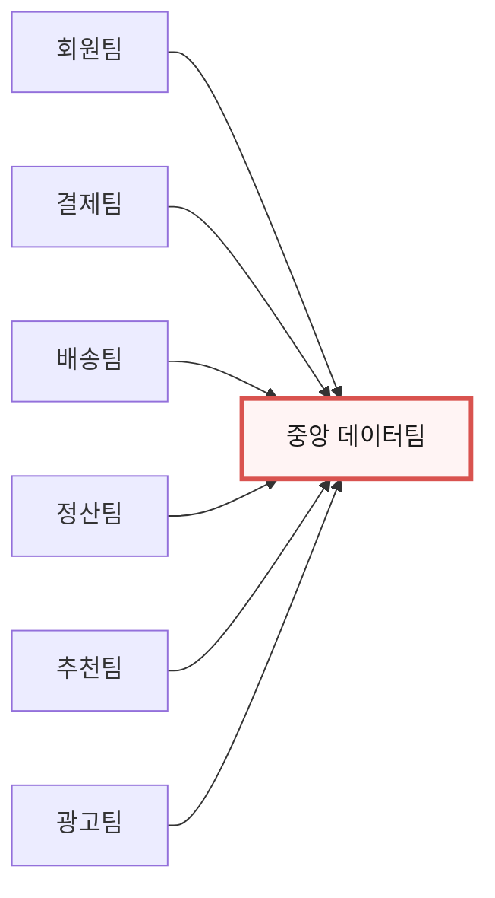

들어오는 요청도 비슷하다.

```text
"Kafka Topic 만들어 주세요."
"DB 만들어 주세요."
"권한 주세요."
"Dashboard 만들어 주세요."
```

결국 플랫폼 팀이 새로운 병목이 된다.

### 그래서 역할을 바꾼다

> 플랫폼 팀은 모든 일을 대신 처리하는 팀이 아니라  
> 다른 팀이 안전하게 **스스로** 처리할 수 있도록  
> 기반을 만드는 팀이다.

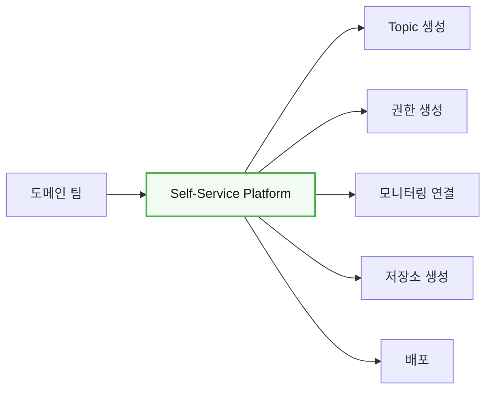

도메인 팀이 매번 티켓을 만들지 않고  
일반적인 데이터 작업을 직접 할 수 있게 하는 것이다.

플랫폼이 제공할 수 있는 것은 이런 것들이다.

```text
데이터 저장소 생성
파이프라인 생성
접근 권한 요청
모니터링 연결
카탈로그 등록
품질 검사 설정
```

### 자유롭게 하라는 뜻은 아니다

셀프서비스라고 해서 아무렇게나 해도 된다는 말이 아니다.

오히려 반대다.

> **올바른 방법을 가장 쉽게 쓸 수 있게 만드는 것**

이것이 핵심이다.

---

## 5. 인프라·클라우드 역량

조직에는 보다 기초적인 기술 기반도 필요하다.

예를 들어:

```text
Cloud
Compute
Network
Storage
Kubernetes
IAM
Monitoring
비용 관리
```

등이다.

조직에 따라

```text
인프라 팀
데이터 플랫폼 팀
```

을 따로 둘 수도 있고,

작은 조직에서는 하나의 플랫폼 조직이  
함께 담당할 수도 있다.

중요한 것은

> 팀 이름보다 책임과 인터페이스가 명확한가

이다.

또한

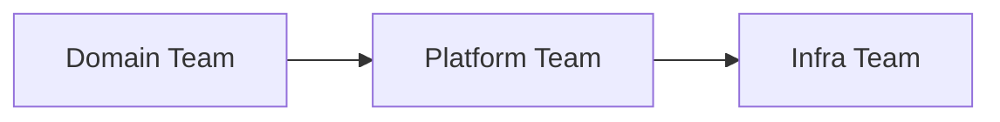

을 반드시 수직적인 조직 계층으로 이해할 필요도 없다.

서로 서비스를 제공하고 협업하는 관계라고 보는 편이 낫다.

---

## 6. Team Topologies

팀을 어떻게 나눌지 이야기할 때 자주 인용되는 모델이 있다.

**Team Topologies**는 팀의 종류와 팀 사이의 관계를 다룬  
책이자 그 모델의 이름이다.

출발점은 오래된 관찰 하나다.

> 시스템 구조는 결국  
> 그것을 만든 조직의 소통 구조를 닮는다.

하나의 서비스를 세 팀이 나눠 만들면  
그 서비스는 세 조각으로 갈라지기 쉽다.

거꾸로 말하면, 아키텍처를 바꾸고 싶으면  
**팀 구조도 함께 봐야 한다**는 뜻이다.

이 모델은 팀을 네 종류로 나눈다.

| 팀 유형 | 한 줄로 |
|---|---|
| **Stream-Aligned** | 하나의 비즈니스 흐름을 처음부터 끝까지 책임진다 |
| **Platform** | 다른 팀이 쓸 공통 기반을 제공한다 |
| **Enabling** | 다른 팀의 역량을 키워 주고 빠진다 |
| **Complicated Subsystem** | 전문성이 아주 높은 부분을 맡는다 |

대부분의 팀은 첫 번째다.  
나머지 셋은 첫 번째 팀이 빨리 움직이도록 돕기 위해 존재한다.

하나씩 보자.

---

## 7. Stream-Aligned Team

특정 비즈니스 가치 흐름을  
지속적으로 책임지는 팀이다.

예를 들면:

```text
회원 팀
결제 팀
주문 팀
배송 팀
```

등을 생각할 수 있다.

단순히 API 하나만 만드는 것이 아니라  
해당 영역의 비즈니스 가치를 end-to-end로 책임한다.

도메인 팀과 상당히 비슷하게 생각할 수 있다.

---

## 8. Enabling Team

Enabling Team은 다른 팀이  
새로운 기술이나 업무 방식을 익히도록 돕는다.

예를 들어:

```text
DDD 전문가
Kafka 전문가
데이터 모델링 전문가
보안 전문가
```

등이 다른 팀을 지원할 수 있다.

중요한 것은 일을 계속 대신해주는 것이 아니다.

목표는

```text
교육
코칭
가이드
컨설팅
```

을 통해 다른 팀이  
결국 스스로 할 수 있게 만드는 것이다.

---

## 9. Complicated Subsystem Team

일반적인 개발 역량만으로 다루기 어려운  
전문적인 시스템을 담당하는 팀이다.

예를 들어:

```text
영상 인코딩 엔진

검색 엔진

특수 추천 알고리즘

고성능 처리 엔진

복잡한 ML 시스템
```

같은 영역이다.

해당 기술에 높은 전문성이 필요한 경우  
별도의 전문 팀을 두는 것이 더 효과적일 수 있다.

---

## 10. Platform Team

Platform Team은 여러 Stream-Aligned Team이  
공통으로 사용할 기술 기반을 제공한다.

예를 들면:

```text
CI/CD
배포 플랫폼
데이터 플랫폼
관측성
클라우드 환경
개발자 플랫폼
```

등이다.

Platform Team의 중요한 목표는

> 다른 팀이 인프라와 기술의 복잡성을 덜 신경 쓰고  
> 비즈니스 개발에 집중하도록 만드는 것

이다.

---

## 11. 중요한 것은 팀 사이의 관계다

팀을 네 종류로 나누는 것이 전부가 아니다.

더 중요한 것은 **팀끼리 어떻게 주고받느냐**다.

같은 두 팀이라도 관계를 맺는 방식에 따라  
일하는 속도가 크게 달라진다.

이 모델은 그 방식을 세 가지로 나눈다.

### Collaboration — 한동안 같이 일한다

두 팀이 바짝 붙어 함께 만든다.  
매일 이야기하고 같이 설계한다.

새 영역을 개척할 때, 아직 무엇을 만들지 모를 때 쓴다.

대신 비용이 크다.  
두 팀의 시간이 모두 들어가고 책임 경계도 흐려진다.

> 그래서 Collaboration은 **한시적으로** 쓴다.

### X-as-a-Service — 만들어 둔 것을 가져다 쓴다

한 팀이 만든 것을 다른 팀이 문서 보고 알아서 쓴다.  
서로 이야기할 일이 거의 없다.

플랫폼 팀이 도메인 팀을 대하는 기본 방식이다.  
앞에서 본 셀프서비스가 바로 이 모드다.

### Facilitation — 도와주고 빠진다

한 팀이 다른 팀을 일정 기간 도와 역량을 키워 준다.  
그리고 손을 뗀다.

Enabling 팀의 방식이다.

### 관계는 고정이 아니다

이 셋이 **상황에 따라 바뀐다**는 점이 핵심이다.

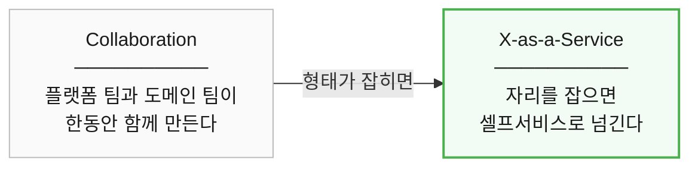

새 기능을 만들 때는 플랫폼 팀과 도메인 팀이  
한동안 Collaboration으로 함께 만든다.

형태가 잡히면 셀프서비스로 넘기고 손을 뗀다.

**Collaboration이 끝나지 않고 계속된다면**  
그건 아직 플랫폼으로 만들지 못했다는 신호다.

즉 목표는 조직 상자를 예쁘게 그리는 것이 아니라

> **팀 간 의존성을 줄이고  
> 비즈니스 변화가 빠르게 흐르도록 만드는 것**

이다.

---

## 12. 조직에 좋은 패턴을 어떻게 정착시킬까?

좋은 아키텍처 문서를 만들었다고 하자.

```text
API 규칙
Event 규칙
도메인 경계
데이터 품질 기준
```

을 모두 정리했다.

하지만 문서를 만든 것만으로  
개발팀이 자동으로 따라오는 것은 아니다.

따라서 새로운 방식을 실제 조직에  
정착시키는 과정이 필요하다.

---

## 13. Playbook

Playbook은 원래 스포츠에서 쓰는 말이다.  
상황별 작전을 모아 둔 책이다.

여기서는

> 자주 마주치는 상황마다  
> "이럴 땐 이렇게 하더라"를 모아 둔 문서

를 뜻한다.

앞 절에서 문서를 만들어도 따라오지 않는다고 했는데  
이것도 문서 아닌가 싶을 수 있다.

성격이 다르다.

| | 무엇을 적나 |
|---|---|
| 규칙 문서 | 반드시 이렇게 해라 |
| **Playbook** | 이런 상황에는 이런 선택지가 있고, 우리는 이렇게 해왔다 |

강제가 아니라 **먼저 해본 사람의 기록**이다.

예를 들어 API Playbook에는 다음과 같은 내용이 들어갈 수 있다.

```text
언제 사용하는가?

Timeout은 어떻게 하는가?

Retry는 언제 하는가?

Idempotency는 어떻게 보장하는가?

Circuit Breaker는 필요한가?
```

이벤트 Playbook에는

```text
이벤트 이름은 어떻게 정하는가?

Schema는 어떻게 관리하는가?

중복 처리는 어떻게 하는가?

재처리는 어떻게 하는가?

실패한 이벤트는 어떻게 처리하는가?
```

등을 담을 수 있다.

새 팀이 API를 만들 때  
Timeout과 Retry를 처음부터 고민하지 않아도 된다.  
이미 겪은 사람이 정리해 뒀기 때문이다.

다만 Playbook도 결국 문서다.

읽지 않으면 소용이 없고,  
읽어도 따를지 말지는 각 팀이 정한다.

그래서 남는 질문이 있다.  
**조직의 표준을 어디까지 강제할 것인가.**

---

## 14. 기술 표준은 필요하지만 너무 강하면 안 된다

조직이 커지면 다음과 같은 상황이 생길 수 있다.

```text
A팀 → Kafka

B팀 → RabbitMQ

C팀 → NATS

D팀 → Redis Streams
```

각 팀의 결정에는 이유가 있을 수 있다.

하지만 기술 종류가 지나치게 많아지면

```text
운영
모니터링
장애 대응
교육
채용
보안
```

비용이 증가한다.

그래서 조직에서는  
기본적으로 지원할 기술을 정할 수 있다.

하지만 표준화가 지나치면  
특수한 요구사항을 해결할 수 없게 된다.

따라서 목표는

```text
표준화
+
자율성
```

사이의 균형이다.

---

## 15. Golden Path

실무에서는 개발자가  
가장 안전하고 쉽게 사용할 수 있도록 만들어 놓은  
기본 경로를 **Golden Path**라고 부르기도 한다.

예를 들어:

- **새 API 생성** — 표준 프로젝트 템플릿 사용
- **새 서비스 배포** — 표준 CI/CD 사용
- **이벤트 생성** — 표준 Schema Registry 사용
- **모니터링** — 기본 Dashboard 자동 생성

처럼 만들 수 있다.

중요한 것은

> 올바른 방법을 문서로 강요하는 것보다  
> 올바른 방법이 가장 쉬운 방법이 되게 만드는 것

이다.

Golden Path라는 용어 자체보다  
이 사고방식을 이해하는 것이 중요하다.

### Playbook, Blueprint와 어떻게 다른가

이 책에 비슷해 보이는 말이 셋 나온다.

| | 무슨 말을 하는가 | 형태 |
|---|---|---|
| **Playbook** | 이런 상황에는 이렇게 하더라 | 문서 |
| **Blueprint** | 이렇게 구성하면 된다 | 미리 맞춰 둔 한 벌의 구성 |
| **Golden Path** | 이 길로 가면 된다 | 그 구성에 이르는 절차와 도구 |

집 짓기에 비유하면 이렇다.

- **Playbook** — 집 지을 때 주의할 점을 적어 둔 노트
- **Blueprint** — 표준 설계도
- **Golden Path** — 그 설계도로 집을 짓는 표준 공정

셋은 서로 겹친다.

실제로 **Golden Path의 첫 걸음이 Blueprint를 고르는 일**이다.  
위 그림의 「템플릿 선택」이 그것이다.

Blueprint는 19장과 부록 A 「클라우드 랜딩 존과 Blueprint」에서 다뤘다.

셋 중 하나만 고른다면 Golden Path 쪽이 강하다.

문서는 읽지 않을 수 있고 설계도는 안 쓸 수 있지만,  
길은 그냥 따라가게 되기 때문이다.

예를 들어 새로운 데이터 제품을 만든다면  
이런 표준 흐름을 제공할 수 있다.

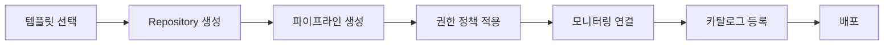

그러면 개발자는 플랫폼 내부의 복잡성을 다 알지 못해도 된다.

참고로 Golden Path는 Data Mesh의 공식 원칙이 아니다.  
셀프서비스 플랫폼을 구현하는 실무적인 방법 중 하나다.

---

## 16. 자동화할 수 있는 거버넌스는 자동화한다

사람이 모든 아키텍처 규칙을  
매번 수동으로 검토하면 비용이 커진다.

예를 들어 다음과 같은 규칙이 있다고 하자.

```text
API Schema 검사

Event Schema 검사

도메인 의존성 검사

보안 정책 검사
```

일부는 CI/CD에서 자동화할 수 있다.

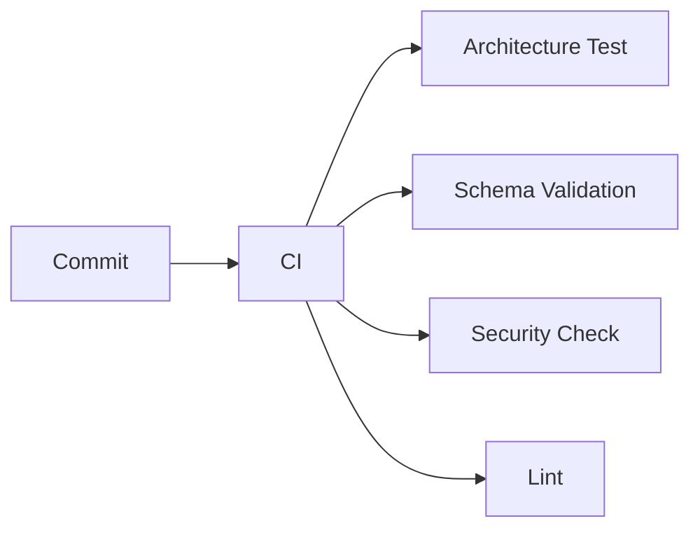

실무에서는 이러한 접근을  
`Governance as Code`와 비슷한 개념으로 설명하기도 한다.

핵심은 이름이 아니라

> 사람이 반복해서 확인하는 규칙 중  
> 자동화할 수 있는 것은 자동화하자.

는 것이다.

### 거버넌스는 중앙 통제가 아니다

거버넌스라는 말을 들으면  
승인·규정·통제·감사를 먼저 떠올리기 쉽다.

하지만 목적은 규칙을 늘리는 것이 아니라

> 여러 팀이 안전하고 일관된 방법으로  
> 데이터를 쓸 수 있게 만드는 것

이다.

전사에서 정하는 것은 최소한으로 둔다.

```text
개인정보 취급 기준
데이터 등급
접근 권한 원칙
품질 표현 방법
공통 메타데이터
보존 정책
```

그 안에서 각 도메인은 자율적으로 움직인다.

이 방식을 **Federated Governance**라고 부른다.  
결정 권한을 어떻게 나누는지는 14장에서,  
거버넌스 체계 전반은 16장 「거버넌스」에서 다뤘다.

반복 가능한 규칙일수록 자동으로 적용하기 좋다.

```text
민감정보가 포함되면 자동 태깅
특정 등급 데이터는 외부 접근 차단
품질 기준 미달 시 배포 차단
모든 데이터 제품에 Owner 등록 요구
```

다만 전부 자동화할 수는 없다.  
조직 간 우선순위나 새 정책처럼  
사람의 판단이 필요한 영역은 남는다.

---

## 17. 처음부터 모든 팀을 바꾸려고 하지 않는다

회사에 새로운 아키텍처 방향을 적용한다고 해서  
모든 시스템을 같은 날 바꿀 수는 없다.

팀마다 상황이 다르다.

- **신규 시스템** — 새로운 방식 적용이 쉬움
- **오래된 레거시** — 점진적인 변경 필요
- **장애가 많은 시스템** — 먼저 안정화가 필요할 수 있음

따라서

> 전체적인 방향은 일관되게 유지하되  
> 실제 전환 속도는 상황에 맞게 조정할 수 있다.

---

## 18. 성공 사례와 실패 사례를 모두 공유한다

한 팀이 좋은 방법을 찾았다고 해보자.

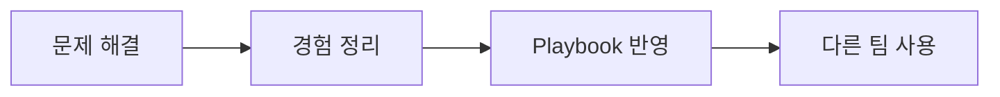

이렇게 조직 전체의 지식으로 만들 수 있다.

실패 사례도 중요하다.

예를 들어

> 이 기능을 이벤트 기반으로 바꿨는데  
> 순서 보장 때문에 오히려 훨씬 복잡해졌다.

라는 경험은 매우 가치 있다.

좋은 아키텍처 조직은

```text
성공만 공유하는 조직
```

보다

```text
성공과 실패에서
둘 다 학습하는 조직
```

에 가깝다.

---

## 19. Consumer의 요구를 이해하면서 Producer를 안정화한다

데이터 제품을 만들 때  
사용자, 즉 Consumer의 요구는 매우 중요하다.

사용자가 무엇을 필요로 하는지 모르면  
좋은 데이터 제품을 만들 수 없다.

하지만 Consumer가 빠르게 증가하기 전에  
Producer 측도 안정적으로 만들어야 한다.

예를 들어 하나의 매출 데이터 제품을

```text
경영 리포트

정산

추천

머신러닝

광고 분석

실시간 대시보드
```

에서 동시에 사용한다고 하자.

데이터 제품의 품질이 불안정하면  
모든 Consumer가 영향을 받는다.

따라서 올바른 접근은

> Consumer의 요구를 지속적으로 반영하면서  
> 사용 범위를 크게 확장하기 전에  
> 데이터 제품의 품질과 안정성을 확보하는 것이다.

---

## 20. 데이터 품질을 운영에 포함한다

데이터 품질은

> 좋은 데이터를 만들자.

라는 구호로 끝나서는 안 된다.

실제로 측정할 수 있어야 한다.

예를 들어

```text
NULL 비율

중복률

갱신 지연

스키마 변경

허용 범위

참조 무결성

비즈니스 규칙
```

등을 확인할 수 있다.

그리고 품질 기준을 위반하면

경고를 보내거나,

파이프라인을 중단하거나,

사용자를 알리거나,

배포를 차단할 수도 있다.

즉,

> **데이터 품질은 개발 이후 확인하는 작업이 아니라  
> 데이터 제품 운영의 일부다.**

---

## 21. 품질의 책임은 도메인과 플랫폼이 나눠 가진다

데이터 품질을 중앙팀이 전부 정의하기는 어렵다.

> 결제 금액이 음수가 될 수 있는가?

이 질문은 플랫폼팀보다 결제 도메인팀이 훨씬 잘 안다.

반대로 이런 질문은 팀마다 다르면 곤란하다.

> 품질을 어떤 지표로 표현할 것인가?  
> 기준에 미달하면 배포를 막을 것인가, 경고만 할 것인가?

그래서 이렇게 나눈다.

| 중앙 · 거버넌스가 정한다 | 도메인이 정한다 |
|---|---|
| 품질을 재는 방식 | 구체적인 품질 규칙 |
| 공통 기준과 표현 방법 | 그 데이터의 비즈니스 의미 |
| 모니터링 도구 | 목표로 삼을 수준 |
| 위반했을 때의 절차 | 문제가 생겼을 때의 해결 |

한 줄로 줄이면 이렇다.

> **중앙은 「어떻게 재고 무엇을 할지」를 정하고,  
> 도메인은 「무엇이 옳은 값인지」를 정한다.**

앞에서 본 Federated Governance가  
품질에 적용된 모습이다.

---
## 22. 데이터 거버넌스 조직

조직이 커지면  
도메인 사이의 충돌도 늘어난다.

예를 들어

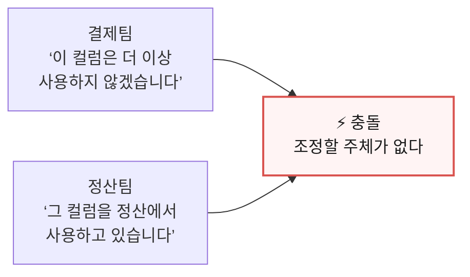

같은 일이 발생한다.

이런 일이 생기는 이유는 둘이다.

**하나, 결제팀은 누가 그 컬럼을 쓰는지 몰랐다.**

계보와 데이터 계약이 있으면 지우기 전에 알 수 있다.  
16장 「거버넌스」에서 다룬 장치들이다.

**둘, 알고도 합의가 안 될 수 있다.**

결제팀은 더 유지할 수 없고 정산팀은 당장 못 옮긴다면  
둘 중 누구도 결정을 내릴 수 없다.

앞쪽은 도구로 풀지만 뒤쪽은 사람이 풀어야 한다.

### 결정할 자리를 미리 만들어 둔다

거버넌스 조직은 **누가 결정하는가**를 미리 정해 두는 것이다.

보통 두 층으로 둔다.

| | 무엇을 다루나 | 예 |
|---|---|---|
| **도메인 수준** | 관련 팀끼리 풀 수 있는 문제 | 컬럼 삭제 일정, 스키마 변경, 품질 기준 |
| **전사 수준** | 도메인끼리 못 정하거나 회사 전체에 영향이 있는 문제 | 공통 정책, 데이터 전략, 투자 우선순위 |

대부분은 도메인 수준에서 끝난다.  
전사로 올라가는 일은 예외여야 한다.

### 앞의 충돌은 이렇게 풀린다

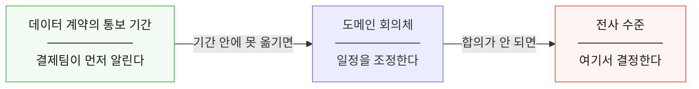

계약에 변경 통보 기간이 정해져 있으면  
결제팀은 정해진 기간 전에 알린다.

정산팀이 그 안에 옮기면 거기서 끝난다.

못 옮기면 도메인 회의체에서 일정을 조정하고,  
거기서도 안 되면 전사 수준으로 올린다.

중요한 것은 마지막 단계까지 가는 일이 드물다는 점이 아니라  
**막혔을 때 갈 곳이 있다는 점**이다.

> 조직도를 예쁘게 그리는 것보다  
> **막혔을 때 어디로 가는지 모두가 아는 것**이 중요하다.

---

## 23. 데이터 리터러시가 필요하다

좋은 데이터 플랫폼을 만들었다고 해서  
자동으로 데이터 주도 조직이 되는 것은 아니다.

사람들이 데이터를 이해하지 못하면  
좋은 플랫폼도 제대로 활용되지 않는다.

**데이터 리터러시(Data Literacy)** 란

> 데이터를 읽고, 이해하고, 질문하고,  
> 적절하게 해석하고 사용할 수 있는 능력

이라고 이해하면 된다.

예를 들어

```text
매출이라는 지표가 정확히 무엇인지

DAU의 정의가 무엇인지

평균값이 왜곡될 수 있는 상황은 무엇인지

데이터가 어느 기간을 나타내는지
```

등을 이해할 수 있어야 한다.

### 교육만으로 풀려고 하지 않는다

여기서 흔한 실수가 있다.

리터러시를 교육 문제로만 보고  
전사 교육을 몇 번 하고 끝내는 것이다.

하지만 「매출」의 정의를 수백 명이 외우고 있게 만드는 것보다  
**외우지 않아도 되게 만드는 편이 쉽다.**

앞에서 본 장치들이 그 일을 한다.

| 무엇이 | 무엇을 대신해 주나 |
|---|---|
| **시맨틱 계층** | 「매출」을 고르면 계산식이 딸려 온다. 외울 필요가 없다 |
| **데이터 카탈로그** | 데이터 옆에 정의와 소유자가 붙어 있다. 물어볼 필요가 없다 |
| **비즈니스 용어집** | 같은 말을 같은 뜻으로 쓰게 한다 |

Golden Path와 같은 생각이다.

> **올바르게 이해하는 것이 가장 쉬운 길이 되게 만든다.**

### 그래도 사람이 배워야 하는 것

전부를 도구로 옮길 수는 없다.

평균이 왜곡되는 상황, 표본의 한계,  
상관관계와 인과관계의 차이 같은 것은  
도구가 대신 판단해 주지 못한다.

이 부분이 앞에서 본 **Enabling 팀**의 몫이다.  
일정 기간 도와 역량을 키워 주고 빠진다.

정리하면 이렇다.

| 리터러시를 높이는 방법 | 무엇으로 |
|---|---|
| 알아야 할 것을 줄인다 | 시맨틱 계층 · 카탈로그 · 용어집 |
| 남은 것을 가르친다 | Enabling 팀 · 교육 |

결국 데이터 주도 문화는  
좋은 데이터와 좋은 플랫폼과 좋은 거버넌스에  
**데이터를 이해하는 사람**이 더해져야 만들어진다.

그리고 그 마지막 조각은  
가르치는 것만으로는 채워지지 않는다.

---

## 24. 아키텍처는 한 번 만들고 끝나는 것이 아니다

아키텍처를 완성된 설계도라고 생각하기 쉽다.

하지만 실제 비즈니스는 계속 변한다.

```text
새로운 상품
새로운 국가
새로운 규제
새로운 비즈니스 모델
```

기술도 변한다.

```text
새로운 DB
새로운 클라우드 서비스
AI
새로운 데이터 처리 기술
```

따라서 아키텍처도 계속 진화해야 한다.

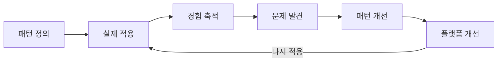

---

## 25. 22장 정리

이 장의 내용을 조직 관점에서 정리하면 이렇다.

| 역할 | 책임 |
|---|---|
| **도메인 · Stream-Aligned 팀** | 비즈니스와 데이터를 책임진다 |
| **Platform 팀** | 공통 복잡성을 줄여 주는 기반을 제공한다 |
| **Enabling 팀** | 지식과 역량을 전파한다 |
| **Complicated Subsystem 팀** | 고도의 전문 영역을 맡는다 |

그리고 플랫폼의 목표는

```text
"우리에게 요청하세요."
```

가 아니라

```text
"여러분이 직접 할 수 있도록
쉬운 환경을 제공하겠습니다."
```

에 가깝다.

네 가지만 기억하면 된다.

**좋은 문서를 만들었다고 조직이 따라오지 않는다.**  
기술·프로세스·조직·사람·문화가 함께 움직여야 한다.

**플랫폼 팀이 대신 해주기 시작하면 새로운 병목이 된다.**  
목표는 다른 팀이 스스로 할 수 있게 만드는 것이다.

**올바른 방법을 문서로 강요하는 것보다  
올바른 방법이 가장 쉬운 방법이 되게 만드는 편이 낫다.**  
Golden Path와 자동화된 가드레일이 그 수단이다.

**처음부터 모든 팀을 바꾸려 하지 않는다.**  
한 팀에서 성공 사례를 만들고 그것을 퍼뜨린다.

마지막으로, 여기까지 온 과정을 한 장으로 보면 이렇다.

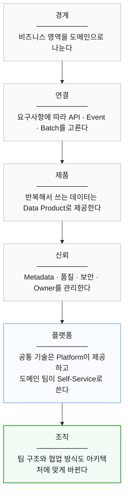

다음 장에서는 이 모든 것을  
어디서부터 시작할지 본다.
