# 22장. 플랫폼과 조직

> **7부 · 실행** — 어디서부터 시작하는가  
> 21장 · **22장** · 23장

아키텍처 가이드 문서를 잘 만들어 공유했다.

API 규칙, 이벤트 규칙, 도메인 경계,  
데이터 품질 기준까지 꼼꼼히 정리했다.

여섯 달이 지났다.  
문서대로 하는 팀은 거의 없다.

좋은 아키텍처 문서를 만들었다고  
조직이 그대로 움직이지는 않는다.

이 장에서는 기술 바깥의 문제를 다룬다.

도메인 팀과 플랫폼 팀의 역할,  
팀 사이의 상호작용 방식,  
그리고 좋은 방법을 조직에 정착시키는 법이다.

플랫폼의 목표는 대신 해주는 것이 아니라  
다른 팀이 스스로 할 수 있게 만드는 것이다.

---

## 1. 좋은 기술만으로 조직은 바뀌지 않는다

여기까지는 주로 기술을 이야기했다.

하지만 데이터 아키텍처를 바꾸는 것은  
기술만의 문제가 아니다.

다음 요소가 함께 바뀌어야 한다.

```text
기술
+
프로세스
+
조직
+
사람
+
문화
```

Kafka를 설치하고  
API Gateway를 도입했다고 해서  
회사 전체 아키텍처가 자동으로 좋아지는 것은 아니다.

---

## 2. 도메인 팀

도메인 팀은 특정 비즈니스 영역을 책임진다.

예를 들면:

```text
회원 팀
결제 팀
주문 팀
배송 팀
정산 팀
```

도메인 팀은 단순히 프로그램만 개발하는 것이 아니라  
자신의 비즈니스 영역과 데이터에 대한 책임을 가진다.

예를 들어 주문 팀이라면

```text
주문 비즈니스 규칙

주문 애플리케이션

주문 데이터 모델

주문 데이터 품질

주문 API / Event

주문 Data Product
```

등을 책임질 수 있다.

핵심은

> **도메인 데이터의 주인은  
> 해당 비즈니스를 가장 잘 이해하는 도메인 팀이다.**

라는 생각이다.

---

## 3. 중앙 데이터 플랫폼 팀

도메인 팀이 자기 데이터를 책임진다고 해서  
모든 기술을 직접 만들어야 하는 것은 아니다.

예를 들어 주문팀마다

```text
Kafka
데이터 파이프라인
CI/CD
모니터링
데이터 카탈로그
저장소
```

를 처음부터 직접 구축한다면  
중복 작업이 너무 많아진다.

그래서 중앙 데이터 플랫폼 팀이  
공통 기반을 제공할 수 있다.

---

## 4. 플랫폼 팀의 목표는 대신 해주는 것이 아니다

좋지 않은 구조를 생각해보자.

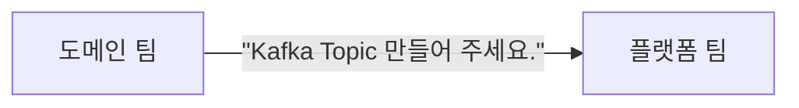

다음에는

```text
"DB 만들어 주세요."

"권한 만들어 주세요."

"Dashboard 만들어 주세요."
```

라는 요청이 계속 들어온다.

결국 플랫폼 팀이 새로운 병목이 된다.

플랫폼 팀이 지향해야 하는 방향은  
**Self-Service**다.

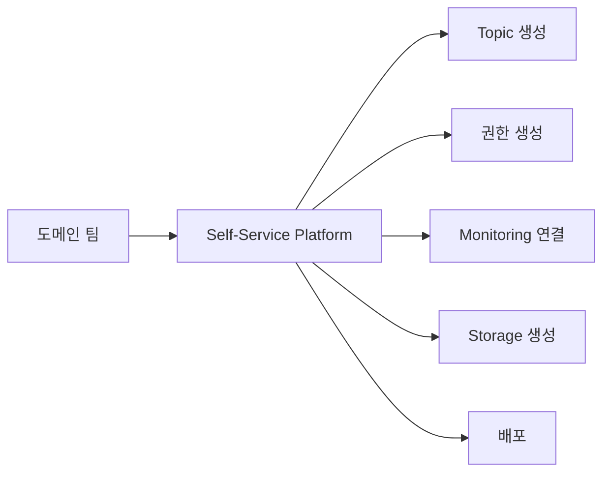

즉,

> 플랫폼 팀은 모든 일을 대신 처리하는 팀이라기보다  
> 다른 팀이 안전하게 스스로 처리할 수 있도록  
> 기반을 만드는 팀이다.

---

## 5. 인프라·클라우드 역량

조직에는 보다 기초적인 기술 기반도 필요하다.

예를 들어:

```text
Cloud
Compute
Network
Storage
Kubernetes
IAM
Monitoring
비용 관리
```

등이다.

조직에 따라

```text
인프라 팀
데이터 플랫폼 팀
```

을 따로 둘 수도 있고,

작은 조직에서는 하나의 플랫폼 조직이  
함께 담당할 수도 있다.

중요한 것은

> 팀 이름보다 책임과 인터페이스가 명확한가

이다.

또한

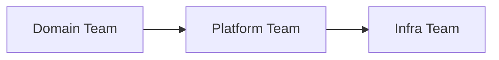

을 반드시 수직적인 조직 계층으로 이해할 필요도 없다.

서로 서비스를 제공하고 협업하는 관계라고 보는 편이 낫다.

---

## 6. Team Topologies

조직 구조를 이해하는 데 도움이 되는 개념으로  
**Team Topologies**가 있다.

대표적으로 네 가지 팀 유형을 정의한다.

```text
Stream-Aligned Team

Enabling Team

Complicated Subsystem Team

Platform Team
```

각각의 역할을 살펴보자.

---

## 7. Stream-Aligned Team

특정 비즈니스 가치 흐름을  
지속적으로 책임지는 팀이다.

예를 들면:

```text
회원 팀
결제 팀
주문 팀
배송 팀
```

등을 생각할 수 있다.

단순히 API 하나만 만드는 것이 아니라  
해당 영역의 비즈니스 가치를 end-to-end로 책임한다.

도메인 팀과 상당히 비슷하게 생각할 수 있다.

---

## 8. Enabling Team

Enabling Team은 다른 팀이  
새로운 기술이나 업무 방식을 익히도록 돕는다.

예를 들어:

```text
DDD 전문가
Kafka 전문가
데이터 모델링 전문가
보안 전문가
```

등이 다른 팀을 지원할 수 있다.

중요한 것은 일을 계속 대신해주는 것이 아니다.

목표는

```text
교육
코칭
가이드
컨설팅
```

을 통해 다른 팀이  
결국 스스로 할 수 있게 만드는 것이다.

---

## 9. Complicated Subsystem Team

일반적인 개발 역량만으로 다루기 어려운  
전문적인 시스템을 담당하는 팀이다.

예를 들어:

```text
영상 인코딩 엔진

검색 엔진

특수 추천 알고리즘

고성능 처리 엔진

복잡한 ML 시스템
```

같은 영역이다.

해당 기술에 높은 전문성이 필요한 경우  
별도의 전문 팀을 두는 것이 더 효과적일 수 있다.

---

## 10. Platform Team

Platform Team은 여러 Stream-Aligned Team이  
공통으로 사용할 기술 기반을 제공한다.

예를 들면:

```text
CI/CD
배포 플랫폼
데이터 플랫폼
관측성
클라우드 환경
개발자 플랫폼
```

등이다.

Platform Team의 중요한 목표는

> 다른 팀이 인프라와 기술의 복잡성을 덜 신경 쓰고  
> 비즈니스 개발에 집중하도록 만드는 것

이다.

---

## 11. Team Topologies는 단순한 조직도가 아니다

Team Topologies를

```text
팀을 네 종류로 나누는 조직도
```

라고만 이해하면 부족하다.

팀 사이의 **상호작용 방식**도 중요하다.

대표적으로

```text
Collaboration

X-as-a-Service

Facilitation
```

과 같은 관계를 생각한다.

예를 들어 Platform Team은  
Stream-Aligned Team에게 플랫폼을 서비스처럼 제공할 수 있다.

Enabling Team은 다른 팀의 역량을 높이기 위해  
일정 기간 Facilitation 방식으로 지원할 수 있다.

즉 목표는 조직 상자를 예쁘게 그리는 것이 아니라

> **팀 간 의존성을 줄이고  
> 비즈니스 변화가 빠르게 흐르도록 만드는 것**

이다.

---

## 12. 조직에 좋은 패턴을 어떻게 정착시킬까?

좋은 아키텍처 문서를 만들었다고 하자.

```text
API 규칙
Event 규칙
도메인 경계
데이터 품질 기준
```

을 모두 정리했다.

하지만 문서를 만든 것만으로  
개발팀이 자동으로 따라오는 것은 아니다.

따라서 새로운 방식을 실제 조직에  
정착시키는 과정이 필요하다.

---

## 13. Playbook

자주 발생하는 상황에 대해  
조직의 경험을 정리할 수 있다.

예를 들어 API Playbook에는 다음과 같은 내용이 들어갈 수 있다.

```text
언제 사용하는가?

Timeout은 어떻게 하는가?

Retry는 언제 하는가?

Idempotency는 어떻게 보장하는가?

Circuit Breaker는 필요한가?
```

이벤트 Playbook에는

```text
이벤트 이름은 어떻게 정하는가?

Schema는 어떻게 관리하는가?

중복 처리는 어떻게 하는가?

재처리는 어떻게 하는가?

실패한 이벤트는 어떻게 처리하는가?
```

등을 담을 수 있다.

이렇게 하면 팀마다 같은 문제를  
처음부터 다시 고민하는 일을 줄일 수 있다.

---

## 14. 기술 표준은 필요하지만 너무 강하면 안 된다

조직이 커지면 다음과 같은 상황이 생길 수 있다.

```text
A팀 → Kafka

B팀 → RabbitMQ

C팀 → NATS

D팀 → Redis Streams
```

각 팀의 결정에는 이유가 있을 수 있다.

하지만 기술 종류가 지나치게 많아지면

```text
운영
모니터링
장애 대응
교육
채용
보안
```

비용이 증가한다.

그래서 조직에서는  
기본적으로 지원할 기술을 정할 수 있다.

하지만 표준화가 지나치면  
특수한 요구사항을 해결할 수 없게 된다.

따라서 목표는

```text
표준화
+
자율성
```

사이의 균형이다.

---

## 15. 실무에서 말하는 Golden Path

실무에서는 개발자가  
가장 안전하고 쉽게 사용할 수 있도록 만들어 놓은  
기본 경로를 **Golden Path**라고 부르기도 한다.

예를 들어:

- **새 API 생성** — 표준 프로젝트 템플릿 사용
- **새 서비스 배포** — 표준 CI/CD 사용
- **이벤트 생성** — 표준 Schema Registry 사용
- **모니터링** — 기본 Dashboard 자동 생성

처럼 만들 수 있다.

중요한 것은

> 올바른 방법을 문서로 강요하는 것보다  
> 올바른 방법이 가장 쉬운 방법이 되게 만드는 것

이다.

Golden Path라는 용어 자체보다  
이 사고방식을 이해하는 것이 중요하다.

---

## 16. 자동화할 수 있는 거버넌스는 자동화한다

사람이 모든 아키텍처 규칙을  
매번 수동으로 검토하면 비용이 커진다.

예를 들어 다음과 같은 규칙이 있다고 하자.

```text
API Schema 검사

Event Schema 검사

도메인 의존성 검사

보안 정책 검사
```

일부는 CI/CD에서 자동화할 수 있다.

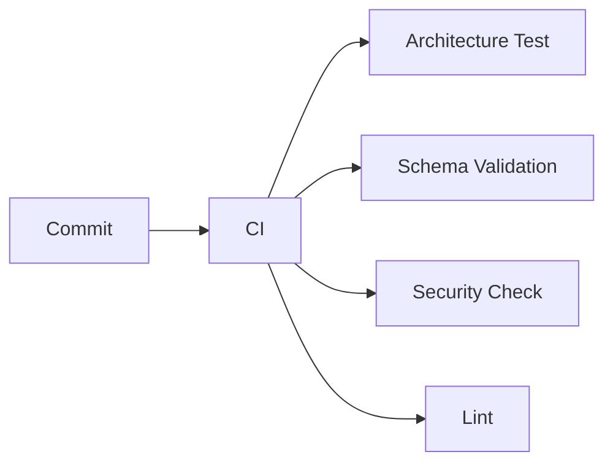

실무에서는 이러한 접근을  
`Governance as Code`와 비슷한 개념으로 설명하기도 한다.

핵심은 이름이 아니라

> 사람이 반복해서 확인하는 규칙 중  
> 자동화할 수 있는 것은 자동화하자.

는 것이다.

---

## 17. 처음부터 모든 팀을 바꾸려고 하지 않는다

회사에 새로운 아키텍처 방향을 적용한다고 해서  
모든 시스템을 같은 날 바꿀 수는 없다.

팀마다 상황이 다르다.

- **신규 시스템** — 새로운 방식 적용이 쉬움
- **오래된 레거시** — 점진적인 변경 필요
- **장애가 많은 시스템** — 먼저 안정화가 필요할 수 있음

따라서

> 전체적인 방향은 일관되게 유지하되  
> 실제 전환 속도는 상황에 맞게 조정할 수 있다.

---

## 18. 성공 사례와 실패 사례를 모두 공유한다

한 팀이 좋은 방법을 찾았다고 해보자.

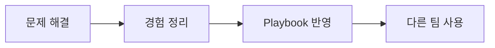

이렇게 조직 전체의 지식으로 만들 수 있다.

실패 사례도 중요하다.

예를 들어

> 이 기능을 이벤트 기반으로 바꿨는데  
> 순서 보장 때문에 오히려 훨씬 복잡해졌다.

라는 경험은 매우 가치 있다.

좋은 아키텍처 조직은

```text
성공만 공유하는 조직
```

보다

```text
성공과 실패에서
둘 다 학습하는 조직
```

에 가깝다.

---

## 19. 아키텍처는 한 번 만들고 끝나는 것이 아니다

아키텍처를 완성된 설계도라고 생각하기 쉽다.

하지만 실제 비즈니스는 계속 변한다.

```text
새로운 상품
새로운 국가
새로운 규제
새로운 비즈니스 모델
```

기술도 변한다.

```text
새로운 DB
새로운 클라우드 서비스
AI
새로운 데이터 처리 기술
```

따라서 아키텍처도 계속 진화해야 한다.

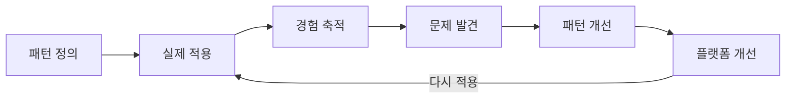

---

## 20. 이번 장 전체를 하나로 연결해보자

지금까지 나온 내용을 큰 흐름으로 정리하면 다음과 같다.

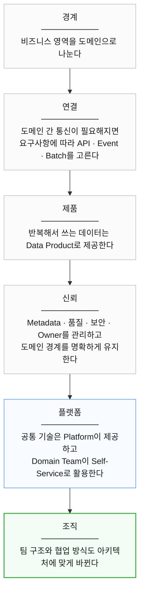

---

## 21. 초보자가 반드시 기억해야 할 것

이번 장에서 수많은 개념이 등장했지만  
전부 외울 필요는 없다.

우선 다음 사고방식을 기억하자.

- **현재 결과가 바로 필요하다** — 동기 API 검토
- **변경 사실을 전달한다** — Event 검토
- **대량 작업을 일정 주기로 처리한다** — Batch 검토
- **여러 사람이 반복해서 사용할 데이터를 제공한다** — Data Product 검토

하지만 이것은 절대적인 규칙이 아니다.

요구사항을 먼저 보고  
기술을 선택해야 한다.

---

## 22. 도메인 경계에서 기억할 것

가장 중요한 원칙은 간단하다.

- **도메인 내부** — 팀이 비교적 자유롭게 변경
- **도메인 외부** — 명확하고 안정적인 계약 제공

외부에서 사용하는 것은

```text
API
Event
Data Product
```

등의 명확한 인터페이스를 통해 제공한다.

다른 도메인의 내부 구현에  
직접 의존하지 않도록 노력한다.

---

## 23. 데이터에서 기억할 것

데이터는 단순히 저장하는 것으로 끝나지 않는다.

좋은 데이터는 다음 질문에 답할 수 있어야 한다.

```text
이 데이터는 무엇인가?

누가 관리하는가?

신뢰할 수 있는가?

어디서 만들어지는가?

어떻게 사용할 수 있는가?
```

그래서

```text
Metadata
Data Catalog
Data Quality
Governance
```

가 필요하다.

---

## 24. 조직에서 기억할 것

좋은 아키텍처는  
조직 구조와도 연결된다.

- **Domain / Stream-Aligned Team** — 비즈니스와 데이터를 책임
- **Platform Team** — 공통 복잡성을 줄여주는 플랫폼 제공
- **Enabling Team** — 지식과 역량을 전파
- **Complicated Subsystem Team** — 고도의 전문 영역 담당

그리고 플랫폼의 목표는

```text
"우리에게 요청하세요."
```

가 아니라

```text
"여러분이 직접 할 수 있도록
쉬운 환경을 제공하겠습니다."
```

에 가깝다.

---

## 25. 새로운 시스템을 설계할 때 던져야 할 질문

기술 이름부터 생각하지 말자.

먼저 이렇게 질문해보자.

```text
처리 결과를 지금 바로 알아야 하는가?

실시간성이 정말 필요한가?

이것은 명령인가, 발생한 사실인가?

소비자가 몇 개인가?

여러 팀이 이 데이터를 반복해서 사용하는가?

데이터 Owner는 누구인가?

다른 도메인의 내부 데이터에
직접 의존하고 있지는 않은가?

장애가 발생하면
어디까지 영향을 미치는가?

표준을 따르는 일이
개발자에게 너무 어렵지는 않은가?
```

이 질문에 답한 뒤

```text
API
Event
Batch
Data Product
Platform
```

등을 선택해야 한다.

---

## 26. 중앙팀은 ‘대신 해주는 팀’에서 ‘플랫폼팀’으로 변한다

데이터 제품이 몇 개 없을 때는  
중앙팀이 직접 많은 작업을 처리할 수 있다.

하지만 데이터 제품이 계속 늘어나면

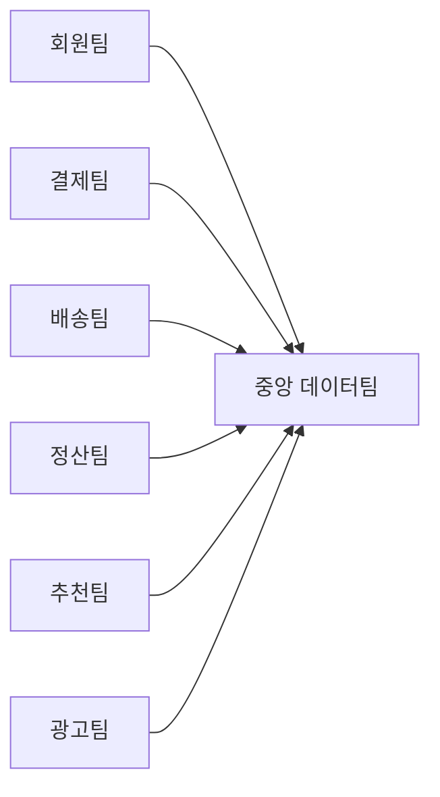

모든 요청이 중앙팀에 몰린다.

결국 중앙 데이터팀 자체가  
데이터 활용의 병목이 될 수 있다.

그래서 역할을 바꿔야 한다.

```text
기존

도메인팀
   ↓ 요청
중앙 데이터팀
   ↓
직접 구현
```

에서

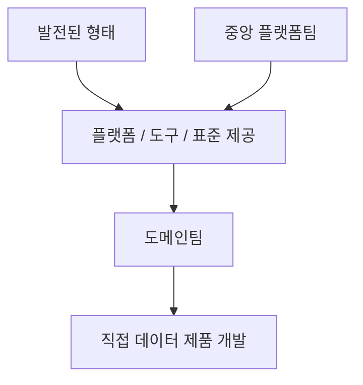

로 이동한다.

---

## 27. Self-Service Data Platform

이런 구조에서 중요한 것이  
**Self-Service Data Platform**이다.

목표는 도메인 팀이 중앙팀에게  
매번 티켓을 만들지 않아도

일반적인 데이터 작업을  
스스로 수행할 수 있게 하는 것이다.

예를 들어

```text
데이터 저장소 생성

파이프라인 생성

접근 권한 요청

모니터링 연결

카탈로그 등록

품질 검사 설정
```

등을 플랫폼에서 제공할 수 있다.

Self-Service라고 해서  
모든 것을 자유롭게 하라는 뜻은 아니다.

오히려

> **올바른 방법을 쉽게 사용할 수 있게 만드는 것**

이 중요하다.

---

## 28. Golden Path를 제공한다

플랫폼 엔지니어링에서는  
자주 사용하는 권장 경로를

**Golden Path**라고 부르기도 한다.

예를 들어 새로운 데이터 제품을 만든다면

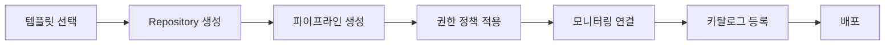

같은 표준 흐름을 제공할 수 있다.

그러면 개발자는  
내부 플랫폼의 모든 복잡성을 알지 못해도 된다.

참고로 Golden Path는  
Data Mesh의 공식 핵심 원칙은 아니다.

Self-Service Platform을 구현하기 위한  
실무적인 방법 중 하나라고 이해하면 된다.

---

## 29. Consumer의 요구를 이해하면서 Producer를 안정화한다

데이터 제품을 만들 때  
사용자, 즉 Consumer의 요구는 매우 중요하다.

사용자가 무엇을 필요로 하는지 모르면  
좋은 데이터 제품을 만들 수 없다.

하지만 Consumer가 빠르게 증가하기 전에  
Producer 측도 안정적으로 만들어야 한다.

예를 들어 하나의 매출 데이터 제품을

```text
경영 리포트

정산

추천

머신러닝

광고 분석

실시간 대시보드
```

에서 동시에 사용한다고 하자.

데이터 제품의 품질이 불안정하면  
모든 Consumer가 영향을 받는다.

따라서 올바른 접근은

> Consumer의 요구를 지속적으로 반영하면서  
> 사용 범위를 크게 확장하기 전에  
> 데이터 제품의 품질과 안정성을 확보하는 것이다.

---

## 30. 데이터 품질을 운영에 포함한다

데이터 품질은

> 좋은 데이터를 만들자.

라는 구호로 끝나서는 안 된다.

실제로 측정할 수 있어야 한다.

예를 들어

```text
NULL 비율

중복률

갱신 지연

스키마 변경

허용 범위

참조 무결성

비즈니스 규칙
```

등을 확인할 수 있다.

그리고 품질 기준을 위반하면

경고를 보내거나,

파이프라인을 중단하거나,

사용자를 알리거나,

배포를 차단할 수도 있다.

즉,

> **데이터 품질은 개발 이후 확인하는 작업이 아니라  
> 데이터 제품 운영의 일부다.**

---

## 31. 품질의 책임은 도메인과 플랫폼이 나눠 가진다

데이터 품질을 중앙팀이 전부 정의하기는 어렵다.

예를 들어

> 결제 금액이 음수가 될 수 있는가?

라는 질문은 플랫폼팀보다  
결제 도메인팀이 훨씬 잘 안다.

따라서 역할은 다음처럼 나눌 수 있다.

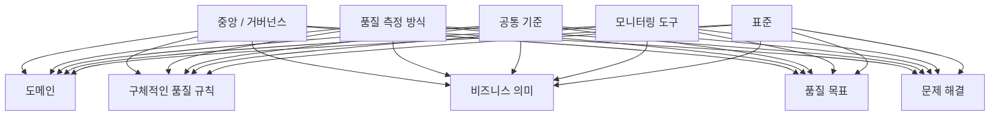

즉,

전사 공통 기준과  
도메인 전문성을 결합해야 한다.

---

## 32. 거버넌스는 모든 것을 중앙 통제하는 것이 아니다

거버넌스라는 말을 들으면

```text
승인

규정

통제

감사
```

를 먼저 떠올리기 쉽다.

하지만 좋은 데이터 거버넌스는  
단순히 규칙을 늘리는 것이 아니다.

목적은

> 여러 팀이 안전하고 일관된 방법으로  
> 데이터를 사용할 수 있게 만드는 것

이다.

예를 들어 조직 전체에서

```text
개인정보 취급 기준

데이터 등급

접근 권한 원칙

데이터 품질 표현 방법

공통 메타데이터

보존 정책
```

등을 정할 수 있다.

그 안에서 각 도메인은  
자율적으로 움직인다.

---

## 33. Federated Governance

Data Mesh에서는  
이런 방식을 **Federated Governance**로 설명한다.

쉽게 말하면

```text
중앙에서 모두 결정
```

도 아니고

```text
각 팀이 마음대로 결정
```

도 아니다.

```text
전사 공통 규칙
        +
도메인별 의사결정
        +
플랫폼을 통한 자동화
```

를 결합한다.

특히 반복 가능한 규칙은  
가능하면 시스템으로 자동 적용할 수 있다.

예를 들어

```text
민감정보가 포함되면 자동 태깅

특정 등급 데이터는 외부 접근 차단

품질 기준 미달 시 배포 차단

모든 데이터 제품에 Owner 등록 요구
```

같은 방식이다.

다만 모든 거버넌스를  
자동화할 수 있는 것은 아니다.

조직 간 우선순위나  
새로운 정책처럼 사람의 판단이 필요한 영역도 존재한다.

---

## 34. 데이터 거버넌스 조직

조직이 커지면  
도메인 사이의 충돌도 늘어난다.

예를 들어

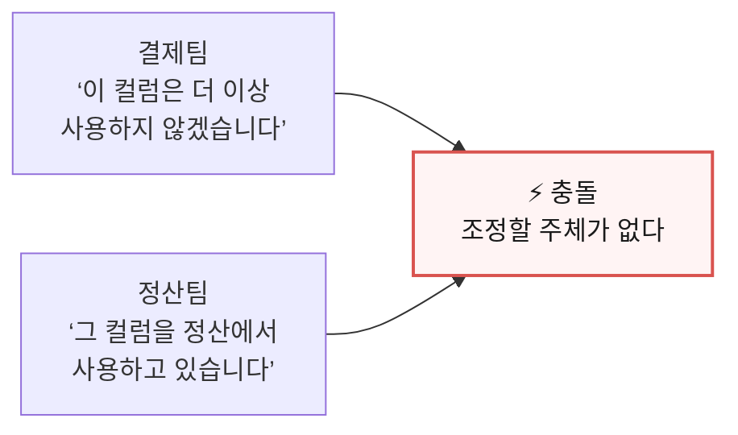

같은 일이 발생한다.

이런 문제를 조정하기 위해  
여러 수준의 거버넌스 구조를 둘 수 있다.

상위 수준에서는

데이터 전략,

전사 로드맵,

투자,

공통 정책

같은 문제를 다룬다.

도메인 수준에서는

데이터 제품,

품질,

정의,

사용자 피드백

같은 실무 문제를 다룬다.

조직 구조 자체보다 중요한 것은

> **도메인 사이의 문제를 해결할 수 있는  
> 명확한 의사결정 경로가 존재하는가**

이다.

---

## 35. 데이터 리터러시가 필요하다

좋은 데이터 플랫폼을 만들었다고 해서  
자동으로 데이터 주도 조직이 되는 것은 아니다.

사람들이 데이터를 이해하지 못하면  
좋은 플랫폼도 제대로 활용되지 않는다.

**데이터 리터러시(Data Literacy)** 란

> 데이터를 읽고, 이해하고, 질문하고,  
> 적절하게 해석하고 사용할 수 있는 능력

이라고 이해하면 된다.

예를 들어

```text
매출이라는 지표가 정확히 무엇인지

DAU의 정의가 무엇인지

평균값이 왜곡될 수 있는 상황은 무엇인지

데이터가 어느 기간을 나타내는지
```

등을 이해할 수 있어야 한다.

결국 데이터 주도 문화는

```text
좋은 데이터
    +
좋은 플랫폼
    +
좋은 거버넌스
    +
데이터를 이해하는 사람
```

이 함께 있어야 만들어진다.

---

## 36. 22장 정리

네 가지만 기억하면 된다.

**기술만으로 조직은 바뀌지 않는다.**  
프로세스, 조직, 사람, 문화가 함께 움직여야 한다.

**플랫폼 팀의 목표는 대신 해주는 것이 아니다.**  
모든 요청을 중앙에서 처리하면  
플랫폼 팀이 새로운 병목이 된다.  
다른 팀이 안전하게 스스로 할 수 있는 기반을 만드는 것이 목표다.

**올바른 방법을 문서로 강요하기보다 가장 쉬운 방법으로 만든다.**  
표준 템플릿과 자동 연결이 있으면  
개발자는 굳이 다른 길을 찾지 않는다.

**자동화할 수 있는 거버넌스는 자동화한다.**  
사람이 매번 확인하는 규칙은  
규모가 커지면 지켜지지 않는다.

다음 장에서는 이 모든 것을  
어디서부터 시작할지 본다.
