# 23장. 실행 로드맵

> **7부 · 실행** — 어디서부터 시작하는가  
> 21장 · 22장 · **23장**

*작은 데이터 제품에서 시작해 플랫폼·거버넌스·DataOps로 확장하기*

앞 장까지 우리는 데이터 전략, 데이터 제품, 도메인,  
메타데이터, 데이터 품질, MDM, 거버넌스 등  
데이터 아키텍처를 구성하는 여러 개념을 살펴봤다.

하지만 개념을 이해하는 것과  
실제 회사에서 구현하는 것은 다른 문제다.

실무에서는 이런 질문을 만나게 된다.

데이터 플랫폼부터 만들어야 할까?

어떤 데이터를 먼저 다뤄야 할까?

중앙 데이터팀이 모든 것을 관리해야 할까?

각 서비스팀이 자신의 데이터를 직접 관리해야 할까?

데이터 제품이 많아지면 누가 품질을 책임져야 할까?

거버넌스를 강화하면 개발 속도가 느려지는 것은 아닐까?

이번 장에서는 지금까지 배운 이론을  
**실제 조직과 시스템에 적용하는 방법**을 살펴본다.

이 장 전체를 관통하는 핵심 원칙은 다음과 같다.

> **전체적인 방향은 알고 있되,  
> 가치 있는 작은 문제부터 실행하고  
> 그 경험을 플랫폼·표준·거버넌스로 발전시킨다.**

---

## 1. 데이터 전략은 기술 선택보다 먼저다

여기까지의 내용을 보면  
특정 기술 하나가 모든 문제를 해결할 수 없다는 것을 알 수 있다.

그래서 필요한 것이  
**데이터 전략**이다.

데이터 전략의 시작은

```text
Data Mesh를 도입하자.

Data Lake를 만들자.

Kafka를 사용하자.
```

가 되어서는 안 된다.

순서는 반대다.

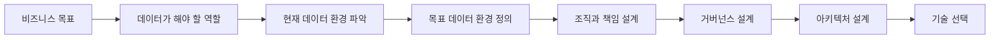

예를 들어 회사가 해결하려는 문제가

```text
사용자 이탈 감소
```

라면 필요한 데이터를 먼저 생각한다.

```text
접속 데이터

조회 데이터

결제 데이터

주문 데이터
```

그리고 이를 이용해  
어떤 분석과 서비스를 만들 것인지 결정한다.

그 이후에 필요한 플랫폼과 기술을 선택한다.

---

## 2. 전략만 세우고 실행하지 않는 것도 문제다

반대로 완벽한 전략을 만들기 위해  
몇 달 동안 문서만 작성하는 것도 좋은 방법은 아니다.

작은 활용 사례부터 시작해  
실제 효과를 확인하는 방식도 필요하다.

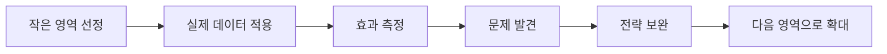

하지만 전략 없이  
각 팀이 PoC만 계속 만들면

```text
팀 A의 데이터 플랫폼

팀 B의 별도 ETL

팀 C의 별도 데이터 모델
```

이 생기면서 또 다른 사일로가 만들어질 수 있다.

따라서 좋은 접근은

**전체 방향은 명확하게 정하되  
실행은 점진적으로 하는 것**

이다.

---

## 3. 기술보다 비즈니스 문제에서 시작한다

데이터 아키텍처를 만드는 목적은  
새로운 기술을 도입하는 것이 아니다.

궁극적인 목적은

**데이터를 이용해 실제 비즈니스 문제를 해결하는 것**이다.

예를 들어 회사에서 다음과 같은 문제가 있다고 생각해보자.

```text
사용자 이탈률을 줄이고 싶다.

상품별 매출을 빠르게 파악하고 싶다.

이상 결제를 빠르게 탐지하고 싶다.

추천 품질을 높이고 싶다.

정산 오류를 줄이고 싶다.
```

여기서 출발해야 한다.

반대로

```text
Kafka를 도입하자.

데이터 레이크를 만들자.

AI 플랫폼을 만들자.
```

부터 시작하면 안 된다.

Kafka도, 데이터 레이크도, AI도  
문제를 해결하기 위한 수단일 뿐이다.

올바른 순서는 대략 다음과 같다.

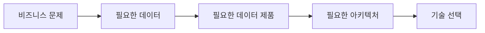

---

## 4. 전체 방향은 필요하지만 처음부터 모두 만들지는 않는다

“작게 시작하라”는 말을 잘못 이해하면

> 아무런 큰 그림 없이 작은 프로젝트만 계속 만들면 된다.

라고 생각할 수도 있다.

그렇지는 않다.

장기적으로 어디로 가고 싶은지에 대한  
**목표 상태(Target State)** 는 필요하다.

예를 들어 장기적인 목표가

```text
도메인별 데이터 제품 운영

Self-Service Data Platform

데이터 카탈로그

자동 품질 관리

공통 거버넌스

DataOps
```

라고 할 수 있다.

하지만 이 모든 것을  
첫 프로젝트에서 구현하려고 해서는 안 된다.

더 현실적인 방법은 다음과 같다.

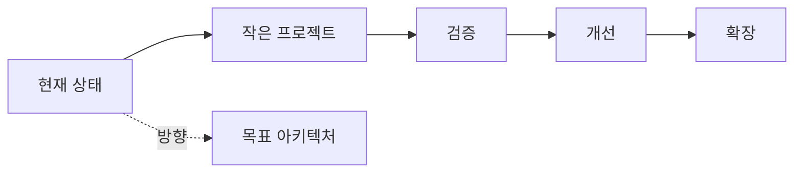

즉,

> **큰 방향을 보고 작은 단위로 실행한다.**

이것이 중요하다.

---

## 5. 첫 번째 유스케이스를 선택한다

모든 데이터 문제를 동시에 해결할 수는 없다.

그래서 먼저  
**가치 있는 유스케이스 하나를 선택해야 한다.**

예를 들어 커머스 서비스라면

```text
판매자 매출 분석

사용자 이탈 예측

실시간 인기 상품 랭킹

이상 결제 탐지

추천 시스템

정산 자동화
```

등이 후보가 될 수 있다.

첫 번째 프로젝트는  
너무 어렵지도 않고 너무 사소하지도 않아야 한다.

비즈니스 가치가 있고,

범위가 어느 정도 명확하며,

필요한 데이터를 확보할 수 있고,

결과를 비교적 빠르게 확인할 수 있는 문제가 좋다.

예를 들어

> “모든 회사 데이터를 통합하자.”

보다는

> “결제·주문·배송 데이터를 이용해  
> 판매자별 일 매출을 정확하게 계산하자.”

가 훨씬 좋은 시작점이다.

---

## 6. 첫 번째 데이터 제품을 만든다

유스케이스가 정해졌다면  
이제 실제 사용 가능한 **데이터 제품(Data Product)** 을 만든다.

데이터 제품은 단순한 테이블 하나를 의미하지 않는다.

사용자가 실제로 신뢰하고 사용할 수 있는  
데이터 제공 단위라고 생각하면 된다.

예를 들어 판매자 매출 데이터 제품이라면

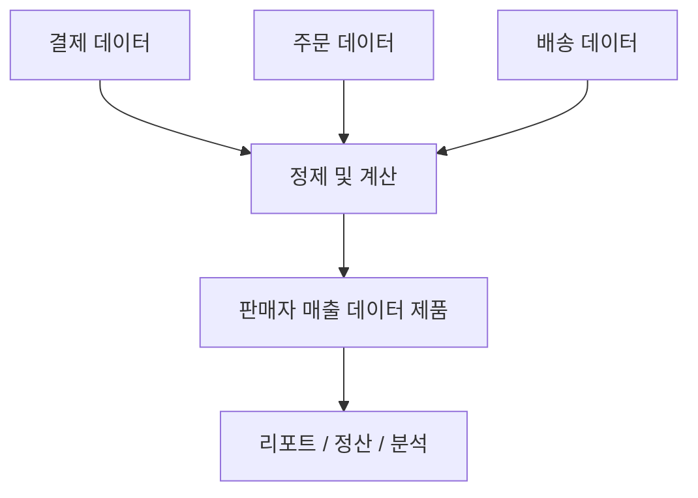

이 될 수 있다.

여기에는 데이터뿐 아니라

데이터 의미,

품질 기준,

갱신 주기,

책임자,

접근 권한

같은 정보도 함께 존재하는 것이 좋다.

---

## 7. 데이터 처리 계층을 나눌 수 있다

원본 데이터를 바로 분석에 사용하는 것은  
여러 문제를 만든다.

그래서 데이터가

수집되고,

정제되고,

비즈니스 의미가 추가되는

단계를 나누는 경우가 많다.

대표적인 예가 Bronze / Silver / Gold를 쓰는  
**Medallion Architecture**다. 14장에서 다뤘다.

이 구조가 유일한 정답은 아니다.

조직에 따라

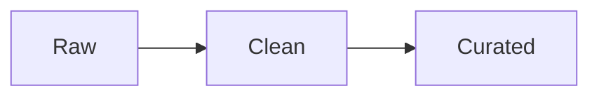

같은 다른 이름과 구조를 사용할 수도 있다.

핵심은 이름이 아니라

> **원본 데이터와 소비용 데이터를 적절하게 분리하는 것**

이다.

---

## 8. 처음부터 완벽하게 자동화할 필요는 없다

첫 데이터 제품을 만들 때는  
아직 플랫폼이 충분하지 않을 수 있다.

예를 들어

```text
권한을 사람이 직접 부여한다.

카탈로그를 수동으로 등록한다.

파이프라인을 직접 실행한다.

장애가 발생하면 운영자가 재처리한다.
```

같은 일이 생길 수 있다.

초기에는 어느 정도 허용할 수 있다.

오히려 실제 프로젝트를 운영해봐야

> 무엇이 반복되고 있는가?

를 알 수 있기 때문이다.

중요한 것은 반복을 방치하지 않는 것이다.

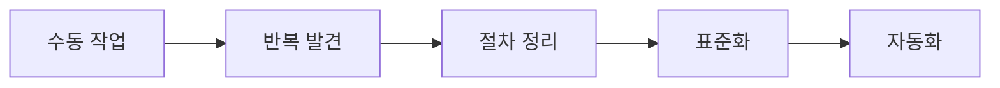

이런 순서로 발전시키면 된다.

---

## 9. 첫 번째 프로젝트는 블루프린트가 된다

첫 번째 데이터 제품의 의미는  
그 데이터 제품 하나에만 있지 않다.

첫 프로젝트를 진행하면서  
조직은 많은 것을 배우게 된다.

예를 들어

```text
데이터를 어떻게 수집할 것인가?

어디에 저장할 것인가?

누가 품질을 책임질 것인가?

카탈로그에는 무엇을 등록할 것인가?

권한은 어떻게 부여할 것인가?

장애는 어떻게 감지할 것인가?

어떻게 배포할 것인가?
```

같은 문제를 실제로 경험한다.

이 경험을 정리하면  
다음 프로젝트에서는 다시 처음부터 고민할 필요가 없다.

- **첫 번째 프로젝트** — 시행착오
- **두 번째 프로젝트** — 재사용
- **세 번째 프로젝트** — 표준화
- **이후** — 자동화와 플랫폼화

따라서 첫 번째 프로젝트는  
미래 데이터 플랫폼의 **블루프린트** 역할을 한다.

---

## 10. 데이터 도메인은 DB 구조와 같지 않다

데이터 아키텍처를 설계할 때  
중요하게 구분해야 하는 것이 있다.

**데이터베이스와 비즈니스 도메인은 같은 개념이 아니다.**

예를 들어 시스템에

```text
user_db

payment_db

delivery_db

order_db
```

가 있다고 하자.

그렇다고 반드시

```text
User Domain

Payment Domain

Delivery Domain

Gift Domain
```

으로 그대로 나눠야 하는 것은 아니다.

도메인은

> 데이터가 어느 서버에 있는가?

보다

> **어떤 비즈니스 의미를 가지고 있으며  
> 누가 그 의미와 품질을 책임지는가?**

를 중심으로 판단해야 한다.

---

## 11. 데이터의 책임자를 명확하게 한다

실제 프로젝트를 시작하면  
평소에는 보이지 않던 문제가 드러난다.

예를 들어

```text
이 데이터의 정확한 정의가 뭐지?

이 컬럼을 누가 변경할 수 있지?

값이 이상하면 누가 확인하지?

외부 팀이 이 데이터를 사용해도 되나?
```

같은 질문이다.

그래서 데이터마다 책임이 필요하다.

회사에 따라

Data Owner,

Data Steward,

Domain Owner,

Data Product Owner

같은 이름을 사용할 수 있다.

하지만 직함 자체가 중요한 것은 아니다.

중요한 것은

```text
누가 데이터의 의미를 정의하는가?

누가 품질을 책임지는가?

누가 변경을 관리하는가?

문제가 생기면 누가 대응하는가?
```

가 명확한 것이다.

작은 조직에서는 한 사람이  
여러 역할을 동시에 담당할 수도 있다.

---

## 12. 중앙집중형과 탈중앙형

데이터 조직을 만들다 보면  
자주 등장하는 질문이 있다.

> 중앙 데이터팀이 모든 데이터를 관리해야 할까?

아니면

> 각 서비스팀이 직접 관리해야 할까?

둘 다 장단점이 있다.

중앙집중형은 대략 이런 모습이다.

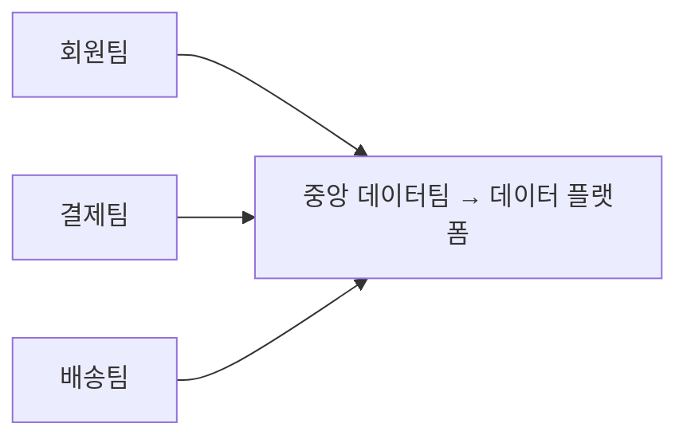

표준을 맞추고  
보안과 품질을 관리하기 쉽다.

하지만 중앙팀에 모든 요청이 몰리면  
병목이 발생한다.

반대로 탈중앙형은

```text
회원팀 → 회원 데이터 제품

결제팀 → 결제 데이터 제품

배송팀 → 배송 데이터 제품
```

처럼 각 도메인이 자신의 데이터를 책임진다.

도메인을 잘 아는 팀이 직접 데이터를 관리하므로  
빠르게 대응할 수 있다.

하지만 각 팀이 너무 자유롭게 움직이면

데이터 정의,

기술,

보안,

품질 기준

등이 제각각이 될 위험이 있다.

---

## 13. 중앙집중과 탈중앙화는 양자택일이 아니다

현실에서는 두 방식 사이에  
여러 형태가 존재한다.

예를 들어

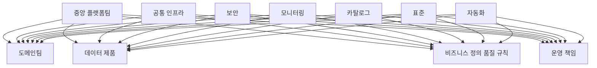

처럼 역할을 나눌 수 있다.

즉,

> 중앙은 공통 기반을 제공하고  
> 도메인은 자신의 데이터를 책임진다.

이런 형태가 실무적으로 많이 사용된다.

조직의 데이터 성숙도가 낮다고 해서  
반드시 중앙집중형부터 시작해야 하는 것도 아니다.

반대로 성숙도가 높다고 해서  
반드시 완전한 탈중앙 구조를 사용해야 하는 것도 아니다.

조직 규모,

인력,

규제,

현재 시스템,

팀 구조,

데이터 종류

등을 고려해야 한다.

---

## 14. Data Mesh는 단순한 탈중앙화가 아니다

여기서 **Data Mesh**를 정확하게 이해할 필요가 있다.

Data Mesh는

> 데이터를 각 도메인에 나누면 된다.

라는 개념이 아니다.

3장에서 본 네 가지 원칙이 함께 있어야 Data Mesh라고 할 수 있다.  
도메인이 데이터를 책임지고, 데이터를 제품처럼 관리하고,  
도메인 팀이 쓸 수 있는 플랫폼이 있으며,  
전사 규칙을 중앙과 도메인이 함께 관리하는 것이다.

따라서

```text
데이터를 팀별로 나눴다
=
Data Mesh
```

는 아니다.

---

## 15. DataOps란 무엇인가

데이터 제품이 많아지면  
개발과 운영 방식도 체계화해야 한다.

여기서 등장하는 개념이 **DataOps**다.

초보자에게는

> 데이터 분야에 DevOps 개념을 적용하는 것

이라고 설명할 수 있다.

하지만 DataOps는 그것보다 조금 더 넓다.

DataOps에는

```text
Agile 방식

DevOps

자동화

지속적인 피드백

데이터 품질

오케스트레이션

모니터링

재현성

협업
```

등의 개념이 함께 포함된다.

따라서 조금 더 정확하게 표현하면

> **DataOps는 데이터와 분석 시스템을  
> 빠르고 안정적으로 개발·배포·운영하기 위해  
> 협업, 자동화, 테스트, 품질 관리와  
> 지속적인 개선을 적용하는 방식이다.**

---

## 16. 데이터도 코드처럼 관리한다

DataOps에서는  
프로그램 코드만 버전 관리하는 것이 아니다.

다음과 같은 것들도  
가능한 범위에서 코드와 함께 관리한다.

```text
SQL

dbt 모델

파이프라인 정의

스키마

설정

테스트

메타데이터 정의

문서
```

이렇게 하면

```text
누가 변경했는가?

언제 변경했는가?

왜 변경했는가?

이전 상태는 무엇이었는가?
```

를 추적할 수 있다.

또한 동일한 환경을 다시 만들거나  
문제가 생겼을 때 이전 버전으로 돌아가기도 쉬워진다.

---

## 17. 데이터 파이프라인 전체를 관리한다

데이터 파이프라인은  
단순한 ETL 작업 하나가 아니다.

실제로는 다음과 같은 여러 단계가 있을 수 있다.

```text
데이터 생성
   ↓
수집
   ↓
소스 검증
   ↓
원본 저장
   ↓
정제
   ↓
변환
   ↓
품질 검사
   ↓
소비 데이터 생성
   ↓
상태 기록
   ↓
사용자 알림
   ↓
카탈로그 갱신
```

이 전체 과정을  
하나의 워크플로로 관리하는 것이 중요하다.

---

## 18. 반복 가능한 부분은 공통 컴포넌트로 만든다

모든 데이터 파이프라인이  
완전히 같은 것은 아니다.

예를 들어

배치,

CDC,

실시간 스트리밍,

파일 수집,

API 수집,

머신러닝 데이터

는 서로 다른 특성이 있다.

하지만 공통되는 부분도 많다.

```text
로그

모니터링

알림

상태 기록

품질 검사

재시도

권한

배포
```

같은 기능이다.

이런 공통 기능은  
각 팀이 매번 새로 만들기보다  
플랫폼에서 제공하는 것이 좋다.

---

## 19. 데이터에도 CI/CD를 적용한다

데이터 파이프라인과 변환 로직도  
일반 애플리케이션처럼 테스트하고 배포할 수 있다.

예를 들어

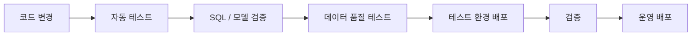

와 같은 흐름이다.

여기서 데이터 시스템은  
일반 애플리케이션 테스트 외에도  
데이터 자체를 검사해야 한다.

예를 들어

```text
NULL이 너무 많지 않은가?

중복이 발생하지 않았는가?

스키마가 예상과 같은가?

데이터 건수가 갑자기 줄지 않았는가?

비즈니스 규칙을 위반하지 않았는가?
```

등을 확인할 수 있다.

---

## 20. 브랜치 전략은 하나의 정답이 아니다

일부 DataOps 사례에서는

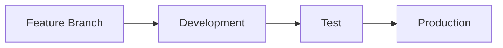

처럼 여러 브랜치와 환경을 연결한다.

이 방식 자체는 사용할 수 있다.

하지만 이것이  
CI/CD의 유일한 표준은 아니다.

현대적인 CI에서는

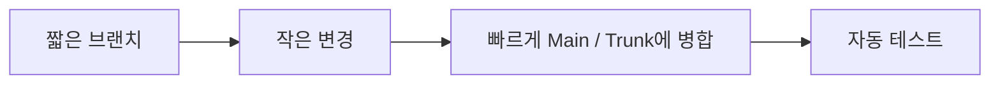

하는 **Trunk-Based Development** 방식도 많이 사용된다.

중요한 것은 특정 브랜치 전략이 아니라

> 변경을 작게 유지하고,  
> 자주 통합하고,  
> 자동 테스트를 통해 안전하게 배포하는 것

이다.

---

## 21. 자동화와 수동 운영 경로를 함께 준비한다

자동화는 중요하지만  
모든 상황을 자동화할 수는 없다.

실제 운영에서는

```text
특정 기간 데이터 재처리

잘못된 배치 재실행

장애 복구

예외 데이터 수정

긴급 대응
```

같은 일이 발생한다.

따라서 좋은 시스템은

```text
자동화된 기본 경로
        +
통제된 수동 처리 경로
```

를 함께 제공해야 한다.

수동 작업을 완전히 없애는 것이 목표가 아니라

> 반복적이고 예측 가능한 작업은 자동화하고,  
> 예외 상황에서는 사람이 안전하게 개입할 수 있게 하는 것

이 중요하다.

---

## 22. 규모가 커질수록 모니터링도 중앙화한다

각 도메인이 자신의 데이터 제품을 운영하더라도  
회사 전체의 상태를 볼 수 있는 기능은 필요하다.

예를 들어

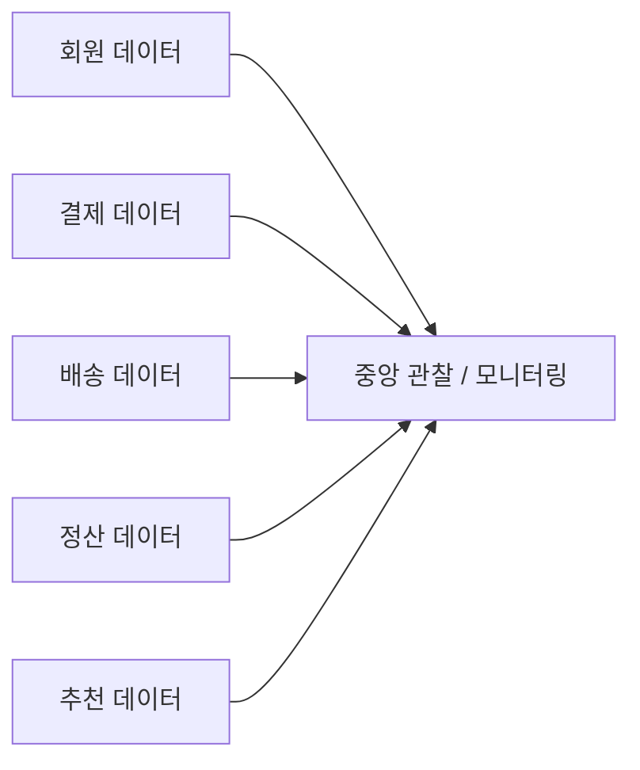

형태로

로그,

품질 상태,

장애,

파이프라인 지연,

사용량

등을 통합해서 볼 수 있다.

이때 중앙팀이 데이터를 직접 소유하는 것과  
전체 상태를 관찰하는 것은 다른 문제다.

분산 운영 환경에서도  
중앙 Observability는 충분히 유용하다.

---

## 23. 엔터프라이즈 아키텍트의 역할

조직과 시스템이 복잡해질수록  
전체 방향을 연결하는 역할이 필요하다.

이 역할을 수행하는 사람이  
**엔터프라이즈 아키텍트(Enterprise Architect)** 다.

하지만 현대적인 아키텍트는  
모든 기술을 혼자 결정하는 사람이 아니다.

오히려

```text
비즈니스

조직

데이터

애플리케이션

플랫폼

보안

운영
```

사이의 관계를 이해하고  
올바른 방향으로 연결하는 역할에 가깝다.

---

## 24. 모든 기술의 최고 전문가일 필요는 없다

현대 시스템은 너무 복잡하다.

한 사람이

DB,

네트워크,

클라우드,

스트리밍,

보안,

AI,

데이터 플랫폼,

DevOps,

DataOps

를 모두 최고 수준으로 알기는 어렵다.

따라서 아키텍트에게 중요한 것은

> 모든 것을 직접 구현하는 능력보다  
> 필요한 전문가와 협력하여  
> 전체 구조를 올바르게 연결하는 능력

이다.

예를 들어

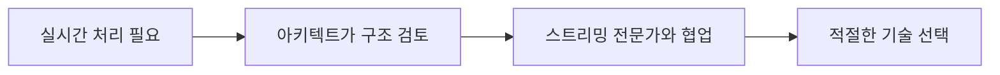

처럼 움직일 수 있다.

---

## 25. 아키텍처 다이어그램은 의사소통 도구다

아키텍트는 복잡한 구조를  
사람들이 이해할 수 있도록 표현해야 한다.

이때 사용하는 것이

블루프린트,

아키텍처 다이어그램,

데이터 흐름도

등이다.

하지만 목적은  
예쁜 그림을 그리는 것이 아니다.

> **서로 다른 사람들이 같은 시스템을  
> 비슷한 방식으로 이해하도록 만드는 것**

이 목적이다.

그래서 대상에 따라  
그림의 수준도 달라질 수 있다.

경영진에게는

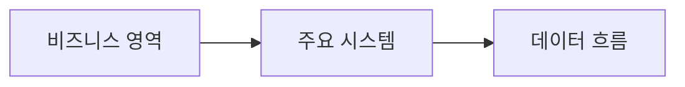

정도로 보여줄 수 있고,

개발팀에는

```text
API
Event
Queue
DB
Cache
Pipeline
Storage
```

수준까지 보여줄 수 있다.

---

## 26. 기술을 비즈니스 가치로 번역한다

좋은 아키텍트는 기술 용어만 말하지 않는다.

예를 들어

> “CDC를 도입해야 합니다.”

라고 말하는 것보다

> “결제 데이터 변경을 빠르게 전달하면  
> 정산 데이터 반영 지연을 줄일 수 있습니다.”

라고 설명할 수 있어야 한다.

즉,

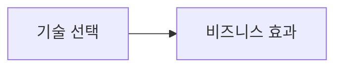

를 연결해야 한다.

아키텍트에게 기술 지식뿐 아니라  
의사소통 능력이 중요한 이유다.

---

## 27. 현실적인 다음 단계를 제시한다

아키텍트가 이상적인 미래 구조만 보여준다면  
실무팀에는 별 도움이 되지 않을 수 있다.

예를 들어 최종 목표가

```text
Data Mesh

Self-Service Platform

자동 거버넌스

완성된 DataOps
```

라고 하더라도

현재 조직이 바로 거기까지 갈 수는 없다.

좋은 아키텍트는

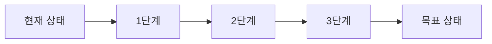

를 설계한다.

즉,

> **최종 목적지뿐 아니라  
> 지금 다음으로 해야 할 일을 제시할 수 있어야 한다.**

---

## 28. 통제보다는 가드레일을 제공한다

기업에는

보안,

표준,

개인정보,

운영 안정성

등을 위한 규칙이 필요하다.

하지만 모든 기술 결정을  
중앙 조직에서 승인하게 만들면  
개발 속도가 크게 떨어진다.

반대로 아무런 기준도 없으면  
각 팀의 구조가 지나치게 달라진다.

그래서 **Guardrail**이라는 사고방식이 유용하다.

가드레일은

> 반드시 지켜야 하는 최소한의 경계

다.

예를 들어

```text
보안 기준

개인정보 처리 기준

API 기본 규칙

로그 기준

모니터링 기준

배포 정책
```

을 정한다.

그리고 그 범위 안에서는  
각 팀이 상황에 맞게 선택하도록 한다.

---

## 29. 현대적인 아키텍트는 경찰이 아니다

아키텍처 조직이

```text
규칙 위반입니다.

사용할 수 없습니다.

표준이 아닙니다.
```

라는 말만 반복하면

현업에서는 아키텍처 조직을  
일을 방해하는 조직으로 생각하게 된다.

현대적인 아키텍트는

```text
왜 문제가 되는지 설명한다.

위험을 설명한다.

가능한 대안을 제시한다.

필요한 전문가를 연결한다.

팀이 좋은 결정을 내리도록 돕는다.
```

는 역할을 해야 한다.

즉,

> **통제자보다는 기술적 방향을 이끄는  
> 커뮤니티 리더에 가까워져야 한다.**

---

## 30. 데이터 아키텍처는 완성되는 것이 아니다

서비스도 변하고,

조직도 변하고,

사용자 요구도 변하고,

기술도 계속 변한다.

따라서

```text
설계 완료
→ 끝
```

이라는 상태는 현실적으로 존재하기 어렵다.

오히려

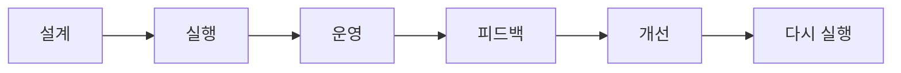

이 반복된다.

좋은 데이터 아키텍처는  
변하지 않는 구조가 아니라

> **변화에 대응할 수 있는 구조**

라고 보는 것이 좋다.

---

## 31. 전체 데이터 여정을 연결해보자

지금까지의 내용을 하나의 흐름으로 연결하면 다음과 같다.

```text
비즈니스 문제
        ↓
데이터 전략
        ↓
가치 있는 유스케이스 선정
        ↓
첫 번째 데이터 제품
        ↓
운영 경험 축적
        ↓
도메인과 책임 정의
        ↓
반복 작업 표준화
        ↓
공통 데이터 플랫폼
        ↓
Self-Service
        ↓
거버넌스 강화
        ↓
DataOps
        ↓
자동화
        ↓
여러 도메인의 데이터 제품
        ↓
지속적인 개선
```

이 흐름에서 중요한 것은  
순서를 기계적으로 따라야 한다는 뜻이 아니다.

조직에 따라

플랫폼을 먼저 강화할 수도 있고,

거버넌스 문제가 먼저 나타날 수도 있고,

특정 데이터 제품이 먼저 성장할 수도 있다.

중요한 것은

> **조직의 현재 문제와 역량을 기준으로  
> 다음 단계를 선택하는 것이다.**

---

## 32. 이번 장에서 꼭 기억해야 할 것

이번 장의 핵심은 크게 네 가지로 압축할 수 있다.

첫째, **기술보다 비즈니스 가치에서 시작한다.**

데이터 플랫폼 자체가 목적이 되어서는 안 된다.

둘째, **전체 방향을 알고 작은 범위부터 실행한다.**

첫 프로젝트를 통해 실제 문제를 발견하고  
그 경험을 다음 프로젝트에 활용한다.

셋째, **규모가 커지면 플랫폼과 자동화가 필요하다.**

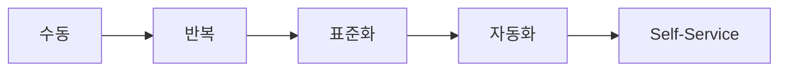

로 발전시킨다.

넷째, **자율성과 거버넌스의 균형을 맞춘다.**

```text
중앙

플랫폼
표준
보안
공통 정책
가드레일

      +

도메인

데이터 제품
비즈니스 규칙
품질
운영 책임
```

두 영역이 함께 움직여야 한다.

---

## 33. 마치면서

새로운 데이터 기술은 앞으로도 계속 등장할 것이다.

레이크하우스,

실시간 스트리밍,

AI,

머신러닝,

새로운 데이터베이스,

새로운 데이터 플랫폼이 계속 등장한다.

따라서 특정 제품이나 기술 하나를 외우는 것보다  
더 중요한 것은 원칙을 이해하는 것이다.

우리는 계속 다음 질문을 할 수 있어야 한다.

```text
왜 이 데이터가 필요한가?

누가 책임져야 하는가?

누가 사용하는가?

어떤 품질을 보장해야 하는가?

어떻게 안전하게 공유할 것인가?

무엇을 중앙에서 제공해야 하는가?

무엇을 도메인이 결정해야 하는가?

어떤 작업을 자동화해야 하는가?

다음 단계는 무엇인가?
```

좋은 데이터 아키텍처는  
처음부터 거대한 플랫폼을 만드는 것에서 시작하지 않는다.

**작은 비즈니스 문제를 데이터로 해결하는 것에서 시작한다.**

그리고 그 경험을 반복하면서

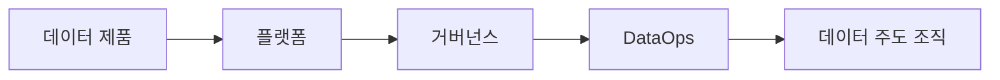

으로 발전시켜 나간다.

결국 23장을 한 문장으로 정리하면 다음과 같다.

> **전체 방향은 분명하게 세우되 완벽한 아키텍처를 한 번에 만들려고 하지 말고,  
> 가치 있는 데이터 제품부터 실행하여 배운 것을 플랫폼·거버넌스·자동화로 발전시키면서  
> 조직 전체의 데이터 역량을 점진적으로 성장시켜라.**
