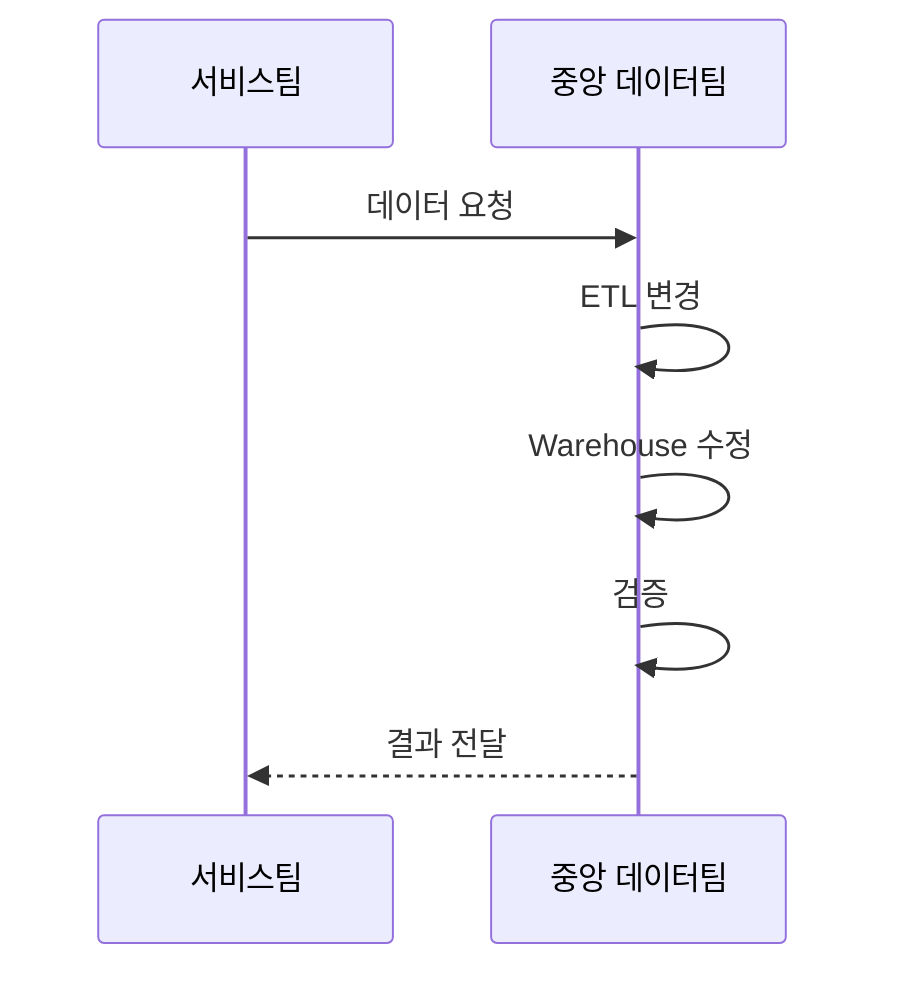
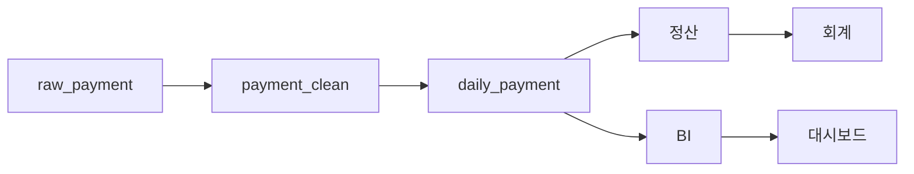
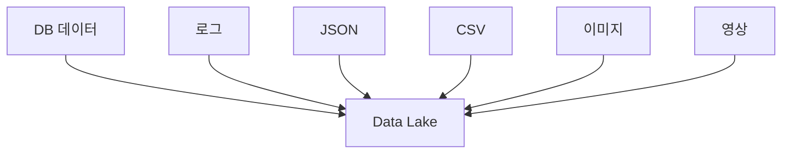
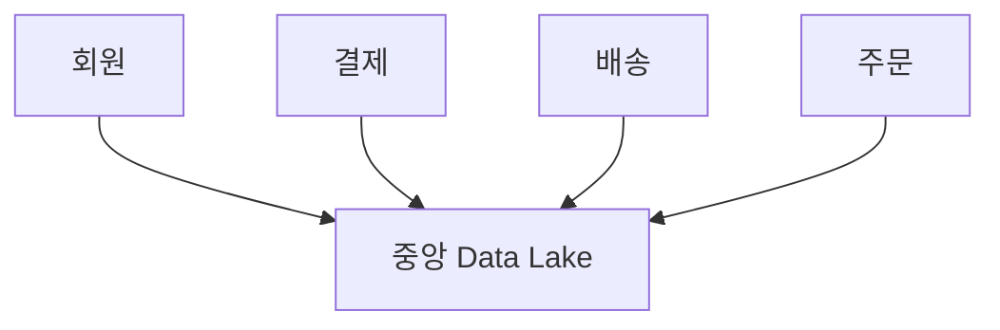

# 2장. 저장 위치가 아니라 책임의 문제

> **1부 · 문제** — 왜 데이터가 흩어졌고 무엇이 문제인가  
> 1장 · **2장** · 3장

대시보드 숫자가 이상하다는 연락을 받았다.

어디부터 봐야 할까.  
원본 DB인가, 중간 집계 테이블인가, 리포트 로직인가.  
그리고 이 데이터는 누구에게 물어봐야 하는가.

1장에서는 데이터가 왜 여러 곳으로 흩어지는지 살펴봤다.

그런데 흩어진 데이터를 다시 모으는 것만으로는  
문제가 풀리지 않는다.

이 장에서는 데이터가 많아질 때  
무엇이 실제로 발목을 잡는지 본다.

중앙 데이터팀의 병목,  
사라지는 비즈니스 맥락,  
복잡해지는 파이프라인,  
그리고 Data Lake가 해결한 것과 남긴 것이다.

여기까지 오면 질문이 바뀐다.

> 데이터를 어디에 저장할 것인가

에서

> 이 데이터는 누가 책임지는가

로 옮겨간다.

---

## 1. 중앙 데이터팀의 병목

중앙집중형 구조에서는  
데이터 업무가 중앙팀에 집중되는 경우가 많다.



조직이 작을 때는 괜찮다.

하지만 수많은 도메인이 존재하면  
중앙팀이 모든 비즈니스 규칙을 이해하기 어렵다.

예를 들어 주문 데이터만 하더라도

```text
유상 포인트인가?

무상 포인트인가?

출금 가능한가?

프로모션 지급인가?

유효기간이 있는가?
```

같은 규칙이 존재할 수 있다.

이러한 규칙을 가장 잘 이해하는 사람은  
대부분 중앙 데이터팀이 아니라  
주문 서비스를 직접 개발하고 운영하는 팀이다.

여기서 현대 데이터 아키텍처의 중요한 질문이 등장한다.

과거에는

```text
데이터를 어디에 저장할 것인가?
```

가 중요한 질문이었다면,

이제는

```text
누가 이 데이터의 의미와 품질을 책임질 것인가?
```

라는 질문이 중요해진다.

---

## 2. 값만 봐서는 알 수 없다

데이터가 많아질수록  
데이터 자체보다 **데이터에 대한 정보**가 중요해진다.

`amount`라는 컬럼이 있다고 하자.

이름만으로는 결제 금액인지 주문 금액인지 알 수 없다.  
단위가 원인지 포인트인지도 모른다.

이 데이터가 어디에서 만들어져 어디까지 흘러갔는지도 알아야 한다.

앞의 것을 메타데이터, 뒤의 것을 데이터 계보라고 부른다.  
둘 다 15장 「메타데이터와 데이터 지도」에서 다룬다.

### 더 어려운 것은 맥락이다

이름과 단위를 적어 두는 것은 그나마 쉽다.

중앙에서 모든 데이터를 하나의 형태로 통합하려고 하면  
원래 데이터가 가지고 있던 **비즈니스 맥락**이 사라진다.

예를 들어 이런 값이 있다고 하자.

```text
point_amount = 1000
```

숫자만 보면 단순하다.

하지만 실제 서비스에서는 이에 따라 의미가 완전히 달라진다.

```text
결제로 충전한 포인트인가?

이벤트로 지급한 포인트인가?

출금 가능한 포인트인가?

유효기간이 있는가?

이미 주문으로 사용된 포인트인가?
```

이것은 컬럼 설명을 잘 적는다고 해결되지 않는다.

이 규칙들은 서비스가 바뀔 때마다 함께 바뀌고,  
그 변화를 아는 사람은 그 서비스를 만드는 팀뿐이다.

> 데이터가 흩어질수록  
> **그 데이터를 설명할 수 있는 사람**이 필요해진다.

그리고 그 사람은 대개 중앙팀이 아니라 도메인 팀이다.

이것이 뒤에서 볼 **도메인 중심 데이터 소유권**으로 이어진다.

---

## 3. 중앙 시스템이 복잡해지는 과정

Data Warehouse 자체가 문제인 것은 아니다.

문제는 오랜 기간 수많은 요구사항이 들어오면서  
데이터 파이프라인의 의존성이 지나치게 복잡해지는 경우다.

```text
ETL

SQL Script

Batch

Cron

View

임시 테이블

집계 테이블

ML 데이터

BI 데이터
```

처음에는 서로 독립적이지만  
시간이 지나면서 서로 참조하기 시작한다.



그 상태에서 작은 컬럼 하나를 변경하려고 해도

```text
이 컬럼을 누가 사용하지?

이 테이블을 변경하면 무엇이 깨지지?

이 ETL은 왜 존재하지?
```

를 확인해야 한다.

이런 상태를 소프트웨어 분야에서는  
**Big Ball of Mud**,  
즉 거대한 진흙덩이에 비유한다.

하지만 이것 역시

> Data Warehouse는 시간이 지나면 반드시 이렇게 된다

라는 의미는 아니다.

잘 설계된 모델, 데이터 계약, 메타데이터 관리,  
자동 테스트와 변경 관리가 있다면  
복잡성을 상당 부분 통제할 수 있다.

즉 문제의 핵심은  
중앙 저장소 자체보다 **지나친 결합과 관리 부족**이다.

---

## 4. Data Lake의 등장

기존의 Data Warehouse는  
대체로 데이터를 저장하기 전에  
구조를 먼저 정의하는 경향이 강했다.


이를 흔히

**Schema-on-Write**

라고 한다.

하지만 미래에 어떤 분석을 할지  
미리 알 수 없는 경우가 많다.

그래서 원본에 가까운 데이터를 먼저 보관하고  
나중에 사용할 때 필요한 구조로 해석하는  
Data Lake가 주목받기 시작했다.



전통적으로 이를

**Schema-on-Read**

라고 설명한다.

다만 이 구분도 절대적인 것은 아니다.

현대의 데이터 레이크나 Lakehouse는  
스키마 검증과 데이터 품질 규칙을  
저장 시점에도 적용할 수 있다.

따라서 더 정확하게 이해하면 다음과 같다.

```text
전통적인 Warehouse
→ 저장 전에 구조를 강하게 정의하는 경향

전통적인 Data Lake
→ 원본을 먼저 저장하고
   활용 시점에 구조를 적용하는 경향

현대 Lakehouse
→ 두 방식의 장점을 결합하려는 접근
```

---

## 5. Data Lake도 만능은 아니다

Data Lake는 유연한 저장 문제를 해결했지만  
조직과 데이터 소유권 문제까지 해결한 것은 아니다.



데이터를 기준 없이 계속 저장하면

```text
이 데이터가 무엇인지 모르겠다.

누가 만들었는지 모르겠다.

어느 파일이 최신인지 모르겠다.

믿고 분석해도 되는지 모르겠다.
```

라는 상황이 발생할 수 있다.

이런 상태를 흔히  
**Data Swamp**, 즉 데이터 늪이라고 부른다.

따라서 Data Lake 역시

메타데이터, 소유권, 품질, 보안,  
카탈로그와 거버넌스가 필요하다.

중요한 교훈은 이것이다.

> 저장 기술을 바꾸는 것만으로  
> 데이터 관리 문제가 해결되지는 않는다.

---

## 6. 2장 정리

세 가지만 기억하면 된다.

**데이터가 많아지면 데이터에 대한 정보가 중요해진다.**  
값만 봐서는 의미를 알 수 없기 때문에  
메타데이터와 데이터 계보가 필요해진다.

**중앙 데이터팀은 규모가 커질수록 병목이 된다.**  
모든 도메인의 비즈니스 규칙을 한 팀이 이해하기 어렵고,  
중앙으로 모으는 과정에서 원래의 맥락이 사라진다.

**Data Lake는 저장 문제를 풀었지만 소유권 문제는 남겼다.**  
기준 없이 쌓기만 하면 늪이 된다.

그래서 질문이 옮겨간다.


다음 장에서는 이 문제에 이름을 붙인  
여러 접근을 한 번에 정리한다.
