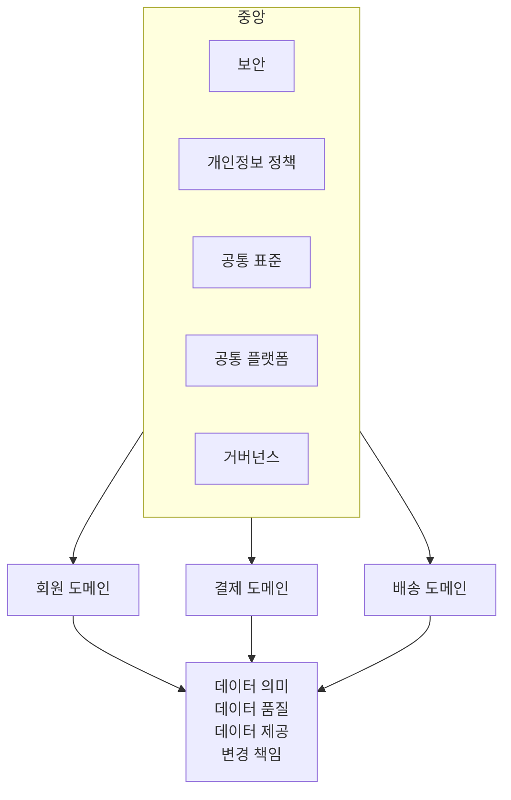
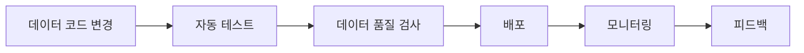
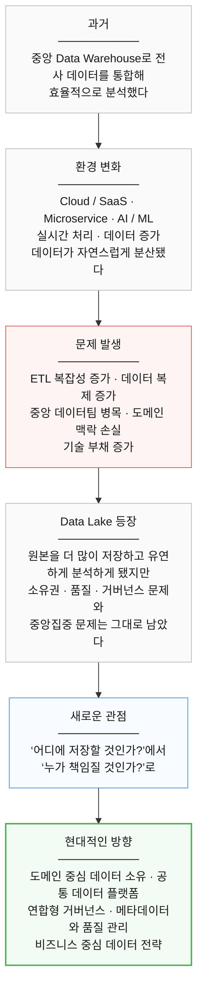

# 3장. 이름들의 지도

> **1부 · 문제** — 왜 데이터가 흩어졌고 무엇이 문제인가  
> 1장 · 2장 · **3장**

> "우리도 Data Mesh를 해야 하지 않나요?"

이런 질문을 받았을 때 바로 답하기는 어렵다.  
그 이름이 무슨 문제를 풀려고 나왔는지 모르면  
도입할지 말지도 판단할 수 없다.

Data Mesh, Data Fabric, DataOps, Lakehouse.

데이터 아키텍처를 공부하면  
비슷해 보이는 이름들이 쏟아진다.

이 장에서는 각 이름이  
어떤 문제를 풀려고 나왔는지만 정리한다.

세부 구현은 뒤에서 하나씩 다루므로  
여기서는 지도를 그린다는 느낌으로 읽으면 된다.

마지막에는 1부 전체를 한 번에 정리한다.

---

## 1. 중앙집중과 탈중앙화

여기에서 데이터 전략의 중요한 선택이 등장한다.

모든 데이터를 중앙에서 관리하면  
통제와 일관성을 확보하기 쉽다.

하지만 조직이 커질수록  
중앙팀의 병목이 생길 수 있다.

반대로 각 팀에게 모든 권한을 주면  
빠르게 움직일 수 있다.

하지만 각 팀이 제각각 움직이면  
새로운 데이터 사일로가 생길 수 있다.

|  | 중앙집중 | 탈중앙화 |
|---|---|---|
| **얻는 것** | 통제가 강하다<br>표준화가 쉽다<br>일관성을 확보하기 쉽다 | 자율성이 높다<br>변경 속도가 빠르다 |
| **잃는 것** | 자율성이 낮아질 수 있다<br>속도가 느려질 수 있다<br>중앙 병목이 생길 수 있다 | 표준이 어긋난다<br>중복 투자가 생긴다<br>데이터 통합이 어려워진다<br>새로운 사일로가 생긴다 |

따라서 현실적인 문제는

**중앙집중이냐 탈중앙화냐**

둘 중 하나를 선택하는 것이 아니다.

> 무엇을 중앙에서 관리하고  
> 무엇을 도메인에 위임할 것인가

를 결정하는 것이다.

---

## 2. 연합형 거버넌스

현대 데이터 아키텍처에서는  
중앙과 도메인이 역할을 나누는  
연합형 접근이 중요하게 다뤄진다.



중앙에서 모든 데이터를 직접 관리하지 않는다.

대신 조직 전체가 반드시 지켜야 하는  
공통 기준과 플랫폼을 제공한다.

도메인 팀은 자신이 가장 잘 알고 있는  
데이터의 의미와 품질을 책임진다.

---

## 3. Data Mesh는 단순한 분산이 아니다

Data Mesh를

```text
각 팀이 자기 데이터를 관리한다
```

정도로만 이해하면 부족하다.

Data Mesh의 핵심에는 크게 네 가지 생각이 있다.

**도메인 중심 데이터 소유권**,  
**Data as a Product**,  
**Self-Service Data Platform**,  
**Federated Computational Governance**다.

쉽게 말하면 다음과 같다.

| 원칙 | 뜻 |
|---|---|
| **도메인 소유권** | 데이터를 가장 잘 아는 팀이 책임진다 |
| **Data as a Product** | 다른 사람이 쉽게 사용할 수 있도록 데이터를 제품처럼 관리한다 |
| **Self-Service Platform** | 각 팀이 모든 인프라를 직접 만들지 않도록 공통 플랫폼을 제공한다 |
| **Federated Governance** | 중앙과 도메인이 함께 데이터 관리 규칙을 만든다 |

따라서 Data Mesh는

**모든 것을 각 팀에게 맡기는 완전한 탈중앙화가 아니다.**

공통 플랫폼과 거버넌스가 없는 상태에서  
팀마다 제각각 데이터를 운영한다면  
그것은 Data Mesh라기보다  
새로운 데이터 사일로에 가까울 수 있다.

또 Data Mesh가  
Data Warehouse나 Data Lake를 반드시 대체하는 것도 아니다.

물리적으로는 같은 Warehouse나 Lake를 사용하면서도  
논리적인 데이터 소유권을 도메인에 나눌 수 있다.

---

## 4. Data Fabric과 DataOps

Data Mesh와 함께  
Data Fabric이라는 개념도 자주 등장한다.

둘은 해결하려는 문제의 초점이 다르다.

Data Mesh가 주로

```text
누가 데이터를 책임지는가?
```

를 고민한다면,

Data Fabric은

```text
여러 환경에 흩어진 데이터를
어떻게 발견하고 연결하고 관리할 것인가?
```

에 더 가깝다.

메타데이터와 자동화를 적극적으로 활용해  
분산된 데이터의 통합과 관리를 돕는 접근이다.

DataOps는 또 다른 문제를 다룬다.

```text
데이터 파이프라인을
어떻게 빠르고 안정적으로 변경할 것인가?
```

소프트웨어 분야의 DevOps와 비슷한 철학을  
데이터 엔지니어링에 적용한다고 생각하면 쉽다.



Data Mesh, Data Fabric, DataOps는  
반드시 하나만 선택해야 하는 경쟁 개념은 아니다.

서로 다른 문제를 해결하기 때문에  
함께 사용할 수도 있다.

---

## 5. 이름은 달라도 향하는 곳은 비슷하다

지금까지 본 이름들은 서로 경쟁하는 개념이 아니다.

Data Mesh는 누가 책임지는가를,  
Data Fabric은 흩어진 것을 어떻게 연결하는가를,  
DataOps는 어떻게 빠르고 안정적으로 바꾸는가를 다룬다.

풀려는 문제가 다르므로 함께 쓸 수 있다.

이 책의 나머지 장은 이 이름들을 하나씩 풀어 쓴 것이다.

```text
경계와 책임      →  2부
경계를 넘는 방법  →  3부
데이터를 제품으로 →  4부
믿을 수 있게      →  5부
성과로 바꾸기     →  6부
조직과 실행       →  7부
```

---

## 6. 이 장의 핵심 흐름

1부를 하나의 이야기로 보면 다음과 같다.



---

## 7. 1부에서 기억할 것

이 장을 다 기억할 필요는 없다.  
다음 내용만 확실하게 이해하면 된다.

첫째, **데이터 관리 문제는 기술 문제만이 아니다.**  
조직, 책임, 품질, 보안, 거버넌스가 함께 움직여야 한다.

둘째, **중앙집중형 Data Warehouse와 Data Lake는 여전히 유용하다.**  
다만 조직 규모와 데이터 복잡성이 커지면  
중앙집중적인 운영 모델이 병목이 될 수 있다.

셋째, **현대 데이터 아키텍처의 질문은  
저장 위치에서 데이터 소유권과 책임으로 확대되고 있다.**

넷째, **완전한 중앙집중이나 완전한 탈중앙화가 정답은 아니다.**  
공통 규칙과 플랫폼은 중앙에서 제공하면서  
데이터의 의미와 품질은 도메인 가까이에서 책임지는  
연합형 접근이 중요하다.

다섯째, **Data Mesh는 단순한 데이터 분산이 아니다.**  
도메인 소유권, 데이터 제품, 셀프서비스 플랫폼,  
연합형 거버넌스가 함께 있어야 한다.

마지막으로 가장 중요한 것은,

> **데이터 아키텍처는 기술에서 출발하는 것이 아니라  
> 비즈니스가 해결해야 할 문제에서 출발해야 한다.**

---

## 8. 1부 한 문장 정리

**현대의 데이터는 이미 여러 시스템과 조직에 분산되어 있으므로,  
모든 것을 중앙으로 모으거나 모든 것을 각 팀에 맡기는 극단적인 방식보다  
비즈니스 목표를 기준으로 중앙의 통제와 도메인의 자율성을 조율하는  
데이터 전략이 필요하다.**
