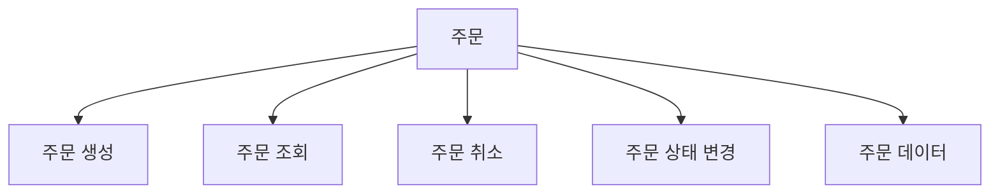
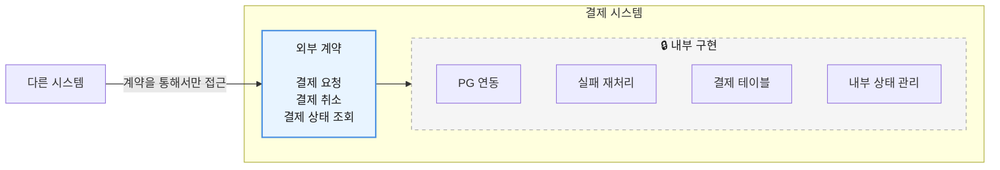

# 4장. 좋은 경계의 원리

> **2부 · 경계** — 어디에 선을 긋고 누가 책임지는가  
> **4장** · 5장 · 6장 · 7장

서비스가 작을 때는 데이터 관리가 어렵지 않다.

애플리케이션도 몇 개 없고,  
데이터베이스도 많지 않다.

필요한 데이터가 있으면 테이블을 조회하고,  
조금 복잡하면 여러 테이블을 JOIN해서 해결할 수도 있다.

하지만 서비스가 성장하면 상황이 달라진다.

```text
회원
결제
상품
배송
주문
출금
정산
파트너
통계
...
```

기능과 데이터가 많아지고  
여러 팀이 같은 데이터를 사용하기 시작한다.

처음에는 편했던 공용 DB와 직접 조회가  
나중에는 변경을 어렵게 만드는 원인이 된다.

이 장에서는 이러한 문제를 해결하기 위해  
**시스템과 데이터를 비즈니스 경계를 기준으로 나누고,  
각 도메인이 자신의 데이터에 책임을 가지는 방법**을 알아본다.

단, 목표는 시스템을 무조건 잘게 쪼개는 것이 아니다.

핵심은 다음 질문에 명확하게 답할 수 있는 구조를 만드는 것이다.

> 이 기능은 누가 책임지는가?  
> 이 데이터는 누가 책임지는가?  
> 다른 영역과는 어떤 계약으로 연결되는가?

---

## 1. 왜 경계가 필요한가

1부에서 본 것처럼 데이터는 이미 여러 곳에 흩어져 있고  
중앙에서 모두 해석하는 방식은 한계에 부딪힌다.

그렇다고 아무렇게나 나누면  
작은 변경 하나가 여러 시스템으로 번진다.

결제 구조를 바꿨더니 ETL이 깨지고  
리포트와 통계까지 손봐야 하는 상황이다.

그래서 필요한 것이 경계다.

이 장에서는 소프트웨어 설계가 오래 써 온 두 가지 원칙,  
응집도와 결합도에서 출발한다.

## 2. 좋은 소프트웨어 설계에서 힌트를 얻다

데이터 도메인을 이해하기 전에  
소프트웨어 설계의 기본 원칙을 알아야 한다.

핵심은 두 가지다.

**응집도는 높이고, 결합도는 낮추는 것**이다.

---

### 2.1 높은 응집도

응집도는 쉽게 말하면

> 서로 밀접하게 관련된 것들이  
> 얼마나 가까이 모여 있는가

를 의미한다.

예를 들어 주문 영역에는 다음 기능이 있을 수 있다.



이 기능들은 모두 주문이라는  
같은 비즈니스 문제를 다룬다.

따라서 같은 경계 안에 있으면  
이해하기도 쉽고 변경하기도 쉽다.

반대로 다음처럼 흩어져 있다면 복잡해진다.

```text
주문 생성 → 시스템 A
주문 조회 → 시스템 B
주문 취소 → 시스템 C
주문 상태 → 시스템 D
```

좋은 설계에서는  
**함께 변경되는 것들을 가능한 한 함께 둔다.**

---

### 2.2 낮은 결합도

결합도는

> 한 시스템이 다른 시스템의 내부 구조를  
> 얼마나 많이 알아야 하는가

를 의미한다.

예를 들어 주문 시스템이  
결제 DB를 직접 조회한다고 해보자.


주문 시스템이 결제 DB의

테이블 이름,  
컬럼 이름,  
JOIN 관계

를 알아야 한다.

그러면 결제팀이 내부 테이블을 변경할 때  
주문 시스템까지 영향을 받을 수 있다.

반대로 명확한 인터페이스를 두면 달라진다.


주문은 결제 내부가 어떻게 구현되었는지  
알 필요가 없다.

결제 내부 구조가 변경되더라도  
외부 계약만 유지하면 된다.

좋은 아키텍처의 중요한 목적 중 하나는

> **변경의 영향을 자신의 경계 안에 가두는 것**

이다.

---

## 3. 경계를 만들고 계약으로 연결한다

하나의 시스템에는  
외부에 공개해야 할 부분과  
내부에서만 알아야 할 부분이 있다.

예를 들어 결제 시스템을 생각해보자.



다른 시스템은 외부에 공개된 계약만 사용한다.

결제 내부의 테이블 구조까지  
알 필요가 없다.

이를 흔히 **캡슐화**라고도 한다.

이 원칙은 나중에 데이터에도 그대로 적용된다.

> 내부 데이터 모델을 그대로 공개하지 말고  
> 필요한 형태의 명확한 계약으로 제공하자.

---

## 4. 마이크로서비스에서 배우는 것

마이크로서비스의 큰 장점은  
각 서비스를 독립적으로 개발하고 배포할 수 있다는 것이다.

```text
회원 서비스

주문 서비스

결제 서비스

상품 서비스
```

상품 기능을 변경하면  
상품 서비스만 수정하고 배포할 수 있다.

하지만 여기서 중요한 점이 있다.

> **서비스를 많이 나눈다고  
> 좋은 아키텍처가 되는 것은 아니다.**

서비스가 많아지면  
다음과 같은 구조가 만들어질 수 있다.

```text
A → B
A → C
B → D
C → D
D → E
E → B
...
```

누가 누구에게 의존하는지  
파악하기 어려워진다.

서비스 하나의 장애가  
다른 서비스로 전파될 수도 있다.

즉 물리적으로 서비스를 나누었지만  
논리적으로는 여전히 강하게 결합되어 있을 수 있다.

---

## 5. Service Mesh가 해결하는 것과 해결하지 못하는 것

서비스가 많아지면

라우팅,  
재시도,  
타임아웃,  
보안,  
모니터링

같은 공통 통신 기능이 필요하다.

이런 운영상의 복잡성을 관리하기 위해  
Service Mesh 같은 기술을 사용할 수 있다.

하지만 한 가지 주의해야 한다.

Service Mesh가 해결하는 것은 주로

> **서비스 간 통신의 기술적·운영적 복잡성**

이다.

다음 질문까지 해결해주는 것은 아니다.

> A 서비스가 정말 B 서비스를 호출해야 하는가?

이것은 기술 문제가 아니라  
**도메인 설계 문제**다.

따라서 잘못된 비즈니스 경계를  
Service Mesh가 해결해주는 것은 아니다.

---

## 6. 4장 정리

세 가지만 기억하면 된다.

**함께 변경되는 것은 함께 둔다.**  
이것이 높은 응집도다.

**다른 시스템의 내부 구조를 알아야 한다면 결합도가 높은 것이다.**  
명확한 인터페이스를 두면  
상대의 내부가 바뀌어도 영향을 받지 않는다.

**좋은 아키텍처의 목적은 변경의 영향을 경계 안에 가두는 것이다.**  
서비스를 많이 나누는 것 자체는 목적이 아니다.  
물리적으로 나눠도 논리적으로 강하게 묶여 있을 수 있고,  
Service Mesh 같은 기술이 잘못 그은 경계를 고쳐주지도 않는다.

그렇다면 남는 질문은 하나다.

> 경계를 어디에 그을 것인가

다음 장에서 그 방법을 본다.
