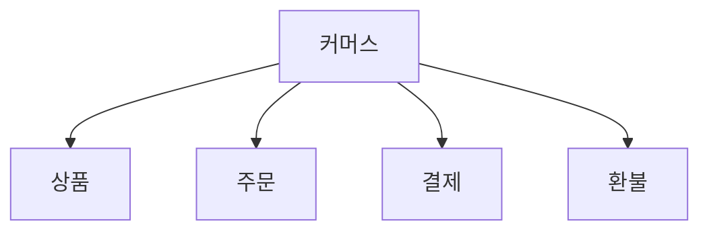
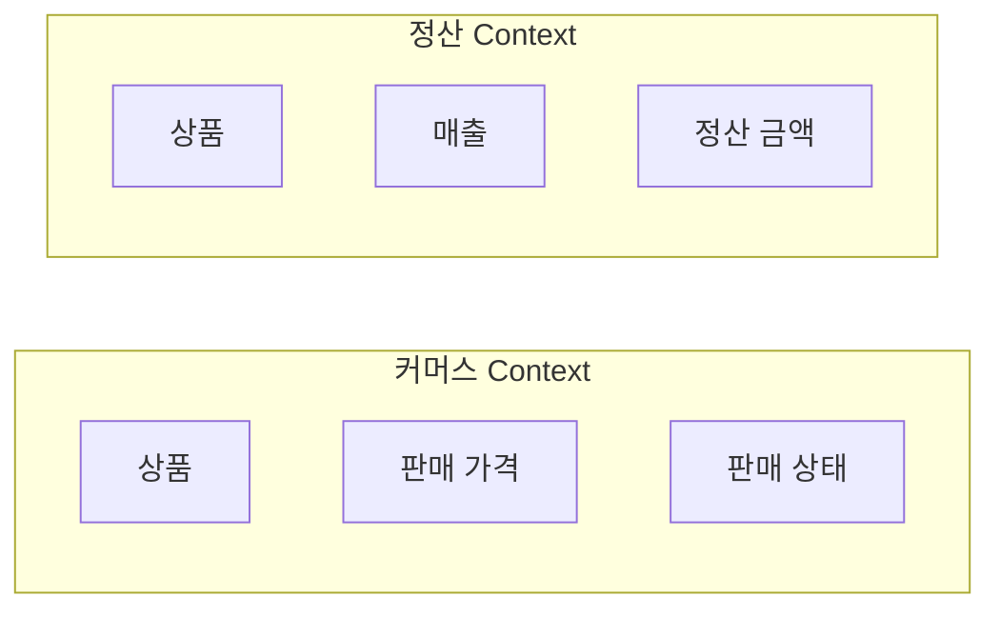
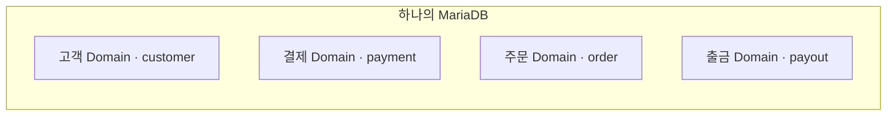

# 5장. 비즈니스로 도메인 나누기

> **2부 · 경계** — 어디에 선을 긋고 누가 책임지는가  
> 4장 · **5장** · 6장 · 7장

> "이 기능은 어느 팀이 맡나요?"

회의에서 이 질문이 나왔는데  
아무도 선뜻 답하지 못한 적이 있는가.

기능은 분명히 동작하고 있는데  
책임의 경계가 어디인지는 아무도 모르는 상태다.

4장에서 좋은 경계의 원리를 봤다.

그렇다면 실제로 어디에 선을 그어야 할까.

이 장에서는 도메인 주도 설계가 제안하는 방법을 본다.

Domain과 Subdomain,  
Bounded Context,  
유비쿼터스 언어,  
그리고 비즈니스 역량이다.

기술 구조가 아니라  
비즈니스 문제를 기준으로 나누는 것이 핵심이다.

---

## 1. 도메인 주도 설계란?

답해야 할 질문은 이런 것들이다.

```text
서비스를 어디까지 하나로 볼 것인가?

데이터를 누가 책임질 것인가?

어떤 기능끼리 함께 있어야 하는가?
```

이 질문에 답하는 방법으로 **도메인 주도 설계(DDD)** 가 있다.

DDD의 핵심은 단순하다.

> 기술 구조보다  
> 실제 비즈니스 문제를 먼저 이해하자.

예를 들어 어떤 플랫폼이 다음 기능을 제공한다고 해보자.

```text
회원
상품
결제
주문
출금
정산
판매자 관리
```

DDD에서는 처음부터

```text
payment_table
order_log
payout_history
```

같은 테이블 구조부터 생각하지 않는다.

먼저 다음을 질문한다.

```text
결제는 어떤 책임을 가지는가?

주문은 무엇을 의미하는가?

출금에는 어떤 규칙이 있는가?

어떤 규칙들이 함께 변경되는가?

어디까지를 하나의 문제 영역으로 볼 것인가?
```

이렇게 비즈니스를 이해하면서  
자연스러운 경계를 발견한다.

---

## 2. Domain과 Subdomain

**Domain**은 우리가 해결하려는  
비즈니스 문제 영역이다.

그런데 회사 전체의 비즈니스는 너무 크다.

그래서 큰 문제를  
더 작은 문제 영역으로 나눈다.

이를 **Subdomain**이라고 한다.

예를 들어 커머스라는 큰 영역이 있다면



처럼 나누어 볼 수 있다.

여기서 중요한 기준은  
프로그램이나 테이블의 개수가 아니다.

**비즈니스 문제가 서로 다른가**가 핵심이다.

---

## 3. Bounded Context

DDD에서 가장 중요한 개념 중 하나가  
**Bounded Context**다.

쉽게 말하면

> 같은 모델과 용어가  
> 일관된 의미를 가지는 경계

라고 이해하면 된다.

예를 들어 `상품`이라는 단어가 있다고 하자.

커머스에서는

```text
상품
= 고객에게 판매하는 대상
```

일 수 있다.

정산에서는

```text
상품
= 매출과 지급 금액을 계산하기 위한 대상
```

일 수 있다.

통계에서는

```text
상품
= 매출 분석을 위한 분류 단위
```

일 수도 있다.

같은 `상품`이라는 단어지만  
필요한 정보와 규칙은 다르다.

그래서 모든 시스템이  
하나의 거대한 상품 모델을 공유하게 만들 필요가 없다.



각 Context 안에서  
자신에게 필요한 모델을 가지면 된다.

---

## 4. Ubiquitous Language

Bounded Context와 함께 알아야 할 것이  
**Ubiquitous Language**다.

쉽게 말하면

> 같은 Context 안에서는  
> 현업, 기획자, 개발자가  
> 같은 용어를 같은 의미로 사용하자.

는 것이다.

예를 들어 조직에서

```text
출금 환산율
출금 환산단가
판매자 지급단가
```

를 섞어서 사용한다고 해보자.

세 용어가 정말 같은 개념이라면  
하나로 통일하는 편이 좋다.

반대로 실제 규칙이 다르다면  
서로 다른 이름을 사용해야 한다.

언어의 차이는 단순한 표현 문제가 아니다.

**모델이 다른 것을 발견하는 단서**가 되기도 한다.

예를 들어

```text
구매 취소
환불
PG 취소
```

를 모두 같은 의미로 사용하고 있었는데  
업무를 자세히 보면

```text
구매 취소
= 주문 자체의 취소

환불
= 사용자에게 돈을 반환

PG 취소
= PG 승인 거래의 취소
```

처럼 실제로는 다른 개념일 수 있다.

---

## 5. 비즈니스 역량

도메인의 경계를 찾는 또 다른 관점은  
**Business Capability**, 즉 비즈니스 역량이다.

쉽게 말하면

> 회사가 비즈니스를 수행하기 위해  
> 할 수 있어야 하는 일

이다.

예를 들어 커머스 회사라면 이런 것들을 할 수 있어야 한다.

```text
상품을 등록하고 노출한다
주문을 받고 처리한다
결제를 승인하고 취소한다
상품을 배송한다
판매자에게 정산한다
고객 문의에 응대한다
```

앞에서 본 도메인 목록과 비슷해 보이지만  
표현이 다르다는 점을 보자.

도메인은 `주문`처럼 **영역**을 가리키고,  
역량은 `주문을 받고 처리한다`처럼 **할 수 있는 일**을 가리킨다.

이것은 조직도와 다르다.

```text
개발1팀
개발2팀
운영팀
사업팀
```

은 조직 구조다.

조직은 자주 바뀔 수 있지만

```text
결제
예약
주문
정산
출금
```

같은 영역에서 하는 일은  
상대적으로 오래 유지된다.

기술도 마찬가지다.

PHP에서 Go로 바뀌어도

> 고객의 결제를 처리한다.

라는 비즈니스 능력은 남는다.

---

## 6. 비즈니스 역량과 Bounded Context는 같은 것이 아니다

여기서 주의해야 한다.

비즈니스 역량과 Bounded Context는  
서로 밀접하게 관련되어 있지만  
동일한 개념은 아니다.

비즈니스 역량은

> **우리가 무엇을 할 수 있는가?**

에 초점을 둔다.

Bounded Context는

> **어디까지 같은 모델과 언어를 사용할 것인가?**

에 초점을 둔다.

따라서 다음처럼 기계적으로 생각하면 안 된다.

```text
비즈니스 역량 하나
=
Bounded Context 하나
=
애플리케이션 하나
=
DB 하나
```

실제 설계에서는  
서로 잘 맞춰보는 것이 좋지만  
반드시 1:1일 필요는 없다.

---

## 7. 조직과 Context는 어떤 관계인가

Bounded Context를 현재 조직도에 억지로 맞추는 것은 좋지 않다.

조직은 자주 바뀌지만 비즈니스 문제는 그렇지 않기 때문이다.

그렇다고 조직 구조가 아무 관련이 없는 것도 아니다.

어떤 팀이 어떤 업무를 담당하는지,  
어떤 사람들끼리 자주 대화하는지,  
어떤 용어를 공유하는지는  
도메인 경계를 발견하는 중요한 단서가 된다.

> **도메인이 조직도에 종속될 필요는 없지만  
> 조직과 의사소통 구조는 경계를 찾는 중요한 정보다.**

### 한 Context에 책임 팀이 하나면 좋다

이상적으로는 하나의 Bounded Context에  
명확한 책임 팀이 있는 것이 좋다.


그러면 누가 변경하는지, 누가 장애를 책임지는지,  
누가 정책을 결정하는지가 명확해진다.

하지만 절대 규칙은 아니다.

큰 Context를 여러 팀이 담당할 수도 있고,  
작은 회사에서는 한 팀이 여러 Context를 담당할 수도 있다.

핵심은 팀의 개수가 아니다.

> **책임의 주체가 명확한가**

---

## 8. 물리적 시스템과 논리적 도메인은 다르다

현실에서는 하나의 오래된 시스템이

```text
회원
결제
주문
출금
통계
```

를 모두 가지고 있을 수 있다.

물리적으로는 하나의 애플리케이션이다.

하지만 이것이  
하나의 도메인이라는 뜻은 아니다.

예를 들어 하나의 MariaDB에

```text
customer
payment
order
point
payout
product
```

가 들어 있다고 해보자.

논리적으로는 다음처럼 볼 수 있다.



따라서 다음 공식은 성립하지 않는다.

```text
DB 1개 = Domain 1개

Application 1개 = Domain 1개

Microservice 1개 = Domain 1개
```

도메인은 물리적인 배치보다  
**비즈니스 책임과 모델의 경계**로 판단한다.

---

## 9. 5장 정리

세 가지만 기억하면 된다.

**도메인은 비즈니스 문제로 나눈다.**  
테이블이나 프로그램 개수가 기준이 아니다.

**Bounded Context는 같은 용어가 일관된 의미를 갖는 경계다.**  
같은 `상품`이라도 판매·정산·통계에서  
필요한 정보와 규칙이 다르다.  
그래서 하나의 거대한 공통 모델을 만들 필요가 없다.

**물리적 배치와 논리적 경계는 다른 문제다.**

```text
DB 1개 = Domain 1개

Application 1개 = Domain 1개

Microservice 1개 = Domain 1개
```

이 공식은 성립하지 않는다.  
하나의 DB 안에서도 도메인 경계를 그을 수 있다.

다음 장에서는 경계를 나눈 뒤에 따라오는 질문,  
즉 데이터를 누가 책임지는가를 본다.
