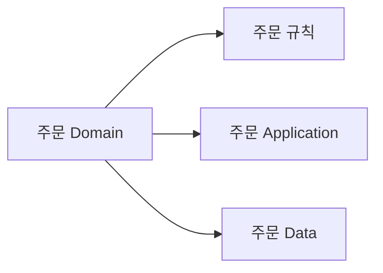
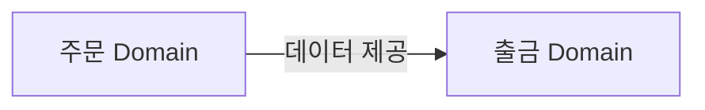
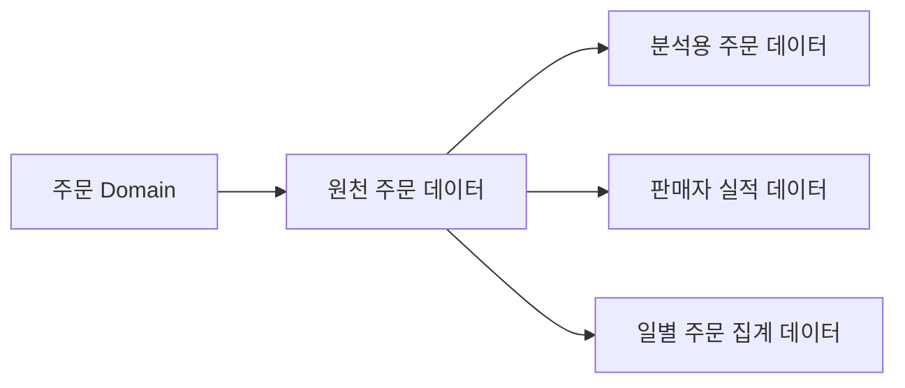
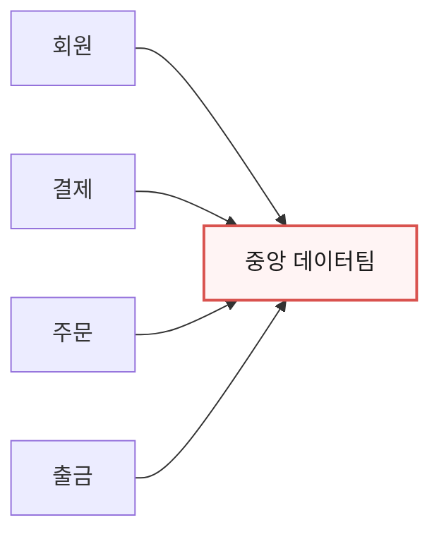
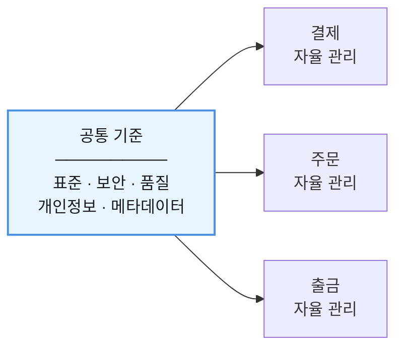
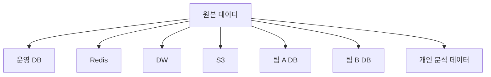

# 6장. 데이터 소유권

> **2부 · 경계** — 어디에 선을 긋고 누가 책임지는가  
> 4장 · 5장 · **6장** · 7장

값이 이상하다는 이야기가 나왔다.

그런데 여러 팀에서 같은 답이 돌아온다.

> "그건 저희가 만든 데이터가 아닌데요."

분명히 어딘가에서 만들어진 데이터인데  
아무도 자기 것이라고 하지 않는다.

경계를 나눴다면 다음 질문이 따라온다.

> 이 데이터는 누가 책임지는가

이 장에서는 데이터 도메인과 데이터 소유권을 다룬다.

복사했다고 소유권이 옮겨가지 않는다는 것,  
하나의 도메인이 여러 데이터 제품을 가질 수 있다는 것,  
그리고 분산이 각자 마음대로가 아니라는 것이다.

---

## 1. 데이터 도메인

이제 이 생각을 데이터에 적용해보자.

예를 들어 주문이라는 비즈니스 영역이 있다면



처럼 볼 수 있다.

여기서 데이터 도메인은

> **어떤 비즈니스 영역이  
> 어떤 데이터에 책임을 가지는가**

를 나타낸다.

데이터가 어느 DB에 저장되어 있는지만 보는 것이 아니다.

---

## 2. Data Ownership

도메인을 나누었다면  
다음 질문을 해야 한다.

> 이 데이터는 누가 책임지는가?

이것이 **Data Ownership**이다.

데이터 소유권은 단순히  
테이블을 만든 사람이 누구인가를 뜻하지 않는다.

도메인은 자신의 데이터에 대해

의미,  
품질,  
변경,  
접근 권한,  
보안,  
개인정보,  
제공 방식

등을 책임져야 한다.

예를 들어 주문 데이터의 값이 이상하다면

> 이 데이터가 맞는지  
> 누가 최종적으로 판단할 것인가?

라는 질문에 답할 수 있어야 한다.

---

## 3. 복사했다고 소유권이 바뀌는 것은 아니다

주문 데이터를 출금 도메인으로 전달했다고 해보자.



출금 시스템이 이 데이터를 저장했다고 해서  
원본 주문 데이터의 소유자가 바뀌는 것은 아니다.

출금 쪽에서

필터링하고,  
JOIN하고,  
이름을 바꾸고,  
새로운 값을 계산해도

원본 주문 데이터에 대한 책임은  
여전히 주문 도메인에 있을 수 있다.

대신 출금 도메인이 새롭게 계산한

```text
출금 가능 금액
출금 상태
출금 처리 결과
```

같은 데이터는  
출금 도메인의 책임이 된다.

이렇게 **어떤 데이터의 어떤 의미를 누가 책임지는가**를  
명확하게 해야 한다.

---

## 4. Data Product

소유권을 정했다면 그것을 밖에서도 알 수 있어야 한다.

데이터를 다른 사람이 믿고 쓸 수 있도록  
관리해서 제공하는 형태를 **Data Product**라고 부른다.

중요한 것은 이것이다.

> Data Product는 단순한 테이블 하나가 아니다.

데이터와 함께 스키마, 의미 설명, 품질 기준,  
접근 정책, 메타데이터, 제공 인터페이스를 같이 생각한다.

그래야 사용자가 이 질문에 답할 수 있다.

> 이 데이터를 믿고 사용해도 되는가?

한 가지 덧붙이면, Data Mesh에서 말하는 Data Product는  
원래 **분석용 데이터**를 중심에 둔 개념이다.

실무에서는 운영 API나 도메인 인터페이스까지  
넓게 부르는 경우도 있다.

무엇을 갖춰야 데이터 제품이라고 부를 수 있는지는  
13장 「데이터 프로덕트」에서 자세히 다룬다.

이 장에서는 **도메인이 소유권을 드러내는 형태**  
정도로 생각하면 충분하다.

---

## 5. 도메인은 여러 데이터 제품을 가질 수 있다

하나의 도메인이  
반드시 데이터 제품 하나만 제공하는 것은 아니다.

예를 들어 주문 도메인에서



처럼 여러 데이터 제품을 만들 수 있다.

따라서

```text
Domain 1개
=
Data Product 1개
```

가 아니다.

---

## 6. 분산형 데이터 관리

기존에는 데이터 관리 책임이  
중앙 데이터 조직에 집중되어 있었다.



도메인 중심 구조에서는 책임을 나눈다.

- **회원 Domain** — 회원 데이터 책임
- **결제 Domain** — 결제 데이터 책임
- **주문 Domain** — 주문 데이터 책임
- **출금 Domain** — 출금 데이터 책임

이것이 Data Mesh가 말하는 중요한 방향 가운데 하나다.

### 분산은 '각자 마음대로'가 아니다

여기서 매우 흔한 오해가 있다.

중앙 관리를 걷어내면 각 팀이 알아서 하면 된다는 생각이다.

그렇게 하면 같은 의미의 데이터가 제각각 만들어진다.

```text
user_id
member_no
uid
account_key
```

날짜 형식, 개인정보 처리 방식,  
품질 기준, 보안 정책도 모두 달라진다.

그래서 도메인 자율성과 함께 공통 기준이 필요하다.



Data Mesh에서는 이 방향을 **Federated Governance**라고 부른다.

> 중앙에서 모든 데이터를 직접 관리하지는 않지만  
> 회사 전체가 따라야 하는 기준은 함께 만든다.

---

## 7. Data Sprawl

분산형 데이터 환경의 위험 가운데 하나는  
데이터가 여기저기 무질서하게 퍼지는 것이다.



어느 순간

> 어떤 것이 진짜 원본인가?

를 알기 어려워진다.

이를 **Data Sprawl**이라고 볼 수 있다.

따라서 데이터가 복제되더라도

```text
원본은 어디인가?

누가 소유하는가?

어디로 전달되는가?

누가 소비하는가?

얼마나 최신인가?
```

를 추적할 수 있어야 한다.

---

## 8. 처음부터 완벽하게 바꾸려고 하지 않는다

오래 운영한 시스템에는 이미

```text
공용 DB
직접 JOIN
공통 테이블
배치
ETL
레거시 코드
```

가 복잡하게 얽혀 있을 수 있다.

이것을 한 번에 모두 뜯어고치는 것은 위험하다.

먼저 현재 구조를 파악해야 한다.

```text
AS-IS

어떤 서비스가
어떤 테이블을 읽는가?

누가 데이터를 수정하는가?

어떤 시스템이 직접 연결되어 있는가?

데이터 원본은 어디인가?
```

그다음 목표 구조를 설계한다.


작은 영역부터 적용하면서  
경험을 쌓는 것이 현실적이다.

---

## 9. 6장 정리

세 가지만 기억하면 된다.

**데이터 소유권은 테이블을 만든 사람이 누구인가가 아니다.**  
의미·품질·변경·접근 정책을 책임지는 주체를 말한다.

**복사했다고 소유권이 옮겨가지 않는다.**  
다만 받은 데이터로 새로운 값을 계산했다면  
그 값에는 새로운 소유자가 생긴다.

**분산은 각자 마음대로가 아니다.**  
같은 의미의 데이터가 팀마다 다른 이름을 갖고,  
날짜 형식과 품질 기준이 제각각이 되면  
도메인을 나눈 의미가 없어진다.

그래서 도메인 자율성과 공통 거버넌스가 함께 가야 한다.

다음 장에서는 경계를 넘어  
다른 도메인에 데이터를 넘기는 방법을 본다.
