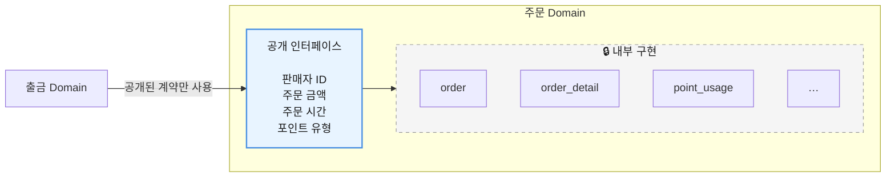
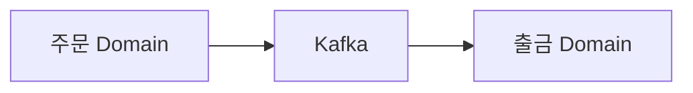
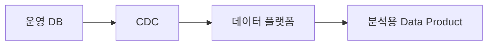
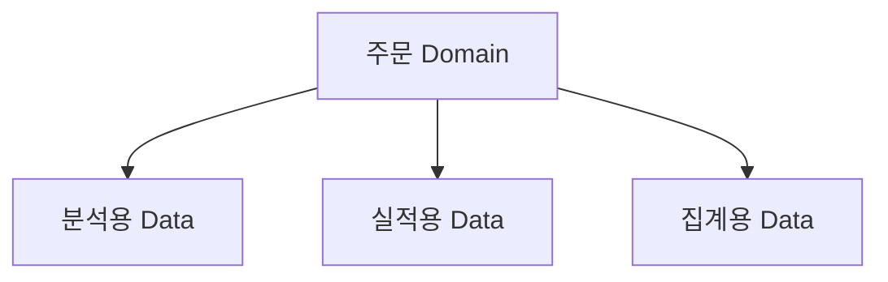
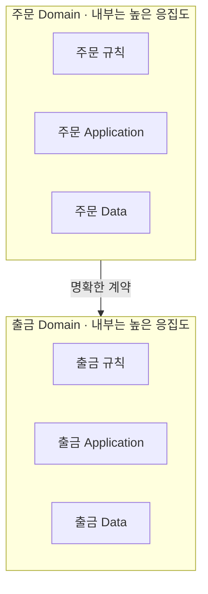
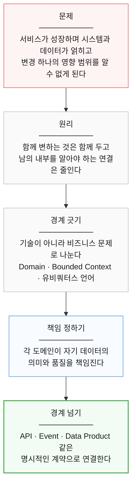

# 7장. 무엇을 공개하고 무엇을 감출 것인가

> **2부 · 경계** — 어디에 선을 긋고 누가 책임지는가  
> 4장 · 5장 · 6장 · **7장**

떼어내기로 한 서비스가 있다.

그런데 코드를 뒤져 보니  
다른 팀 여러 곳에서 그 서비스의 테이블을  
직접 조회하고 있다.

테이블 이름 하나만 바꿔도  
어디가 깨질지 알 수 없는 상태다.

도메인을 잘 나누면 곧바로 현실적인 문제가 생긴다.

> 다른 도메인의 데이터가 필요하면 어떻게 하지?

이 장에서는 경계를 넘는 방법을 다룬다.

핵심은 하나다.  
내부 데이터 모델과 외부 공개 계약을 나누는 것이다.

모놀리스에서 서비스를 떼어내는 중이라면  
이 장이 가장 먼저 쓰인다.

---

## 1. 다른 도메인이 데이터를 필요로 한다면

도메인을 잘 나누면  
다음 문제가 생긴다.

> 다른 도메인의 데이터가 필요하면 어떻게 하지?

예를 들어 출금에서  
주문 데이터가 필요하다고 해보자.

가장 쉬운 방법은


다.

처음에는 편하다.

하지만 출금 시스템이 주문 DB의

테이블 구조,  
컬럼,  
JOIN 관계

까지 알게 된다.

결국 두 도메인이 다시 강하게 결합된다.

---

## 2. 공개 인터페이스를 만든다

대신 주문 도메인이  
외부에 사용할 수 있는 계약을 제공할 수 있다.



출금 도메인은 이 네 가지만 알면 된다.

내부에서 몇 개의 테이블을 JOIN했는지는  
알 필요가 없다.

이런 역할을 `Data Provider`라고 부르기도 한다.  
다만 DDD의 표준 용어는 아니다.

핵심은 이름이 아니라

> **내부 데이터 구조와  
> 외부 공개 계약을 분리한다.**

는 원칙이다.

---

## 3. API만이 유일한 방법은 아니다

도메인 간 데이터를 전달한다고 해서  
항상 HTTP API만 사용해야 하는 것은 아니다.

상황에 따라 여러 방법을 사용할 수 있다.

```text
API

Domain Event

Message Broker

CDC

Data Pipeline

Data Product

Read Model
```

중요한 것은 어떤 기술을 사용하느냐보다

> **누가 생산자이고  
> 누가 소비자이며  
> 데이터의 의미와 책임이 어디에 있는가**

가 명확해야 한다는 것이다.

---

## 4. 중간 시스템이 있다고 잘못된 구조는 아니다

데이터가 반드시 생산자에서 소비자로  
직접 전달되어야 하는 것은 아니다.

예를 들어 다음 구조도 충분히 가능하다.



또는



도 가능하다.

문제는 Kafka나 파이프라인 자체가 아니다.

문제는 이런 구조다.


이쯤 되면 소비 시스템 쪽에서 이런 질문이 나온다.

> 그래서 이 데이터의 주인이 누구지?

중간 시스템 때문에  
데이터 출처와 의미와 소유권이 흐려지는 것이 문제다.

따라서 정확한 원칙은 다음과 같다.

> **중간 시스템을 쓰지 말라는 것이 아니라  
> 중간 시스템 때문에 데이터 소유권과 의미가  
> 사라지게 만들지 말자.**

---

## 5. 소비자가 사용하기 좋은 데이터를 제공한다

내부 테이블을 그대로 공개하는 것보다  
소비자가 필요한 데이터 모델을 제공하는 것이 좋다.

예를 들어 출금에서는

```text
판매자 ID
주문 금액
포인트 유형
출금 가능 여부
```

가 중요할 수 있다.

반면 분석에서는

```text
날짜
판매자
구매자
주문 금액
주문 시간
```

이 필요할 수 있다.

따라서 하나의 원천에서  
여러 형태의 데이터가 나올 수 있다.



하지만 소비자마다  
모든 요구를 별도 모델로 만들어주는 것도 좋지 않다.

생산자가 소비자 요구에  
지나치게 끌려다닐 수 있기 때문이다.

따라서

**재사용성**과  
**소비 편의성**

사이의 균형이 필요하다.

---

## 6. 타 도메인 DB 직접 접근은 무조건 금지인가?

원칙적으로 비즈니스 로직에서

```text
출금 → 주문 내부 테이블 직접 수정
```

같은 구조는 피하는 것이 좋다.

도메인 경계를 무너뜨리기 쉽기 때문이다.

하지만

> 다른 도메인 테이블을  
> 어떤 상황에서도 읽으면 안 된다.

는 절대 법칙은 아니다.

예를 들어

분석,  
통계,  
CQRS Read Model,  
Materialized View

처럼 여러 도메인의 데이터를  
결합해야 하는 목적이 있을 수 있다.

따라서 더 정확한 원칙은

> **도메인의 핵심 비즈니스 로직이  
> 다른 도메인의 내부 구현에 직접 의존하지 않게 한다.**

라고 이해하는 것이 좋다.

---

## 7. 도메인 안은 강하게, 도메인 사이는 느슨하게

지금까지 배운 원칙을  
가장 간단하게 표현하면 다음과 같다.



즉,

> **경계 안은 밀접하게 만들고  
> 경계를 넘을 때는 느슨하게 만든다.**

이 원칙이 DDD와 데이터 도메인을  
관통하는 핵심이다.

---

## 8. 7장 정리

세 가지만 기억하면 된다.

**내부 데이터 모델과 외부 공개 계약을 나눈다.**  
다른 도메인은 계약만 보고, 내부에 몇 개의 테이블이 있는지는 모른다.  
그래야 내부를 바꿔도 밖이 깨지지 않는다.

**계약이 반드시 API인 것은 아니다.**  
API, 도메인 이벤트, 메시지 브로커, CDC,  
데이터 파이프라인, 데이터 제품 모두 계약이 될 수 있다.  
중요한 것은 기술이 아니라 **누가 생산자이고 의미를 누가 책임지는가**다.

**"남의 DB는 절대 읽지 마라"가 원칙은 아니다.**  
분석이나 조회 모델처럼 여러 도메인을 결합해야 하는 목적이 있다.  
정확한 원칙은 이것이다.

> 도메인의 **핵심 비즈니스 로직**이  
> 다른 도메인의 내부 구현에 직접 의존하지 않게 한다.

### 여기까지가 2부다

4장부터 7장까지를 하나로 이으면 다음과 같다.



2부에서 가장 중요한 것은  
시스템을 많이 쪼개는 기술이 아니다.

세 가지를 명확하게 만드는 것이다.

```text
무엇을 책임지는가
어떤 데이터를 책임지는가
다른 영역과 어떤 계약으로 연결되는가
```

그래서 데이터 도메인이란

> **DB를 기준으로 데이터를 나누는 것이 아니라  
> 비즈니스 책임을 기준으로 경계를 만들고  
> 각 영역이 자신의 데이터에 책임을 가지게 하는 것**

이다.

하나의 DB를 쓴다고 도메인 중심 설계를 못 하는 것이 아니고,  
마이크로서비스를 수십 개로 나눴다고 좋은 설계가 되는 것도 아니다.

여기에 **도메인의 자율성**과 **전사 공통 거버넌스**가 더해질 때  
규모가 커져도 감당할 수 있는 구조가 된다.

이 부에서 나온 용어는 부록 C 「용어집」의  
「경계와 도메인」 항목에 정리해 두었다.

다음 부에서는 여기서 정한 계약을  
**무엇으로 구현할 것인가**를 본다.
