# 8장. API로 연결하기

> **3부 · 연결** — 경계를 어떻게 넘는가  
> **8장** · 9장 · 10장 · 11장 · 12장

현대 시스템은 하나의 프로그램만으로 동작하지 않는다.

회원, 주문, 결제, 배송, 정산처럼  
서로 다른 기능이 데이터를 주고받으며  
하나의 서비스를 만든다.

시스템이 작을 때는 서로의 DB를 직접 조회하거나  
내부 함수를 호출하는 방식으로도 충분할 수 있다.

하지만 규모가 커지면 문제가 생긴다.

어떤 시스템이 어떤 데이터를 소유하는지,  
누가 변경할 수 있는지,  
다른 시스템은 어떤 방식으로 접근해야 하는지가  
점점 불분명해진다.

이 문제를 해결하는 핵심 도구가 **서비스와 API**이다.

이번 장에서는 API의 기본 개념에서 시작해  
SOA, REST, ESB, API Gateway, 마이크로서비스,  
서비스 메시, GraphQL, BFF, CQRS까지 살펴본다.

기술 이름을 모두 외우는 것이 목표는 아니다.

이번 장의 핵심은 다음 한 문장으로 정리할 수 있다.

> **각 도메인은 자신의 비즈니스 로직과 데이터를 책임하고,  
> 다른 도메인은 명확하게 정의된 인터페이스를 통해 사용한다.**

---

## 1. 데이터와 애플리케이션은 함께 움직인다

데이터 아키텍처를 공부하다 보면  
DB와 데이터 모델에만 집중하기 쉽다.

하지만 실제 데이터는 DB에 가만히 있지 않다.

애플리케이션이 데이터를 생성하고,  
다른 애플리케이션이 그 데이터를 조회하고,  
또 다른 시스템으로 전달한다.

예를 들어 주문 시스템을 생각해보자.

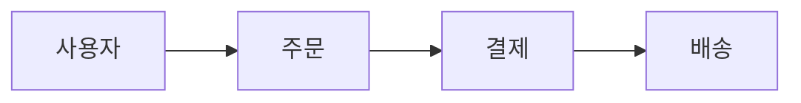

주문은 결제와 연결되어야 하고,  
결제가 완료되면 배송과 연결될 수 있다.

따라서 실제 시스템에서는

```text
데이터
+
애플리케이션
+
서비스
+
API
```

가 함께 움직인다.

데이터 아키텍처와  
애플리케이션 아키텍처를  
완전히 별개의 문제로 볼 수 없는 이유이다.

---

## 2. 운영 시스템과 분석 시스템은 다르다

같은 데이터를 쓰더라도 두 시스템은 성격이 다르다.

운영 시스템은 작은 단위를 빠르고 정확하게 처리한다.  
분석 시스템은 많은 데이터를 읽어 계산한다.

요구사항이 다르지만 결국 같은 비즈니스 데이터를 쓴다.  
둘을 안전하게 잇는 방법 가운데 하나가 API다.

두 영역의 경계가 어떻게 흐려지고 있는지는  
12장 「무엇으로 연결할 것인가」에서 다룬다.

## 3. API란 무엇인가

API는

**Application Programming Interface**

의 약자이다.

쉽게 말하면

> 프로그램이 다른 프로그램의 기능이나 데이터를  
> 사용할 수 있도록 정해 놓은 인터페이스

이다.

예를 들어 회원 정보를 조회하는 API가 있다고 하자.

```http
GET /users/100
```

응답은 다음과 같을 수 있다.

```json
{
  "id": 100,
  "name": "홍길동"
}
```

API를 사용하는 쪽에서는  
회원 시스템 내부가 어떻게 구현되었는지 알 필요가 없다.

```text
PHP인지
Go인지
MariaDB인지
Redis를 사용하는지
```

몰라도 된다.

Consumer가 알아야 할 것은

```text
무엇을 요청하면 되는가?

어떤 형식으로 결과가 오는가?
```

이다.

이것이 API가 제공하는 중요한 가치이다.

---

## 4. API는 내부 구현을 숨긴다

결제 시스템 내부가 다음처럼 복잡하다고 생각해보자.

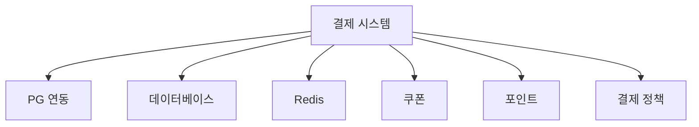

다른 시스템이 이 구조를 전부 알아야 한다면  
결제 시스템을 변경하기 매우 어렵다.

대신 외부에는 다음과 같은 인터페이스만 제공한다.

```http
POST /payments
```

그러면 내부에서

```text
PHP → Go

DB 구조 변경

PG사 변경
```

이 일어나더라도  
외부 계약이 유지되는 한  
Consumer의 변경을 최소화할 수 있다.

이렇게 내부 복잡성을 감추는 것을  
**추상화** 또는 **캡슐화**라고 볼 수 있다.

---

## 5. 서비스 간 통신은 동기와 비동기로 나뉜다

서비스끼리 통신하는 방법은 크게  
동기식과 비동기식으로 나누어 생각할 수 있다.

### 동기식 통신

동기식 통신은 요청한 쪽이  
응답을 기다리는 방식이다.

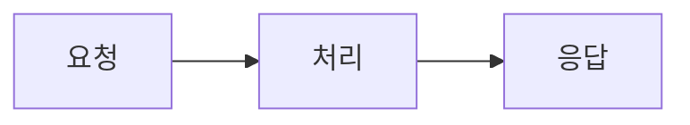

예를 들어 결제 요청은  
성공했는지 실패했는지 바로 알고 싶다.

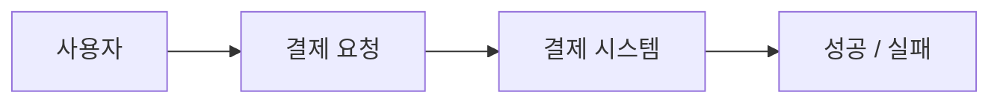

이런 경우에는 동기식 요청-응답 방식이 자연스럽다.

---

### 비동기식 통신

반대로 즉시 결과를 기다릴 필요가 없는 작업도 있다.

예를 들어 주문이 완료된 이후

```text
랭킹 반영
통계 적재
알림 발송
추천 데이터 반영
```

이 필요하다고 하자.

주문 서비스가 이 작업을 모두 기다릴 필요는 없다.

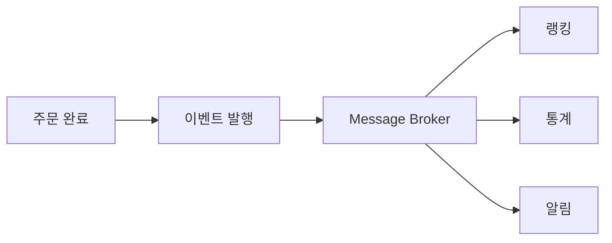

이처럼 요청자가  
후속 작업의 완료를 직접 기다리지 않는 방식이  
비동기 통신이다.

---

## 6. Publish / Subscribe

비동기 시스템에서 자주 사용하는 방식이

**Publish / Subscribe**,  
줄여서 **Pub/Sub**이다.

예를 들어 주문 서비스가

```text
OrderCompleted
```

라는 이벤트를 발행한다고 하자.

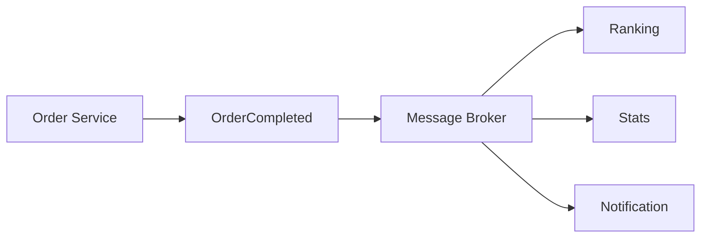

주문 서비스는  
누가 이 이벤트를 사용할지 모두 알 필요가 없다.

각 Consumer가 자신에게 필요한 이벤트를 구독하고  
자기 역할을 수행한다.

이 방식은 서비스 간 직접 의존성을 줄이는 데  
도움이 된다.

---

## 7. SOA: 서비스를 중심으로 시스템을 나누다

SOA는

**Service-Oriented Architecture**

즉, 서비스 지향 아키텍처이다.

핵심 아이디어는

> 시스템 기능을 서비스 단위로 제공하고,  
> 명확한 인터페이스를 통해 서로 사용하게 하자.

이다.

예를 들어 거대한 쇼핑몰 시스템을

```text
회원 서비스
상품 서비스
주문 서비스
결제 서비스
배송 서비스
```

처럼 나눌 수 있다.

서비스를 사용하는 쪽을

**Service Consumer**

라고 하고,

서비스를 제공하는 쪽을

**Service Provider**

라고 한다.

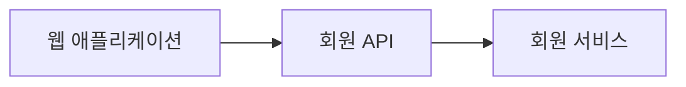

이 경우 웹 애플리케이션은 Consumer이고  
회원 서비스는 Provider이다.

---

## 8. 느슨한 결합

서비스 아키텍처에서 매우 중요한 목표가  
**느슨한 결합**이다.

서비스 A가 서비스 B의 DB를 직접 조회한다고 하자.

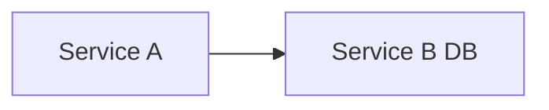

B의 테이블 구조가 바뀌면  
A도 영향을 받을 수 있다.

반면 다음처럼 API를 사용하면

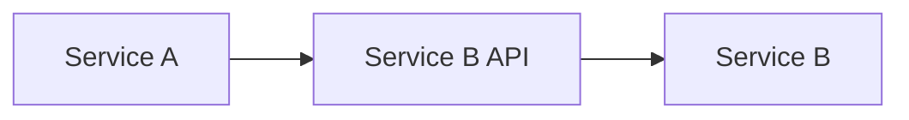

B의 내부 구현이 바뀌더라도  
외부 API 계약을 유지하면  
A의 변경을 줄일 수 있다.

이것이 느슨한 결합의 핵심이다.

---

## 9. REST와 리소스 중심 API

현대 웹 API에서 자주 사용하는 방식이 REST이다.

REST는

**Representational State Transfer**

라는 이름의 **아키텍처 스타일**이다.

REST는 단순히

```text
GET
POST
PUT
DELETE
```

를 사용하는 규칙만을 의미하지 않는다.

REST에는

```text
Client-Server
Stateless
Cacheable
Uniform Interface
Layered System
```

등 여러 제약이 포함된다.

다만 실무에서 RESTful HTTP API를 이해할 때는  
먼저 **리소스(Resource)** 개념부터 보는 것이 쉽다.

---

### 리소스란 무엇인가

시스템에서 다루는 대상을 리소스로 볼 수 있다.

```text
회원
주문
상품
결제
배송
```

예를 들어 URI를 다음처럼 만들 수 있다.

```http
/users/100
/orders/500
/products/30
```

그리고 HTTP Method를 이용해  
어떤 동작을 원하는지 표현한다.

실무에서 흔히 다음처럼 대응한다.

```text
생성 → POST
조회 → GET
수정 → PUT / PATCH
삭제 → DELETE
```

예를 들어

```http
POST /orders
```

는 주문 생성을,

```http
GET /orders/100
```

은 주문 조회를 표현할 수 있다.

다만 이것은 REST 전체의 정의라기보다  
RESTful HTTP API에서 흔히 사용하는 설계 관례이다.

---

## 10. REST와 CRUD는 완전히 같은 개념이 아니다

REST를 처음 배우면

```text
REST = CRUD
```

라고 이해하기 쉽다.

하지만 실제 비즈니스는  
CRUD만으로 표현하기 어려운 경우도 있다.

예를 들어 주문 취소는 단순한 DELETE가 아닐 수 있다.

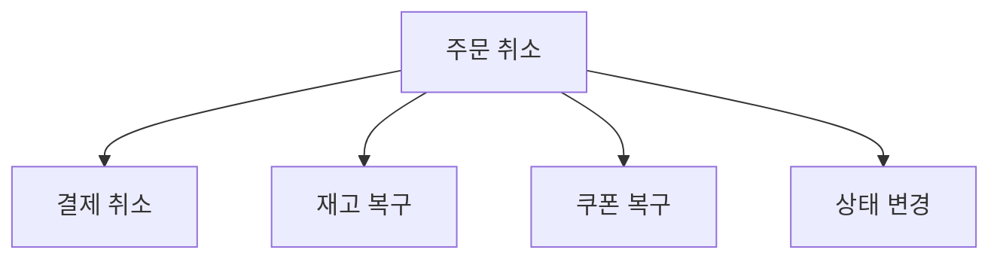

따라서 상황에 따라

```http
PATCH /orders/100
```

로 상태를 변경할 수도 있고,

취소를 별도 리소스로 모델링해서

```http
POST /orders/100/cancellations
```

처럼 설계할 수도 있다.

실무에서는

```http
POST /orders/100/cancel
```

같은 액션형 API도 흔히 볼 수 있다.

중요한 것은 CRUD에 억지로 맞추는 것이 아니라  
**API의 의미를 명확하고 일관성 있게 표현하는 것**이다.

---

## 11. EAI와 ESB

기업에는 오래된 시스템과  
새로운 시스템이 함께 존재하는 경우가 많다.

```text
ERP
CRM
결제
회원
회계
레거시 시스템
```

이 시스템들은 서로 다른 기술과  
데이터 형식을 사용할 수 있다.

이런 기업 애플리케이션들을 통합하는 분야를

**EAI  
Enterprise Application Integration**

이라고 한다.

전통적인 EAI 환경에서 중요한 역할을 했던 것이  
**ESB(Enterprise Service Bus)** 이다.

---

### ESB의 역할

서비스들이 서로 직접 연결되면

```text
A ↔ B
A ↔ C
A ↔ D
B ↔ C
B ↔ D
```

처럼 관계가 복잡해질 수 있다.

그래서 중앙의 통합 계층을 둔다.

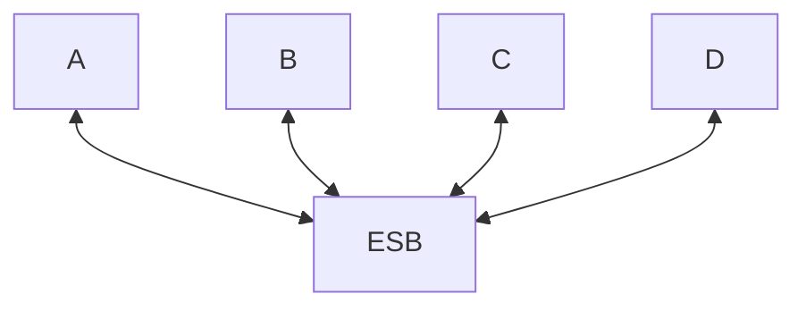

ESB는 다음과 같은 역할을 수행할 수 있다.

```text
메시지 라우팅
데이터 형식 변환
프로토콜 변환
서비스 연결
오케스트레이션
```

---

## 12. SOAP, WSDL, XSD

전통적인 SOA 환경에서는  
SOAP과 XML 기반 기술이 많이 사용되었다.

SOAP은 XML을 이용한 메시징 프로토콜이다.

```xml
<Envelope>
  <Body>
    <GetUser>
      <UserId>100</UserId>
    </GetUser>
  </Body>
</Envelope>
```

WSDL은

**Web Services Description Language**

로,

웹 서비스가 제공하는 기능과 인터페이스를  
기계가 읽을 수 있는 형태로 정의한다.

SOAP 기반 웹 서비스에서 특히 널리 사용되었다.

XSD는

**XML Schema Definition**

으로,

XML 문서의 데이터 구조와 타입을 정의한다.

```text
User에는 Id가 있어야 한다.

Id는 숫자다.

Name은 문자열이다.
```

같은 규칙을 표현할 수 있다.

---

## 13. REST/JSON이 널리 사용된 이유

SOAP은 강력한 표준이지만  
웹과 모바일 환경에서는 다소 복잡하게 느껴질 수 있다.

반면

```text
HTTP
+
REST 스타일
+
JSON
```

조합은 웹 기술과 자연스럽게 연결되고  
비교적 단순하게 사용할 수 있다.

그래서 일반적인 웹 API에서는  
REST/JSON 방식이 매우 널리 사용되고 있다.

그렇다고 SOAP이 사라진 것은 아니다.

기업 내부 통합이나 레거시 환경에서는  
여전히 SOAP 기반 시스템이 존재한다.

즉,

```text
SOAP → 과거 기술이라서 폐기

REST → 무조건 최신 정답
```

이라고 이해하면 안 된다.

각 기술은 사용 환경과 목적이 다르다.

---

## 14. 서비스 애그리게이션과 오케스트레이션

여러 서비스를 결합하는 방법도 다양하다.

### Service Aggregation

여러 서비스의 결과를 모아  
하나의 응답으로 만드는 방식이다.

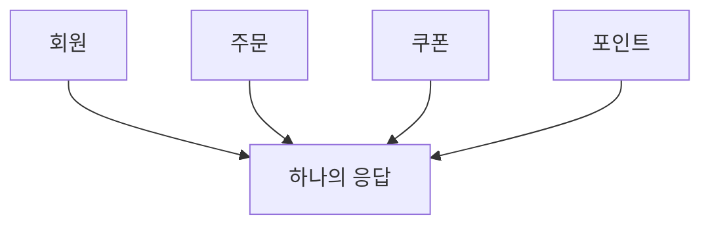

예를 들어 마이페이지 화면을 만드는 데 사용할 수 있다.

---

### Service Orchestration

여러 서비스의 실행 순서와 조건을  
중앙에서 제어한다.

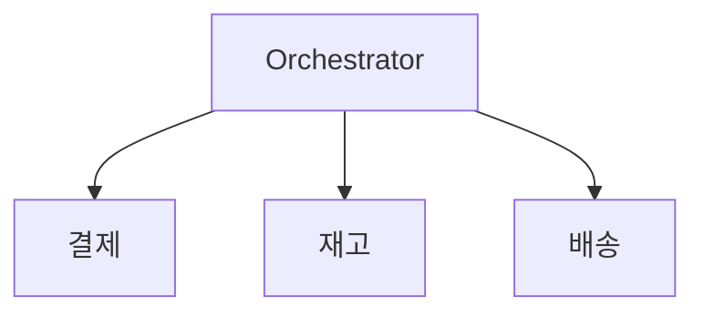

예를 들어

```text
1. 결제한다.
2. 성공하면 재고를 차감한다.
3. 배송을 등록한다.
```

같은 흐름을 중앙의 Orchestrator가 알고 있다.

오케스트라의 지휘자와 비슷하다.

---

## 15. 서비스 코레오그래피

오케스트레이션과 대비되는 방식이

**Service Choreography**

이다.

여기에는 중앙 지휘자가 없다.

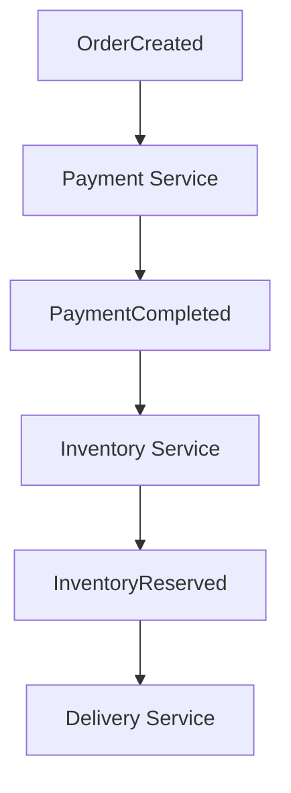

각 서비스가 이벤트를 보고  
자신이 해야 할 행동을 수행한다.

쉽게 비교하면

- **오케스트레이션** — 중앙 지휘자가 전체 흐름을 안다.
- **코레오그래피** — 각 서비스가 이벤트에 반응하며 움직인다.

이다.

둘 중 하나가 항상 좋은 것은 아니다.

실무에서는 두 방식을 섞어 사용하는 경우도 많다.

예를 들어 핵심 거래 흐름은 오케스트레이션으로 관리하고,

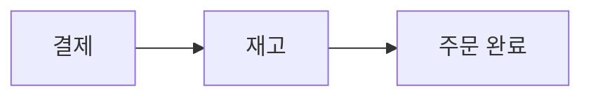

주문 완료 이후의 부가 기능은 이벤트로 처리할 수 있다.

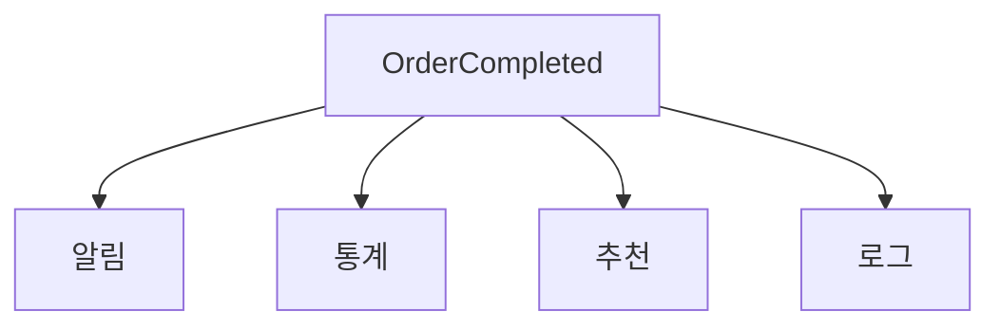

---

## 16. 중앙 ESB가 너무 커질 때의 문제

ESB 자체가 나쁜 기술은 아니다.

문제는 모든 책임을 ESB에 넣기 시작할 때다.

```text
라우팅
변환
업무 규칙
상태 관리
오케스트레이션
프로세스 관리
```

가 모두 중앙으로 모이면

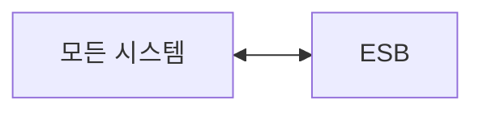

이 된다.

그러면 중앙 통합 계층이  
가장 복잡한 시스템이 될 수 있다.

또한 특정 기능의 소유자가 불명확해지고  
변경 영향 범위가 커질 수 있다.

ESB를 고가용성으로 구성하면  
물리적인 단일 장애점을 줄일 수 있다.

따라서 정확한 문제는

> ESB 자체가 반드시 단일 장애점이라는 것이 아니라,  
> 지나치게 많은 논리적 책임과 의존성을 중앙에 모으면  
> 장애와 변경의 영향 범위가 커질 수 있다는 것이다.

라고 이해하는 것이 좋다.

---

## 17. 공통 데이터 모델의 장점과 한계

과거 SOA에서는 여러 시스템이  
공통 데이터 모델을 사용하는 방식도 널리 사용했다.

이를

**Canonical Data Model**

이라고 한다.

예를 들어 서로 다른 시스템이 회원을

```text
user_id
memberNo
customerId
```

처럼 다르게 표현한다면  
통합 과정이 복잡해진다.

그래서 공통 모델을 만들 수 있다.

```text
memberId
memberName
```

이 방식은 제한된 통합 영역에서는  
여전히 유용할 수 있다.

문제는 회사 전체의 모든 의미를  
하나의 초대형 모델에 넣으려고 할 때다.

각 팀의 요구사항이 계속 추가되면서

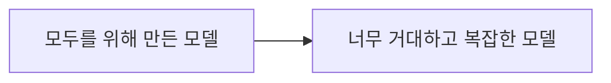

이 될 수 있다.

따라서 표준 모델 자체가 나쁜 것이 아니라  
**범위를 지나치게 넓히는 것이 문제**이다.

---

## 18. 중앙집중에서 도메인 책임으로

현대적인 아키텍처에서는

```text
중앙 시스템이 모든 것을 소유
```

하는 방식보다

```text
각 도메인이 자기 영역을 책임
```

지는 방식을 중요하게 본다.

예를 들어

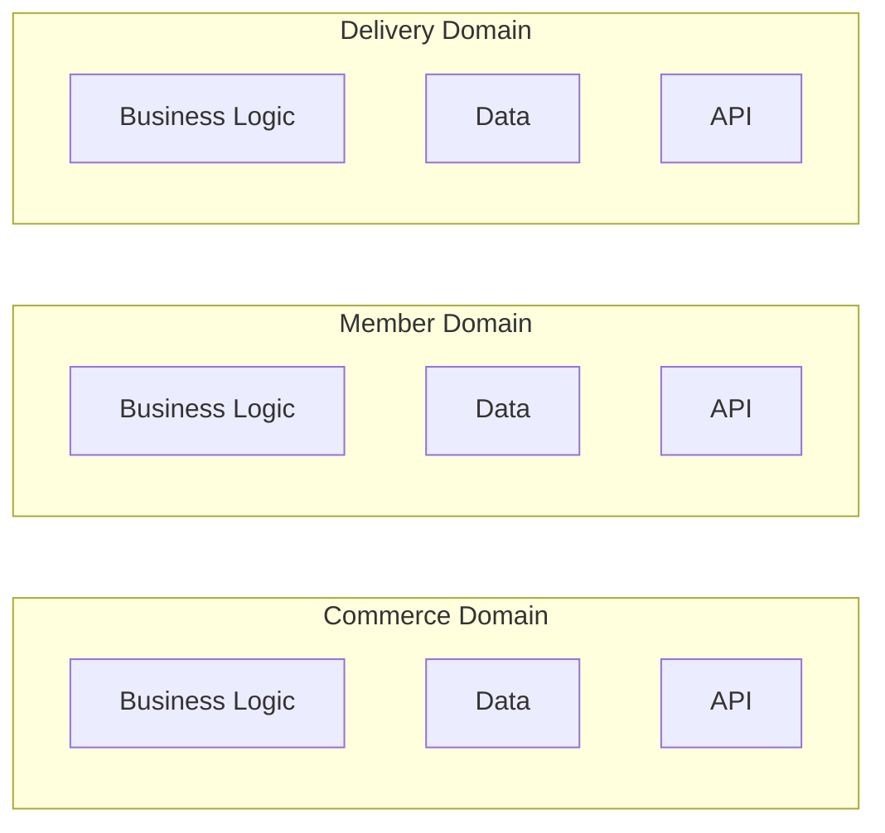

처럼 구성할 수 있다.

이 구조에서는 각 도메인의 소유권이 명확하다.

---

## 19. API Gateway

현대적인 API 환경에서 자주 등장하는 것이  
**API Gateway**이다.

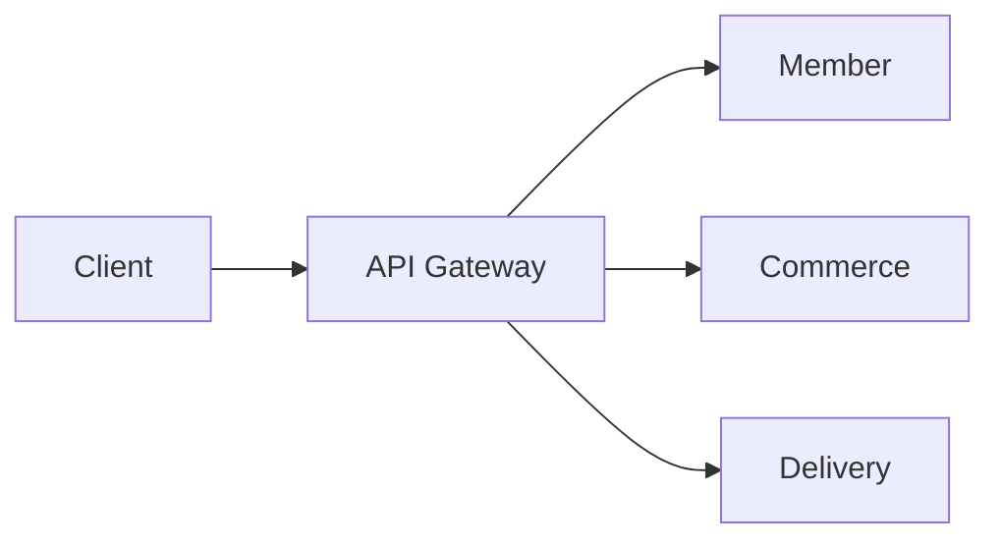

API Gateway는 보통 다음과 같은 공통 기능을 담당한다.

```text
라우팅
인증
인가
Rate Limit
TLS
로깅
모니터링
```

또한 상황에 따라  
간단한 응답 변환이나 Aggregation을 수행할 수도 있다.

하지만 핵심 비즈니스 규칙을  
Gateway에 집중시키는 것은 피하는 것이 좋다.

예를 들어

```text
포인트 차감 우선순위
환불 가능 여부
결제 승인 정책
```

은 Gateway가 아니라  
해당 도메인이 판단해야 한다.

따라서 쉽게 말하면

- **API Gateway** — 요청을 통제하고 전달
- **Domain** — 비즈니스 판단

이라고 이해하면 된다.

---

## 20. API를 제품으로 관리한다

API는 단순한 HTTP Endpoint가 아니다.

API에도 사용자가 있다.

```text
웹
모바일
다른 개발팀
외부 파트너
```

따라서 API도 하나의 제품처럼 관리할 수 있다.

이를 흔히

**API as a Product**

관점이라고 부른다.

API 제품에는 다음과 같은 요소가 필요하다.

```text
Owner
문서
버전
보안
모니터링
호환성 정책
Lifecycle
SLA 또는 SLO
```

즉,

```text
API 개발 완료
→ 끝
```

이 아니다.

API도 지속적으로 운영하고 관리해야 한다.

---

## 21. API Contract

Provider와 Consumer 사이에는  
명확한 약속이 필요하다.

이를 **API Contract**라고 한다.

예를 들어

```http
GET /users/{id}
```

라는 API의 계약에는

```text
URL
HTTP Method
Request
Response
Status Code
Error
인증 방법
버전
```

등이 포함될 수 있다.

Provider가 마음대로 응답 구조를 바꾸면  
기존 Consumer가 깨질 수 있다.

따라서 API 계약은  
도메인 간 결합을 안정적으로 관리하는 핵심 요소이다.

---

## 22. OpenAPI

HTTP API의 인터페이스를 문서화하는  
대표적인 표준 중 하나가

**OpenAPI Specification**이다.

OpenAPI에서는

```text
Endpoint
Method
Parameter
Request Schema
Response Schema
Authentication
```

등을 정의할 수 있다.

이를 기반으로

```text
API 문서
Mock Server
Client SDK
Validation
테스트
```

등을 자동화할 수 있다.

다만

```text
OpenAPI = API 계약의 모든 것
```

이라고 보면 안 된다.

실제 계약에는

```text
SLA
Rate Limit 정책
호환성 정책
비즈니스 전제조건
```

처럼 OpenAPI 문서만으로 충분히 표현하기 어려운 내용도 있다.

따라서 OpenAPI는

> **API Contract를 표현하고 관리하는 대표적인 수단 중 하나**

라고 이해하면 된다.

---

## 23. Composite Service

여러 API의 결과를 조합해  
하나의 API로 제공할 수도 있다.

예를 들어 마이페이지에서

```text
회원 정보
보유 포인트
최근 결제
배송 정보
```

가 필요하다고 하자.

```mermaid
flowchart TD
    n0["Client"]
    n1["MyPage Composite API"]
    n2["Member API"]
    n3["Point API"]
    n4["Payment API"]
    n5["Delivery API"]
    n1 --> n2
    n1 --> n3
    n1 --> n4
    n1 --> n5
    n0 --> n1
```

Client는 여러 API를 각각 호출할 필요가 없다.

하지만 Composite API가  
각 도메인의 핵심 비즈니스 규칙까지 소유하기 시작하면  
새로운 중앙집중 시스템이 될 수 있다.

따라서 Composite는 주로

```text
호출
결과 결합
표현 변환
```

에 집중하고,

비즈니스 판단은  
각 도메인이 담당하는 것이 좋다.

---

## 24. API 탐색 가능성과 메타데이터

API가 몇 개 없을 때는  
개발자가 기억할 수 있다.

하지만 API가 수백 개로 늘어나면 어렵다.

```text
회원 조회 API가 어디 있지?

누가 관리하지?

최신 버전은 뭐지?

이 API 아직 사용 중인가?
```

이 문제를 해결하기 위해

```text
Service Registry
API Catalog
Developer Portal
```

등을 사용할 수 있다.

API 자체뿐 아니라  
API에 대한 정보도 관리해야 한다.

이를 **API Metadata**라고 볼 수 있다.

```text
API 이름
설명
Owner
도메인
버전
Endpoint
인증 방법
Deprecated 여부
의존 관계
```

등이 메타데이터에 포함될 수 있다.

---

## 25. 8장 정리

네 가지만 기억하면 된다.

**API는 내부 구현을 숨기고 계약만 노출한다.**  
언어를 바꾸든 DB 구조를 바꾸든  
외부 계약이 유지되면 소비자는 영향을 받지 않는다.

**REST는 CRUD가 아니다.**  
주문 취소처럼 CRUD로 표현하기 어려운 업무가 많다.  
중요한 것은 규칙에 억지로 맞추는 것이 아니라  
API의 의미를 명확하고 일관되게 표현하는 것이다.

**중앙 통합 계층에 책임을 몰면 그것이 가장 복잡한 시스템이 된다.**  
ESB 자체가 문제가 아니라  
라우팅·변환·업무 규칙·상태 관리를 모두 중앙에 모으는 것이 문제다.

**API도 제품이다.**  
Owner, 문서, 버전, 보안, 호환성 정책, 수명주기가 필요하다.

다음 장에서는 서비스를 어떻게 나누고  
조회를 어떻게 최적화할지 본다.
