# 9장. 서비스 경계와 조회 모델

> **3부 · 연결** — 경계를 어떻게 넘는가  
> 8장 · **9장** · 10장 · 11장 · 12장

서비스를 잘게 나눴다.

그랬더니 화면 하나를 그리는 데  
API를 일곱 번 호출하게 됐다.

응답은 느려지고,  
그중 하나만 실패해도 화면 전체가 비어 버린다.

8장에서 API 계약을 봤다.

이 장에서는 서비스를 어떻게 나눌지,  
그리고 조회를 어떻게 최적화할지 본다.

마이크로서비스, Service Mesh, BFF, GraphQL, CQRS가 나오지만  
기술 이름보다 중요한 것은 하나다.

작게 나누는 것이 목표가 아니라  
적절한 경계를 찾는 것이 목표다.

---

## 1. 마이크로서비스

마이크로서비스는

> 애플리케이션을 비교적 작은 서비스 단위로 나누고  
> 각 서비스의 자율성과 독립적인 운영을 높이는  
> 아키텍처 접근 방식

이다.

SOA와

```text
서비스 단위 구성
느슨한 결합
인터페이스 통신
```

이라는 철학을 공유하지만,

마이크로서비스를  
단순히 SOA의 새로운 버전이라고 볼 수는 없다.

마이크로서비스는 특히

```text
독립적인 배포
작은 책임 범위
팀 자율성
자동화된 운영
분산된 데이터 소유권
```

등을 강하게 강조한다.

---

## 2. 마이크로서비스의 핵심은 작기가 아니라 경계다

마이크로서비스라는 이름 때문에

```text
작을수록 좋다
```

라고 생각하기 쉽다.

하지만 중요한 것은 코드 크기가 아니다.

```text
이 서비스가 어떤 비즈니스 책임을 가지는가?
```

가 더 중요하다.

서비스를 너무 잘게 나누면

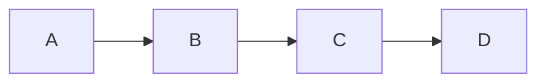

모든 작업이 네트워크 호출이 되어

```text
지연
장애 가능성
배포 복잡성
운영 복잡성
```

이 증가할 수 있다.

따라서

> 가능한 한 작게 나누는 것이 아니라  
> 적절한 도메인 경계를 찾는 것이 중요하다.

라고 이해해야 한다.

---

## 3. 데이터 소유권과 물리 DB는 다르다

마이크로서비스에서 흔히

```text
각 서비스는 자신의 데이터를 가진다.
```

라고 말한다.

하지만 이것이 반드시

```text
서비스 하나
=
물리 DB 서버 하나
```

를 의미하지는 않는다.

같은 DB 인스턴스를 사용하면서도

```text
테이블 소유권 분리
스키마 분리
다른 서비스의 직접 접근 금지
```

같은 규칙을 적용할 수 있다.

중요한 것은

> 누가 데이터를 변경하고 책임지는지가 명확한가?

이다.

---

## 4. Service Mesh

마이크로서비스가 많아지면  
서비스 간 네트워크 통신이 복잡해진다.

각 서비스가 모두 직접

```text
TLS
인증
재시도
로드밸런싱
트래픽 제어
모니터링
```

을 구현하면 부담이 커진다.

이러한 통신 기능을  
인프라 계층에서 처리하는 접근이

**Service Mesh**이다.

쉽게 비교하면

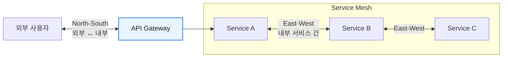

라고 생각할 수 있다.

다만 이것은 대표적인 역할 구분이지  
절대적인 경계는 아니다.

API Gateway를 내부 API에 사용할 수도 있고,  
Service Mesh에도 ingress/egress 기능이 있을 수 있다.

---

## 5. Control Plane과 Data Plane

서비스 메시를 이해할 때  
자주 등장하는 개념이다.

Control Plane은

```text
라우팅 정책
보안 정책
트래픽 정책
```

등을 정의한다.

Data Plane은  
실제 요청과 트래픽을 처리한다.

쉽게 표현하면

- **Control Plane** — 교통 정책을 정한다.
- **Data Plane** — 실제 차량이 다니는 도로다.

라고 이해할 수 있다.

---

## 6. 내부 API와 외부 API는 다르다

회사 내부 시스템끼리 사용하는 API와  
외부 파트너에게 제공하는 API는  
요구사항이 다르다.

내부 API는 상대적으로 빠르게 변경할 수 있지만,

외부 API는

```text
강한 인증
Rate Limit
DDoS 대응
감사 로그
문서화
안정적인 버전 정책
```

등이 더 중요하다.

따라서 내부 API를  
외부에 그대로 공개하는 것은 주의해야 한다.

내부 구현이 외부 계약으로 굳어지면  
나중에 내부 구조를 변경하기 어려워질 수 있다.

---

## 7. Experience API와 BFF

사용자 화면에 맞게 API를 구성할 수도 있다.

예를 들어 모바일 홈 화면에서

```text
회원 정보
보유 포인트
상품 목록
추천
알림
```

이 필요하다고 하자.

모바일 앱이 모든 API를 직접 호출하는 대신

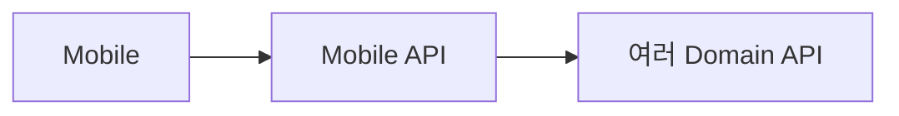

형태로 구성할 수 있다.

이러한 소비자 경험 중심의 계층을  
**Experience API**라고 부르기도 한다.

비슷한 목적의 대표적인 패턴이

**BFF(Backend for Frontend)** 이다.

```text
Web BFF
Mobile BFF
Admin BFF
```

처럼 프론트엔드별로  
전용 Backend를 둘 수 있다.

Experience API와 BFF는 비슷한 문제를 해결하지만  
완전히 같은 개념이라고 볼 필요는 없다.

BFF는 특히  
**특정 프론트엔드 전용 Backend**라는 의미가 강하다.

---

## 8. GraphQL

GraphQL은 Client가  
필요한 필드를 직접 지정해 요청할 수 있는  
API Query Language이자 실행 방식이다.

예를 들어

```graphql
query {
  user(id: 100) {
    name
    profileImage
  }
}
```

처럼 원하는 데이터만 요청할 수 있다.

REST API에서 하나의 응답이 너무 많은 데이터를 내려주는  
**Over-fetching** 문제나,

하나의 화면을 위해 여러 API를 호출해야 하는  
**Under-fetching** 문제를 줄이는 데 도움이 될 수 있다.

하지만 GraphQL을 사용한다고 해서  
자동으로 성능이 좋아지는 것은 아니다.

```text
복잡한 Nested Query
N+1 Query
쿼리 비용 관리
권한 제어
```

같은 문제를 따로 고려해야 한다.

---

## 9. GraphQL은 REST 위에서만 동작하는 것이 아니다

GraphQL을 다음처럼 사용할 수 있다.

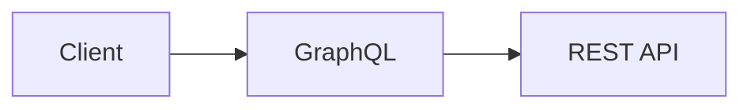

하지만 이것은 하나의 구현 방법일 뿐이다.

GraphQL Resolver는

```text
DB
REST API
gRPC
다른 GraphQL 서비스
Cache
외부 API
```

등 다양한 데이터 소스를 사용할 수 있다.

또한 GraphQL 역시  
도메인 소유권을 무너뜨리면 안 된다.

하나의 거대한 GraphQL 서버가  
회사 전체 데이터를 직접 소유하기 시작하면

```text
스키마 비대화
소유권 불명확
변경 영향 증가
```

가 생길 수 있다.

---

## 10. API 메타데이터와 의존 관계

서비스와 API가 많아지면  
누가 누구를 사용하는지 추적해야 한다.

예를 들어

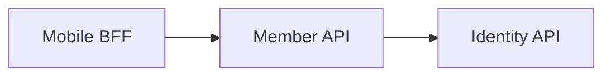

라는 구조가 있다고 하자.

Identity API에 장애가 발생하면

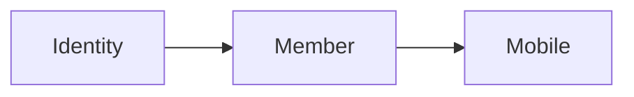

까지 영향을 받을 수 있다.

API 메타데이터와 Dependency 정보를 잘 관리하면  
이런 영향 범위를 파악하기 쉬워진다.

또한

```text
v1 API를 아직 누가 사용하고 있는가?

이 서비스를 삭제해도 되는가?

어떤 API가 Deprecated 상태인가?
```

같은 Lifecycle 관리에도 도움이 된다.

---

## 11. 읽기 지향 API

모든 API가 데이터를 변경할 필요는 없다.

데이터 제품이나 분석 서비스라면  
읽기만 제공하는 API가 유용할 수 있다.

```http
GET /reports/sales
GET /rankings
GET /products/active
```

이러한 API는  
Consumer가 데이터베이스를 직접 조회하지 않아도  
필요한 데이터를 사용할 수 있게 해준다.

---

## 12. CQRS

읽기와 쓰기의 요구사항이 크게 다르다면  
두 책임을 분리할 수 있다.

이를

**CQRS  
Command Query Responsibility Segregation**

이라고 한다.

핵심은 매우 단순하다.

- **Command** — 상태를 변경
- **Query** — 상태를 읽음

그리고

```text
Command Model
≠
Query Model
```

로 설계할 수 있다.

---

## 13. CQRS가 반드시 DB 두 개를 의미하는 것은 아니다

CQRS를 설명할 때 흔히 다음 구조를 본다.

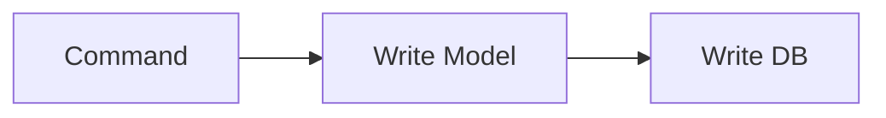

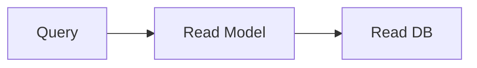

하지만 이것은 **CQRS의 한 구현 방법**이다.

CQRS의 핵심은

```text
읽기 책임
≠
쓰기 책임
```

을 분리하는 것이지,

반드시 물리적으로 DB를 두 개 만들어야 한다는 것은 아니다.

같은 DB를 사용하면서  
Command Model과 Query Model만 분리할 수도 있다.

---

## 14. CQRS와 결과적 일관성

Write Store와 Read Store를 별도로 만들고  
비동기 이벤트로 동기화한다면

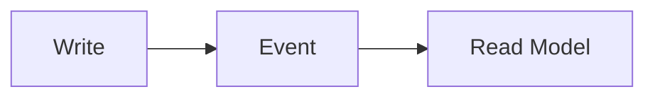

짧은 시간 동안 데이터 차이가 발생할 수 있다.

예를 들어

```text
포인트 차감

Write Store
900

Read Store
아직 1000
```

인 순간이 생길 수 있다.

시간이 지나면서 Read Store도 900으로 반영된다면  
이를 **결과적 일관성(Eventual Consistency)** 이라고 한다.

하지만 중요한 점은

> **CQRS 자체가 결과적 일관성을 의미하지는 않는다.**

는 것이다.

같은 저장소를 사용하거나  
동기식 처리를 한다면 이런 문제가 없을 수도 있다.

---

## 15. CQRS와 Event Sourcing도 별개다

초보자가 자주 혼동하는 개념이다.

```text
CQRS
≠
Event Sourcing
```

둘을 함께 사용하는 시스템이 많을 뿐  
서로 다른 패턴이다.

CQRS는

```text
Command와 Query의 책임 분리
```

가 핵심이고,

Event Sourcing은

```text
현재 상태 자체가 아니라  
상태를 만든 이벤트의 기록을 저장
```

하는 방식이다.

---

## 16. CQRS는 성능 최적화만을 위한 것이 아니다

CQRS를

```text
조회가 느림
→ CQRS 적용
```

정도로만 이해하면 부족하다.

CQRS의 근본적인 목적은

> 읽기와 쓰기가 서로 다른 모델과 책임을 가질 수 있다는 점을  
> 아키텍처에 명확하게 표현하는 것

이다.

물론 이를 이용하면

- **Write** — 정합성 중심
- **Read** — 검색/조회 성능 중심

으로 각각 최적화할 수 있다.

예를 들어

- **Write** — MariaDB
- **Read** — Redis / Elasticsearch / Read Replica

같은 구조도 가능하다.

하지만 시스템이 단순하다면  
굳이 CQRS를 적용할 필요는 없다.

---

## 17. 데이터 제품과 API

6장에서 소개한 **데이터 제품**과  
이번 장의 API는 밀접하게 연결된다.

예를 들어 주문 도메인이  
주문 데이터를 다른 도메인에 제공한다고 하자.

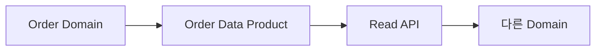

이렇게 하면 다른 도메인이

```text
Order DB 직접 조회
```

를 하지 않아도 된다.

즉, 데이터 제품을 제공하는 인터페이스로  
API를 사용할 수 있다.

물론 도메인 간 데이터 공유가  
항상 동기 API여야 하는 것은 아니다.

다음과 같은 방법도 가능하다.

```text
API
이벤트
메시지
공식 데이터 제품
```

중요한 것은

> 다른 도메인이 상대 도메인의 내부 DB나 구현에  
> 직접 결합하지 않는 것

이다.

---

## 18. 도메인 내부와 외부를 구분한다

도메인 내부에서는  
상대적으로 구현 변경이 자유롭다.

```text
Commerce Domain

Order
Payment
Refund
```

하지만 도메인 밖으로 나가는 인터페이스는  
더 안정적이어야 한다.

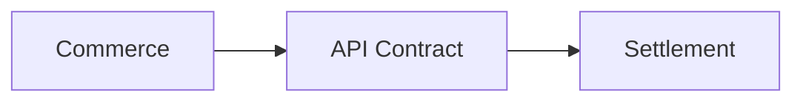

따라서

- **도메인 내부** — 구현 자유도
- **도메인 외부** — 계약 안정성

을 구분하는 것이 중요하다.

---

## 19. API 이름에도 비즈니스 언어를 사용한다

비즈니스에서는 "주문"이라고 부르는데

코드와 API에서는

```text
PointGrantTransferTransaction
```

같은 전혀 다른 용어를 사용한다면  
의사소통이 어려워진다.

가능하면

```text
비즈니스 언어
=
도메인 언어
=
API 언어
```

를 맞추는 것이 좋다.

예를 들어

```http
POST /orders
GET /orders/{id}
```

처럼 의미가 쉽게 드러나게 만들 수 있다.

이것은 DDD에서 말하는  
**보편 언어(Ubiquitous Language)** 와도 연결된다.

---

## 20. 도메인 자율성과 공통 거버넌스

각 도메인이 API를 책임한다고 해서

```text
각 팀이 마음대로 API를 만든다.
```

는 뜻은 아니다.

조직 전체적으로 필요한 최소한의 기준은  
공통으로 정할 수 있다.

예를 들어

```text
API Naming
HTTP Method 사용 원칙
에러 응답 형식
인증 방식
버전 정책
OpenAPI 작성 규칙
로깅
보안 기준
```

같은 것이다.

즉,

```text
도메인의 자율성
+
조직 공통 거버넌스
```

를 함께 가져가는 것이다.

이 철학은 앞에서 배운  
데이터 메시의 연합형 거버넌스와도 닮아 있다.

---

## 21. 기술보다 문제를 먼저 본다

이번 장에는 많은 기술이 등장했다.

```text
SOA
REST
ESB
API Gateway
Microservices
Service Mesh
GraphQL
BFF
CQRS
```

하지만 이 기술들은 서로 대체 관계가 아니다.

각각 해결하려는 문제가 다르다.

- **REST / GraphQL** — API 인터페이스와 데이터 접근 방식
- **API Gateway** — API 진입점과 공통 정책
- **Service Mesh** — 서비스 간 네트워크 통신
- **Microservices** — 서비스와 조직의 경계
- **BFF** — 특정 프론트엔드에 맞는 Backend
- **CQRS** — Command와 Query의 책임 분리

따라서 모든 시스템에  
이 기술들을 전부 적용할 필요는 없다.

작은 시스템이라면

```text
모놀리스
+
REST API
+
MariaDB
```

만으로 충분할 수 있다.

규모와 문제에 따라

```text
API Gateway
Message Broker
BFF
Service Mesh
CQRS
```

등을 추가하면 된다.

좋은 아키텍처는  
기술을 많이 사용하는 아키텍처가 아니라

> **현재 문제를 가장 단순한 방법으로 해결하면서  
> 앞으로의 변경도 감당할 수 있는 구조**

이다.

---

## 22. 9장 정리

네 가지만 기억하면 된다.

**작게 나누는 것이 목표가 아니다.**  
마이크로서비스의 기준은 크기가 아니라 경계다.  
잘못 그은 경계는 Service Mesh가 고쳐 주지 않는다.

**물리 DB와 데이터 소유권은 다른 문제다.**  
DB를 나눠야만 소유권이 생기는 것이 아니고,  
DB를 합쳤다고 소유권이 사라지는 것도 아니다.

**CQRS는 DB 두 개를 뜻하지 않는다.**  
읽기와 쓰기의 **책임**을 나누는 것이고,  
같은 DB 안에서도 할 수 있다.  
Event Sourcing과도 별개다.

**조회를 최적화하되 경계를 흐리지 않는다.**  
BFF와 GraphQL은 화면이 편해지는 만큼  
누가 무엇을 책임지는지 흐려지기 쉽다.

기술 이름보다 먼저 답해야 할 질문은 이것들이다.

```text
누가 이 기능을 책임지는가?

누가 이 데이터를 소유하는가?

어떤 경계를 외부에 공개할 것인가?

다른 도메인은 어떤 계약으로 사용할 것인가?
```

좋은 구조에서는 각 도메인의 책임이 이렇게 보인다.

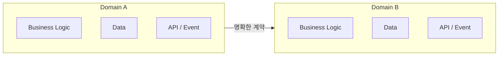

다른 도메인의 DB와 내부 구조를 직접 쓰는 대신  
공식적으로 제공되는 API, Event, Message, Data Product를 쓴다.

> **도메인이 자신의 기능과 데이터를 책임지고,  
> 다른 도메인은 명확하게 정의된 인터페이스로 사용한다.**

8장과 9장이 함께 답한 것이 이 한 문장이다.

다음 장에서는 요청과 응답이 아니라  
**이미 일어난 일을 알리는 방식**, 즉 이벤트를 본다.
