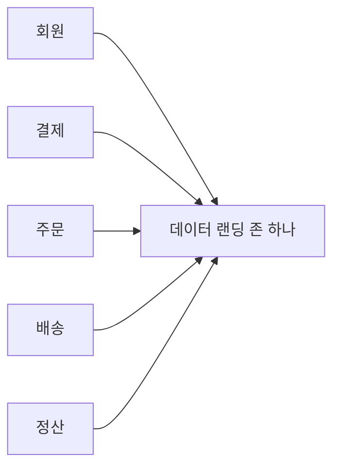
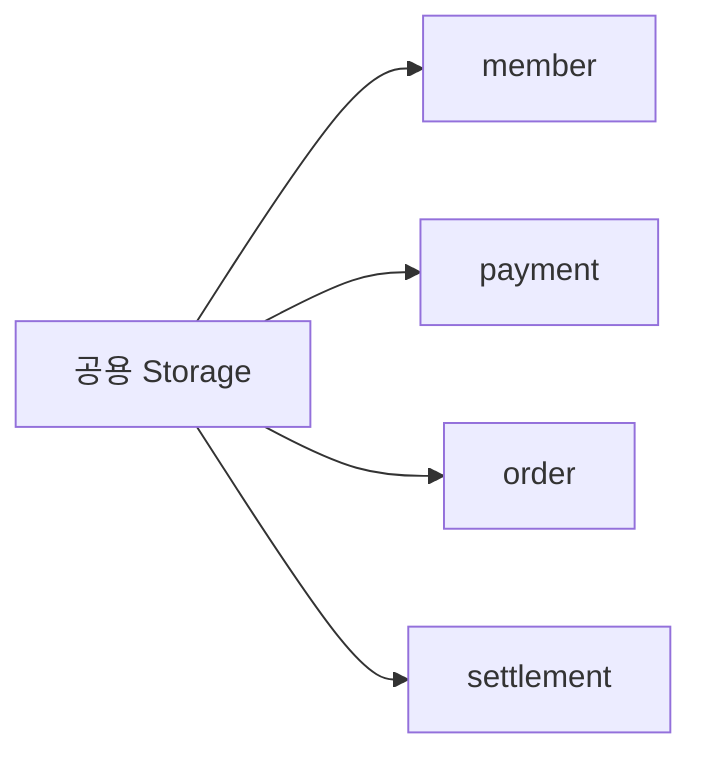
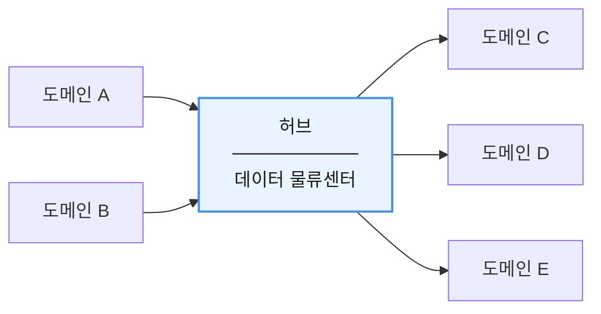
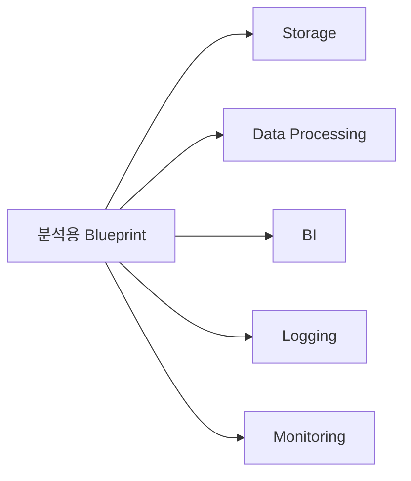
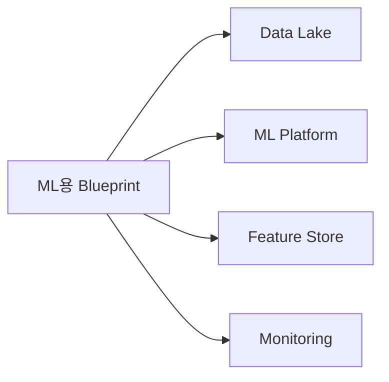
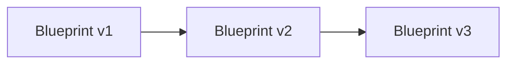
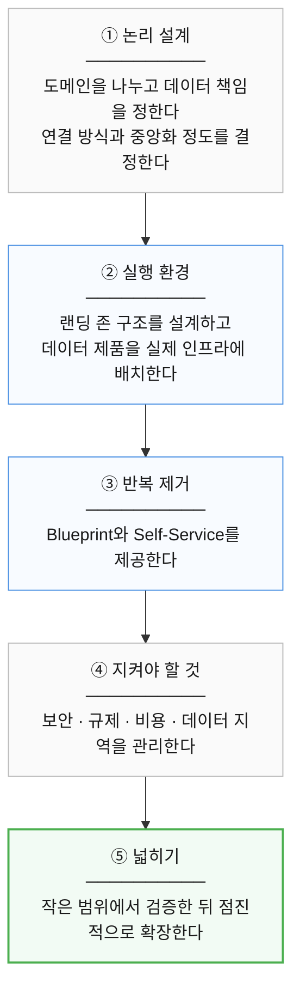
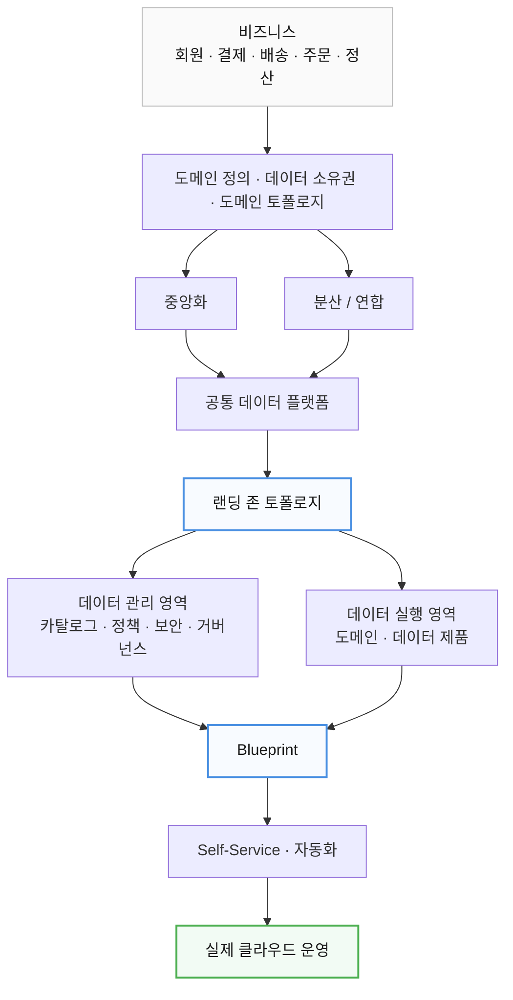

# 부록 A. 클라우드 랜딩 존과 Blueprint

이 부록은 21장 「도메인 토폴로지」에서 이어진다.

클라우드에 도메인을 실제로 배치할 때 필요한 내용이다.  
표준 실행 환경인 랜딩 존과, 반복 가능한 템플릿인 Blueprint를 다룬다.

처음 읽을 때는 건너뛰어도 된다.  
실제로 클라우드 환경을 설계할 때 돌아오면 된다.

---

## 1. 이제 실제 클라우드로 내려가자

지금까지는

```text
어떤 도메인이 있는가?

누가 데이터를 책임지는가?

도메인끼리 어떻게 연결하는가?
```

를 살펴봤다.

이제 질문이 바뀐다.

> 이 도메인들을 실제 클라우드 환경에  
> 어떻게 배치할 것인가?

여기서 **랜딩 존(Landing Zone)** 이라는  
개념이 등장한다.

---

## 2. 랜딩 존이란

랜딩 존은

> 클라우드에서 워크로드를 안전하고  
> 일관되게 시작하기 위해 준비해둔  
> 표준 기반 환경

이라고 이해하면 된다.

예를 들어 새로운 프로젝트를 시작할 때마다

```text
VPC 설계

IAM 정책

로그

모니터링

보안

비용 태그
```

를 처음부터 만들면  
시간도 오래 걸리고 구성도 제각각이 된다.

그래서 표준 환경을 미리 준비한다.

---

## 3. 호텔 객실로 이해하기

호텔은 손님이 올 때마다

```text
전기 설치

도어락 설치

침대 설치

소방시설 설치
```

를 하지 않는다.

이미 일정 기준으로 준비된 방을 제공한다.

랜딩 존도 비슷하다.

```text
네트워크

IAM

보안

로그

모니터링

정책

비용 관리
```

같은 기본 환경을 미리 준비해둔다.

---

## 4. 클라우드마다 구현은 다르다

AWS, Azure, Google Cloud 모두  
랜딩 존 또는 유사한 개념을 제공한다.

하지만

> 모든 클라우드가  
> 완전히 동일한 구조와 이름을 사용하는 것은 아니다.

따라서 랜딩 존을  
특정 클라우드 제품 이름보다는

```text
표준화된 클라우드 실행 환경
```

이라는 개념으로 이해하는 것이 좋다.

---

## 5. 데이터 관리 랜딩 존

데이터 플랫폼을 설계할 때는  
공통 관리 영역을 따로 둘 수도 있다.

이를 여기서는  
**데이터 관리 랜딩 존**이라고 부르자.

대표적인 기능은

```text
데이터 카탈로그

메타데이터

데이터 계보

MDM

데이터 품질

보안 정책

거버넌스
```

다.

다만 이 명칭과 구조는  
모든 클라우드에서 사용하는 절대적인 표준은 아니다.

특정 데이터 플랫폼 아키텍처에서 사용하는  
대표적인 설계 패턴이라고 이해하면 된다.

---

## 6. 데이터 랜딩 존

반면 데이터 랜딩 존은  
실제 데이터 작업이 수행되는 영역이다.

예를 들어

```text
데이터 수집

데이터 저장

데이터 변환

분석

데이터 제품 생성
```

같은 작업이 이루어진다.

쉽게 비유하면

```text
데이터 관리 랜딩 존
= 아파트 관리사무소

데이터 랜딩 존
= 실제 각 세대
```

처럼 볼 수 있다.

---

## 7. 단일 데이터 랜딩 존

가장 단순한 구조는  
모든 데이터 도메인을 하나의 랜딩 존에 넣는 것이다.



장점은 명확하다.

```text
구성이 단순

초기 비용 낮음

표준화 쉬움

운영 쉬움
```

---

## 8. 단일 랜딩 존은 언제 좋을까

다음과 같은 환경에서  
좋은 출발점이 될 수 있다.

```text
작은 조직

데이터 플랫폼 초기 단계

도메인 수가 많지 않음

강한 표준화 필요
```

처음부터 복잡한 구조를 만드는 것보다  
단순한 구조로 시작하는 것이 좋을 수 있다.

---

## 9. 단일 랜딩 존의 한계

조직이 커지면 문제가 생긴다.

```text
회원

결제

주문

배송

광고

추천

정산

AI
```

모두 하나의 환경을 사용하면

```text
권한 복잡

리소스 경쟁

비용 추적 어려움

성능 간섭

배포 충돌
```

같은 문제가 생길 수 있다.

그래서 필요에 따라  
랜딩 존을 분리하게 된다.

---

## 10. 데이터 제공자와 소비자

데이터 흐름을 이해할 때는

```text
Provider
Consumer
```

관계가 중요하다.

Provider는 데이터를 제공한다.

Consumer는 데이터를 사용한다.

예를 들어


에서 주문 도메인은

회원 데이터에 대해서는

```text
Consumer
```

이고,

정산에게 주문 데이터를 제공할 때는

```text
Provider
```

다.

즉 하나의 도메인이  
둘 다 될 수 있다.

---

## 11. Self-Service가 중요한 이유

도메인이 데이터를 사용할 때마다

```text
중앙 데이터팀에 요청
```

해야 한다면  
조직 규모가 커질수록 병목이 생긴다.

그래서 이상적인 플랫폼은


할 수 있도록 한다.

이를 **Self-Service**라고 한다.

---

## 12. 랜딩 존과 도메인은 1:1이 아니다

중요한 오해 중 하나다.

```text
도메인 하나
=
랜딩 존 하나
```

일 필요는 없다.

예를 들어

```text
주문
정산
출금
```

이 모두 작은 규모라면  
하나의 랜딩 존을 공유할 수도 있다.

반대로 매우 큰 도메인은  
여러 랜딩 존을 사용할 수도 있다.

결정 기준은

```text
보안

규제

비용

조직

성능

리소스 한도

운영 책임
```

등이다.

---

## 13. 데이터 제품을 실제로 배치하기

데이터 제품은 실제 클라우드에서는  
여러 기술 리소스로 구성될 수 있다.

예를 들어

```text
스토리지

처리 로직

테이블

컨테이너

메타데이터

보안 설정
```

같은 것들이다.

도메인별로 완전히 나눌 수도 있다.

```text
회원 → Storage A

결제 → Storage B

주문 → Storage C
```

---

## 14. 스토리지를 공유할 수도 있다

반대로 하나의 공통 스토리지 안에서  
논리적으로 분리할 수도 있다.



이 방식은 관리가 쉽다.

하지만 도메인별 자율성은 줄어든다.

---

## 15. 공유와 격리의 트레이드오프

공유하면

```text
비용 감소

운영 단순

표준화 쉬움
```

이라는 장점이 있다.

반대로

```text
도메인 독립성 감소

장애 영향 확대

개별 최적화 어려움
```

이라는 문제가 있다.

분리하면 반대다.

```text
자율성 ↑

격리 ↑

하지만

비용 ↑

운영 복잡도 ↑
```

따라서 모든 것을 공유하거나  
모든 것을 분리할 필요는 없다.

---

## 16. 소스 정렬 랜딩 존

데이터 생산과 소비를  
분리해서 관리할 수도 있다.

**소스 정렬 랜딩 존**은

> 원천 시스템에서 생성되는 데이터를  
> 수집하고 정리하는 영역

이다.

예를 들어 결제 데이터에는

```text
카드

PG

무통장

취소

환불
```

등이 있을 수 있다.

이를


한다.

---

## 17. 컨슈머 정렬 랜딩 존

반대로 컨슈머 정렬 랜딩 존은

> 데이터를 사용하는 사람이나 시스템의  
> 목적에 맞춰 데이터를 제공하는 영역

이다.

예를 들어

```text
BI

마케팅

추천

경영 분석
```

목적으로 데이터를 재구성할 수 있다.

전체 흐름은


처럼 볼 수 있다.

---

## 18. 허브 데이터 랜딩 존

여러 랜딩 존 사이에 중앙 허브를 둘 수도 있다.



허브는 일종의 **데이터 물류센터**다.

보내는 쪽은 허브에 넣고, 받는 쪽은 허브에서 가져간다.  
서로 직접 연결하지 않는다.

도메인이 늘어날수록 이 차이가 커진다.

| | 연결 수 |
|---|---|
| 서로 직접 연결 | 보내는 쪽 × 받는 쪽 |
| 허브를 거침 | 보내는 쪽 + 받는 쪽 |

---

## 19. 허브에서 할 수 있는 일

예를 들어

```text
데이터 배포

공통 스토리지

데이터 라우팅

권한 관리

공통 변환

데이터 계약
```

같은 기능을 제공할 수 있다.

특히

```text
누가

어떤 데이터를

어디로 보냈는지
```

관리해야 하는 조직에 유리하다.

---

## 20. 허브의 위험

모든 데이터가 허브를 통과하면

```text
병목

중앙 의존

장애 영향 확대
```

문제가 발생할 수 있다.

따라서 허브가 편하다고 해서  
모든 데이터를 반드시 허브로 통과시킬 필요는 없다.

---

## 21. 데이터 가상화

허브나 데이터 플랫폼에서는  
데이터 가상화 기술을 사용할 수도 있다.

데이터 가상화는

> 여러 위치에 있는 데이터를  
> 모두 복사하지 않고  
> 하나의 논리적인 데이터처럼 조회하는 방식

이다.

예를 들어

```text
회원 DB

주문 DB

결제 DB
```

가 서로 다른 위치에 있어도

사용자에게는

```text
하나의 통합 데이터 뷰
```

처럼 보이게 할 수 있다.

---

### 주의할 점

데이터 가상화라고 해서  
항상 물리적 데이터 복사가 전혀 없는 것은 아니다.

구현에 따라

```text
캐시

임시 저장

물리화
```

등이 사용될 수도 있다.

핵심은 소비자가  
여러 데이터 위치의 복잡성을  
직접 처리하지 않도록 하는 것이다.

---

## 22. 다중 데이터 랜딩 존

조직 규모가 커지면  
여러 개의 데이터 랜딩 존을 운영할 수 있다.

예를 들어 지역 기준으로

```text
미국 랜딩 존

유럽 랜딩 존

아시아 랜딩 존
```

을 둘 수도 있다.

또는 비즈니스 기준으로

```text
커머스

구독

광고
```

를 나눌 수도 있다.

---

## 23. 랜딩 존을 나누는 기준

대표적인 기준은 다음과 같다.

```text
보안 수준

데이터 민감도

규제

리전

비용 책임

SLA

조직 구조

비즈니스 프로세스

변경 속도

실험 여부

장애 격리
```

즉 단순히

```text
팀 하나 = 랜딩 존 하나
```

처럼 나누는 것이 아니다.

---

## 24. 데이터 레지던시

글로벌 서비스를 운영하면  
데이터가 저장되는 지역도 중요하다.

**데이터 레지던시(Data Residency)** 는

> 데이터를 어느 국가 또는 지역에  
> 저장해야 하는지

와 관련된 문제다.

예를 들어 특정 국가 규제 때문에  
해당 지역 안에서 데이터를 저장해야 할 수 있다.

---

### GDPR에 대한 주의

다만

```text
GDPR
= 유럽 데이터는 절대 EU 밖으로 이동 불가
```

라고 이해하면 안 된다.

GDPR은 국제 데이터 이전을  
무조건 금지하는 법이 아니다.

적절한 법적 근거와 보호조치가 있다면  
국제 이전도 가능하다.

따라서 아키텍처 관점에서는

> 데이터 위치와 국제 이전 조건을  
> 규제에 맞게 검토해야 한다.

라고 이해하는 것이 정확하다.

---

## 25. 비용 관리

클라우드 비용도  
랜딩 존 분리 기준이 될 수 있다.

여기서 자주 나오는 개념이

```text
Showback

Chargeback
```

이다.

Showback은

```text
"A팀이 이번 달
클라우드 비용 500만 원을 사용했습니다."
```

처럼 비용을 보여주는 것이다.

Chargeback은

```text
실제로 그 비용을
A팀 또는 해당 사업부에 배부
```

하는 방식이다.

---

## 26. SLA

모든 시스템이 동일한 수준의  
가용성을 필요로 하는 것은 아니다.

예를 들어

- **실시간 주문** — 매우 높은 가용성
- **일일 분석 배치** — 일정 시간 지연 가능

일 수 있다.

두 시스템에 같은 인프라를 적용하면  
불필요한 비용이 발생할 수 있다.

그래서 SLA 차이가 큰 경우  
환경을 분리하는 것도 방법이다.

---

## 27. 실험 환경

새로운 기술을 테스트하는 환경도  
운영 환경과 분리하는 것이 좋다.

예를 들어

```text
새 데이터베이스

AI PoC

신규 데이터 플랫폼

새로운 처리 엔진
```

을 실험한다고 하자.

운영 환경과 분리하면  
실패하더라도 실제 서비스에 영향을 줄 가능성이 줄어든다.

---

## 28. 조직적 요인도 중요하다

아키텍처는 기술만으로 결정되지 않는다.

실제로는

```text
사업부 구조

예산

조직 권한

법인 분리

향후 매각이나 분사 가능성
```

등도 영향을 미친다.

따라서 좋은 아키텍처란

> 기술적으로 아름다운 구조

만을 의미하지 않는다.

조직이 실제로 운영할 수 있어야 한다.

---

## 29. 다중 데이터 관리 랜딩 존

매우 큰 글로벌 조직이라면  
데이터 관리 영역 자체도 여러 개로 나눌 수 있다.

```text
미국 관리 영역

유럽 관리 영역

아시아 관리 영역
```

하지만 각 지역이 완전히 독립적으로 움직이면  
전사 데이터가 다시 파편화된다.

그래서 전체 회사 차원의

```text
공통 보안

공통 감사

공통 메타데이터 기준

공통 데이터 정책
```

은 필요하다.

---

## 30. Blueprint란 무엇인가

새로운 도메인이 생길 때마다  
클라우드 환경을 처음부터 만들면 비효율적이다.

그래서 반복해서 사용할 수 있는  
표준 환경 템플릿을 만든다.

이 책에서는 이를  
**Blueprint**라고 부를 수 있다.

예를 들어



또는



같은 형태다.

---

## 31. Blueprint는 개념으로 이해하자

여기서 Blueprint는

> 반복 가능한 표준 인프라 템플릿

이라는 일반 개념으로 이해하는 것이 좋다.

특정 클라우드의  
`Blueprint`라는 이름의 제품과는 구분해야 한다.

실제로 구현할 때는

```text
Terraform

CloudFormation

Bicep

각종 IaC 모듈

배포 스택
```

등 여러 기술을 사용할 수 있다.

---

## 32. Blueprint와 Self-Service

이상적인 환경에서는  
새 도메인이 생길 때 다음처럼 진행할 수 있다.


중앙 플랫폼팀이  
매번 직접 환경을 만드는 대신,

도메인 팀이 준비된 환경을  
스스로 사용할 수 있도록 한다.

---

## 33. Blueprint에 공통 정책을 포함한다

Blueprint에는 단순한 서버나  
스토리지만 들어가는 것이 아니다.

예를 들어

```text
IAM

모니터링

비용 태그

보안 정책

로그

데이터 카탈로그 연결
```

등을 기본으로 넣을 수 있다.

그러면 새 환경을 만들 때마다  
회사의 기본 정책이 자동으로 적용된다.

---

## 34. 표준화와 자율성을 동시에 가져간다

이 구조의 목적은

```text
모든 팀을 똑같게 만들기
```

가 아니다.

대신

- **공통 기반** — 표준화
- **도메인 내부** — 필요한 자율성

을 함께 제공한다.

예를 들어

```text
공통 보안
공통 로그
공통 비용 관리
```

는 강제하되,

도메인의 데이터 처리 기술은  
선택권을 줄 수도 있다.

---

## 35. 아키텍처 도입은 작게 시작한다

이 부록에서 가장 중요한 실무 원칙 중 하나다.

처음부터

```text
전사 데이터 메시

전사 데이터 플랫폼

모든 도메인 분리

모든 랜딩 존 자동화
```

를 한 번에 구축하려 하면  
실패 위험이 높다.

대신 작은 영역부터 시작한다.

---

## 36. 작지만 전체 흐름을 경험해야 한다

예를 들어

```text
주문 분석 데이터
```

하나를 선택했다고 하자.

단순히

```text
파일 하나 저장
```

하고 끝내는 것이 아니라


까지 경험해보는 것이 좋다.

---

## 37. 8~16주는 하나의 경험적 가이드

책에서는 첫 프로젝트를  
대략 8~16주 정도 범위로 잡는 방식을 제안할 수 있다.

하지만 이것은

```text
산업 표준 규칙
```

이 아니다.

핵심은

> 몇 년짜리 거대한 프로젝트로 시작하지 말고  
> 짧은 기간 안에 실제 결과를 만들어보라.

는 것이다.

---

## 38. 이해관계자를 초기부터 참여시킨다

아키텍트와 플랫폼팀만  
설계해서는 안 된다.

실제로 사용할 사람들도 참여해야 한다.

예를 들어

```text
도메인 개발자

데이터 엔지니어

분석가

보안팀

운영팀
```

등이다.

실제 사용자를 통해

```text
불편한 점

복잡한 점

부족한 기능

불필요한 기능
```

을 확인해야 한다.

---

## 39. 완벽한 미래를 미리 설계하지 않는다

5년 뒤의 모든 요구사항을  
처음부터 예측하려 하면  
설계가 지나치게 복잡해질 수 있다.

대신


방식으로 발전시키는 것이 현실적이다.

---

## 40. 아키텍처는 살아 있는 구조다

아키텍처를 한 번 만들어놓고  
끝내는 것이 아니다.


을 반복한다.

Blueprint도



처럼 계속 발전할 수 있다.

---

## 41. 데이터 제품의 기본 조건을 정의한다

조직에서는

> 무엇을 데이터 제품이라고 부를 것인가?

에 대한 기본 기준을 마련하는 것도 좋다.

예를 들어

```text
소유자 존재

메타데이터 존재

품질 정보 제공

접근 정책 존재

카탈로그 등록
```

같은 기준을 둘 수 있다.

구체적인 항목은 조직마다 달라질 수 있다.

---

## 42. 보안과 컴플라이언스는 처음부터 넣는다

보안을 나중에 추가하면  
비용도 많이 들고 구조도 복잡해진다.

따라서 초기 설계부터

```text
접근제어

암호화

감사 로그

데이터 보존

개인정보

지역 규제
```

를 고려해야 한다.

즉,

```text
기능 먼저 개발
→ 나중에 보안
```

보다는

```text
처음부터 보안이 포함된 플랫폼
```

이 더 좋은 방향이다.

---

## 43. 기존 환경을 무조건 버리지 않는다

새로운 아키텍처를 도입한다고 해서

```text
기존 시스템 전부 폐기
```

부터 할 필요는 없다.

가능하면

```text
기존 시스템

+

새로운 거버넌스

+

공통 플랫폼

+

자동화
```

를 결합해서  
점진적으로 개선하는 것이 현실적이다.

---

## 44. 과도한 커스터마이징을 피한다

처음부터

```text
우리 회사만의
완벽한 데이터 플랫폼
```

을 만들려고 하면 위험하다.

시간이 지나면

```text
개발 비용 증가

운영 비용 증가

업그레이드 어려움

표준 기술 활용 어려움
```

이 생길 수 있다.

가능하면 검증된 기술과  
클라우드 기본 기능을 활용한다.

---

## 45. 자동화가 매우 중요하다

도메인이 2~3개일 때는  
사람이 직접 처리할 수도 있다.

하지만 도메인이 수십 개가 되면 어렵다.

예를 들어 모든 도메인에 대해 사람이

```text
계정 생성

권한 설정

스토리지 생성

로그 설정

카탈로그 등록
```

을 반복하면 확장할 수 없다.

그래서

```text
Infrastructure as Code

CI/CD

Policy as Code

Self-Service
```

같은 자동화가 중요하다.

---

## 46. 자동화하기 어려운 기능은 다시 검토한다

어떤 기능이 항상

```text
담당자가 직접 승인

담당자가 직접 생성

담당자가 직접 설정
```

해야 한다면

규모가 커졌을 때 병목이 될 가능성이 높다.

따라서 반복 작업은 최대한

```text
정책화

표준화

자동화
```

해야 한다.

---

## 47. 부록 A 정리

랜딩 존과 Blueprint를 처음부터 끝까지 연결하면 이렇다.



①은 21장 「도메인 토폴로지」에서 이미 정한 것이다.  
이 부록은 ②부터를 다뤘다.

조금 더 자세히 보면 이렇게 내려간다.



아래로 내려갈수록 **비즈니스 개념에서 실제 인프라로** 구체화된다.

위쪽 절반은 21장에서 정하는 것이고,  
랜딩 존부터 아래가 이 부록의 범위다.

### 세 가지만 기억하면 된다

용어를 다 외울 필요는 없다.

**랜딩 존은 표준화된 클라우드 실행 환경이다.**  
보안, 네트워크, 로그, 정책을 미리 준비해 둔다.  
새 도메인이 생길 때마다 처음부터 만들지 않아도 된다.

**Blueprint와 Self-Service로 반복을 없앤다.**  
표준 구성을 한 벌 만들어 두고 팀이 직접 가져다 쓰게 한다.  
단, 바꿀 수 없으면 기본값이 아니라 규제가 된다.

**처음부터 완벽한 구조를 만들려고 하지 않는다.**


도메인을 어떻게 나누고 무엇을 중앙화할지는  
21장 「도메인 토폴로지」에서 다뤘다.  
이 부록은 그렇게 정한 것을 클라우드에 어떻게 내려놓을지의 이야기였다.

> **좋은 데이터 아키텍처는 모든 것을 중앙에 모으거나  
> 모든 것을 분산하는 것이 아니다.  
> 비즈니스 책임은 명확하게 나누고, 공통으로 관리할 것은 표준화하며,  
> 조직이 감당할 수 있는 수준에서 점진적으로 자율성을 확대하는 것이다.**
