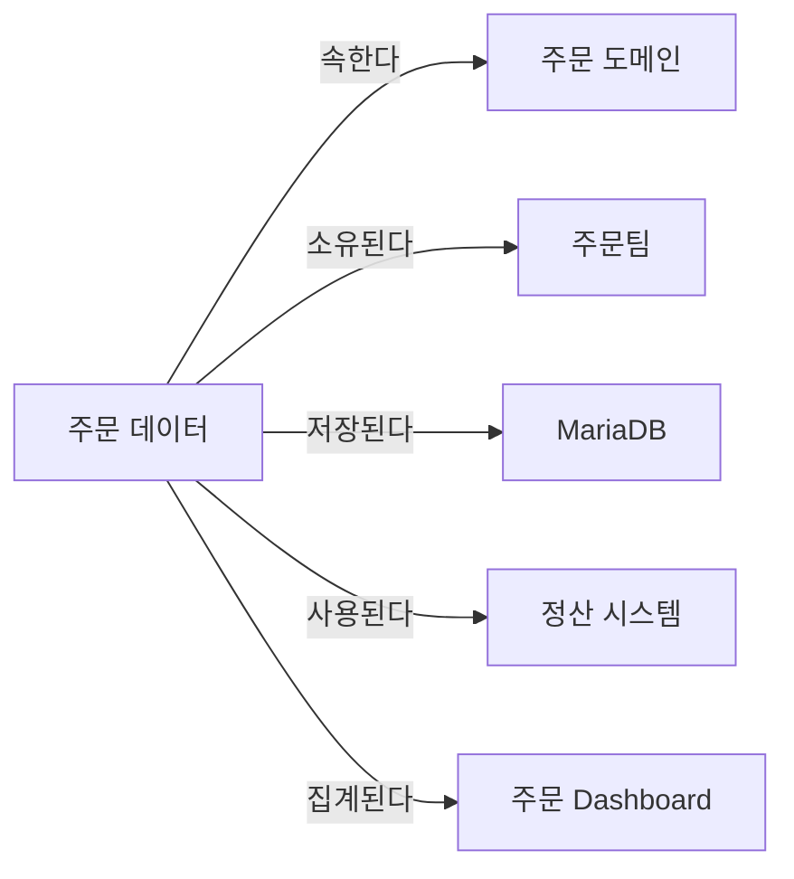
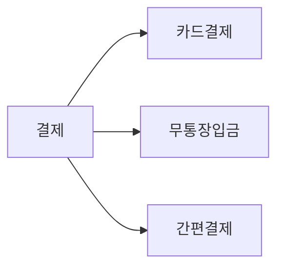
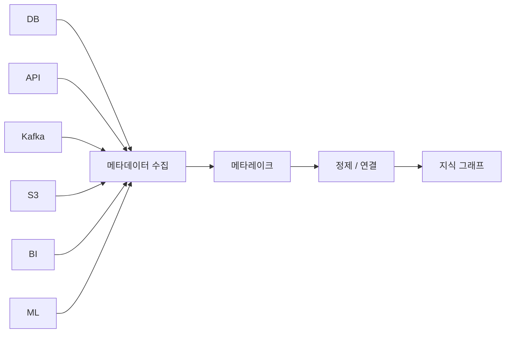
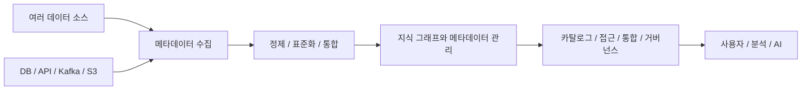

# 부록 B. 지식 그래프와 시맨틱 웹

이 부록은 15장 「메타데이터와 데이터 지도」에서 이어진다.

메타데이터의 관계를 그래프로 다루는 기술을 모았다.
지식 그래프, RDF, OWL, SPARQL, SHACL, SKOS,
그리고 메타데이터 통합 기반과 데이터 마켓플레이스다.

15장을 이해하는 데 반드시 필요한 내용은 아니다.
메타데이터를 본격적으로 다루게 될 때 읽으면 된다.

---

## 1. 지식 그래프

메타데이터가 많아질수록  
단순 목록보다 관계가 중요해진다.

이때 활용할 수 있는 것이  
**지식 그래프(Knowledge Graph)** 다.

지식 그래프는

> **개념과 데이터 사이의 관계를  
> 그래프 형태로 연결하는 방식**

이다.

예를 들어



처럼 표현할 수 있다.

---

## 2. 지식 그래프가 메타데이터와 잘 맞는 이유

메타데이터에는 관계가 많다.


그래프 모델은 이런 관계를  
자연스럽게 표현하고 탐색하기 좋다.

다만

> 그래프 DB가 관계형 DB보다  
> 항상 빠르거나 항상 우수하다

는 뜻은 아니다.

성능은 데이터 모델, 데이터 크기,  
쿼리 형태와 제품에 따라 달라진다.

지식 그래프의 장점은

> **복잡한 관계와 의미를 표현하고  
> 탐색하는 데 자연스럽다는 것**

이다.

---

## 3. RDF

지식 그래프에서 자주 등장하는 기술이  
**RDF(Resource Description Framework)** 다.

RDF에서는 정보를 다음처럼 표현한다.

```text
주어 - 관계 - 목적어
```

정확한 용어로는

```text
Subject
Predicate
Object
```

이고 이를 **Triple**이라고 한다.

예를 들어

```text
payment
belongsTo
commerce
```

라고 표현할 수 있다.

즉,

```text
payment는
commerce에 속한다.
```

라는 의미다.

---

## 4. OWL

**OWL**(Web Ontology Language)은  
개념과 관계를 보다 형식적으로 정의하는  
온톨로지 언어다.

예를 들어

```text
카드결제는
결제의 한 종류다.

결제는
주문과 연결될 수 있다.
```

같은 개념 관계와 제약을 표현할 수 있다.

OWL은 단순한 업무 규칙 엔진이라기보다

> **컴퓨터가 개념의 의미와 관계를  
> 해석하고 추론할 수 있도록 만드는  
> 형식적인 온톨로지 표현 언어**

라고 이해하는 것이 정확하다.

---

## 5. SPARQL

RDF 그래프에서 데이터를 검색할 때  
사용할 수 있는 대표적인 질의 언어가

**SPARQL**이다.

쉽게 비교하면

- **관계형 DB** — SQL
- **RDF Graph** — SPARQL

이다.

예를 들어

> 커머스 도메인에 속하면서  
> 정산 서비스가 사용하는 데이터는?

같은 관계 중심 질문을  
그래프에서 조회할 수 있다.

---

## 6. SHACL

**SHACL(Shapes Constraint Language)** 은  
RDF 그래프가 특정 조건을 만족하는지  
검증하는 데 사용할 수 있다.

예를 들어 조직의 규칙이

```text
모든 데이터 프로덕트에는
Owner가 있어야 한다.
```

라면

이 조건을 검증하도록 만들 수 있다.

즉,

> **그래프 데이터의 구조와 조건을 검증하는 기술**

이라고 이해하면 된다.

---

## 7. SKOS

**SKOS(Simple Knowledge Organization System)** 는  
용어집과 분류체계를 표현하는 데 사용할 수 있다.

예를 들어



같은 구조나

```text
판매자
≈ 셀러
≈ 입점 업체
```

같은 관련 용어를 표현할 수 있다.

따라서 비즈니스 용어집이나  
분류체계를 표현할 때 유용하다.

---

## 8. 관련 기술을 쉽게 기억하면

```text
RDF
= 관계 표현

OWL
= 개념과 관계를 형식적으로 정의

SPARQL
= 그래프 검색

SHACL
= 그래프 검증

SKOS
= 용어와 분류 체계
```

정도로 기억하면 충분하다.

---

## 9. 메타레이크

책에서는 **메타레이크(Metalake)** 라는  
아키텍처 개념을 소개한다.

여기서 주의할 점이 있다.

`메타레이크`는 Data Warehouse처럼  
모든 조직이 동일한 의미로 사용하는  
확립된 표준 용어라고 보기는 어렵다.

이 책에서는

> **여러 시스템에서 수집한 메타데이터를  
> 통합적으로 저장하고 연결하며  
> 가공하기 위한 기반**

이라는 의미로 이해하면 된다.

예를 들면 다음과 같다.



---

## 10. 메타레이크와 데이터 카탈로그

둘의 역할을 구분하면 이해하기 쉽다.

```text
메타레이크
= 메타데이터를 저장하고 연결하는 기반

데이터 카탈로그
= 사용자가 메타데이터를 검색하고 탐색하는 서비스
```

비유하면

```text
메타레이크
= 도서관의 책과 관리 시스템

데이터 카탈로그
= 도서 검색 시스템
```

정도로 볼 수 있다.

실제 제품에서는 두 역할이  
하나의 플랫폼에 합쳐질 수도 있다.

---

## 11. 데이터 패브릭

**데이터 패브릭(Data Fabric)** 은  
메타데이터 시스템 하나를 의미하지 않는다.

보다 넓은

> **분산된 데이터 환경을  
> 통합적으로 발견하고, 연결하고, 접근하고,  
> 거버넌스하기 위한 아키텍처 접근법**

이다.

데이터를 반드시 하나의 저장소로  
옮겨야 하는 것은 아니다.

실제 데이터가

```text
MariaDB
Kafka
S3
Data Warehouse
Cloud
SaaS
```

등 여러 곳에 있어도 된다.

대신

```text
메타데이터
자동화
데이터 통합
카탈로그
거버넌스
보안
API
```

등을 이용해  
하나의 연결된 환경처럼 사용할 수 있게 한다.

---

## 12. 데이터 패브릭의 개념적 흐름

쉽게 표현하면 다음과 같다.



지식 그래프는 데이터 패브릭을 구현할 때  
활용할 수 있는 중요한 기술 중 하나이지,

데이터 패브릭 자체와  
동일한 개념은 아니다.

---

## 13. 데이터 카탈로그와 데이터 마켓플레이스

두 개념은 상당히 겹친다.

반드시

```text
카탈로그
→ 마켓플레이스
```

라는 순서로 발전해야 하는 것은 아니다.

다만 개념적으로는 다음처럼 구분하면 쉽다.

```text
데이터 카탈로그

데이터를
발견하고
이해하는 데 초점
```

반면

```text
데이터 마켓플레이스

데이터 프로덕트를
발견하고
평가하고
신청하고
소비하는 경험에 초점
```

이 있다.

어떤 제품에서는 두 기능을  
하나의 플랫폼으로 제공하기도 한다.

---

## 14. 데이터 마켓플레이스

데이터 마켓플레이스를  
일종의

> **사내 데이터 상품 쇼핑몰**

이라고 생각하면 이해하기 쉽다.

예를 들어 다음과 같이 보일 수 있다.

```text
데이터 프로덕트
판매자별 일별 주문 통계

소유자
주문 데이터팀

갱신 주기
5분

품질
정상

접근 방법
SQL / API

접근 권한
승인 필요
```

사용자는 데이터를 발견한 다음

```text
설명 확인
품질 확인
소유자 확인
접근 신청
사용
```

까지 이어갈 수 있다.

