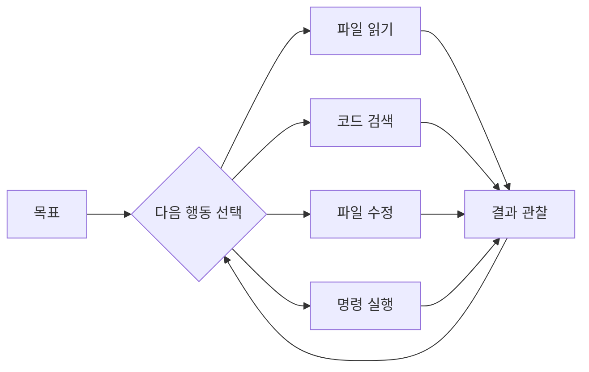

# 1장. AI 코딩은 어떻게 달라지고 있는가 — 자동완성에서 Coding Agent까지

## "AI로 개발한다"는 말은 세 번 뜻이 바뀌었다

처음에는 커서 뒤에 붙는 회색 글자를 뜻했다.

그다음에는 브라우저 창에 코드를 붙여넣고 물어보는 일을 뜻했다.

지금은 터미널에 목표를 적어두고  
결과를 검토하는 일을 뜻한다.

도구만 좋아진 것이 아니다.  
개발자가 하는 일 자체가 옮겨갔다.

---

## 세대는 세 번 바뀌었다

### 1️⃣ 자동완성 세대

내가 타이핑을 시작하면 AI가 뒷부분을 이어 쓴다.

`userRepository.findBy` 까지 치면 나머지를 채워준다.  
편리하다. 그러나 AI가 아는 것은 지금 열린 파일 몇 개뿐이다.

작업의 주도권은 100% 개발자에게 있다.  
AI는 타이핑 시간을 줄여준다.

### 2️⃣ 대화 세대

코드를 복사해서 채팅창에 붙여넣고 물어본다.

"이 코드에서 동시성 문제가 있을까?"

설명은 훌륭하다.  
그런데 AI는 우리 프로젝트를 본 적이 없다.

우리에게 없는 클래스를 쓰라고 하고,  
이미 있는 유틸리티를 다시 만들라고 한다.

붙여넣기, 번역, 적용, 검증은 전부 사람의 일로 남는다.

### 3️⃣ Agent 세대

이제는 코드를 붙여넣지 않는다.

프로젝트 디렉터리에서 도구를 실행하고,  
해야 할 일을 문장으로 적는다.

```text
결제 취소 시 포인트가 두 번 환급되는 버그가 있다.
관련 코드를 찾아서 원인을 설명하고,
재현 테스트를 먼저 작성한 다음 수정해줘.
```

그러면 AI가 스스로 파일을 찾고, 읽고, 수정하고,  
`./gradlew test` 를 실행해 결과를 확인한다.

실패하면 로그를 읽고 다시 고친다.

---

## 결정적 차이는 하나다

세 세대를 가르는 기준은 모델의 성능이 아니다.

> 다음 행동을 누가 결정하는가

자동완성과 대화형에서는 다음 행동을 항상 개발자가 정한다.  
AI가 만들어내는 것은 텍스트뿐이다.

Agent는 다르다.  
목표를 받으면 다음 행동을 스스로 고른다.



이 순환이 에이전틱 코딩의 전부다.

> 대화형 AI는 답을 준다.  
> Coding Agent는 행동을 한다.

---

## 같은 버그, 두 가지 방식

앞의 이중 환급 버그를 두 방식으로 처리해보자.

| 구분 | 대화형 AI | Coding Agent |
|---|---|---|
| 입력 | 사람이 고른 코드 조각 | 목표 문장 |
| 코드 탐색 | 사람이 함 | Agent가 함 |
| 검증 | 사람이 실행 | Agent가 실행 |
| 실패 시 | 사람이 다시 질문 | Agent가 다시 시도 |

대화형에서 개발자는 이렇게 움직인다.

의심되는 파일을 열고,  
`PointRefundService` 를 복사해 붙여넣고,  
답변을 읽고,  
우리 코드에 맞게 고쳐 쓰고,  
테스트를 돌린다.

Agent에서는 이렇게 움직인다.

목표를 적고,  
Agent가 찾아온 호출 흐름이 맞는지 확인하고,  
제안한 수정 방향에 동의하거나 반대하고,  
테스트가 실제로 그 버그를 잡는지 검토한다.

일이 줄어든 것이 아니다.  
**일의 종류가 바뀌었다.**

---

## Vibe Coding과 Agentic Coding

여기서 갈림길이 생긴다.

같은 도구를 쓰면서도 전혀 다른 두 가지 방식이 존재한다.

| 구분 | Vibe Coding | Agentic Coding |
|---|---|---|
| 판단 기준 | 돌아가면 통과 | 검증되면 통과 |
| 코드 읽기 | 거의 읽지 않음 | 변경점을 읽음 |
| 적합한 곳 | 프로토타입, 일회성 스크립트 | 운영 중인 시스템 |
| 실패 방식 | 조용히 망가짐 | 테스트가 막음 |

Vibe Coding은 나쁜 것이 아니다.  
주말에 만드는 사이드 프로젝트라면 충분히 합리적이다.

문제는 우리가 다루는 것이다.

⚠️ 백엔드 개발자는 남의 돈, 남의 개인정보,  
그리고 되돌릴 수 없는 트랜잭션을 다룬다.

"돌아가는 것 같다"로 통과시킬 수 없는 영역이다.

그래서 이 책은 Vibe Coding을 다루지 않는다.  
검증 가능한 위임, 즉 Agentic Coding을 다룬다.

> 코드를 읽지 않아도 되는 것이 아니다.  
> 읽어야 할 대상이 달라진다.

전체 구현을 한 줄씩 쓰는 대신,  
변경된 경계와 테스트 결과를 읽는다.

---

## 시간은 어디로 옮겨가는가

기존 개발에서 시간 배분은 대략 이랬다.

```text
코드 작성        ██████████████ 60%
코드 이해·탐색   ██████ 25%
검증·리뷰        ███ 15%
```

에이전틱 코딩에서는 이렇게 뒤집힌다.

```text
작업 정의        ██████ 25%
환경·규칙 정비   ██████ 25%
검증·리뷰        ████████ 35%
직접 작성        ███ 15%
```

타이핑이 줄어든 자리에 들어오는 것은 여유가 아니다.

무엇을 맡길지 정하는 일,  
Agent가 틀리지 않을 환경을 만드는 일,  
결과가 맞는지 확인하는 일이 들어온다.

---

## 백엔드 개발자가 유리한 이유

이 변화는 백엔드 개발자에게 낯설지 않다.

우리는 이미 위임의 전문가다.

* 신규 입사자에게 온보딩 문서를 준다
* 요구사항을 티켓으로 쪼갠다
* 완료 조건을 정의한다
* CI로 자동 검증한다
* 코드 리뷰로 최종 확인한다

Agent를 다루는 방식은 이것과 거의 같다.

| 팀에서 하던 일 | Agent에게 대응되는 것 |
|---|---|
| 온보딩 문서 | `CLAUDE.md` |
| 티켓과 완료 조건 | Task 정의 |
| CI 파이프라인 | 테스트·빌드 검증 루프 |
| 운영 DB 접근 통제 | Permission 정책 |
| 코드 리뷰 | 사람의 최종 승인 |

Agent는 마법이 아니다.  
어제 합류해서 우리 코드를 아직 모르는,  
그러나 대단히 빠르고 지치지 않는 동료에 가깝다.

그 동료가 성과를 내는지는 개인 역량보다  
우리가 만들어둔 환경에 달려 있다.

이 환경을 이 책에서는 **하네스(Harness)** 라고 부른다.  
4장과 5장에서 본격적으로 다룬다.

---

## 이 장의 핵심

* AI 코딩은 자동완성 → 대화 → Agent로 세 세대를 지나왔다
* 세대를 가르는 기준은 모델 성능이 아니라 다음 행동을 누가 정하느냐다
* 대화형 AI는 답을 주고, Coding Agent는 코드를 읽고 고치고 실행한다
* Vibe Coding은 프로토타입의 방식이고, 운영 백엔드에는 맞지 않는다
* 에이전틱 코딩은 코드를 안 읽는 방식이 아니라 읽을 대상을 바꾸는 방식이다
* 개발자의 시간은 타이핑에서 작업 정의·환경 정비·검증으로 이동한다
* 위임과 검증은 백엔드 개발자가 이미 팀에서 해온 일이다
