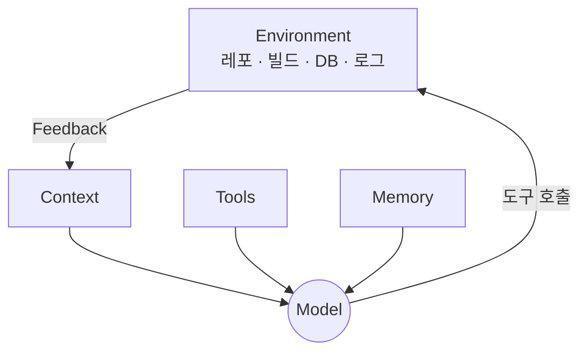

# 2장. Agent를 이루는 것들 — Context · Tools · Memory · Environment · Feedback Loop

1장에서 Coding Agent는 다음 행동을 스스로 고른다고 했다.

그런데 LLM은 텍스트를 생성하는 모델이다.

파일을 열 수 없고,  
`./gradlew test` 를 실행할 수 없고,  
어제 한 일을 기억하지 못한다.

그런 모델이 어떻게 우리 레포를 고치는가.

---

## LLM과 Agent의 차이

LLM 자체는 함수에 가깝다.

```text
LLM    : 텍스트 → 텍스트
Agent  : 목표 → (관찰 → 판단 → 행동)* → 결과
```

모델은 상태를 갖지 않는다.  
루프도, 손도, 기억도 모델 안에 없다.

> 모델은 판단만 한다.  
> 나머지는 전부 모델 바깥에 있다.

그 '바깥'을 이루는 것이 다섯 가지다.



---

## 1️⃣ Context — 지금 보고 있는 것

모델은 매 순간 텍스트 한 덩어리만 본다.

우리 레포 전체가 아니다.  
**지금까지 읽힌 것**뿐이다.

`PointRefundService.kt` 를 아직 읽지 않았다면  
그 클래스는 Agent에게 존재하지 않는다.

여기서 초보자의 오해가 생긴다.

> "프로젝트를 다 읽혀두면 똑똑해지겠지"

그렇지 않다.  
읽힐 수 있는 양에는 한계가 있고,  
쓸데없는 코드가 섞이면 판단이 흐려진다.

3부에서 본격적으로 다룬다.

---

## 2️⃣ Tools — 할 수 있는 행동

Agent가 가진 도구 목록이 곧 능력의 범위다.

* 파일 읽기
* 코드 검색
* 파일 수정
* 명령 실행
* Git 조작

도구가 없는 능력은 존재하지 않는다.

테스트를 실행할 도구가 없는 Agent는  
"검증했다"고 말할 수 없다.  
할 수 있는 것은 추측뿐이다.

7장에서 도구 하나하나를 본다.

---

## 3️⃣ Memory — 세션을 넘어 남는 것

대화창을 닫으면 Context는 사라진다.

남는 것은 파일에 쓴 것뿐이다.

* `CLAUDE.md` 에 적은 규칙
* 테스트 코드
* 커밋 메시지
* 작업 문서

> 대화 안에만 있는 지식은  
> 없어질 지식이다.

이 원칙은 4부 전체를 관통한다.

---

## 4️⃣ Environment — 실제로 손을 대는 세계

Agent가 코드를 고친 다음 무엇을 할 수 있는지는  
환경이 결정한다.

| 환경 | Agent가 할 수 있게 되는 일 |
|---|---|
| Gradle 빌드 | 컴파일 성공 여부 확인 |
| 테스트 스위트 | 동작 깨짐 확인 |
| Docker · 로컬 DB | 실제 쿼리 실행 |
| 로그 | 런타임 문제 추적 |

환경은 Agent에게 눈이다.

로컬에서 테스트가 아예 돌지 않는 프로젝트라면,  
Agent는 눈을 감고 코드를 쓴다.

⚠️ 이 상태에서 Agent에게 자율성을 주면  
틀린 방향으로 아주 빠르게 간다.

---

## 5️⃣ Feedback Loop — 틀렸다는 사실을 아는 방법

Agent가 스스로 수렴할 수 있는 이유는  
반성 능력이 뛰어나서가 아니다.

틀렸다는 신호가 텍스트로 돌아오기 때문이다.

```text
e: PointRefundService.kt:47:9 Type mismatch:
   inferred type is Long? but Long was expected
```

이 한 줄이 Context에 들어오면  
다음 판단이 달라진다.

컴파일 에러, 테스트 실패, 로그, HTTP 응답.  
모두 같은 역할을 한다.

24장에서 이 루프를 설계 대상으로 다시 본다.

---

## 다섯 요소로 다시 보는 이중 환급 버그

1장의 버그를 이 다섯 가지로 나누어 보자.

| 요소 | 이 작업에서 실제로 무엇이었나 |
|---|---|
| Context | 검색으로 찾은 관련 파일 3개와 그 내용 |
| Tools | Grep, Read, Edit, Bash |
| Memory | `CLAUDE.md` 의 트랜잭션 규칙 |
| Environment | Gradle, 테스트, 로컬 MySQL |
| Feedback | 재현 테스트의 실패 → 성공 전환 |

하나라도 비어 있으면 결과가 달라진다.

Memory가 없으면 우리 팀의 트랜잭션 규칙을 어기고,  
Environment가 없으면 고쳤는지 확인하지 못하고,  
Feedback이 없으면 틀린 채로 끝난다.

---

## "스스로 작업한다"는 말의 실제 의미

자율성이라는 말은 종종 과장된다.

Agent의 자율성은 한 가지를 뜻한다.

> 다음 도구 호출을 스스로 고를 권한

그 이상도, 그 이하도 아니다.

그래서 자율성의 가치는 다섯 요소의 품질에 정비례한다.

읽을 것이 정확하고,  
쓸 도구가 갖춰져 있고,  
지켜야 할 규칙이 남아 있고,  
실행할 환경이 있고,  
결과가 신호로 돌아올 때  
비로소 위임이 성립한다.

이 다섯 가지를 의도적으로 갖춰주는 일을  
4장부터 **하네스**라고 부른다.

---

## 이 장의 핵심

* LLM은 텍스트 함수이고, Agent는 LLM에 루프와 도구를 붙인 구조다
* Agent를 이루는 것은 Context · Tools · Memory · Environment · Feedback Loop다
* Context에 없는 코드는 Agent에게 존재하지 않는다
* 도구 없는 능력은 없다 — 테스트 도구가 없으면 검증은 추측이 된다
* 대화 안에만 있는 지식은 세션이 끝나면 사라진다
* 환경은 Agent의 눈이고, 눈이 없으면 자율성은 위험해진다
* Agent의 자율성은 다음 도구 호출을 고를 권한을 뜻할 뿐이다
