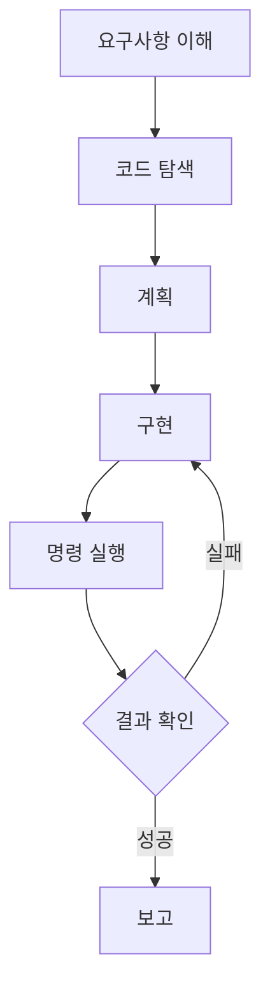
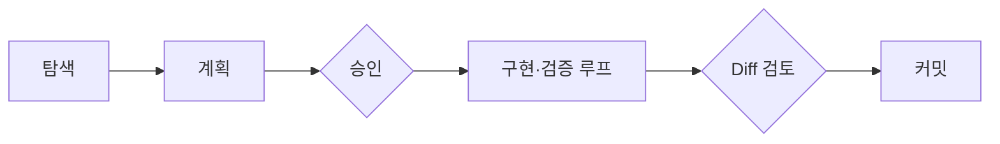

# 03장. Coding Agent는 어떻게 개발하는가 — 탐색 · 계획 · 구현 · 검증의 순환

2장에서 Agent의 구성요소를 봤다.

이제 그것들이 실제로 어떻게 맞물려 돌아가는지  
작업 하나를 처음부터 끝까지 따라가 보자.

과제는 1장의 그 버그다.

> 결제 취소 시 포인트가 두 번 환급된다

---

## 사람이 하던 순서와 다르지 않다

Agent의 작업 순서는 우리가 하던 것과 거의 같다.



다른 점은 속도와 인내심이 아니라  
**어디서 사람이 끼어드는가** 하나다.

---

## 1️⃣ 요구사항 이해

Agent가 가장 먼저 하는 일은 문장을 좁히는 것이다.

"두 번 환급된다"는 표현에는 여러 가능성이 있다.

* 취소 API가 두 번 호출된다
* 한 번의 호출에서 적립 이력이 두 건 쌓인다
* 환급 금액이 두 배로 계산된다

좋은 Agent는 여기서 되묻는다.  
정보가 부족하면 추측하기보다 확인하는 편이 싸다.

이 되묻기를 유도하는 방법은 10장에서 다룬다.

---

## 2️⃣ 코드 탐색

이제 코드를 찾는다.

주의할 점은 Agent가 프로젝트를 통째로 읽지 않는다는 것이다.

```text
> grep -rn "refundPoint" --include=*.kt

  point/PointRefundService.kt:42
  order/OrderCancelFacade.kt:88
  payment/PaymentCancelHandler.kt:61
```

세 곳이 나왔다.

Agent는 이 중 어디를 읽을지 고른다.  
전부 읽으면 Context가 낭비되고 판단이 흐려진다.

> 탐색은 넓게, 정독은 좁게.

13장에서 이 원칙을 다시 다룬다.

---

## 3️⃣ 계획

읽어보니 구조가 이렇다.

```text
OrderCancelFacade.cancel()
  ├─ PaymentCancelHandler.cancel()   → 결제 취소 후 이벤트 발행
  │     └─ PointRefundListener       → 포인트 환급 (1)
  └─ PointRefundService.refund()     → 포인트 환급 (2)
```

같은 환급이 리스너와 직접 호출로 두 번 일어난다.

Agent는 여기서 계획을 제시한다.

```text
원인: 이벤트 리스너와 Facade의 직접 호출이 중복
수정 방향: Facade의 직접 호출 제거
영향 범위: 주문 취소, 부분 취소, 관리자 강제 취소
검증: 재현 테스트 + 기존 취소 테스트 6건
```

이 지점이 이 책에서 가장 중요한 순간이다.

🔥 코드를 고치기 전에 사람이 방향을 승인한다.

방향이 틀렸다면 여기서 멈추는 비용이 가장 싸다.  
21장에서 이것을 `Plan First` 라고 부른다.

---

## 4️⃣ 구현

승인 후 Agent가 코드를 고친다.

순서가 중요하다.  
좋은 Agent는 재현 테스트를 먼저 만든다.

```kotlin
@Test
fun `주문 취소 시 포인트 환급은 한 번만 발생한다`() {
    val order = 주문_생성(point = 1_000)

    orderCancelFacade.cancel(order.id)

    val histories = pointHistoryRepository
        .findAllByOrderId(order.id)
    assertThat(histories).hasSize(1)
}
```

지금은 이 테스트가 실패해야 정상이다.

실패하는 테스트는 버그의 존재 증명이다.  
36장의 Characterization Test와 같은 원리다.

---

## 5️⃣ 명령 실행과 결과 확인

Agent가 직접 실행한다.

```text
> ./gradlew test --tests '*OrderCancelTest'

  주문 취소 시 포인트 환급은 한 번만 발생한다  FAILED
    expected size: 1 but was: 2
```

원인이 확인됐다.  
이제 중복 호출을 제거하고 다시 돌린다.

```text
> ./gradlew test --tests '*OrderCancel*'

  BUILD SUCCESSFUL
  7 tests completed
```

여기까지가 한 바퀴다.

사람이 한 일은 방향 승인과 최종 검토 두 번이고,  
나머지 왕복은 Agent가 했다.

---

## 6️⃣ 실패 후 재시도 — 그리고 그 위험

현실에서는 한 바퀴로 끝나지 않는다.

부분 취소 테스트가 깨질 수도 있고,  
컴파일이 안 될 수도 있다.

Agent는 실패 로그를 읽고 다시 시도한다.  
이것이 강력한 이유이자, 가장 위험한 지점이다.

⚠️ 재시도가 이렇게 흐를 때가 있다.

| 위험한 재시도 | 왜 문제인가 |
|---|---|
| 실패하는 단정문 삭제 | 테스트를 통과시키려 검증을 없앤다 |
| `@Disabled` 추가 | 문제를 미래로 미룬다 |
| 예외를 잡아 무시 | 증상만 감춘다 |
| 같은 수정 반복 | 수렴하지 않고 맴돈다 |

Agent가 나쁜 의도를 가진 것이 아니다.

"테스트를 통과시켜라"라는 목표에  
가장 짧은 경로를 고른 것이다.

그래서 목표를 이렇게 주면 안 된다.

> ❌ 테스트가 통과하게 만들어줘  
>  
> ✅ 이 동작이 한 번만 일어나게 고치고,  
>    기존 테스트를 수정하지 말고 통과시켜줘

지시를 잘 쓰는 문제로 보이지만,  
결국 환경으로 막아야 하는 문제다.  
41장에서 규칙을 의존성 테스트로 강제한다.

---

## 사람이 개입하는 두 지점

한 바퀴 전체에서 사람의 자리는 정해져 있다.



앞에서 방향을 잡고,  
뒤에서 결과를 본다.

중간의 왕복은 맡긴다.  
그 왕복까지 사람이 따라가면 위임의 이점이 사라진다.

---

## 이 장의 핵심

* Agent의 작업 순서는 사람의 순서와 같다 — 이해 · 탐색 · 계획 · 구현 · 검증
* Agent는 프로젝트를 통째로 읽지 않는다. 탐색은 넓게, 정독은 좁게 한다
* 코드 수정 전 계획 승인이 가장 값싼 개입 지점이다
* 재현 테스트를 먼저 만들면 실패가 버그의 증명이 된다
* 재시도는 강력하지만, 검증을 약화시키는 방향으로 흐를 수 있다
* 목표를 "테스트 통과"로 주면 테스트를 지우는 경로가 열린다
* 사람의 자리는 앞의 방향 승인과 뒤의 Diff 검토, 두 곳이다
