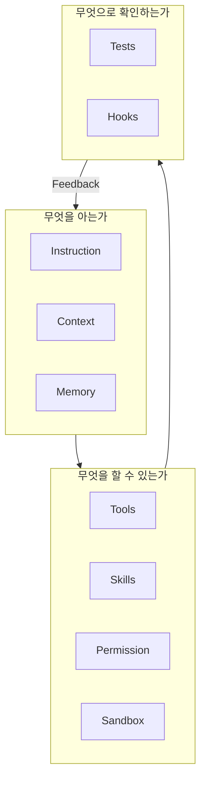

# 5장. Harness의 구성요소 — 아홉 개의 부품

4장에서 하네스가 결과를 만든다고 했다.

그렇다면 하네스는 무엇으로 조립하는가.

이 장은 부품 목록이다.  
동시에 이 책의 지도다.

각 부품이 어느 장에서 다뤄지는지 표시해둔다.  
지금 다 이해할 필요는 없다.

---

## 부품은 세 개의 질문으로 묶인다

아홉 개를 나열하면 외우기 어렵다.

세 가지 질문으로 나누면 구조가 보인다.



이 세 층이 한 바퀴 도는 것이 3장에서 본 순환이다.

---

## 무엇을 아는가

### 1️⃣ Instruction

Agent가 **항상** 알아야 하는 규칙이다.

두 종류가 있다.

* 도구가 기본으로 갖고 있는 시스템 지침
* 우리가 쓰는 프로젝트 지침 — `CLAUDE.md`

우리가 손댈 수 있는 것은 후자다.

```text
- 모든 금액은 Long, 원 단위로 다룬다
- Service 계층에서 다른 Service를 직접 호출하지 않는다
- 운영 DB에는 절대 접속하지 않는다
```

14장~16장에서 다룬다.

### 2️⃣ Context

이번 작업에서만 필요한 정보다.

관련 파일, 검색 결과, 실행 결과, 에러 로그.

Instruction은 항상,  
Context는 이번만.

12장~13장에서 다룬다.

### 3️⃣ Memory

세션이 끝나도 남는 것이다.

```text
docs/architecture.md
tasks/point-refund-fix.md
.claude/rules/
```

17장~19장에서 다룬다.

---

## 무엇을 할 수 있는가

### 4️⃣ Tools

파일 읽기, 검색, 수정, 명령 실행, Git.

여기에 MCP로 외부 시스템을 연결하면  
GitHub 이슈나 모니터링 지표까지 도구가 된다.

7장, 그리고 52장~53장에서 다룬다.

### 5️⃣ Skills

반복되는 절차를 문서로 고정한 것이다.

"우리 팀에서 API 하나 추가하는 절차"를  
매번 설명하지 않기 위한 부품이다.

45장~46장에서 다룬다.

### 6️⃣ Permission

무엇을 허용하고, 무엇을 물어보게 하고,  
무엇을 금지할지 정한다.

| 대상 | 정책 |
|---|---|
| 테스트 실행 | 허용 |
| 마이그레이션 실행 | 확인 후 |
| `git push --force` | 금지 |
| 운영 DB 접속 | 금지 |

55장에서 다룬다.

### 7️⃣ Sandbox

권한이 정책이라면 샌드박스는 물리적 격리다.

Docker 컨테이너, 별도 DB, 별도 네트워크.

⚠️ 정책은 실수로 넘길 수 있다.  
격리는 넘길 수 없다.

55장에서 함께 다룬다.

---

## 무엇으로 확인하는가

### 8️⃣ Tests

Agent가 자기 결과를 확인하는 유일하게 값싼 수단이다.

테스트가 없는 프로젝트에서  
Agent의 "수정 완료"는 의견에 불과하다.

23장, 36장에서 다룬다.

### 9️⃣ Hooks

무조건 실행되어야 하는 것을 자동화한다.

* 파일을 고치면 포매터가 돈다
* 커밋 전에 의존성 규칙 검사가 돈다

지시는 잊힐 수 있지만 훅은 잊히지 않는다.

47장에서 다룬다.

---

## 한눈에 보는 지도

| 부품 | 답하는 질문 | 다루는 장 |
|---|---|---|
| Instruction | 항상 지켜야 할 규칙은? | 14~16장 |
| Context | 이번에 봐야 할 것은? | 12~13장 |
| Memory | 다음에도 남을 것은? | 17~19장 |
| Tools | 할 수 있는 행동은? | 7, 52~53장 |
| Skills | 반복 절차는? | 45~46장 |
| Permission | 해도 되는 범위는? | 55장 |
| Sandbox | 못 넘게 막을 선은? | 55장 |
| Tests | 맞았는지 어떻게 아는가? | 23, 36장 |
| Hooks | 무조건 돌아야 할 것은? | 47장 |

11부에서 이 아홉 개를 실제로 조립한다.

---

## 지금 아홉 개를 다 만들지 않는다

이 목록을 보고 하네스 구축 프로젝트를 시작하고 싶어진다면  
잠깐 멈추는 편이 좋다.

처음부터 다 만든 하네스는 대개 틀린다.

Agent가 실제로 어디서 틀리는지 모르는 상태에서  
쓴 규칙은 추측이다.

🔥 최소 구성은 셋이면 충분하다.

```text
1. CLAUDE.md 한 장
   - 빌드·테스트 명령
   - 디렉터리 구조 한 줄 설명
   - 절대 하지 말 것 세 줄

2. 돌아가는 테스트 명령 하나

3. 위험 명령 차단
   - 운영 접속, force push, DB 삭제
```

8장에서 문서 없는 레포에 이 최소 구성을 붙인다.

나머지 부품은 필요가 생길 때 추가한다.

같은 실수를 두 번 보면 Instruction을 늘리고,  
같은 절차를 세 번 설명하면 Skill로 만들고,  
지시를 계속 잊으면 Hook으로 내린다.

> 하네스는 설계되는 것이 아니라 자란다.

---

## 이 장의 핵심

* 하네스는 아홉 개의 부품으로 조립된다
* 부품은 아는 것 · 할 수 있는 것 · 확인하는 것 세 층으로 묶인다
* Instruction은 항상 유효하고 Context는 이번 작업에만 유효하다
* Permission은 정책이고 Sandbox는 넘을 수 없는 물리적 격리다
* 테스트가 없으면 Agent의 완료 보고는 의견에 불과하다
* 지시는 잊히고 Hook은 잊히지 않는다
* 처음부터 아홉 개를 다 만들지 않는다 — 규칙 한 장, 테스트 하나, 금지 목록으로 시작한다
* 하네스는 Agent가 틀리는 지점을 보면서 자란다
