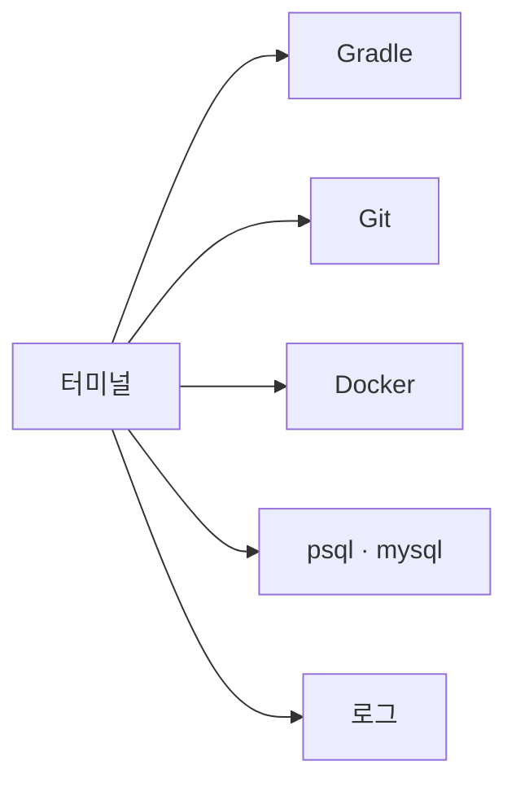

# 6장. 설치와 첫 실행 — 터미널에서 시작한다

5장에서 최소 구성 세 가지를 정했다.

규칙 한 장, 테스트 명령 하나, 금지 목록.

그런데 그것을 만들기 전에 먼저 해야 할 일이 있다.

일단 켜보는 것이다.

---

## 설치

Node.js 18 이상이 있으면 한 줄이다.

```bash
npm install -g @anthropic-ai/claude-code
```

설치 후 프로젝트 디렉터리에서 실행한다.

```bash
cd ~/work/order-service
claude
```

첫 실행에서 로그인 절차가 진행된다.  
브라우저가 열리고, 계정을 인증하면 터미널로 돌아온다.

---

## 어디서 실행하는지가 중요하다

이 부분을 가볍게 넘기면 나중에 고생한다.

Claude Code를 실행한 디렉터리가 **작업 범위**가 된다.

* 그 아래의 파일을 읽고 수정한다
* 그 위치에서 명령을 실행한다
* 그곳의 `CLAUDE.md` 를 규칙으로 읽는다

⚠️ 홈 디렉터리에서 실행하면 안 된다.

```bash
cd ~          # 위험
claude
```

`~/.aws/credentials`, `~/.ssh`, 다른 프로젝트가  
모두 사정권에 들어온다.

항상 하나의 프로젝트 루트에서 시작한다.

---

## 기본 조작만 알면 된다

처음부터 모든 기능을 알 필요는 없다.  
아래 정도면 첫 주를 보낼 수 있다.

| 입력 | 하는 일 |
|---|---|
| `/help` | 사용 가능한 명령 목록 |
| `/init` | 프로젝트를 분석해 `CLAUDE.md` 초안 생성 |
| `/model` | 사용할 모델 변경 |
| `/clear` | 대화를 비우고 새 Session 시작 |
| `/compact` | 대화를 압축해 이어가기 |
| `/resume` | 이전 Session 이어받기 |
| `Esc` | 작업 중단 |
| `Shift+Tab` | 권한 모드 전환 (계획 모드 포함) |

입력 중에 쓰는 두 가지 접두사도 함께 익혀두면 편하다.

* `@` — 파일을 직접 지목한다
  `@src/main/kotlin/order/OrderCancelFacade.kt 이 흐름 설명해줘`
* `!` — 명령을 직접 실행하고 결과를 대화에 넣는다
  `!git log --oneline -20`

`!` 는 특히 유용하다.

Agent가 대신 실행하는 것이 아니라  
내가 실행한 결과를 Context에 넣어주는 방식이다.

---

## 첫날의 명령은 읽기만

처음 켠 날 코드를 고치게 하지 않는다.

읽기만 시켜본다.

```text
이 프로젝트의 디렉터리 구조와 주요 모듈을 설명해줘.
코드는 수정하지 마.
```

```text
테스트는 어떻게 실행해? 실행 명령만 찾아서 알려줘.
```

```text
주문 취소 요청이 들어오면 어떤 클래스를 거쳐 처리되는지
호출 순서대로 정리해줘.
```

이 세 가지 답을 받아보면 두 가지를 동시에 알게 된다.

Claude Code가 무엇을 할 수 있는지,  
그리고 **우리 프로젝트가 얼마나 설명하기 어려운 상태인지.**

두 번째가 더 중요하다.  
8장에서 그 상태를 다룬다.

---

## 첫날 하지 말 것

⚠️ 다음 세 가지는 첫 주에 하지 않는다.

| 하지 말 것 | 이유 |
|---|---|
| 커밋하지 않은 변경 위에서 작업 | 되돌릴 기준점이 없다 |
| 운영 접속 정보가 있는 위치에서 실행 | 읽히면 Context에 남는다 |
| 권한 자동 승인 모드 | 무엇이 실행되는지 배우기 전이다 |

특히 첫 번째가 사고를 만든다.

작업 전에 `git status` 가 깨끗해야 한다.  
그러면 무엇을 하든 되돌릴 수 있다.

이 원칙은 25장에서 다시 다룬다.

---

## 왜 터미널인가

Claude Code는 터미널, 데스크톱 앱, 웹, IDE 확장으로 쓸 수 있다.

이 책은 터미널을 기준으로 설명한다.  
이유는 취향이 아니다.

2장에서 Environment를 Agent의 눈이라고 했다.

백엔드 개발자의 그 눈은 이미 터미널에 있다.



빌드, 테스트, 마이그레이션, 컨테이너, 로그 조회.

우리가 하루에 수십 번 치는 명령이 전부 여기 있다.

그래서 여기에 Agent를 놓으면  
별도 연동 없이 검증 수단이 곧바로 갖춰진다.

> Agent를 우리 작업 환경으로 데려오는 것이지,  
> 우리가 Agent의 환경으로 가는 것이 아니다.

---

## 모델은 일단 기본값으로

`/model` 로 모델을 바꿀 수 있지만  
첫 주에는 기본값을 쓰는 편이 좋다.

무엇이 느리고 무엇이 비싼지 감이 없는 상태에서  
모델을 바꾸면 원인 분석이 어려워진다.

작업 유형별로 모델을 배치하는 방법은 11장에서 다룬다.

---

## 이 장의 핵심

* 설치는 `npm install -g @anthropic-ai/claude-code` 한 줄이다
* 실행한 디렉터리가 작업 범위가 된다 — 홈 디렉터리에서 실행하지 않는다
* `/init`, `/clear`, `/compact`, `/model`, `Esc`, `Shift+Tab` 정도면 첫 주는 충분하다
* `@` 로 파일을 지목하고, `!` 로 내 명령 결과를 Context에 넣는다
* 첫날은 읽기만 시킨다 — 그 답변이 프로젝트 상태를 알려준다
* 작업 전 `git status` 가 깨끗해야 되돌릴 수 있다
* 터미널을 쓰는 이유는 빌드·테스트·Git·로그가 이미 거기에 있기 때문이다
