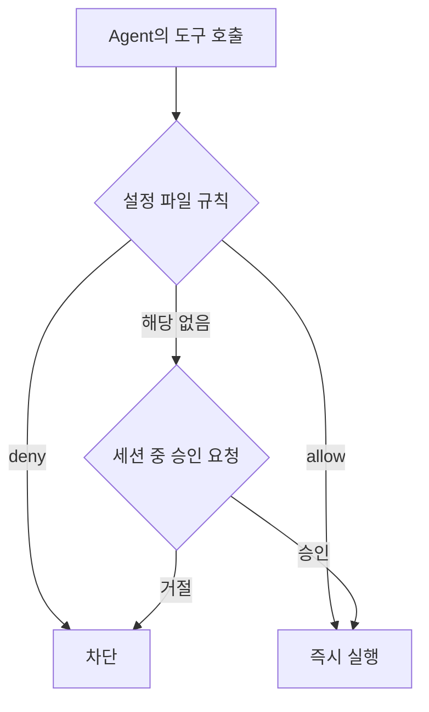

# 07장. Claude Code가 쓰는 도구와 권한 — Read · Grep · Edit · Bash

2장에서 이렇게 말했다.

> 도구가 없는 능력은 존재하지 않는다.

그러니 Claude Code가 실제로 무엇을 할 수 있는지는  
도구 목록을 보면 정확히 알 수 있다.

목록은 짧다.

---

## 도구는 다섯 종류로 충분히 설명된다

### 1️⃣ 읽기 — Read

파일 내용을 읽는다.

전체를 읽을 수도 있고 특정 구간만 읽을 수도 있다.  
Agent는 보통 필요한 부분만 읽는다.

한 번 읽은 내용은 Context에 남는다.  
그래서 큰 파일을 여러 개 읽히면 대가가 있다.

### 2️⃣ 찾기 — Glob과 Grep

`Glob` 은 파일 경로 패턴으로 찾는다.

```text
**/*Repository.kt
```

`Grep` 은 파일 내용으로 찾는다.

```text
refundPoint
```

이 두 도구가 3장의 "탐색은 넓게" 를 담당한다.

찾기는 싸고 읽기는 비싸다.  
좋은 Agent는 찾은 다음에 읽는다.

### 3️⃣ 수정 — Edit과 Write

`Edit` 은 파일의 일부 문자열을 교체한다.  
`Write` 는 파일을 새로 쓰거나 통째로 덮어쓴다.

둘의 차이가 안전성 차이다.

⚠️ `Write` 는 기존 파일을 덮어쓸 수 있다.  
그래서 도구를 다루는 규칙에서 이 차이가 자주 등장한다.

### 4️⃣ 실행 — Bash

여기가 가장 강력하고 가장 위험하다.

```bash
./gradlew test
git diff
docker compose up -d
psql -c "select count(*) from orders"
```

빌드, 테스트, 마이그레이션, 컨테이너, DB 접속.  
전부 이 하나의 도구를 통과한다.

에이전틱 코딩이 성립하는 이유도,  
사고가 나는 이유도 같은 도구다.

### 5️⃣ 위임 — Subagent

Agent가 별도 Context를 가진 Agent를 띄운다.

탐색처럼 읽을 양이 많은 작업을 넘겨두고  
결과 요약만 받는다.

47장에서 본격적으로 다룬다.

---

## 권한은 세 겹이다

도구가 위험을 만들고, 권한이 그 위험을 통제한다.



### 세션 중 승인

처음에는 대부분 여기서 걸린다.

```text
Bash 명령을 실행하려고 합니다
  ./gradlew test --tests '*OrderCancelTest'

  1. 예
  2. 예, 이후 이 명령은 자동 승인
  3. 아니오
```

2번을 고르면 그 규칙이 설정에 쌓인다.

첫 주에는 이 프롬프트를 귀찮게 여기지 않는 편이 좋다.  
Agent가 실제로 무슨 명령을 만드는지 배우는 시간이다.

### 설정 파일 규칙

반복되는 판단은 `.claude/settings.json` 에 적는다.

```json
{
  "permissions": {
    "allow": [
      "Bash(./gradlew test:*)",
      "Bash(./gradlew build)",
      "Bash(git diff:*)",
      "Bash(git status)"
    ],
    "deny": [
      "Read(./.env)",
      "Read(./.env.*)",
      "Bash(git push --force:*)",
      "Bash(rm -rf:*)"
    ]
  }
}
```

`allow` 는 매번 묻지 않게 하는 목록이고,  
`deny` 는 물어보지도 않고 막는 목록이다.

이 파일은 Git에 커밋한다.  
팀 전체의 안전선이 되기 때문이다. 60장에서 다룬다.

### 권한 모드

`Shift+Tab` 으로 전환한다.

| 모드 | 성격 | 언제 |
|---|---|---|
| 기본 | 위험한 작업은 물어본다 | 대부분의 작업 |
| 계획 | 읽기만 하고 수정하지 않는다 | 조사·설계 단계 |
| 자동 승인 | 묻지 않는다 | 격리된 환경에서만 |

🔥 계획 모드는 이 책에서 가장 자주 쓰게 될 모드다.

읽고 분석하되 손대지 않는다.  
8장의 첫날과 21장의 Plan First가 모두 이 모드 위에 있다.

자동 승인은 편하다.  
그리고 편한 만큼 위험하다. 54장까지는 쓰지 않는다.

---

## 백엔드 개발자의 금지 목록

우리 도메인에서는 이 목록이 특히 구체적이어야 한다.

| 대상 | 이유 |
|---|---|
| 운영 DB 접속 문자열 | 조회 한 번이 장애가 될 수 있다 |
| `.env`, `application-prod.yml` | 읽히면 Context에 남는다 |
| `git push --force` | 남의 커밋이 사라진다 |
| `DROP`, `TRUNCATE` | 되돌릴 수 없다 |
| 마이그레이션 실행 | 확인 후에만 |
| 외부 결제·알림 API 호출 | 실제로 발송된다 |

목록을 외우는 것이 목적이 아니다.

기준은 하나다.

> 되돌릴 수 없는 일은 사람이 결정한다.

---

## 도구가 없으면 무슨 일이 안 되는가

권한을 조일 때 함께 봐야 할 것이 있다.

무엇을 막으면 무엇이 불가능해지는지다.

| 막으면 | 못 하게 되는 일 |
|---|---|
| 테스트 실행 | 스스로 검증 — 추측만 남는다 |
| Git | Diff 확인, 되돌리기 |
| 로컬 DB | 쿼리·마이그레이션 확인 |
| 로그 조회 | 장애 원인 분석 |

⚠️ 안전을 이유로 모든 실행을 막으면  
4장의 나쁜 하네스가 된다.

Agent는 코드를 쓸 수만 있고 확인할 수는 없게 된다.

그래서 권한 설계의 목표는 최소화가 아니다.

> 로컬에서는 넓게,  
> 운영으로 갈수록 좁게.

54장에서 이 원칙을 환경별 정책으로 구체화한다.

---

## 이 장의 핵심

* 도구는 읽기 · 찾기 · 수정 · 실행 · 위임 다섯 종류로 설명된다
* 찾기는 싸고 읽기는 비싸다 — 좋은 Agent는 찾은 다음에 읽는다
* Bash 하나에 빌드·테스트·DB·컨테이너가 모두 걸려 있다
* 권한은 설정 규칙 · 세션 승인 · 권한 모드의 세 겹으로 작동한다
* 계획 모드는 읽되 수정하지 않는 모드이고, 이 책에서 가장 자주 쓴다
* `.claude/settings.json` 은 팀의 안전선이므로 Git에 커밋한다
* 되돌릴 수 없는 일은 사람이 결정한다
* 모든 실행을 막으면 Agent는 검증할 수 없게 된다 — 로컬은 넓게, 운영은 좁게
