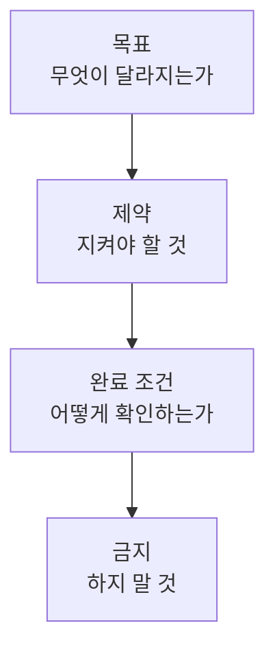

# 10장. 질문이 아니라 작업을 주는 법 — 목표 · 제약 · 완료 조건

9장에서 버그 하나를 끝까지 처리했다.

돌아보면 그 세션의 품질은  
Agent의 능력보다 처음 준 문장에서 결정됐다.

이 장은 그 문장을 쓰는 방법이다.

---

## 질문과 작업은 다른 것이다

두 문장을 비교해보자.

```text
이 코드에 동시성 문제가 있을까?
```

```text
이 코드의 동시성 문제를 찾아서, 재현 테스트를 만들고 수정해줘.
```

첫 번째는 질문이다.  
답변이 돌아온다.

두 번째는 작업이다.  
파일이 바뀐다.

둘 다 필요하다.  
문제는 **섞어 쓰는 것**이다.

질문을 주면서 수정을 기대하거나,  
작업을 주면서 완료 조건을 안 주는 경우다.

> 질문에는 답변이,  
> 작업에는 완료 조건이 필요하다.

---

## 나쁜 지시와 좋은 지시

세 쌍을 보면 패턴이 보인다.

**1️⃣ 목표가 없는 지시**

> ❌ 주문 조회 API 좀 개선해줘

무엇이 개선인지 정의되지 않았다.  
Agent는 자기 기준으로 리팩터링을 시작한다.

> ✅ 주문 목록 API가 200ms를 넘는다.  
> N+1을 찾아 제거하고, 응답 스펙은 그대로 유지해줘.

**2️⃣ 제약이 없는 지시**

> ❌ 결제 실패 시 재시도 로직 추가해줘

라이브러리를 새로 추가할지, 스레드를 쓸지,  
멱등성을 어떻게 처리할지 전부 Agent가 정한다.

> ✅ 결제 실패 시 재시도를 추가해줘.  
> 이미 쓰고 있는 Spring Retry를 사용하고,  
> 라이브러리는 추가하지 마.  
> 재시도 중 중복 결제가 발생하지 않아야 해.

**3️⃣ 완료 조건이 없는 지시**

> ❌ 이 테스트 통과하게 해줘

3장에서 본 그 함정이다.  
가장 짧은 경로는 테스트를 지우는 것이다.

> ✅ 이 테스트가 검증하는 동작을 실제로 고쳐줘.  
> 테스트 코드는 수정하지 말고,  
> 기존 테스트 전체가 통과하는 상태로 끝내줘.

---

## 작업 지시의 네 요소

앞의 좋은 예시들은 모두 같은 구조를 가진다.



### 1️⃣ 목표 — 무엇이 달라지는가

현재 상태와 원하는 상태를 함께 쓴다.

```text
현재: 주문 취소 시 포인트가 2건 적립된다
목표: 1건만 적립된다
```

### 2️⃣ 제약 — 지켜야 할 것

우리 프로젝트에만 있는 사정이다.

```text
- 응답 스펙 변경 불가 (앱 클라이언트 배포 주기 때문)
- 새 라이브러리 추가 금지
- v1 패키지 수정 금지
```

`CLAUDE.md` 에 적을 것과 여기 적을 것의 차이는 하나다.

항상 유효하면 `CLAUDE.md`,  
이번만 유효하면 작업 지시.

5장의 Instruction과 Context의 차이가 그대로 적용된다.

### 3️⃣ 완료 조건 — 어떻게 확인하는가

가장 자주 빠지고, 가장 큰 차이를 만든다.

검증 가능한 문장으로 쓴다.

| ❌ 모호한 완료 조건 | ✅ 검증 가능한 완료 조건 |
|---|---|
| 잘 동작해야 한다 | `./gradlew test` 전체 통과 |
| 성능이 개선돼야 한다 | 해당 API 쿼리 수가 3개 이하 |
| 안전해야 한다 | 동시 요청 100건에서 중복 적립 0건 |
| 깨끗해야 한다 | `./gradlew ktlintCheck` 통과 |

기준은 하나다.

> Agent가 스스로 실행해서 판정할 수 있는가.

이것이 24장 Feedback Loop의 입력이 된다.

### 4️⃣ 금지 — 하지 말 것

Agent가 목표를 향해 갈 때 열릴 수 있는  
지름길을 미리 막는다.

```text
- 테스트 코드를 수정하지 마
- @Disabled 를 추가하지 마
- 예외를 잡아서 무시하지 마
```

세 줄 모두 3장에서 본 위험한 재시도 경로다.

---

## 템플릿

매번 네 요소를 떠올리기 어려우면  
이 틀을 그대로 쓴다.

```text
## 목표
(현재 상태 → 원하는 상태)

## 제약
-
-

## 완료 조건
- 테스트:
- 검증 명령:

## 하지 말 것
-
```

이 틀이 익숙해지면  
20장에서 요구사항을 Task로 바꾸는 작업이 쉬워진다.

반복되면 45장에서 Skill로 만든다.

---

## 구현 방법까지 지정해야 할 때

모든 작업에 네 요소를 다 쓸 필요는 없다.  
어디까지 지정할지 판단 기준이 필요하다.

| 상황 | 판단 |
|---|---|
| 되돌리기 어렵다 (마이그레이션, 이벤트 스펙) | 방법까지 지정 |
| 팀 합의가 있다 (아키텍처, 트랜잭션 경계) | 방법까지 지정 |
| 정답이 여러 개다 (내부 구현, 네이밍) | 맡긴다 |
| 탐색이 필요하다 (원인 분석, 영향 범위) | 맡긴다 |

⚠️ 방법을 과하게 지정하면 두 가지를 잃는다.

Agent가 더 나은 방법을 찾을 기회,  
그리고 우리가 그것을 배울 기회.

반대로 되돌릴 수 없는 결정을 맡기면  
나중에 사람이 수습한다.

> 판단이 필요한 곳에는 방법을 주고,  
> 탐색이 필요한 곳에는 목표만 준다.

---

## 되묻게 만드는 것도 설계다

정보가 부족할 때 추측하는 것보다  
되묻는 편이 훨씬 싸다.

지시 끝에 한 줄을 붙여둔다.

```text
정보가 부족하면 추측하지 말고 먼저 물어봐.
```

`CLAUDE.md` 에 넣어두면 매번 쓰지 않아도 된다.

특히 레거시에서 효과가 크다.  
추측할 여지가 많은 코드베이스이기 때문이다.

---

## 이 장의 핵심

* 질문에는 답변이 돌아오고, 작업에는 파일이 바뀐다 — 섞어 쓰지 않는다
* 작업 지시는 목표 · 제약 · 완료 조건 · 금지 네 요소로 구성된다
* 목표는 현재 상태와 원하는 상태를 함께 쓴다
* 항상 유효한 제약은 `CLAUDE.md` 로, 이번만 유효한 제약은 작업 지시로
* 완료 조건의 기준은 Agent가 스스로 실행해 판정할 수 있는지다
* 금지 항목은 목표로 가는 위험한 지름길을 미리 막는다
* 되돌릴 수 없는 결정에는 방법을 주고, 탐색에는 목표만 준다
* "정보가 부족하면 먼저 물어봐" 한 줄이 추측을 줄인다
