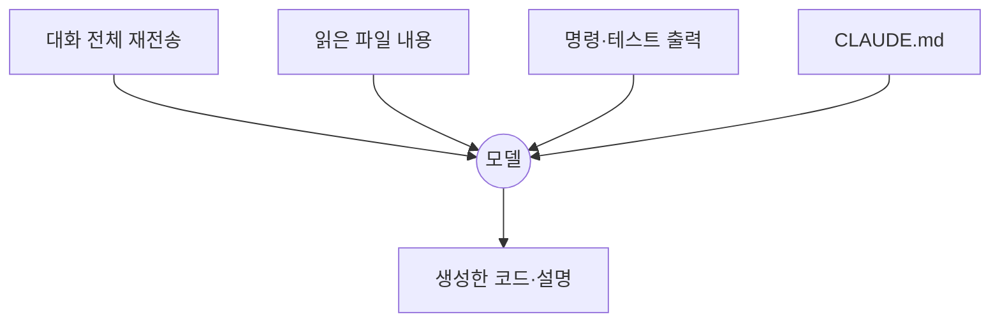

# 11장. 모델 선택과 비용 감각 — 어디에 Opus를 쓸 것인가

10장까지 왔으면 이제 매일 쓸 수 있다.

그러면 곧 다음 질문이 온다.

> 이거 얼마나 나오는 거야?

팀에 도입할 때 반드시 답해야 하는 질문이고,  
개인의 작업 습관도 여기서 갈린다.

---

## 두 가지 지불 방식

Claude Code는 두 경로로 쓸 수 있다.

| 방식 | 성격 |
|---|---|
| 구독제 | 정액. 사용량 한도 안에서 쓴다 |
| API 종량제 | 토큰 단위로 실제 사용량만큼 |

구독제를 쓰면 단가를 계산할 일이 없다.  
그래도 이 장을 읽을 이유가 있다.

한도에 걸리는 속도와 작업 습관이 정확히 비례하기 때문이다.

이하의 단가는 종량제 기준으로 감각을 잡기 위한 것이다.

---

## 모델 티어

2026년 8월 기준, 100만 토큰당 단가다.

| 모델 | 입력 | 출력 | Context |
|---|---|---|---|
| Opus 5 | $5 | $25 | 1M |
| Sonnet 5 | $3 | $15 | 1M |
| Haiku 4.5 | $1 | $5 | 200K |

⚠️ 단가와 모델 구성은 바뀐다.  
숫자 자체보다 **비율**을 기억하는 편이 유용하다.

세 가지 비율이 판단의 근거가 된다.

* 출력이 입력보다 **5배** 비싸다
* Opus는 Haiku보다 **5배** 비싸다
* Opus와 Sonnet의 차이는 **1.7배** 정도다

마지막 비율이 의외로 중요하다.

Opus와 Sonnet은 흔히 생각하는 만큼 차이 나지 않는다.  
같은 작업을 Opus가 절반의 시도로 끝낸다면 오히려 싸다.

---

## 티어별 성격

| 모델 | 강한 곳 |
|---|---|
| Opus | 복잡한 에이전틱 코딩, 긴 작업, 어려운 원인 분석 |
| Sonnet | 속도와 비용의 균형. 반복적인 구현 |
| Haiku | 단순·대량. 분류, 요약, 넓은 탐색 |

핵심은 난이도가 아니라 **작업의 길이**다.

한 번에 끝나는 일은 어느 모델이든 비슷하다.  
여러 번 왕복하는 일에서 차이가 벌어진다.

> 짧은 작업은 싼 모델로,  
> 긴 작업은 좋은 모델로.

긴 작업에서 약한 모델을 쓰면  
왕복 횟수가 늘어 결국 더 비싸진다.

---

## 토큰은 어디로 사라지는가

세션 하나에서 토큰이 쓰이는 곳은 대략 이렇다.

여기서 놓치기 쉬운 사실이 하나 있다.

🔥 매 턴마다 **대화 전체가 다시 입력된다.**

API는 상태를 갖지 않는다.  
그래서 30번째 턴은 29턴 분량을 다시 실어 보낸다.

세션이 길어지면 턴당 비용이 계속 오른다는 뜻이다.

가장 비싼 낭비 세 가지는 이렇다.

| 낭비 | 왜 비싼가 |
|---|---|
| 큰 파일 전체 읽기 | 한 번 들어오면 세션 끝까지 남는다 |
| 장황한 테스트·빌드 출력 | 수천 줄이 그대로 입력된다 |
| 목적 없이 길어진 세션 | 매 턴 전체가 재전송된다 |

---

## 프롬프트 캐싱이 계산을 바꾼다

다행히 재전송분에는 캐싱이 작동한다.

동일한 앞부분이 반복되면 캐시에서 읽는다.

| 구분 | 상대 비용 |
|---|---|
| 캐시 쓰기 | 약 1.25배 |
| 캐시 읽기 | 약 0.1배 |
| 캐시 없음 | 1배 |

읽기가 **10분의 1**이다.

이 수치가 실무에서 뜻하는 것은 하나다.

> 같은 맥락으로 이어지는 작업은  
> 세션을 유지하는 편이 싸다.

반대로 `/clear` 를 습관적으로 누르면  
매번 캐시를 새로 쓴다.

여기서 판단 기준이 생긴다.

| 상황 | 선택 |
|---|---|
| 같은 작업을 계속한다 | 유지 (캐시 이점) |
| 작업이 끝났다 | `/clear` |
| 맥락은 필요하나 대화가 길다 | `/compact` |
| Agent가 잘못된 가정을 고집한다 | `/clear` (비용보다 정확도) |

⚠️ 마지막 줄이 중요하다.

캐시를 아끼려고 오염된 Context를 끌고 가면  
틀린 작업을 저렴하게 반복하는 셈이다.

18장에서 이 판단을 자세히 다룬다.

---

## 작업별 모델 배치

실무에서 쓸 만한 배치는 이렇다.

| 작업 | 권장 | 이유 |
|---|---|---|
| 코드베이스 조사·지도 만들기 | Sonnet 또는 Haiku | 읽는 양이 많고 판단은 단순 |
| 원인 분석, 설계, 경계 찾기 | Opus | 틀리면 비용이 크다 |
| 컨벤션대로 반복 구현 | Sonnet | 정답이 명확하다 |
| 대규모 패키지 이동 | Opus | 40장에서 다룬다 |
| 테스트 작성 | Sonnet | |
| 독립 Review | Opus | 놓치면 의미가 없다 |
| 커밋 메시지, 요약 | Haiku | |

`/model` 로 세션 중에도 바꿀 수 있다.

⚠️ 다만 모델을 바꾸면 캐시는 무효화된다.  
모델은 세션 단위로 정하는 편이 낫다.

---

## 실전 절약 다섯 가지

1. **파일을 지목해서 읽힌다**
   `@` 로 경로를 주면 탐색 왕복이 줄어든다
2. **명령 출력을 줄인다**
   테스트는 `--tests` 로 좁히고, 로그는 `tail -n` 으로 자른다
3. **탐색은 Subagent에 맡긴다**
   읽은 양은 그쪽 Context에 남고 요약만 돌아온다 (47장)
4. **`CLAUDE.md` 를 짧게 유지한다**
   매 요청에 실려 간다
5. **작업이 끝나면 세션을 닫는다**
   길어진 세션의 다음 턴은 계속 비싸진다

여기에 하나 더.

`/fast` 로 켜는 빠른 모드는 출력 속도를 올려주지만  
프리미엄 단가가 붙는다.

사람이 기다리는 대화형 작업에는 값을 하고,  
백그라운드 작업에는 낭비다.

---

## 비용 최적화가 품질을 깎는 지점

절약이 손해로 바뀌는 선이 있다.

⚠️ 이 세 가지는 하지 않는다.

| 아끼려다 잃는 것 |
|---|
| 검증 단계를 생략한다 → 5장의 하한선이 무너진다 |
| 계획 없이 바로 구현시킨다 → 잘못된 방향을 싸게 완주한다 |
| 어려운 작업에 약한 모델을 쓴다 → 왕복이 늘어 더 비싸진다 |

토큰보다 비싼 것은 사람의 시간이고,  
사람의 시간보다 비싼 것은 잘못 배포된 코드다.

> 비용 감각의 목적은 절약이 아니다.  
> 같은 예산으로 더 어려운 문제를 푸는 것이다.

---

## 이 장의 핵심

* 구독제와 API 종량제 두 경로가 있고, 어느 쪽이든 작업 습관이 사용량을 결정한다
* 출력은 입력보다 5배 비싸고, Opus와 Sonnet의 차이는 1.7배 정도다
* 모델 선택 기준은 난이도보다 작업의 길이다 — 긴 작업일수록 좋은 모델이 싸다
* 매 턴마다 대화 전체가 다시 입력된다 — 긴 세션은 턴당 비용이 계속 오른다
* 캐시 읽기는 약 10분의 1이므로 같은 맥락의 작업은 세션을 유지하는 편이 싸다
* 오염된 Context를 비용 때문에 끌고 가면 틀린 작업을 저렴하게 반복한다
* 조사는 싼 모델, 판단과 Review는 좋은 모델에 배치한다
* 검증 생략·계획 생략은 절약이 아니라 손실이다
