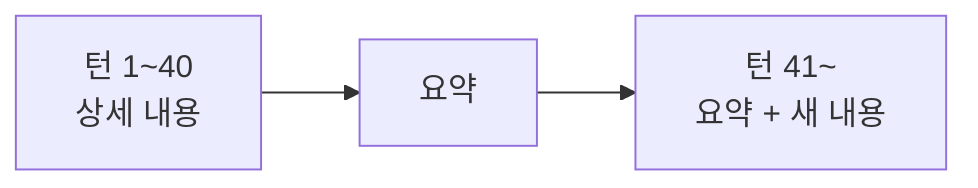

# 12장. Context가 Agent의 성능을 결정한다 — Window의 한계와 Context Rot

11장에서 토큰이 어디로 사라지는지 봤다.

그런데 Context는 비용 문제만이 아니다.

같은 Agent가 같은 작업을 하면서도  
읽힌 것에 따라 전혀 다른 판단을 한다.

이 장은 그 이유를 다룬다.

---

## Context Window는 넉넉하다

현재 모델의 Context Window는 100만 토큰 규모다.

우리 모놀리스 소스가 대략 30만 줄이라면  
이론상 상당 부분이 들어간다.

그러면 이렇게 하면 되지 않을까.

```text
프로젝트 전체를 읽고 시작해줘.
```

이 요청은 대개 결과를 나쁘게 만든다.

Window가 부족해서가 아니다.

> Context는 넣을 수 있는 양이 아니라  
> 판단에 쓰이는 재료다.

재료가 많아지면 요리가 좋아지는 것이 아니다.

---

## 다 읽히면 나빠지는 세 가지 이유

### 1️⃣ Context Pollution — 관련 없는 정보가 섞인다

Agent는 Context에 있는 것을 모두 유효한 정보로 취급한다.

```text
order/v1/OrderCancelService.kt      (2년 전, 사용 중단)
order/v2/OrderCancelFacade.kt       (현재)
```

두 파일이 함께 읽히면  
Agent는 둘 중 어느 쪽이 현재인지 모른다.

그리고 `v1` 의 패턴을 그대로 따라 코드를 쓴다.

레거시에서 이 문제가 특히 심각하다.  
죽은 코드와 산 코드가 같은 레포에 있기 때문이다.

### 2️⃣ Context Rot — 앞의 정보가 삭는다

긴 세션에서 벌어지는 현상이다.

초반에 확인한 사실이 뒤로 밀리면서  
후반의 추측에 덮인다.

```text
턴 3   "이 API는 인증이 필요 없다" (실제 코드 확인)
턴 40  "인증 처리를 추가하겠습니다"  ← 앞의 확인이 흐려짐
```

정보가 사라진 것은 아니다.  
하지만 무게가 달라진다.

⚠️ 그리고 더 흔한 형태가 있다.

한번 잘못 세운 가정이 세션 끝까지 살아남는 것이다.

Agent는 자기가 앞에서 한 말을 근거로 삼는다.  
틀린 근거도 마찬가지다.

### 3️⃣ 비용과 지연

11장에서 본 그대로다.

읽힌 것은 세션이 끝날 때까지 매 턴 재전송된다.  
불필요한 파일 하나가 끝까지 따라온다.

---

## 백엔드 개발자의 Context 함정

우리 작업에는 특유의 오염원이 있다.

| 오염원 | 문제 |
|---|---|
| 테스트 전체 실행 출력 | 수천 줄이 통째로 들어온다 |
| 애플리케이션 로그 | 대부분이 무관한 라인이다 |
| 긴 스택트레이스 | 정작 중요한 3줄이 묻힌다 |
| DB 스키마 덤프 | 테이블 200개 중 3개만 필요하다 |
| 자동 생성 코드 | QueryDSL Q클래스, 프로토콜 스텁 |
| 대용량 테스트 fixture | JSON 수천 줄 |

각각은 무해해 보인다.

문제는 한 세션에서 이것들이 겹칠 때다.

```text
> ./gradlew test
  (2,400줄)

> docker logs order-service --tail 500
  (500줄)

> psql -c "\d+ orders"
  (컬럼 60개)
```

세 명령으로 Context의 상당 부분이 채워진다.  
그리고 정작 고칠 코드는 아직 읽지 않았다.

---

## 압축은 무손실이 아니다

세션이 길어지면 자동 또는 수동으로 압축이 일어난다.

```text
/compact
```

대화를 요약해 이어가는 기능이다.  
유용하고, 동시에 손실이 있다.



요약에서 살아남는 것은 결론이고,  
사라지는 것은 세부사항이다.

🔥 그래서 압축 전에 중요한 사실은 파일로 꺼내야 한다.

```text
지금까지 확인한 사실을 tasks/point-refund.md 에 정리해줘.
그 다음 /compact 하자.
```

19장에서 이것을 Session 인계라고 부른다.

---

## Context는 예산이다

이 장의 결론은 한 줄이다.

> 읽힐 수 있는 양이 아니라,  
> 쓰기로 결정한 양이 Context다.

예산처럼 다루면 판단이 쉬워진다.

| 넣을 가치가 있는 것 | 넣지 않는 것 |
|---|---|
| 고칠 파일 | 비슷해 보이는 다른 파일 |
| 호출 흐름상 인접한 코드 | 전체 패키지 |
| 실패한 테스트의 출력 | 전체 테스트 출력 |
| 관련 로그 20줄 | 로그 500줄 |
| 현재 컨벤션 예시 1개 | 컨벤션 후보 5개 |

오른쪽 열이 전부 "혹시 필요할까 봐" 넣는 것들이다.

혹시 필요하면 그때 읽히면 된다.  
Agent는 필요할 때 다시 찾을 수 있다.

---

## 그래서 무엇을 해야 하는가

원칙은 셋이다.

1. 탐색은 넓게, 정독은 좁게 (13장)
2. 항상 필요한 규칙은 Context가 아니라 Instruction으로 (14장)
3. 세션이 길어지면 사실을 파일로 꺼낸다 (19장)

다음 장에서 첫 번째를 구체적인 작업 방식으로 만든다.

---

## 이 장의 핵심

* Context Window가 커도 전체를 읽히는 것은 나쁜 선택이다
* Agent는 Context에 있는 모든 것을 유효한 정보로 취급한다
* 죽은 코드와 산 코드가 함께 읽히면 죽은 쪽의 패턴을 따라 쓴다
* 긴 세션에서는 초반에 확인한 사실이 후반의 추측에 덮인다
* 한번 세운 잘못된 가정은 세션 끝까지 근거로 재사용된다
* 테스트 출력·로그·스키마 덤프가 백엔드 작업의 주된 오염원이다
* 압축은 결론을 남기고 세부사항을 버린다 — 압축 전에 파일로 꺼낸다
* Context는 넣을 수 있는 양이 아니라 쓰기로 결정한 예산이다
