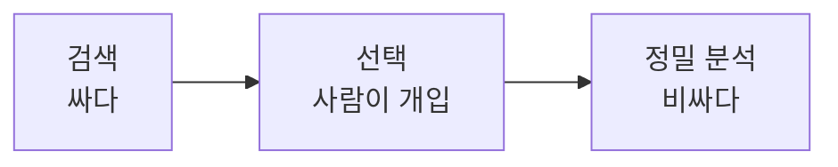
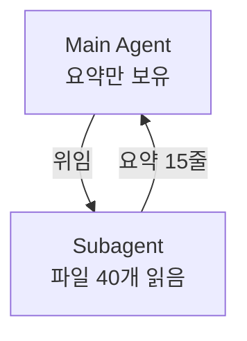

# 13장. 필요한 Context만 주기 — 검색 → 선택 → 정밀 분석

12장의 결론은 Context가 예산이라는 것이었다.

그러면 그 예산을 어떻게 쓰는가.

3장에서 한 줄로 지나간 원칙이 여기서 작업 방식이 된다.

> 탐색은 넓게, 정독은 좁게.

---

## 세 단계로 나눈다



각 단계의 비용이 다르다는 것이 핵심이다.

| 단계 | 도구 | Context 비용 |
|---|---|---|
| 검색 | Grep, Glob | 경로와 몇 줄만 |
| 선택 | 사람 또는 Agent의 판단 | 없음 |
| 정밀 분석 | Read | 파일 내용 전체 |

검색은 거의 공짜고 정독은 비싸다.  
그래서 순서를 지키는 것 자체가 절약이다.

---

## 1️⃣ 검색 — 후보를 찾는다

```text
포인트 환급과 관련된 코드를 찾아줘.
파일을 읽지는 말고 경로와 매칭된 라인만 보여줘.
```

두 번째 문장이 이 단계를 지킨다.

```text
> grep -rn "refundPoint\|PointRefund" --include=*.kt

  point/PointRefundService.kt:42
  point/PointRefundListener.kt:18
  order/OrderCancelFacade.kt:88
  payment/PaymentCancelHandler.kt:61
  admin/AdminOrderService.kt:203
```

다섯 곳이 나왔다.  
여기까지 들어온 Context는 다섯 줄이다.

---

## 2️⃣ 선택 — 여기서 사람이 개입한다

가장 값싸고 효과가 큰 개입 지점이다.

```text
admin/AdminOrderService.kt 는 이번 작업 범위가 아니야.
나머지 네 곳의 호출 관계만 파악해줘.
```

한 줄로 20%를 걷어냈다.

이 판단은 사람이 훨씬 잘한다.  
우리는 프로젝트의 맥락을 알고 있다.

⚠️ 반대로 이 단계를 생략하면  
Agent는 다섯 파일을 전부 읽는다.

"혹시 관련 있을까 봐" 는 Agent의 기본값이다.

---

## 3️⃣ 정밀 분석 — 좁게 읽힌다

이제 읽힌다.

```text
@order/OrderCancelFacade.kt 의 cancel 메서드와
@point/PointRefundListener.kt 를 읽고
환급이 몇 번 일어나는지 확인해줘.
```

`@` 로 지목하면 탐색 왕복이 사라진다.

파일이 크면 범위를 좁힌다.

```text
OrderCancelFacade 전체는 800줄이야.
cancel 관련 메서드만 읽어줘.
```

---

## 나쁜 요청과 좋은 요청

같은 목적, 다른 Context 비용.

**❌ 나쁜 요청**

```text
주문 도메인 전체를 파악하고 포인트 이중 환급 버그를 찾아줘.
```

Agent는 `order` 패키지를 훑기 시작한다.  
파일 40개가 Context에 들어온다.

**✅ 좋은 요청**

```text
포인트 환급 호출 지점을 grep으로 찾아줘. (읽지는 말고)
그중 주문 취소 경로에 해당하는 것만 골라서 읽어줘.
```

같은 답에 도달하지만 Context 사용량이 한 자릿수 배 차이 난다.

---

## 명령 출력을 잘라내는 습관

백엔드 작업에서 가장 큰 오염원은 코드가 아니라 출력이다.

12장에서 본 세 가지를 이렇게 줄인다.

| 대신 | 이렇게 |
|---|---|
| `./gradlew test` | `./gradlew test --tests '*OrderCancel*'` |
| `docker logs svc` | `docker logs svc --tail 50` |
| `psql -c "\d+ orders"` | 필요한 컬럼만 질문 |
| 전체 스택트레이스 | `Caused by` 부분만 |

Agent에게 이 습관을 넘기는 방법도 있다.

`CLAUDE.md` 에 한 줄 적어두는 것이다.

```markdown
- 테스트는 항상 `--tests` 로 범위를 좁혀 실행한다
- 로그는 `--tail` 로 최근 50줄만 확인한다
```

14장에서 이런 규칙을 모아 쓴다.

---

## 큰 파일을 다루는 방법

레거시에는 1,000줄짜리 Service가 있다.

세 가지 방법이 있다.

1️⃣ **구간을 지정한다**

```text
OrderService.kt 의 400~520줄만 읽어줘.
```

2️⃣ **구조만 먼저 본다**

```text
OrderService.kt 의 public 메서드 목록과 각각의 역할을
한 줄씩 정리해줘. 본문은 읽지 마.
```

3️⃣ **호출 흐름으로 접근한다**

```text
cancel() 에서 시작해서 실제로 실행되는 메서드만 따라가줘.
```

세 번째가 가장 효율적이다.  
파일 단위가 아니라 실행 경로 단위로 읽는다.

---

## 탐색을 Subagent에 넘긴다

읽을 양이 많을 때 쓰는 방법이다.

```text
Subagent로 이 모놀리스의 주문 관련 모듈 구조를 조사하고
요약만 가져와줘.
```

효과가 두 가지다.



* Main Agent의 Context가 깨끗하게 유지된다
* 조사에 쓴 토큰이 이후 턴에 재전송되지 않는다

두 번째가 특히 크다.  
Subagent의 Context는 그 작업이 끝나면 사라진다.

50장에서 자세히 다룬다.

---

## 세션을 용도로 나눈다

Context 관리의 가장 단순한 방법이 남아 있다.

세션 하나에 한 가지 목적만 담는 것이다.

| 세션 | 담기는 것 |
|---|---|
| 조사 세션 | 코드 구조, 호출 흐름 → 문서로 출력 |
| 구현 세션 | 그 문서 + 고칠 파일 |
| Review 세션 | Diff + 규칙 |

조사 세션의 산출물이 문서라면  
구현 세션은 파일 40개가 아니라 문서 한 장으로 시작할 수 있다.

19장의 Session 인계가 이 방식이고,  
66장의 12주짜리 작업이 이렇게 진행된다.

---

## 이 장의 핵심

* 검색은 거의 공짜고 정독은 비싸다 — 순서를 지키는 것이 절약이다
* 검색 단계에서는 "읽지는 말고" 를 명시한다
* 후보를 걷어내는 선택 단계가 가장 값싼 개입 지점이다
* "혹시 관련 있을까 봐 전부 읽기" 는 Agent의 기본값이다
* `@` 로 파일을 지목하면 탐색 왕복이 사라진다
* 테스트·로그·스키마 출력은 범위를 좁혀 실행한다
* 큰 파일은 파일 단위가 아니라 실행 경로 단위로 읽힌다
* 탐색을 Subagent에 넘기면 그 토큰이 이후 턴에 재전송되지 않는다
* 세션 하나에 한 가지 목적만 담는다
