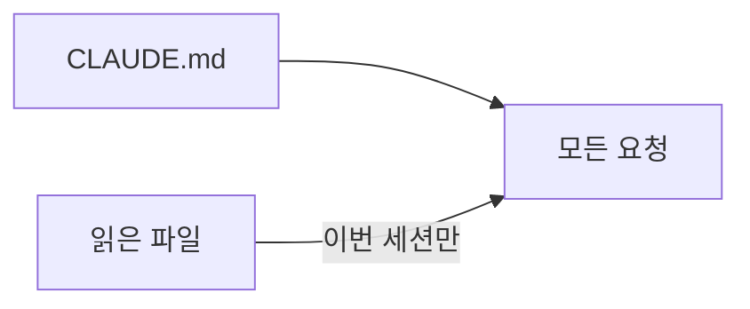

# 14장. CLAUDE.md란 무엇인가 — Agent가 항상 알아야 하는 것

12장과 13장은 **이번 작업에 필요한 것**을 다뤘다.

이제 반대쪽이다.

작업이 무엇이든 항상 알아야 하는 것.  
그것이 `CLAUDE.md` 다.

---

## 매 요청에 함께 실려 가는 문서

`CLAUDE.md` 의 성격은 위치가 아니라 이 사실에서 나온다.



Context는 세션이 끝나면 사라진다.  
`CLAUDE.md` 는 다음 세션에도 실려 간다.

여기서 두 가지가 따라온다.

* 매번 설명하기 지친 것은 여기에 적는다
* 여기 적은 것은 매번 비용을 낸다

두 번째 때문에 15장이 필요해진다.

---

## 어디에 두는가

프로젝트 루트에 두는 것이 기본이다.

```text
order-service/
  CLAUDE.md              ← 프로젝트 전체 규칙
  .claude/
    settings.json        ← 권한 (7장)
  src/
```

이 파일은 Git에 커밋한다.  
팀 공용 문서다.

개인적인 취향은 여기 적지 않는다.  
그것은 개인 설정으로 분리한다.

하위 디렉터리에도 둘 수 있다.  
16장에서 계층화를 다룬다.

---

## 무엇을 적는가

여섯 종류다.

### 1️⃣ 실행 명령

Agent가 가장 자주 필요하고, 추측하면 가장 자주 틀린다.

```markdown
## 개발 명령

- 빌드: `./gradlew build`
- 전체 테스트: `./gradlew test` (약 4분)
- 단일 테스트: `./gradlew test --tests '*OrderCancelTest'`
- 린트: `./gradlew ktlintCheck`
- 로컬 실행: `docker compose up -d` 후 `./gradlew bootRun`
```

소요 시간을 적어두면 Agent의 선택이 달라진다.  
4분짜리 전체 테스트를 무턱대고 돌리지 않는다.

### 2️⃣ 구조

전체 트리가 아니라 **어디에 무엇이 있는지**다.

```markdown
## 구조

- `order/` 주문 도메인 (현재 개발 중심)
- `payment/` 결제. 외부 PG 연동 포함
- `point/` 포인트 적립·환급
- `common/` 공통 유틸. 새 코드 추가 전 여기 먼저 확인
- `legacy/` 사용 중단. 읽기 전용
```

마지막 두 줄이 실제 가치다.

12장의 Context Pollution을 문서로 막는 것이다.

### 3️⃣ 아키텍처 규칙

호출 방향과 계층 경계를 적는다.

```markdown
## Architecture

Controller → Facade → Service → Repository

- Service가 다른 도메인의 Service를 직접 호출하지 않는다
  도메인 간 조합은 Facade에서 한다
- Repository는 자기 도메인의 테이블만 접근한다
- 도메인 간 조회는 필요하면 Facade에서 각각 호출해 조합한다
```

🔥 이 규칙이 8부의 경계 작업 전체의 출발점이 된다.

지금 문장으로 적어둔 것을  
42장에서 의존성 테스트로 강제하게 된다.

### 4️⃣ 코딩 컨벤션

Agent가 코드에서 유추할 수 없는 것만 적는다.

```markdown
## Convention

- 금액은 `Long`, 원 단위. `BigDecimal`을 쓰지 않는다
- 시간은 `Instant`. `LocalDateTime`은 새로 쓰지 않는다
- 신규 코드는 `order/v2` 구조를 따른다 (`v1`은 마이그레이션 대상)
- 테스트 이름은 한글 백틱 (`fun \`주문 취소 시 ...\`()`)
```

8장에서 본 그 판단이다.

레거시에는 두 세대의 컨벤션이 함께 있고,  
어느 쪽이 현재인지는 사람만 안다.

### 5️⃣ 도메인 용어

백엔드 프로젝트에는 반드시 있다.

```markdown
## 도메인 용어

- 취소(cancel): 결제 완료 후 되돌리는 것
- 철회(withdraw): 결제 완료 전 주문을 없애는 것
- 부분 취소: 주문의 일부 상품만 취소. 포인트는 비례 배분
- 포인트 환급: 사용한 포인트를 되돌려주는 것 (적립과 구분)
```

이 네 줄이 없으면 Agent는  
`cancel` 과 `withdraw` 를 섞어 쓴다.

우리 팀도 신규 입사자에게 이걸 설명한다.  
같은 문서를 쓰는 것이다.

### 6️⃣ 금지사항

8장에서 손으로 썼던 그 목록이다.

```markdown
## 절대 하지 말 것

- 운영·스테이징 DB에 접속하지 않는다
- 마이그레이션을 실행하지 않는다 (작성까지만)
- `legacy/` 의 동작을 변경하지 않는다
- 외부 PG·알림 API를 실제로 호출하지 않는다
- 테스트를 삭제하거나 `@Disabled` 를 추가하지 않는다
```

마지막 줄은 3장에서 본 위험한 재시도를 막는다.

---

## 여기에 적지 않는 것

경계가 흐려지기 쉬운 부분이다.

| 적지 않는다 | 어디로 |
|---|---|
| 이번 작업의 목표 | 작업 지시 (10장) |
| 특정 버그의 원인 분석 | Task 문서 (19장) |
| 반복 절차 (API 추가 순서 등) | Skill (47장) |
| 무조건 실행해야 하는 검사 | Hook (49장) |
| 코드에서 바로 보이는 사실 | 아무 데도 (15장) |

⚠️ 세 번째와 네 번째를 여기 적으면  
`CLAUDE.md` 가 절차서가 되어 길어진다.

기준은 5장에서 정한 그대로다.

> 항상 알아야 하는 것 → `CLAUDE.md`  
> 필요할 때 수행하는 절차 → Skill  
> 무조건 실행되어야 하는 것 → Hook

---

## 지금 만들 수 있는 한 장

앞의 여섯 절을 합치면 이 정도가 된다.

```markdown
# order-service

Kotlin + Spring Boot 모놀리스. 주문·결제·포인트.

## 개발 명령
## 구조
## Architecture
## Convention
## 도메인 용어
## 절대 하지 말 것
```

한 화면에서 두 화면 사이.

이것이 목표 분량이다.  
이유는 다음 장에서 다룬다.

---

## 이 장의 핵심

* `CLAUDE.md` 는 모든 요청에 함께 실려 가는 유일한 문서다
* Context는 세션과 함께 사라지고, 이 문서는 남는다
* 팀 공용 문서이므로 Git에 커밋한다
* 적을 것은 실행 명령 · 구조 · 아키텍처 · 컨벤션 · 도메인 용어 · 금지사항 여섯 가지다
* 테스트 소요 시간을 적어두면 Agent의 선택이 달라진다
* "사용 중단" 표시가 Context Pollution을 문서로 막는다
* 아키텍처 규칙은 나중에 의존성 테스트로 강제할 대상이 된다
* 도메인 용어는 신규 입사자에게 설명하던 것과 같다
* 반복 절차는 Skill로, 강제 검사는 Hook으로 분리한다
