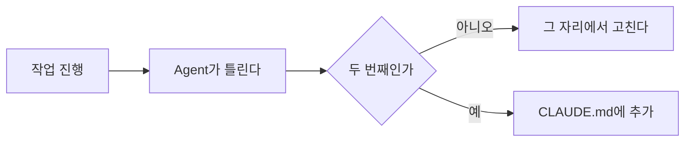

# 15장. 좋은 CLAUDE.md 만들기 — 짧게, 자주 틀리는 것만

14장에서 무엇을 적는지 봤다.

이 장은 그 반대다.

무엇을 적지 않을지, 그리고 어떻게 적을지.

실무에서 차이를 만드는 쪽은 이쪽이다.

---

## 긴 CLAUDE.md가 나쁜 두 가지 이유

### 1️⃣ 매 요청에 비용을 낸다

`CLAUDE.md` 가 3,000줄이면  
그 3,000줄이 모든 요청에 실려 간다.

11장에서 본 구조 그대로다.  
캐싱이 완화해주지만 공짜는 아니다.

### 2️⃣ 지시가 희석된다

이쪽이 더 심각하다.

규칙이 100개면 Agent는 100개를 동등하게 취급한다.  
그중 진짜 중요한 5개가 묻힌다.

```text
규칙 5개  → 대체로 지킨다
규칙 50개 → 절반쯤 지킨다
규칙 200개 → 무엇을 지켰는지 알 수 없다
```

⚠️ 규칙을 늘리는 것으로 통제를 강화할 수 없다.

이 사실이 이 장 전체의 전제다.

---

## 코드에 이미 있는 것을 반복하지 않는다

가장 흔한 낭비다.

**❌ 적을 필요 없는 것**

```markdown
- Spring Boot를 사용한다
- JPA로 데이터에 접근한다
- Controller는 @RestController 를 붙인다
- Repository는 JpaRepository 를 상속한다
- 테스트는 JUnit5를 쓴다
```

전부 코드를 열면 3초 안에 알 수 있다.

Agent는 이런 것을 놓치지 않는다.  
이건 사람이 신입에게 쓰는 문서의 습관이 남은 것이다.

**✅ 적어야 하는 것**

```markdown
- `common/util` 에 이미 있는 것을 다시 만들지 않는다
  (특히 날짜·금액 포맷팅, ID 생성)
- `@Transactional` 은 Facade 계층에만 붙인다
  Service에 붙어 있는 기존 코드는 마이그레이션 대상
```

기준은 하나다.

> 코드를 읽어서 알 수 있으면 적지 않는다.  
> 코드를 읽어도 알 수 없으면 적는다.

두 번째 범주가 무엇인지 정리하면 이렇다.

| 코드로 알 수 없는 것 |
|---|
| 두 방식 중 어느 쪽이 현재 표준인가 |
| 왜 이렇게 되어 있는가 |
| 무엇이 사라질 예정인가 |
| 무엇을 건드리면 안 되는가 |
| 우리 팀에서 이 단어가 뜻하는 것 |

---

## Agent가 자주 틀리는 것만 남긴다

그러면 무엇을 적어야 할지 어떻게 아는가.

답은 예측이 아니라 관찰이다.



🔥 한 번 틀린 것은 규칙으로 만들지 않는다.

한 번은 우연일 수 있다.  
두 번이면 패턴이다.

이 기준이 없으면 `CLAUDE.md` 는  
세션마다 한 줄씩 늘어나 결국 아무도 읽지 않게 된다.

Kotlin + Spring 레거시에서 실제로 반복되는 항목들이다.

```markdown
- 새 예외를 만들지 말고 `common/exception` 의 기존 예외를 쓴다
- 테스트에서 `@SpringBootTest` 를 새로 추가하지 않는다
  기존 `IntegrationTestBase` 를 상속한다
- 응답 DTO에 엔티티를 직접 담지 않는다
```

셋 다 Agent가 한 번쯤 틀리고,  
코드만 봐서는 판단이 어려운 것들이다.

---

## 명확하게 쓴다

같은 규칙도 문장에 따라 지켜지는 정도가 다르다.

| ❌ 모호한 규칙 | ✅ 명확한 규칙 |
|---|---|
| 코드를 깔끔하게 작성한다 | 한 메서드는 40줄을 넘지 않는다 |
| 적절히 테스트를 추가한다 | 새 public 메서드에는 단위 테스트를 추가한다 |
| 성능을 고려한다 | 반복문 안에서 Repository를 호출하지 않는다 |
| 트랜잭션을 주의한다 | 외부 API 호출을 `@Transactional` 안에서 하지 않는다 |
| 기존 스타일을 따른다 | 신규 파일은 `order/v2` 구조를 따른다 |

왼쪽 열은 사실 규칙이 아니다.  
덕목이다.

덕목은 Agent가 이미 가지고 있다.  
그래서 아무 효과가 없다.

판정 가능한 문장이어야 규칙이 된다.

10장의 완료 조건과 같은 기준이다.

> Agent가 스스로 위반 여부를 판단할 수 있는가.

---

## 이유를 한 줄 붙인다

이유가 있는 규칙은 응용된다.

**이유 없는 규칙**

```markdown
- 외부 API 호출을 `@Transactional` 안에서 하지 않는다
```

**이유 있는 규칙**

```markdown
- 외부 API 호출을 `@Transactional` 안에서 하지 않는다
  (커넥션을 물고 대기해서 커넥션 풀이 마른 장애가 있었다)
```

두 번째를 읽은 Agent는  
비슷한 상황도 알아서 피한다.

Redis 호출, 파일 업로드, 메시지 발행에도 적용한다.

한 줄 추가가 규칙 세 개를 대신한다.

---

## 강조는 인플레이션을 일으킨다

여기서 실무자가 가장 많이 실패한다.

Agent가 규칙을 어기면 이렇게 하고 싶어진다.

```markdown
- **반드시** 테스트를 실행한다
- **절대** 엔티티를 직접 반환하지 마라
- **중요:** 트랜잭션 경계를 지켜라
- ⚠️ **매우 중요:** 마이그레이션을 실행하지 마라
- 🚨 **경고:** legacy 패키지를 수정하지 마라
```

처음 한두 개는 효과가 있다.

다섯 개가 되면 강조가 정보를 잃는다.  
전부 중요하면 아무것도 중요하지 않다.

⚠️ 부작용이 하나 더 있다.

과한 강조는 **과잉 반응**을 만든다.  
"반드시 테스트를 실행한다" 를 강하게 써두면  
한 줄 주석을 고친 뒤에도 4분짜리 전체 테스트를 돌린다.

원칙은 이렇다.

> 필요한 것을 평범한 문장으로 쓴다.  
> 강조는 진짜 위험한 두세 개에만 남긴다.

그리고 기억할 것이 있다.

문장으로 막아야 하는 것과  
설정으로 막아야 하는 것은 다르다.

4장에서 본 그 차이다.

| 위험 | 수단 |
|---|---|
| 컨벤션 위반 | 문장 |
| 실수하면 아쉬운 일 | 문장 + Hook (46장) |
| 되돌릴 수 없는 일 | 권한 `deny` (7장) |

🔥 `CLAUDE.md` 에 대문자로 세 번 써도  
운영 DB 접속은 막히지 않는다.

막고 싶으면 `settings.json` 에 적어야 한다.

---

## 분량 기준

숫자로 정해두면 관리가 쉽다.

| 항목 | 기준 |
|---|---|
| 전체 | 스크롤 두 번 이내 |
| 한 규칙 | 한두 줄 |
| 섹션 수 | 6~8개 |

이 기준을 넘어가려 할 때 선택지는 셋이다.

1. 이유가 사라진 오래된 규칙을 지운다 (16장)
2. 하위 디렉터리로 계층화한다 (16장)
3. 절차라면 Skill로 옮긴다 (44장)

늘리는 것보다 이 셋 중 하나를 고르는 편이 거의 항상 낫다.

---

## 이 장의 핵심

* 긴 `CLAUDE.md` 는 비용을 늘리고 지시를 희석시킨다
* 규칙을 늘리는 것으로 통제를 강화할 수 없다
* 코드를 읽어서 알 수 있는 것은 적지 않는다
* 무엇이 현재 표준인지, 무엇이 사라질 예정인지는 코드로 알 수 없다 — 그것을 적는다
* 한 번 틀린 것은 그 자리에서 고치고, 두 번 틀린 것만 규칙으로 만든다
* 덕목은 규칙이 아니다 — 판정 가능한 문장이어야 규칙이 된다
* 이유를 한 줄 붙이면 규칙이 응용된다
* 강조를 남발하면 강조가 정보를 잃고, 과잉 반응을 부른다
* 되돌릴 수 없는 일은 문장이 아니라 권한 설정으로 막는다
