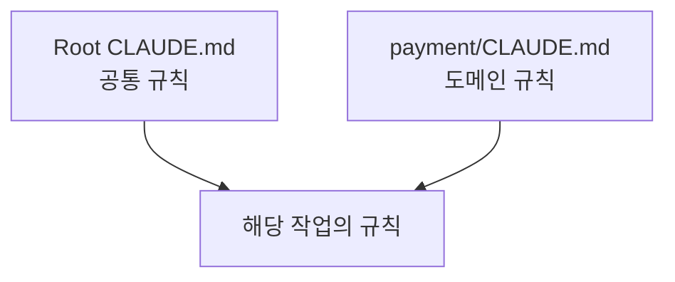
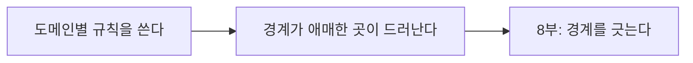
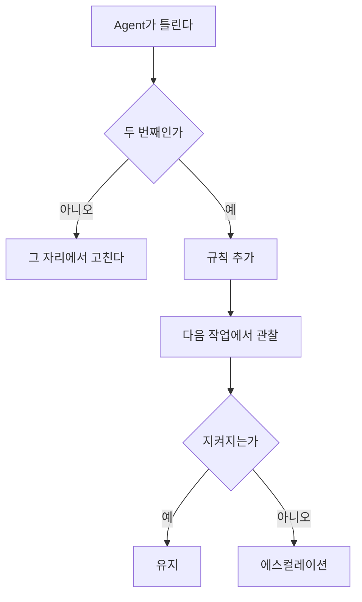

# 16장. 계층화와 개선 루프 — Root · 모듈 · 도메인, 그리고 규칙의 수명

15장에서 분량 기준을 정했다.

스크롤 두 번.

그런데 모놀리스에서 이 기준은 곧 깨진다.  
도메인이 열 개면 도메인별 규칙도 열 벌이다.

여기서 두 가지가 필요해진다.

계층화와, 규칙을 버리는 방법.

---

## 계층화 — 규칙을 코드 옆에 둔다

`CLAUDE.md` 는 여러 위치에 둘 수 있다.

```text
order-service/
  CLAUDE.md                    ← 프로젝트 전체
  src/main/kotlin/
    order/
      CLAUDE.md                ← 주문 도메인
    payment/
      CLAUDE.md                ← 결제 도메인
    legacy/
      CLAUDE.md                ← 손대지 않는 영역
```

하위 파일은 상위를 대체하지 않는다.  
더해진다.



결제 코드를 고칠 때는 두 파일이 함께 유효하다.

---

## 무엇을 어디에 두는가

기준은 **적용 범위**다.

| 위치 | 담는 것 | 예 |
|---|---|---|
| Root | 모든 코드에 적용 | 빌드 명령, 계층 방향, 금지사항 |
| 도메인 | 그 도메인만 | 그 도메인의 불변식, 외부 연동 주의점 |
| 특수 영역 | 그 디렉터리만 | 손대지 말 것, 자동 생성 |

도메인별 파일의 실제 예시를 보면 감이 온다.

**`payment/CLAUDE.md`**

```markdown
# 결제 도메인

## 절대 규칙

- 결제 요청은 멱등키(`idempotencyKey`) 없이 만들지 않는다
- PG 응답 코드는 절대 하드코딩하지 않는다 (`PgResultCode` 사용)
- 결제 상태 전이는 `PaymentStatus.canTransitTo()` 를 통과해야 한다

## 로컬 테스트

- PG는 `MockPgClient` 로만 테스트한다
- 실제 PG 샌드박스 호출은 사람이 수동으로만 한다
```

**`legacy/CLAUDE.md`**

```markdown
# legacy — 읽기 전용

이 디렉터리의 코드는 동작을 변경하지 않는다.

- 참고용으로 읽는 것은 괜찮다
- 여기 있는 패턴을 새 코드에 따라 쓰지 않는다
- 버그를 발견하면 수정하지 말고 보고한다
```

⚠️ 두 번째 파일이 12장의 Context Pollution을  
구조적으로 막는 장치다.

Agent가 그 디렉터리를 읽을 때마다  
"따라 쓰지 마라" 를 함께 읽는다.

---

## 계층화는 경계 선언의 시작이다

여기서 이 책의 목적지와 연결된다.

도메인별 `CLAUDE.md` 를 쓰려고 하면  
반드시 이 질문이 나온다.

```text
결제 도메인의 규칙이 뭐지?
그 규칙은 어디까지 적용되지?
주문 도메인이 결제 코드를 직접 호출하고 있는데,
이건 누구 규칙을 따라야 하지?
```

🔥 이 질문에 답하는 과정이 곧 경계를 찾는 과정이다.



38장에서 "코드에서 경계를 찾기" 를 다루는데,  
그 작업의 가장 값싼 예비 조사가 이것이다.

파일을 옮기지 않고, 문서만 써보면서  
경계가 성립하는지 확인한다.

---

## 규칙에는 수명이 있다

계층화가 분량 문제의 절반을 해결한다.

나머지 절반은 버리는 일이다.

규칙은 세 가지 이유로 죽는다.

| 죽는 이유 | 예 |
|---|---|
| 원인이 사라졌다 | `v1` 패키지를 다 지웠는데 규칙은 남아 있다 |
| 코드가 대신 막는다 | 의존성 테스트를 넣었는데 문장도 남아 있다 |
| 틀린 규칙이었다 | 한 번의 실수를 일반화했다 |

두 번째가 특히 흔하고, 특히 해롭다.

Hook이나 테스트로 강제한 규칙을 문장으로도 남겨두면  
Agent는 같은 것을 두 번 확인한다.

⚠️ 그리고 지켜지지 않는 규칙이 하나라도 있으면  
다른 규칙의 권위도 함께 떨어진다.

> 지킬 수 없는 규칙은  
> 지켜야 할 규칙의 신뢰를 깎는다.

---

## 개선 루프

규칙을 늘리고 줄이는 과정을 루프로 만든다.



15장의 두 번 규칙에 뒷단이 붙은 형태다.

핵심은 마지막 갈래다.

**규칙을 적었는데도 지켜지지 않을 때 무엇을 하는가.**

여기서 규칙을 더 강하게 쓰는 것은 답이 아니다.  
15장에서 본 강조의 인플레이션이 시작된다.

대신 수단을 올린다.

```text
문장으로 적는다          (CLAUDE.md)
      ↓ 그래도 어긴다
절차로 만든다            (Skill · 45장)
      ↓ 그래도 어긴다
자동으로 실행시킨다      (Hook · 47장)
      ↓ 되돌릴 수 없는 일이다
아예 막는다              (Permission · 7장)
```

같은 규칙을 네 번 강조하는 것보다  
한 단계 위의 수단으로 올리는 편이 항상 낫다.

60장에서 이것을 하네스 개선이라고 부른다.

---

## 언제 점검하는가

정기 점검은 대개 지켜지지 않는다.  
계기에 붙여두는 편이 현실적이다.

| 계기 | 할 일 |
|---|---|
| 같은 실수를 두 번 봤다 | 규칙 추가 |
| 패키지·모듈 구조를 바꿨다 | 구조 섹션 갱신 |
| 마이그레이션을 완료했다 | 관련 규칙 삭제 |
| 새 팀원이 합류했다 | 사람이 읽어보고 틀린 곳 지적 |
| Agent가 규칙을 대놓고 어겼다 | 에스컬레이션 판단 |

네 번째가 의외로 효과적이다.

`CLAUDE.md` 는 사람에게도 읽히는 문서다.  
신규 입사자가 읽고 이해가 안 되는 부분은  
Agent도 이해하지 못한다.

---

## 점검은 Agent에게, 판단은 사람이

목록을 뽑는 일은 위임할 수 있다.

```text
CLAUDE.md 에서 지금 코드베이스와 맞지 않는 항목을 찾아줘.
사라진 클래스를 언급하는 규칙, 테스트로 이미 강제되는 규칙,
코드만 봐도 아는 규칙. 수정은 하지 말고 목록만.
```

⚠️ 삭제 판단은 사람이 한다.

Agent는 규칙이 왜 생겼는지 모른다.  
장애 하나 때문에 생긴 규칙을 "코드로 보이니 불필요" 로 분류한다.

15장에서 이유를 한 줄 붙이라고 한 것이 여기서도 작동한다.

---

## 이 장의 핵심

* 하위 `CLAUDE.md` 는 상위를 대체하지 않고 더해진다
* 배치 기준은 적용 범위다 — 모든 코드 / 한 도메인 / 한 디렉터리
* `legacy/CLAUDE.md` 는 Context Pollution을 구조적으로 막는 장치다
* 도메인별 규칙을 쓰려 하면 경계가 애매한 곳이 드러난다 — 8부의 예비 조사다
* 규칙은 원인이 사라지거나, 코드가 대신 막거나, 틀렸을 때 죽는다
* 지킬 수 없는 규칙은 지켜야 할 규칙의 신뢰를 깎는다
* 규칙이 안 지켜지면 강조를 올리지 말고 수단을 올린다 — 문장 → Skill → Hook → 권한
* 점검은 정기 일정보다 계기에 붙인다
* 규칙 삭제 판단은 사람이 한다 — Agent는 규칙이 생긴 이유를 모른다
