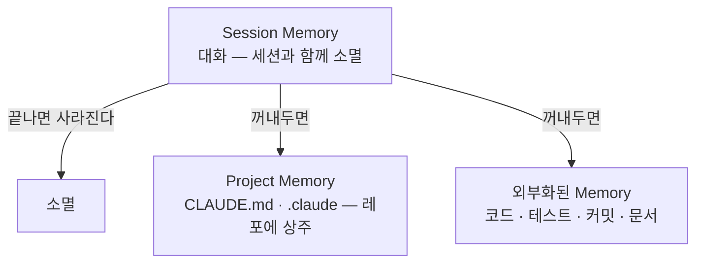
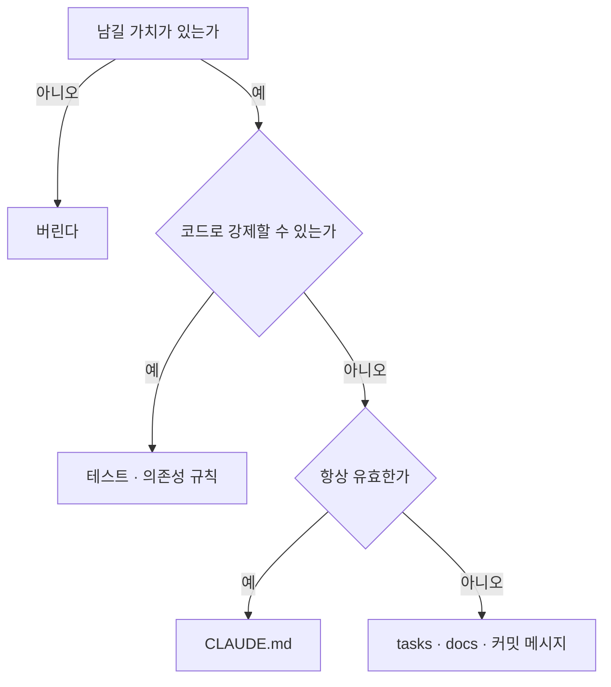

# 17장. Agent의 Memory란 무엇인가 — 기억시킬 것과 기억시키지 않을 것

3부에서 두 가지를 나눴다.

이번 작업에만 필요한 것은 Context,  
언제나 필요한 것은 `CLAUDE.md`.

그런데 그 사이에 끼는 것이 있다.

```text
이 버그의 원인은 이벤트 리스너 중복이었다
결제 취소 흐름은 Facade에서 시작한다
v1 마이그레이션은 3분기까지 끝내기로 했다
```

이번 세션이 끝나면 사라지기엔 아깝고,  
영구 규칙으로 삼기엔 맞지 않는 것들이다.

---

## 모델은 기억하지 않는다

먼저 사실 하나를 정확히 해두자.

LLM은 대화를 기억하지 않는다.

```text
턴 1  → [질문]                        을 보낸다
턴 2  → [질문, 답변, 질문]              을 보낸다
턴 3  → [질문, 답변, 질문, 답변, 질문]   을 보낸다
```

11장에서 본 그 구조다.

기억처럼 보이는 것은  
**매번 다시 실어 보내고 있기 때문**이다.

그래서 Agent의 Memory는 이렇게 정의된다.

> 다음 요청에 다시 실을 수 있도록  
> 대화 밖에 남겨둔 것.

기억이 아니라 저장이고,  
저장의 형태는 결국 파일이다.

---

## 세 층으로 나뉜다



| 층 | 수명 | 예 |
|---|---|---|
| Session | 세션 종료까지 | 지금까지의 대화, 읽은 파일 |
| Project | 레포와 함께 | `CLAUDE.md`, `.claude/settings.json` |
| 외부화 | 코드와 함께 | 테스트, 커밋 메시지, `docs/`, `tasks/` |

세 번째가 이 장의 주제다.

---

## 코드 자체가 가장 강한 Memory다

백엔드 개발자에게는 익숙한 이야기다.

문서로 적힌 규칙과  
테스트로 고정된 규칙 중 어느 쪽이 오래 사는가.

```markdown
# CLAUDE.md
- 주문 취소 시 포인트 환급은 한 번만 발생한다
```

```kotlin
@Test
fun `주문 취소 시 포인트 환급은 한 번만 발생한다`() { ... }
```

두 번째가 압도적으로 강하다.

이유는 셋이다.

* 어기면 즉시 알려준다
* 사람도 Agent도 동일하게 구속된다
* 코드가 바뀌면 함께 실패해서 갱신을 강제한다

🔥 그래서 백엔드 프로젝트에서 가장 좋은 Memory는  
테스트다.

23장과 36장에서 이 관점을 확장한다.

문서로 남길지 테스트로 남길지 고민된다면  
테스트로 남길 수 있는지부터 확인한다.

---

## 기억시킬 것과 기억시키지 않을 것

| 남긴다 | 남기지 않는다 |
|---|---|
| 아키텍처와 계층 규칙 | 일회성 디버깅 로그 |
| 개발·테스트 명령 | 이번 세션의 중간 상태 |
| 반복되는 주의사항 | 이미 폐기된 구현 계획 |
| 도메인 용어 | 코드에서 바로 보이는 사실 |
| 결정과 그 이유 | 검토했다가 버린 대안의 세부 |
| 확인된 사실 (검증 방법 포함) | 확인하지 않은 추측 |

마지막 줄이 가장 중요하다.

⚠️ 추측을 사실처럼 남기면  
12장의 Context Rot이 **영구화**된다.

```markdown
# ❌ 위험
결제 취소는 항상 비동기로 처리된다

# ✅ 안전
결제 취소는 PaymentCancelHandler에서 이벤트로 처리된다
(2026-08 확인. OrderCancelFacade.cancel() 기준)
```

두 번째는 틀렸을 때 반증할 수 있다.  
첫 번째는 계속 인용되며 살아남는다.

---

## 어디에 남길 것인가

판단은 두 질문으로 끝난다.



세 갈래의 실제 모습은 이렇다.

**테스트로**

```kotlin
@Test
fun `외부 API 호출은 트랜잭션 밖에서 일어난다`() { ... }
```

**`CLAUDE.md` 로**

```markdown
- 외부 API 호출을 `@Transactional` 안에서 하지 않는다
  (커넥션 풀 고갈 장애 이력)
```

**작업 문서로**

```markdown
# tasks/point-refund-fix.md
## 확인한 사실
- 환급 경로는 2개 (Facade 직접 호출 + 이벤트 리스너)
- 이벤트 방식이 3개월 전 도입 (a3f9c21)
```

세 번째는 작업이 끝나면 폐기되거나,  
살아남을 가치가 있으면 위 두 층으로 승격된다.

---

## 승격과 폐기

작업 문서를 계속 쌓아두면 그것도 부채가 된다.

작업이 끝나면 셋 중 하나를 고른다.

| 판단 | 처리 |
|---|---|
| 계속 지켜야 할 규칙이다 | `CLAUDE.md` 로 승격 |
| 동작으로 고정할 수 있다 | 테스트로 승격 |
| 이 작업에만 필요했다 | 삭제 |

⚠️ 승격하지 않고 그냥 두는 것이 최악이다.

세 달 뒤에 남아 있는 `tasks/*.md` 는  
사실인지 아닌지 아무도 확신하지 못하는 문서가 된다.

16장에서 규칙에 수명이 있다고 했다.  
작업 문서에는 더 짧은 수명이 있다.

---

## 커밋 메시지는 무료 Memory다

가장 저평가된 저장소다.

```bash
git commit -m "fix: 주문 취소 시 포인트 이중 환급 수정

이벤트 기반 환급(a3f9c21) 도입 시 제거되지 않은
Facade의 직접 호출을 제거."
```

이 메시지는 세 가지 성질을 갖는다.

* 코드와 함께 영구히 남는다
* 해당 코드를 볼 때 `git log` 로 찾을 수 있다
* 별도 관리 비용이 0이다

Agent도 `git log` 를 읽는다.  
9장에서 판단을 뒤집은 그 방법이다.

> 코드 옆에 붙어 있는 설명이  
> 가장 오래 살아남는다.

---

## 이 장의 핵심

* 모델은 기억하지 않는다 — 매번 다시 실어 보낼 뿐이다
* Agent의 Memory는 대화 밖에 남겨둔 파일이다
* 층은 셋이다 — Session(소멸), Project(레포), 외부화(코드와 함께)
* 백엔드에서 가장 강한 Memory는 테스트다 — 어기면 즉시 알려준다
* 문서로 남길지 고민되면 테스트로 남길 수 있는지부터 본다
* 추측을 사실처럼 남기면 Context Rot이 영구화된다
* 확인한 사실에는 근거와 시점을 함께 적어 반증 가능하게 만든다
* 작업 문서는 끝나면 승격하거나 삭제한다 — 방치가 최악이다
* 커밋 메시지는 관리 비용 없이 코드 옆에 남는 Memory다
