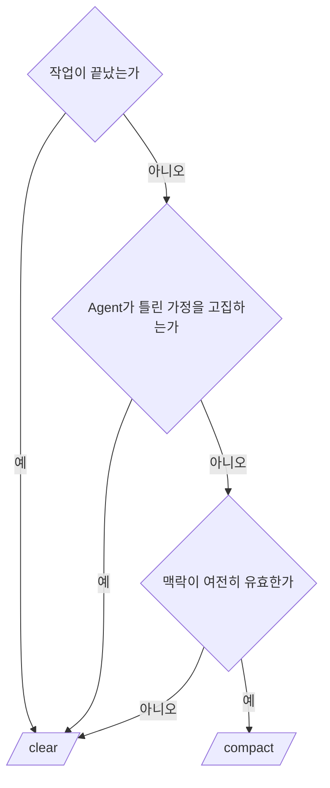
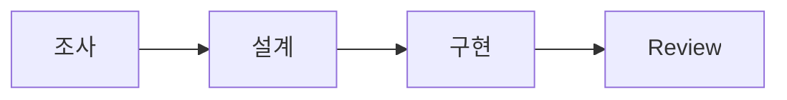

# 18장. Session이 길어지면 무엇이 무너지는가 — 언제 새로 시작할까

에이전틱 코딩을 며칠 해보면 이런 순간이 온다.

오전 내내 잘 되던 세션이  
오후부터 이상해진다.

같은 Agent, 같은 프로젝트, 같은 사람인데  
답변이 눈에 띄게 나빠진다.

이 장은 그 현상과 대처법이다.

---

## 무너지는 다섯 가지

### 1️⃣ 중요한 정보가 묻힌다

세션 초반에 확인한 핵심 사실이  
수십 턴 뒤의 잡다한 정보에 파묻힌다.

12장의 Context Rot이다.

### 2️⃣ 낡은 가정이 근거로 재사용된다

가장 위험한 증상이다.

```text
턴 8   "이 서비스는 단일 인스턴스로 뜬다" (당시 추측)
턴 45  "단일 인스턴스이므로 로컬 캐시로 충분합니다"
```

턴 8의 추측이 턴 45에서 전제가 된다.

Agent는 자기가 앞에서 한 말을 사실로 취급한다.  
틀린 말도 마찬가지다.

### 3️⃣ 방향을 고집한다

한번 잡은 접근을 계속 밀어붙인다.

```text
"이 방식으로는 안 될 것 같은데"
"조금만 더 수정하면 됩니다"   ← 세 번째 반복
```

⚠️ 이때 지시를 더 정교하게 쓰는 것은 대개 효과가 없다.

Context 안에 이미 그 방향을 지지하는  
자기 발언이 수십 개 쌓여 있기 때문이다.

### 4️⃣ 압축에서 세부가 사라진다

세션이 길어지면 압축이 일어난다.

결론은 남고 근거는 사라진다.  
그래서 "왜 그렇게 결정했더라" 가 재현되지 않는다.

### 5️⃣ 비용이 계속 오른다

11장의 구조다.  
긴 세션의 다음 한 턴은 계속 비싸진다.

---

## 끊어야 할 신호

증상으로 판단하는 편이 정확하다.

| 신호 | 판단 |
|---|---|
| 같은 수정을 세 번째 시도한다 | 끊는다 |
| 앞에서 확인한 사실을 다시 물어본다 | 끊는다 |
| 처음 설명과 다른 설명을 한다 | 끊는다 |
| 지시를 반복해도 같은 실수를 한다 | 끊는다 |
| 방향이 틀렸다고 지적해도 밀어붙인다 | 끊는다 |
| 작업이 끝났다 | 끊는다 |

마지막 줄이 실무에서 가장 자주 놓친다.

작업이 끝났는데 그 세션에서 다음 작업을 시작하면  
끝난 작업의 Context를 전부 짊어지고 간다.

> 세션은 작업 단위로 닫는다.

---

## `/clear` · `/compact` · `/resume`

세 가지 도구의 성격이 다르다.

| 명령 | 하는 일 | 남는 것 |
|---|---|---|
| `/clear` | 대화를 비운다 | `CLAUDE.md` 만 |
| `/compact` | 대화를 요약해 이어간다 | 요약된 맥락 |
| `/resume` | 이전 세션을 다시 연다 | 그 세션 전체 |

판단 기준은 이렇다.



🔥 핵심은 두 번째 갈래다.

틀린 가정이 문제라면 `/compact` 는 해결책이 아니다.  
요약에 그 가정이 함께 실려 간다.

오염된 물을 반쯤 버려도 여전히 오염된 물이다.

이때는 `/clear` 하고,  
**검증된 사실만** 골라 다시 넘긴다.

---

## 반대 함정 — 너무 자주 끊는다

이 장을 읽고 나면 반대로 가기 쉽다.

⚠️ 세션을 너무 자주 끊으면 그 나름의 대가가 있다.

| 잃는 것 | 결과 |
|---|---|
| 캐시 이점 | 매번 새로 쓴다 (11장) |
| 탐색 결과 | 같은 파일을 다시 읽는다 |
| 합의된 맥락 | 같은 설명을 반복한다 |

기준은 하나다.

> 맥락이 유효하면 유지하고,  
> 맥락이 오염됐으면 끊는다.

시간이나 턴 수가 기준이 아니다.

30분짜리 세션도 오염될 수 있고,  
3시간짜리 세션도 깨끗할 수 있다.

---

## 세션을 나누는 자연스러운 경계

미리 정해두면 판단할 일이 줄어든다.



각 전환에서 세션을 바꾼다.

| 경계 | 이유 |
|---|---|
| 조사 → 설계 | 읽은 파일 40개를 들고 갈 필요가 없다 |
| 설계 → 구현 | 검토했다 버린 대안이 남아 있다 |
| 구현 → Review | 🔥 자기가 쓴 코드를 자기가 검토하면 안 된다 |

세 번째가 특히 중요하다.

구현한 세션에는  
"이렇게 하기로 했다" 는 합의가 쌓여 있다.

같은 Context에서 Review를 시키면  
그 합의를 다시 확인할 뿐이다.

50장에서 이것을 독립 Review로 다룬다.

---

## 실전 리듬

하루를 이렇게 쪼갠다.

```text
오전
  세션 1  이 기능이 어떻게 동작하는지 조사
          → docs/order-cancel-flow.md 작성 후 종료

  세션 2  그 문서를 읽히고 수정 계획 수립 · 승인
          → tasks/refund-fix.md 작성 후 종료

오후
  세션 3  계획대로 구현 + 테스트
          → 커밋 후 종료

  세션 4  Diff만 읽히고 독립 Review
```

각 세션은 앞 세션의 **결과물**로 시작한다.  
대화가 아니라 파일로 이어진다.

이 방식이 성립하려면 인계가 필요하다.

다음 장의 주제다.

---

## 이 장의 핵심

* 긴 세션에서는 정보가 묻히고, 낡은 가정이 근거로 재사용된다
* Agent는 자기가 앞에서 한 말을 사실로 취급한다 — 틀린 말도 마찬가지다
* 방향을 고집할 때 지시를 정교하게 쓰는 것은 대개 효과가 없다
* 작업이 끝나면 세션도 닫는다 — 다음 작업이 이전 Context를 짊어지지 않게
* 틀린 가정이 문제라면 `/compact` 가 아니라 `/clear` 다
* 너무 자주 끊으면 캐시·탐색 결과·합의된 맥락을 잃는다
* 기준은 시간이나 턴 수가 아니라 맥락이 오염됐는지다
* 조사 → 설계 → 구현 → Review 전환에서 세션을 바꾼다
* 구현한 세션에서 Review를 시키면 합의를 재확인할 뿐이다
